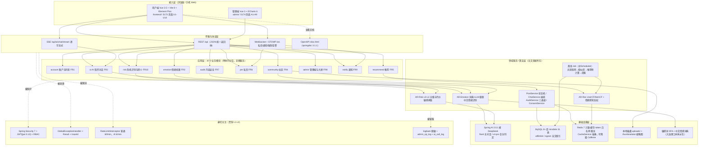
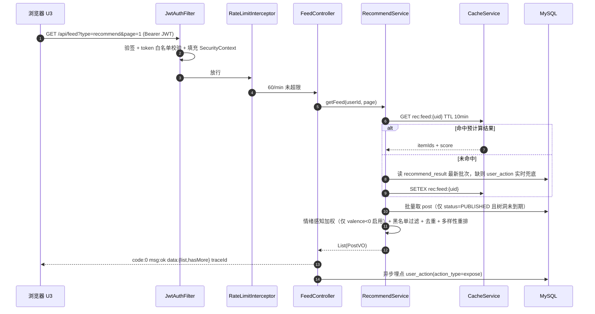
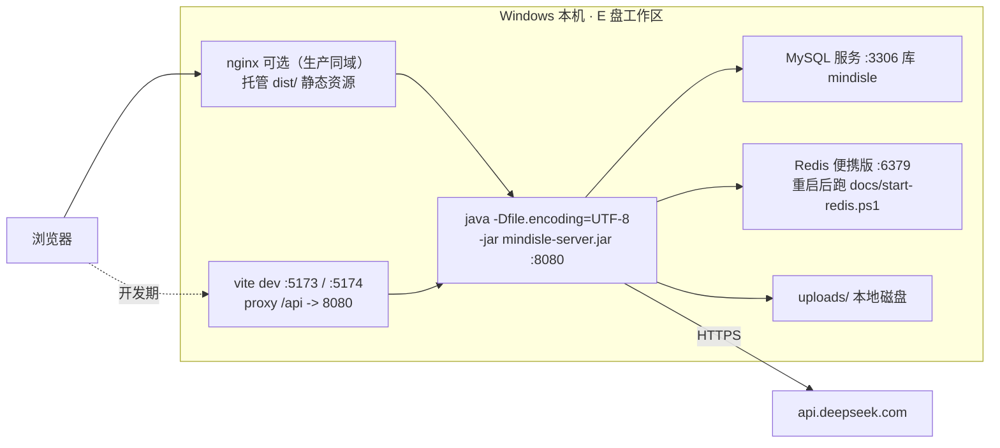

# 01 系统总体架构图（分层）

> 心屿 MindIsle · 阶段 1B 产出（手册 §4.1「架构图 3 张」之一） · 对应论文图 3-1 / 图 6-1 · 口径依据：需求 §11、手册 §1.2、手册 §1.4
> 用途：开题 PPT「系统结构」页 + 论文第 6 章总体设计。**本图画不出的框，就不许写进 V1 代码。**

## 1. 五层结构（B/S 单体 + 内部分层）

## 2. 为什么是「单体分层」而不是微服务（答辩被问就照这段念）

| 备选方案 | 否决理由 |
|---|---|
| 微服务（Spring Cloud） | 需求 §13.3 明确不做；单人 144.3 人日承担不起注册中心/网关/分布式事务；预计峰值 QPS < 50，服务化收益为零 |
| 直接引入 ruoyi-vue-pro 整包 | 手册 §6.7 与需求 R12 硬约束：只抄字段设计与切面思路。整包引入必然范围失控，且混淆「自己实现」与「框架提供」的边界 |
| 用 gorse 等独立推荐服务 | 仅架构参考。V1 用 Java 自实现 UserCF/ItemCF，论文才能写清公式与复杂度；交给第三方等于交出第 5 章 |
| Node / Python 全栈 | 技术栈须与课程与就业一致（Java + Vue）；Spring AI 官方支持 DeepSeek，JDK 17 虚拟线程正好覆盖 SSE/WS 长连接并发 |

## 3. 请求生命周期：一次「首页信息流」的完整路径

## 4. 部署视图（单人可复现，零 Docker 依赖）

- 生产形态：`frontend/dist` + `admin/dist` 由 nginx 托管并把 `/api` 反代到 8080，**同域即关闭 CORS 放宽**（手册 §5.6）。
- 全链路无外部中间件：不上 MQ、不上 ES、不上对象存储（需求 §13.3）。异步写用「虚拟线程池 + 批量落库」，论文中作为轻量替代方案讨论其一致性代价。
- 断网兜底：LLM 不可达时 ChatService 走离线共情话术库并置 `degraded=1`（需求 R5、手册 §7.4 D8）。

