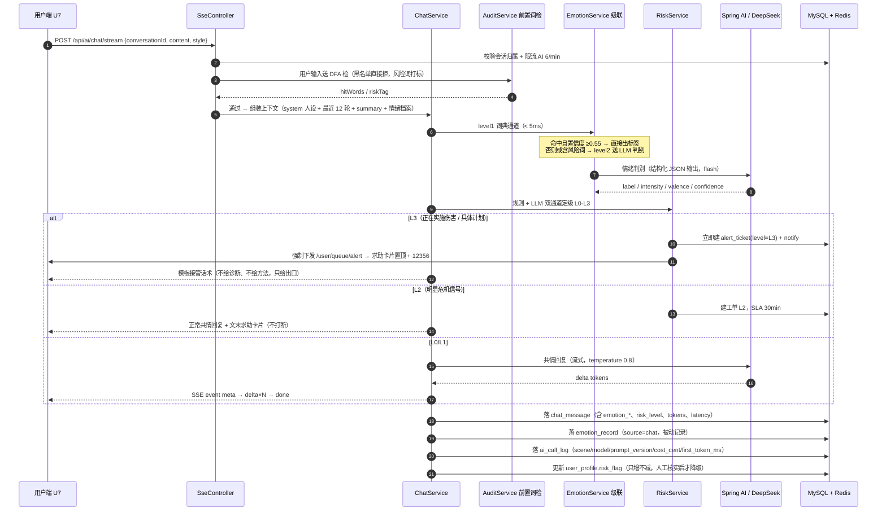
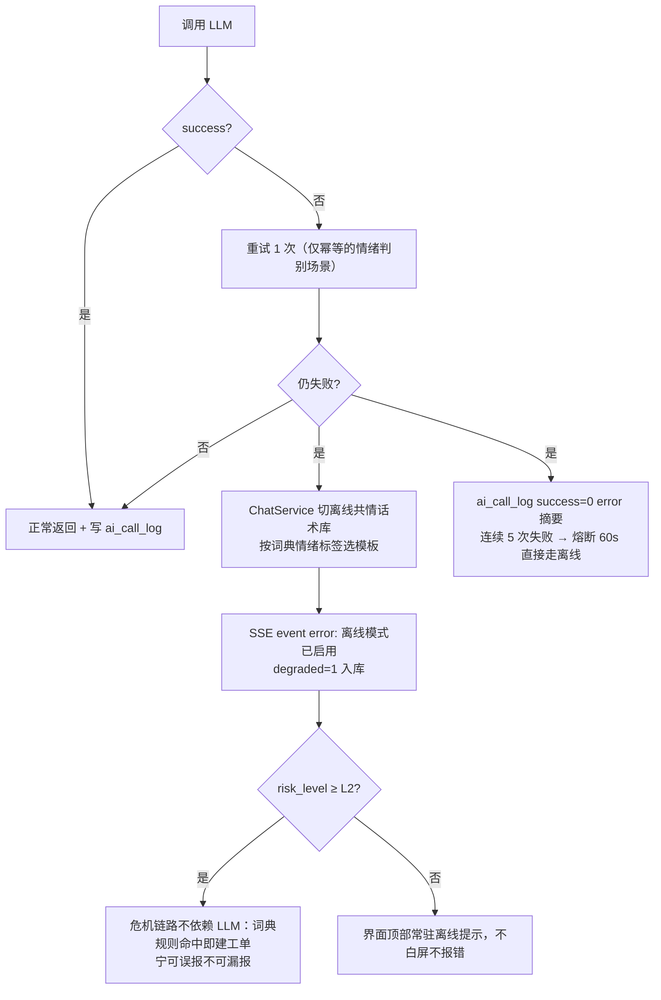
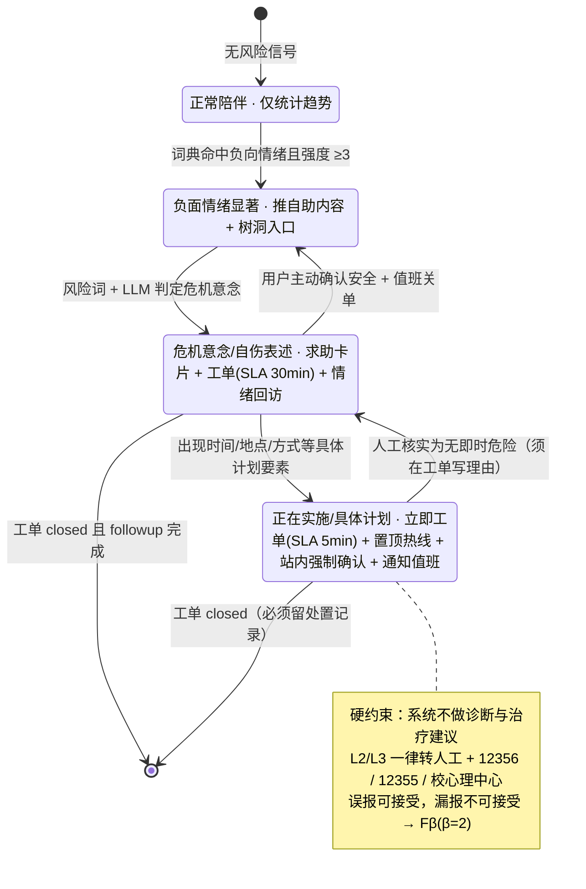
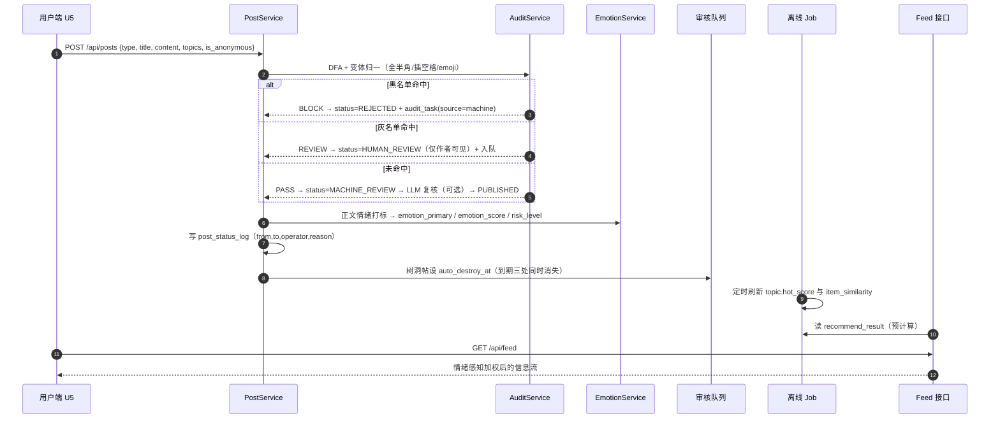

# 02 核心链路时序图（AI 对话 → 情绪识别 → 危机分流）

> 阶段 1B 产出 · 对应需求 §6.1 与论文图 4-3 / 图 6-4 · 参数口径取自需求 §8.1.2（级联阈值）、§5.2（处置矩阵）、§18.4（演示语料）
> **这条链路是答辩现场演示的主场（手册 §7.4 D1–D3），图画错了代码就会返工，因此先画后写。**

## 1. 主链路：一次流式共情对话

## 2. 降级链路（断网 / 无 Key / 超时的兜底，演示必考）

## 3. L0–L3 处置矩阵（需求 §5.2 的图形化，代码里是枚举 + 策略表）

## 4. 二次链路：发帖 → 审核 → 入池 → 推荐（需求 §6.2）

## 5. 关键时序约束（写进代码注释的性能红线）

| 编号 | 约束 | 取值 | 依据 |
|---|---|---|---|
| TS-1 | SSE 首字延迟 TTFT | ≤ 2 s（P95） | NFR2 |
| TS-2 | 情绪 level1 词典通道 | ≤ 5 ms，不阻断主流程 | §8.1.2 |
| TS-3 | 级联送 LLM 的触发条件 | conf < 0.55 或命中风险词 | §8.1.2 |
| TS-4 | L3 工单建立 | 与用户输入同事务内落库，异步只做通知 | FR10 |
| TS-5 | 审核 SLA | L2=30min / L3=5min，超时自动升级并通知 SUPER | §5.2 |
| TS-6 | 计数回写 | Redis 即时 + 5min 定时回写 DB，不在写请求里加行锁 | BR2 |
| TS-7 | 对话上下文窗口 | 最近 12 轮 + summary 压缩，超窗先摘要 | FR2.3 |

