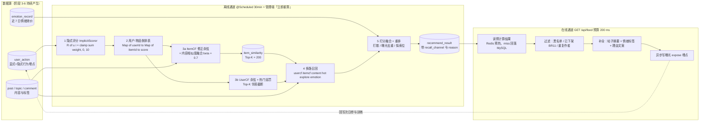
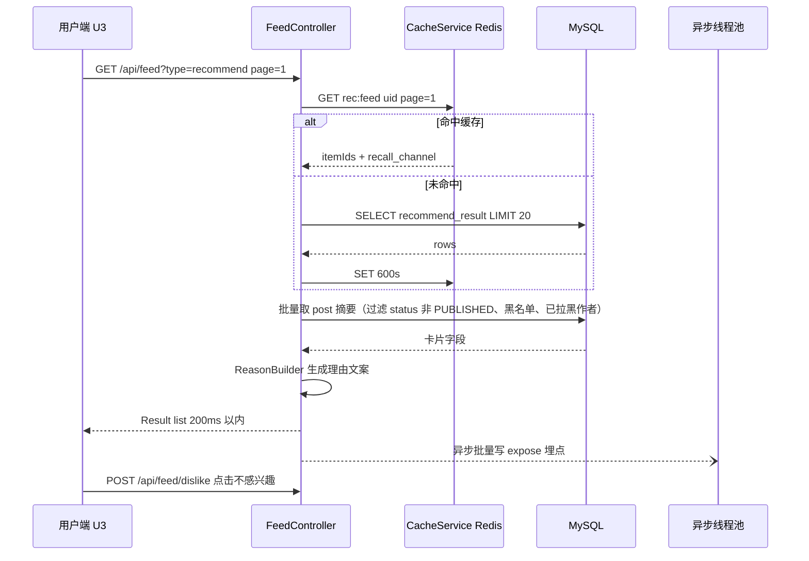

# 03 推荐系统「在线 / 离线双通道」架构图

> 心屿 MindIsle · 阶段 1B 产出（手册 §4.1「架构图 3 张」之三） · 对应论文图 5-1（离线计算流程）/ 图 5-2（在线服务流程）、表 5-1（召回通道） · 口径依据：需求 §3 FR5、§8.2、手册 §10.1–§10.2
> 一句话设计：**把「算得起但慢」的部分全部搬到离线，把「必须快」的部分压成一次读缓存。** 在线通道不做任何矩阵运算，因此 200 ms 的预算只花在「读 + 过滤 + 补全」上。

## 1. 双通道总览



> 图中 `Q4 -.-> UA` 这条虚线是整条链路的**飞轮**：曝光本身也是一条行为（权重 0.1），它让「长时间不出现在流里」的旧帖自然降温，也是 D7「推荐流不重复」的判定依据。

## 2. 离线通道分解

| 步骤 | 输入 | 输出 | 代码落点 | 周期 | 失败时 |
|---|---|---|---|---|---|
| 1 隐式评分 | `user_action` 近 30 天 | `(user,item,score)` 稀疏表 | `ImplicitScorer` + `RecWeightConstants` | 30 min | 沿用上一轮 `recommend_result` |
| 2 倒排 | 稀疏表 | `Map<userId,Map<itemId,Float>>` | `InvertedIndex` | 30 min | 同上 |
| 3a ItemCF | 倒排 + 内容特征 | `item_similarity.sim_items` JSON | `ItemSimilarityCalculator` | 30 min | 内容相似度单独兜底 |
| 3b UserCF | 倒排 | 内存邻居表（不落库，减少表数） | `UserSimilarityCalculator` | 30 min | 退化为热门衰减 |
| 4 多路召回 | 邻居 + 相似度 + 话题 + 情绪 | 候选集 ~600 | `RecallService`（每通道一个 `RecallChannel` 实现） | 30 min | 任一通道空则跳过 |
| 5 融合重排 | 候选集 + 情绪效价 | Top-200/用户 | `RankService`、`EmotionBoost`、`RerankService` | 30 min | 关 `emotion_boost` 开关 |
| 6 落库 | 排序结果 | `recommend_result`（`mode`、`position`、`is_exposed`） | `RecommendRepository#replaceForUser` | 30 min | 事务内批量替换 |
| 7 预热 | `recommend_result` | Redis `rec:feed:{uid}` | `FeedWarmUpJob` | 落库后立即 | 在线回落 DB |

**权重表（需求 §8.2.1，全部放 `RecWeightConstants`，消融实验只改这一处）**

| 行为 | view（停留 ≥3 s） | read_through（完读） | like | comment | collect | follow 作者 | dislike | report | expose |
|---|---|---|---|---|---|---|---|---|---|
| 权重 | 1 | 2 | 3 | 4 | 5 | 5 | −3 | −5 | 0.1 |

> 单条上限 10、下限 0；同一 `(user,item,action,day)` 因 `uk_action` 唯一索引天然幂等（BR2），不需要额外去重代码。

## 3. 相似度公式（论文 5.2 手推，代码里逐行对应）

```text
# ItemCF 修正余弦（分母引入物品热度，抑制热门帖的虚假相似）
sim(i,j) = Σ_{u∈N(i)∩N(j)} R(u,i)·R(u,j)
           ─────────────────────────────────────
           sqrt( Σ_{u∈N(i)} R(u,i)² ) · sqrt( Σ_{u∈N(j)} R(u,j)² )

# UserCF 余弦 + 热门惩罚（抑制「什么都看」的活跃用户贡献的相似度）
sim(u,v) = cos(R(u), R(v)) / (1 + ln|I(v)| · α)      α = 0.5 起步，可调

# 稀疏场景主力：内容相似度融合（帖子量 600 级别时纯 CF 共现过稀疏）
sim_final(i,j) = β·sim_cf(i,j) + (1−β)·sim_content(i,j)     β = 0.7
sim_content = cos( 话题 one-hot ⊕ 情绪标签 one-hot ⊕ 分词 TF 向量 )
```

> **写进论文的难点**：内测期 `|U|=200`、`|I|=660`，密度约 9%（12 000 行为 / 132 000 格），远低于协同过滤通常要求；因此本项目**不宣称**「CF 在小数据上也一定好」，而是把「内容相似度兜底 + 冷启动分级」作为对策，并用 MovieLens-1M 先验证实现正确性（需求 §8.2.4）。

## 4. 打分融合与情绪感知加权（创新点②）

```text
score(u,i) =  w1·CF(u,i)
            + w2·quality(i)          # post.quality_score：长度/图文/回复率/被举报惩罚
            + w3·freshness(i)        # exp(-Δt/τ)，τ = 48 h
            + w4·emotion_match(u,i)  # 创新点：仅 mood(u) < 0 时启用
            - w5·repetition(u,i)     # 7 日内已曝光
            - w6·negative(u,i)       # 同话题 / 同作者负反馈衰减

# 默认权重（sys_config: rec.weights，A8 页面可热改）
w1=1.0  w2=0.4  w3=0.5  w4=0.6  w5=0.8  w6=0.5
```

```text
# 情绪匹配：把「现在的我」和「曾被验证能安慰人的内容」对齐
emotion_match(u,i) = 1 - | valence_now(u) - comfort_valence(i) |
  valence_now(u)       ∈ {-1, 0, 1}  ← emotion_record 近 24 h 多数值（打卡优先于被动识别）
  comfort_valence(i)   ∈ [-1, 1]     ← 离线统计：评论区「被治愈 / 抱抱 / 谢谢」正向反应比例
                                        与作者发布时情绪效价的差值（0.6·治愈率 + 0.4·差值）
  启用条件：mood(u) < 0 且 emotion_boost 开关为真 且 valence_now 置信度 ≥ 0.55
```

| 用户当下 | 候选内容 comfort_valence | emotion_match | 效果 |
|---|---|---|---|
| 低落（−1） | 被标记为治愈（+1） | 1.00 | 最强加权 |
| 低落（−1） | 中性（0） | 0.00 | 不加权也不惩罚 |
| 低落（−1） | 同样低落（−1） | 1.00 | **注意**：靠 `w2·quality` 与「负能量扎堆惩罚」压住，避免树洞互相感染（论文 5.5 讨论） |
| 平静（0） | 任意 | **不启用** | 退回常规 CF，防止把「情绪」当唯一信号 |

> 最后一行是这个创新点最容易被打辩老师追问的地方，标准答案：**情绪感知只在负性情绪时介入，且是一个可关掉的加权项**（`sys_config.rec_emotion_boost_enabled`），关掉就是消融组的第 5 组。

## 5. 冷启动三档（FR5.5，阈值可配）

| 档位 | 判定 | 召回策略 | 卡片理由 |
|---|---|---|---|
| 纯新用户 | 注册且 `user_action` = 0 | 「质量分 + 新鲜度」精选池（`is_featured` 优先） | 新人推荐：社区精选 |
| 有偏好无交互 | 注册时选了 3 个话题 | 标签召回（`interest_tags` → `topic` → 帖） | 因为你关注了 #失眠# |
| 交互 ≥ 20 次 | 阈值 `rec_cf_min_actions` 可配 | 切 CF 主通道，标签通道降为补充 | 和你相似的屿民也喜欢 |
| 纯新内容 | 帖子无行为 | 内容相似度 + 作者关注链，给 1/5 探索位 | 社区新声音 |

## 6. 重排与负反馈（FR5.7，D6 判定项）

- **话题打散**：同一 `topic` 连续出现 ≤ 2 条；同一作者 ≤ 1 条 / 10 屏。
- **曝光去重**：Redis `rec:exposed:{uid}` 存 7 天，命中则 `w5` 惩罚并直接剔除。
- **探索位**：每 5 个位置留 1 个给未参与过 CF 计算的新帖 / 长尾帖（也保覆盖率指标）。
- **不感兴趣**：`POST /api/feed/dislike` → ① 即时从当前流剔除（前端本地移除）② 写 `user_action(dislike, weight=-3)` ③ 同话题、同作者、同情绪标签降权（`negative` 通道），下一轮离线生效。

## 7. 在线通道时序（`GET /api/feed?type=recommend`）



- 超时保护：单次 `/api/feed` 服务端 300 ms 未返回 → 直接返回热门衰减通道结果并打 `degraded=1`（9xxxx 降级码，NFR 可观测性）。
- 无预计算结果（新用户 / 首次部署 / 离线 Job 全挂）→ **热门衰减兜底**：`hot_score` 按 `quality / (1 + hours_since_publish/12)` 现算，走 Caffeine 60 s。

## 8. A/B 通道（FR5.10，论文表 5-6 的来源）

| `rec_mode` | 分流 | 排序依据 | 用途 |
|---|---|---|---|
| `cf` | 用户 ID 尾号 0–4 | 本文 §4 融合公式 | 实验组 |
| `hot` | 用户 ID 尾号 5–7 | 纯热度衰减 | 对照组 1（证明 CF 有效） |
| `ab`（random） | 用户 ID 尾号 8–9 | 同池随机打乱 | 对照组 2（证明排序本身有效） |

> 分流写在 `recommend_result.mode`，埋点写在 `user_action.scene`，两者交叉即可算出各组的 CTR / 完读率 / 人均停留，不需要额外的表。

## 9. 规模保护与降级

| 场景 | 阈值 | 措施 |
|---|---|---|
| 物品数增长 | > 5 000 | 只算 ItemCF，或按话题分组计算（论文「可扩展性讨论」引需求 §7.3） |
| 离线一次全量超时 | > 2 min（D7 红线） | 增量计算：只对「有新行为的用户」重算；管理端日志打印各通道占比与 `calc_ms` |
| Redis 不可用 | 探活失败 | `CacheService` 自动切 `CaffeineCacheService`（手册 §5.5），在线通道回落 MySQL 直读 |
| 无 API / 无网络 | — | 推荐链路**完全不依赖 LLM**；`comfort_valence` 用上一次离线值 |

## 10. 与实验章节的对应（需求 §8.2.4 六组对照 → 论文表 5-4）

| # | 实验组 | 关闭项 | 预期主要指标 |
|---|---|---|---|
| 1 | Random | 全部 | Precision@10 基线 |
| 2 | Popularity | 全部 | Recall@10 基线（热门偏差最大） |
| 3 | ItemCF | — | Precision@10 |
| 4 | UserCF | — | Precision@10 / NDCG@10 |
| 5 | CF + 内容融合（β=0.7） | 情绪加权 | NDCG@10、覆盖率 |
| 6 | CF + 内容融合 + **情绪感知加权** | 全开 | 负性情绪子集的 CTR、多样性、覆盖率 |

> 消融结论必须**只写实验里真实出现的数字**；若第 6 组在公开数据集上没有提升（MovieLens 无情绪标签，本就不该有），论文里的表述限定为「在自建含情绪标签数据集上」，不得外推。

---

**施工回写要求**：本图每改一处公式或权重，同步改 ①需求 §8.2.2 ②`RecWeightConstants` ③`sys_config` 默认值 ④论文 5.2，四处口径一致才算改完。

