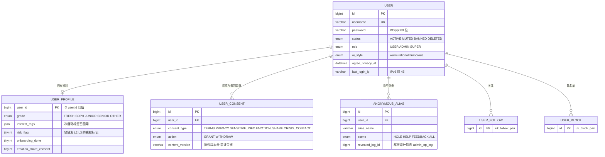
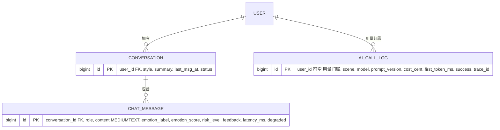
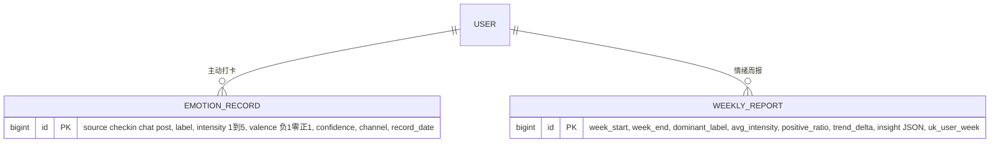
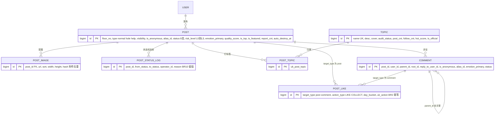
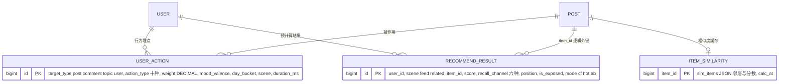
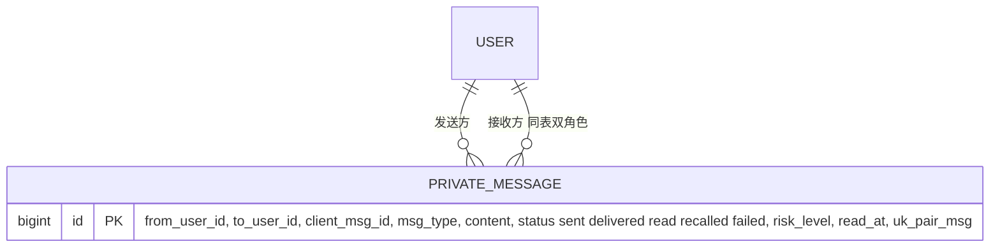
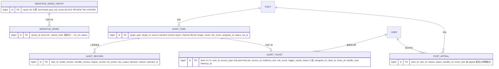
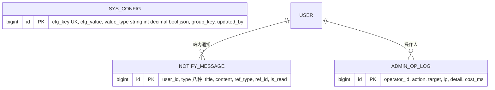

# 04 ER 图（全库 31 张物理表）

> 心屿 MindIsle · 阶段 1B 产出（手册 §4.1「ER 图 1 张」） · 对应论文图 6-2（概念结构）与图 6-3（逻辑结构主外键） · 口径依据：需求 §7.1、§7.2、手册 §5.1
> **表数口径（v1.1.3 统一，31 张）**：需求 §7.2 的 24 个编号行按功能归并，展开为 **26 张物理表**（#16 拆 `sensitive_word_group` + `sensitive_word`，#24 拆 `admin_op_log` + `ai_call_log`）；手册 §5.1 施工清单再加 `post_status_log`、`post_appeal`、`post_like`（→29）与 `weekly_report`（→30）；本轮隐私合规再加 `user_consent`（→**31**）。**建库、DDL、ER 图、论文 6.1 一律以 31 张为准，需求 §7.2 只作功能索引。**
> 为什么必须有 `user_consent`：`user.agree_privacy_at` 只能记一次「同意」，记不了 PIPL 第 29 条要求的**敏感个人信息单独同意的取得与撤回全过程留痕**（举证责任在处理者）。因此它是一张追加式流水表，不覆盖、不删除。

## 1. 概念结构总览（只画实体与关系，不画属性）

```mermaid
erDiagram
  USER ||--o| USER_PROFILE : "1对1 资料"
  USER ||--o{ USER_CONSENT : "同意与撤回留痕"
  USER ||--o{ ANONYMOUS_ALIAS : "马甲映射 唯一可回溯"
  USER ||--o{ USER_FOLLOW : "关注"
  USER ||--o{ USER_BLOCK : "黑名单"
  USER ||--o{ CONVERSATION : "拥有"
  CONVERSATION ||--o{ CHAT_MESSAGE : "包含"
  CHAT_MESSAGE ||--o| EMOTION_RECORD : "被动识别落库"
  USER ||--o{ EMOTION_RECORD : "主动打卡"
  USER ||--o{ WEEKLY_REPORT : "情绪周报"
  USER ||--o{ POST : "发布"
  POST ||--o{ POST_IMAGE : "配图"
  POST ||--o{ POST_STATUS_LOG : "状态机流转"
  POST ||--o{ POST_TOPIC : "打标签"
  TOPIC ||--o{ POST_TOPIC : "归类"
  POST ||--o{ COMMENT : "评论"
  COMMENT ||--o{ COMMENT : "楼中楼"
  POST ||--o{ POST_LIKE : "点赞收藏"
  COMMENT ||--o{ POST_LIKE : "点赞"
  USER ||--o{ USER_ACTION : "行为埋点"
  POST ||--o{ USER_ACTION : "被作用"
  USER ||--o{ RECOMMEND_RESULT : "预计算结果"
  POST ||--o{ RECOMMEND_RESULT : "推荐物品"
  POST ||--o{ ITEM_SIMILARITY : "相似度缓存"
  USER ||--o{ PRIVATE_MESSAGE : "收发"
  SENSITIVE_WORD_GROUP ||--o{ SENSITIVE_WORD : "词库分组"
  POST ||--o{ AUDIT_TASK : "送审"
  AUDIT_TASK ||--o{ AUDIT_RECORD : "三通道留痕"
  AUDIT_TASK ||--o| ALERT_TICKET : "升级危机工单"
  POST ||--o{ POST_APPEAL : "申诉"
  USER ||--o{ ALERT_TICKET : "被救助对象"
  USER ||--o{ NOTIFY_MESSAGE : "站内通知"
  USER ||--o{ AI_CALL_LOG : "用量归属"
  USER ||--o{ ADMIN_OP_LOG : "操作人"
```



> `SYS_CONFIG` 不画进本图：它是参数表，靠 `group_key` 在应用侧分组（rec / risk / prompt / audit），与任何实体都没有外键关系。

## 2. 分域逻辑结构（带主外键，对应 8 个 DDL 文件）

### 2.1 账户与隐私域（`sql/01_account.sql`，6 张）



### 2.2 AI 对话域（`sql/02_ai.sql`，3 张）



### 2.3 情绪档案域（`sql/03_emotion.sql`，2 张）



### 2.4 社区域（`sql/04_community.sql`，7 张）



### 2.5 推荐域（`sql/05_recommend.sql`，3 张）



### 2.6 私信域（`sql/06_pm.sql`，1 张）



### 2.7 内容安全与危机域（`sql/07_audit.sql`，6 张）



### 2.8 配置与通知域（`sql/08_config.sql`，3 张）



## 3. 31 张表落库清单（写 DDL 与 Gate 2 列数比对的唯一依据）

| # | 表 | 文件 | 主键 | 业务唯一索引（=规则） | 需求 §7.2 编号 |
|---|---|---|---|---|---|
| 1 | `user` | 01 | id | `uk_username` | #1 |
| 2 | `user_profile` | 01 | user_id | 主键即 1 对 1 | #2 |
| 3 | `user_consent` | 01 | id | 无（追加式流水，禁止 UPDATE） | 新增（PIPL 第 29 条） |
| 4 | `anonymous_alias` | 01 | id | `uk_user_alias_scene` | #3 |
| 5 | `user_follow` | 01 | id | `uk_follow_pair` | #10 |
| 6 | `user_block` | 01 | id | `uk_block_pair` | #11 |
| 7 | `conversation` | 02 | id | — | #12 |
| 8 | `chat_message` | 02 | id | — | #13 |
| 9 | `ai_call_log` | 02 | id | — | #24 后半 |
| 10 | `emotion_record` | 03 | id | — | #14 |
| 11 | `weekly_report` | 03 | id | `uk_user_week` | 手册 §7.5 T4.20 |
| 12 | `post` | 04 | id | — | #4 |
| 13 | `post_image` | 04 | id | — | #5 |
| 14 | `post_status_log` | 04 | id | — | 手册 §5.1 施工补 |
| 15 | `topic` | 04 | id | `uk_name` | #6 |
| 16 | `post_topic` | 04 | id | `uk_post_topic` | #7 |
| 17 | `comment` | 04 | id | — | #8 |
| 18 | `post_like` | 04 | id | `uk_action`（BR2 幂等） | 手册 §5.1 施工补 |
| 19 | `user_action` | 05 | id | `uk_action`（同用户同目标同动作同日） | #9 |
| 20 | `item_similarity` | 05 | item_id | — | #22 |
| 21 | `recommend_result` | 05 | id | `uk_user_scene_item_mode` | #21 |
| 22 | `private_message` | 06 | id | `uk_pair_msg` | #15 |
| 23 | `sensitive_word_group` | 07 | id | `uk_name` | #16 前半 |
| 24 | `sensitive_word` | 07 | id | `uk_word` | #16 后半 |
| 25 | `audit_task` | 07 | id | `uk_target_pending` | #17 |
| 26 | `audit_record` | 07 | id | — | #18 |
| 27 | `alert_ticket` | 07 | id | — | #19 |
| 28 | `post_appeal` | 07 | id | `uk_post_pending` | 手册 §5.1 施工补（原 `appeal`） |
| 29 | `sys_config` | 08 | id | `uk_cfg_key` | #23 |
| 30 | `notify_message` | 08 | id | — | #20 |
| 31 | `admin_op_log` | 08 | id | — | #24 前半 |

**文件计数必须为 6 / 3 / 2 / 7 / 3 / 1 / 6 / 3 = 31**（`sql/01`…`sql/08`），`09_seed.sql` 只有 `INSERT`，`10_index.sql` 只有 `ALTER`。

## 4. 实外键 vs 逻辑外键（写进论文 6.2「性能优化设计」）

1. **只建索引、不建物理外键约束**：全站统一 `KEY idx_xxx`，**不写 `FOREIGN KEY`**。理由三条：① 逻辑删除与推荐批量重算会因约束产生顺序耦合和锁等待；② V2 若分库，物理外键必须先删；③ 社区类产品的主流实践如此。完整性由应用层 + `post_status_log`、`audit_record`、`user_consent` 三张留痕表保证。论文里如实写「本系统采用逻辑外键 + 应用层校验」，**不要声称数据库级参照完整性**。
2. **跨域引用一律存 ID + 冗余展示字段**：例如 `alert_ticket.evidence_text` 冗余存证据片段，防止原帖被删后工单失去上下文（危机场景的硬要求，BR 可追溯到处置依据）。
3. **计数字段是缓存值不是真相**：`like_cnt` 之类真相在 `post_like` / `user_action`，Redis 计数 + 5 分钟回写（BR2），允许短时不一致 —— 这是答辩「为什么不直接 `COUNT(*)`」的标准答案。

## 5. 三个设计取舍（论文 6.1「设计说明」用）

| 取舍 | 选择 | 放弃的方案 | 理由 |
|---|---|---|---|
| 点赞与收藏是否分表 | 合并进 `post_like`，用 `action_type` 区分 | 两张表 | 行为语义相同（幂等 + 计数），分表只多一次 JOIN；一条 `uk_action` 同时管两种行为 |
| 情绪效价是否用小数 | `TINYINT`（−1/0/1）存效价，`DECIMAL(4,3)` 存置信度 | 全用小数 | 效价是**分档语义**（用户打卡就是在三档里选），连续值反而制造不存在的精度 |
| 匿名是否可解 | 默认不可解；`anonymous_alias` 是唯一可回溯表，解匿必须写 `revealed_log_id` | 完全不存映射 | 不存映射 = 无法履行违法内容处置义务；随手可解 = 匿名承诺失效。折中：**存映射 + 解匿留痕 + 仅 SUPER 权限 + 必填理由**（A9 可审计） |
| 同意记录放哪 | 独立 `user_consent` 流水 | 只在 `user` 上放 `agree_privacy_at` | 撤回必须留痕且不覆盖历史，PIPL 举证责任在处理者；一列时间戳无法证明「当时同意的是哪一版协议」，所以还要 `content_version` |

---

**校验命令**（阶段 2 建库后跑，各文件 `CREATE TABLE` 计数之和必须等于 31）：

```powershell
Select-String -Path sql\*.sql -Pattern CREATE TABLE | Group-Object Filename | Select-Object Name, Count
(Select-String -Path sql\0*.sql -Pattern CREATE TABLE).Count
```

