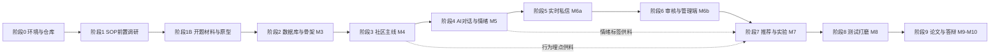

# 心屿 · 制作步骤文档（施工手册 v1.3.1 —— 阶段 6「管理端 · 审核台 · 风控」与阶段 7「双通道离线推荐 + 看了又看」**代码全线收口**：Gate6 ☑、Gate7 ◐（D6/D7 已签死，D10 论文实验按用户指示本轮不做）；本轮现查纠正 **7 处「文档口径 ≠ 代码实况」**——表数、情绪类别数、认领字段、登录锁定时长、词云依赖、A/B 枚举、重算触发方式）

> 项目编号 009 ｜ 编制 2026-09-17（v1.0）｜ **修订 2026-09-30（v1.3.2）** ｜ 配套文档：`需求分析文档.md` v1.2.2、`同类项目调研与实现方案.md`（Gate 1 产出，已定版；阶段 2 施工实测回写见其 §10）
> 定位：**把需求翻译成一条可以照着敲键盘的施工路线**。需求文档回答「做什么、做到什么标准」，本文件回答「先做哪一步、命令是什么、怎么算过关」。
> 版本事实（Spring Boot / Vue / 依赖坐标等）已于 2026-09-17 从 Maven Central 与 npm registry 实测确认，非记忆值；v1.1 新增的版本事实（ECharts 词云扩展的 peer 依赖）已于 2026-09-18 复测确认。

---

## 目录

| 节 | 内容 | 什么时候看 |
|---|---|---|
| 0 | 本文件怎么用、施工总原则、阶段流水线 | 开工前读一遍 |
| 1 | **定版技术栈 / 论文题目 / 目录与包结构** | 开题与论文第 2、6 章 |
| 2 | **阶段 0**：环境、Maven、Redis、MySQL、git、自检脚本 | 第 1 天 |
| 3 | **阶段 1**：SOP 强制前置调研（不通过不编码） | 第 2–4 天 |
| 4 | **阶段 1B**：开题报告、文献综述、线框图 | 10 月上旬 |
| 5 | **阶段 2（M3）**：建表、骨架、统一返回体、JWT、前端地基 | 11 月上旬 |
| 6 | **阶段 3（M4）**：社区主线 + **提前埋点** | 11 月下–12 上 |
| 7 | **阶段 4（M5）**：SSE 对话、情绪级联、危机闭环、情绪实验 | 12 下–1 月 |
| 8 | **阶段 5（M6a）**：WebSocket/STOMP 私信 | 1 月 |
| 9 | **阶段 6（M6b）**：审核链路、管理端 A1–A9、数据大屏 | 寒假集中 |
| 10 | **阶段 7（M7）**：推荐双通道 + 六组对照实验 + 消融 | 2 下–3 上 |
| 11 | **阶段 8（M8）**：单测、压测、演示数据、安全自查 | 3 月下 |
| 12 | **阶段 9（M9/M10）**：论文章节取料、查重、答辩三件套 | 4–5 月 |
| 13 | 日常开发工作流、协作节奏、时间预算（**≈144.3 人日 / 117 项任务**） | 每天 |
| 14 | **42 条常见故障速查表**（v1.1 新增 25–30：词云 peer、验证码字体、注销后可检索、定时任务事务、周报降级、SSE 串流；v1.2.0 新增 31–35：中文 SQL 只能用 cmd `<` 重定向、工单表真实列名、内联 powershell 吃 `$`、`Tee-Object` 默认 UTF-16LE、块级组件别进 `<p>`；36：before 行数与机制描述必须现量现读；**v1.2.1 新增 37–42**：`{immediate:true}` watcher 的 TDZ 只坏首屏、两个信号分开等读到未 flush 的 DOM、恒真/近似谓词的「0」不是不变式、`q-cmd` 的 exit 0 假绿、`info()` 打印的 SQL 不执行就是永久假事实、登出不清 store 红点跟着上一个人走） | 卡住时先查这里 |
| 15 | 全阶段任务打勾总表（T0.1–T9.8，共 117 行、≈144.3 人日） | 决定「下一步做什么」 |
| 16 | 可复制清单索引 | 抄配置时 |
| 17 | **需求覆盖与三向追溯矩阵（FR/NFR/BR/AR → 任务 → Gate → 论文章节）** | 答辩前自查、老师问「这条需求在哪」 |
| 18 | **Gate 判定汇总表（Gate0–9，10 行，含证据目录与状态）** | 每个阶段收尾时 |
| 19 | 变更记录（v1.0 / v1.1）与下一步 | 只在回头看时 |

---

## 0. 这份文件怎么用

### 0.1 与需求文档的引用关系

| 编号前缀 | 出处 | 在本文件中的作用 |
|---|---|---|
| `FR1~FR10` | 需求 §3 | 每条施工任务后面标注它实现的 FR，防止「做了但没覆盖需求」 |
| `NFR1~NFR12` | 需求 §4 | 写进各阶段的性能/安全施工要求 |
| `BR1~BR12` | 需求 §5.3 | 落到具体的唯一索引、Redis 键、定时任务实现 |
| `AR-Emotion / AR-Rec / AR-Risk` | 需求 §8 | 阶段 4、7 的算法实现规格 |
| `U1~U14 / A1~A9` | 需求 §10 | 前端任务清单按页面编号排 |
| `M3~M10` | 需求 §14 | 本文件的「阶段」与里程碑一一对应 |
| `D1~D14` | 需求 §16.1 | 每阶段末尾的 Gate 直接引用 DoD 编号，**Gate 不过不开下一阶段** |

### 0.2 施工总原则（贴到显示器边上）

1. **顺序不可乱**：阶段 1（SOP 前置调研）是工作区强制关卡，未完成并向你确认之前，**不写一行业务代码**。
2. **先跑通，再跑好**：每个模块先做「最小可用版」（能返回、能显示），再做缓存、限流、降级、美化。论文需要的是可演示的完整闭环，不是半截的高性能。
3. **每阶段一个 git tag**：`git tag stage-2-skeleton` + `git tag -a -m`；阶段内每天一 commit，commit message 带任务 ID（见 §12）。
4. **埋点提前埋**：`user_action` 表在阶段 3 就开始写数据，否则阶段 7 的推荐算法没有原料 —— 这是最容易翻车的时间差。
5. **实验数据随时导出**：每完成一个算法就导一次 CSV，别等到 3 月回头补跑。
6. **每次环境变更后跑一次 `docs/check-env.ps1`**（阶段 0 建立），十项全绿才继续。
7. **红线**（需求 §11.1 第 9、10 条）：不复用「脑益生」任何代码/数据/密钥；演示数据 100% 虚构；Key 只进 `.env`。

### 0.3 阶段流水线



### 0.4 每个阶段的固定收尾动作

- [ ] 本阶段 Gate 全部条目实测通过（截图/命令输出存 `docs/gate/阶段N/`）
- [ ] `mvn -q test` 与 `npm run build` 双双通过
- [ ] 在 `docs/dev-log.md` 追加一段「本阶段完成 / 遗留 / 下一步」
- [ ] `git commit` + `git tag stage-N-xxx` + `git push`（若配了远端，远端必须是私有仓库）
- [ ] 更新 `README.md` 第五节「进度」勾选框（README 实际编号：四=目录结构、四·补=怎么跑起来、五=进度；此条于 2026-09-20 核对 README 时修正，旧写法「第四节」与盘面不符）

---

## 1. 定版技术栈、论文题目与工程骨架规划

### 1.1 与需求文档 §11 的差异（先说清楚，避免施工时自我怀疑）

需求文档 v1.0 写的是「Spring Boot 3.x」。**2026-09-17 实测：Spring Boot 3.5 的开源支持已于 2026-06-30 结束**，Maven Central 上 `spring-boot-starter-parent` 的最新 GA 为 **4.1.1**（4.2.0 仍是 milestone，不可用于毕设）。因此本手册统一按 **Boot 4.1.1** 施工，需求文档 §11 已同步升级到 v1.1。

对毕设的三点影响（都是好消息）：
1. Boot 4 内置**虚拟线程**支持（`spring.threads.virtual.enabled=true`），SSE 并发与 WS 连接的吞吐直接受益，可写进论文「并发模型设计」一节。
2. Spring AI **2.0.x 自带 DeepSeek starter**（实测其 POM 依赖 `spring-boot-starter-webclient:4.1.1`，与 Boot 4.1.1 精确对齐），对话链路可以不手写 HTTP。
3. 代价：Spring Security 升到 **7.x**（配置 DSL 与 6.x 不同）、MyBatis-Plus 必须用 **3.5.13 以后**的版本并换成 `…-spring-boot4-starter` 坐标。

### 1.2 最终技术栈（定版，施工期间不再改）

| 层 | 组件与版本（2026-09-17 实测） | 坐标 / 安装 | 备注 |
|---|---|---|---|
| JDK | **17.0.19 LTS**（本机已装，够用）；建议另装 **21 LTS** | `D:\Program Files (x86)\JDK\jdk-17` | Boot 4 基线 Java 17；21 才有成熟虚拟线程实践，论文可提 |
| 后端框架 | **Spring Boot 4.1.1** | `spring-boot-starter-parent:4.1.1` | 3.x 已停止 OSS 支持，不要新建 3.x 工程 |
| 安全 | Spring Security 7（随 Boot BOM）+ **jjwt 0.13.0** | `io.jsonwebtoken:jjwt-{api,impl,jackson}:0.13.0` | 密码 BCrypt |
| ORM | **MyBatis-Plus 3.5.17** | `com.baomidou:mybatis-plus-spring-boot4-starter:3.5.17`（Boot4 专用坐标，已实测存在）；分页需 `mybatis-plus-jsqlparser:3.5.17` | Boot3 工程才用 `…-spring-boot3-starter` |
| 数据库 | **MySQL 9.7.1**（本机服务 `MySQL` 已运行，3306 监听） | utf8mb4 / InnoDB | 认证插件 `caching_sha2_password`；全文索引 `ngram` |
| 缓存 | **Redis 7**（本机未装 → 阶段 0 解决，含降级方案） | `spring-boot-starter-data-redis` + Lettuce | 降级：Caffeine 3.2.4 + 保留接口抽象 |
| 实时 | Spring WebSocket + **STOMP** + SockJS 兜底 | `spring-boot-starter-websocket` | 前端 `@stomp/stompjs:7.3.0`、`sockjs-client:1.6.1` |
| 流式 | **SSE**（`SseEmitter`）+ Spring AI 流式 API | — | 不用 WebSocket 做对话，一问一答更简单 |
| AI | **Spring AI 2.0.1** + DeepSeek | `org.springframework.ai:spring-ai-bom:2.0.1`（import scope）+ `org.springframework.ai:spring-ai-starter-model-deepseek:2.0.1` | 另写 `LlmClient` 接口 + JDK HttpClient 降级实现（三实现，见 §7.1 任务 4.1） |
| 接口文档 | **springdoc-openapi 3.1.1** | `org.springdoc:springdoc-openapi-starter-webmvc-ui:3.1.1` | knife4j 尚无 Boot4 版本（实测无 `…-boot4-…` 坐标），**不用 knife4j** |
| 工具 | Lombok 1.18.48、jsoup 1.23.2（XSS 清洗）、Thumbnailator 0.4.21（图片重编码） | — | — |
| 构建 | **Maven 3.9.16**（本机 PATH 无 `mvn`，阶段 0 安装；Maven 4 仍 RC，不要用） | zip 解压到 `E:\codex workspace\_tools\` | 本地仓库指 E 盘 |
| 前端 | **Vue 3.5.43** + **Vite 8.3.0** + **Element Plus 2.14.5** + Pinia + Vue Router + Axios + ECharts | `vue@3.5.43`、`vite@8.3.0`、`element-plus@2.14.5`、`pinia@4.0.3`、`vue-router@5.3.1`、`axios@1.20.0`、`echarts@6.1.0`、`@echarts-x/custom-word-cloud@1.0.1`、`sass@1.104.1` | Vite 8 需 Node ≥20.19（本机 v22.16.0 ✅）；Vue 3.6 仍 RC，不追。**词云扩展 v1.1 换包**：`echarts-wordcloud@2.1.0` 的 peer 为 `echarts ^5.0.1`（最后更新 2022-11-24），与 `echarts@6.1.0` 同装必报 ERESOLVE（npm registry 实测 2026-09-18）→ 改用 peer 为 `echarts ^6.0.0` 的 `@echarts-x/custom-word-cloud@1.0.1`（2026-01-12 发布） |。**v1.1.3 实测（2026-09-18）**：`frontend`（145 包）与 `admin`（128 包）`npm install` 均无 ERESOLVE、`npm run build` 双端通过，且 `npm ls vue vue-router pinia` 无重复实例 → **依赖层风险关闭**；但该包**至今未被任何 `.vue` 引用**，运行时渲染未验证，15 分钟 spike + 截图仍在待办（见 §15 T2.15）。**v1.3.1 最终实况（2026-09-29 现查，本行原计划到此已被推翻）**：两条退路都没走 —— `admin/package.json` 里 **既没有 `echarts-wordcloud` 也没有 `@echarts-x/custom-word-cloud`**（dependencies 只有 echarts 6.1.0 等 7 项），A2 大屏的词云改用**仓库内 vendor 文件** `admin/src/vendor/word-cloud.esm.js`（**1150** 行，文件头保留 ASF Apache-2.0 许可原文）以 ECharts 6 自定义 series 方式注册；🔴 另现查出一条依赖欠账：`frontend/package.json` 仍声明 `"@echarts-x/custom-word-cloud": "^1.0.1"`，而 `frontend/src/**` 全仓 grep `word-cloud`/`wordcloud` **0 命中** ⇒ **这是个从未被引用的死依赖**，删或真用结转阶段 8（§19 下一步 ⑪）
| 算法 | 纯 Java（`float[]` + 余弦 + 稀疏 `HashMap`），无 Spark MLlib | — | 实验与评估脚本 Python 3.12（本机 ✅） |
| 部署 | 本机：后端 jar + 前端 dist 由 Nginx **或** Spring 静态目录托管；单库单体 + `@Scheduled` | — | 明确不做微服务/消息队列（需求 §13.3） |

> 说明：`pinia@4` / `vue-router@5` / `echarts@6` 是当前 npm `latest`，但 Element Plus 2.14.5 与三者的组合需一次真实构建验证。阶段 2 建前端后用 `npm ls vue vue-router pinia` 核对无重复实例；若 Element Plus 报 peer 冲突，退回 `pinia@2.3.x` + `vue-router@4.5.x` 组合并在 `docs/dev-log.md` 记录原因。词云扩展另有一条硬规则：**进 Gate 2 前先用 15 分钟做一次 spike**（空工程装 `echarts@6.1.0` + 词云包，跑一张词云截图存 `docs/gate/阶段2/`）；若 `@echarts-x/custom-word-cloud` 不适配，退路依次是 ① `npm install echarts-wordcloud@2.1.0 --legacy-peer-deps` ② 整体退回 `echarts@5.6.0` + `echarts-wordcloud@2.1.0`。**这一步以 `npm install` 实际结果为准，不靠猜。** 🔴 **本条 spike 的最终结局（v1.3.1 回写）**：`@echarts-x/custom-word-cloud` 与 ECharts 6 的对不上**不是靠换包解决的** —— 阶段 6 直接把它改成仓库内 vendor 的自定义 series（`admin/src/vendor/word-cloud.esm.js` 1150 行 + `ScreenView` @107 import、@115 `echarts.use`，@372-382 记下三个必须踩的坑），既没有 `npm install`，也没有退回 `echarts@5.6.0`。**判据不是「装上了」而是「画出来了」**：词云面板的出证在 `docs/gate/阶段6/`，实现口径见 §9.3 第 4 条。
>
> **v1.1.3 收口**：上述冲突与两条退路**均未启用** —— `@echarts-x/custom-word-cloud@1.0.1` 与 `echarts@6.1.0` / `element-plus@2.14.5` / `pinia@4.0.3` / `vue-router@5.3.1` 在 Node v22.16.0 + npm 10.x 下直接安装、构建通过，退路封存备查。**唯一未验证项**：词云的运行时渲染（依赖装上了但还没有任何组件 import 它），故 §15 T2.15 只能标 ◐ 不能标 ☑。

### 1.3 论文题目定版（「基于 ×× 技术/算法的 ×× 系统的设计与实现」句式）

| 序 | 题目 | 突出点 | 适配度 |
|---|---|---|---|
| **推荐 1** | **《基于大语言模型与情绪感知协同过滤算法的校园心理陪伴社区平台的设计与实现》** | 同时含「大语言模型」+「协同过滤算法」两个技术关键词，AI 与算法双主线，与需求 §1.5 三创新点中的两个直接对应 | ★★★★★ |
| 备选 2 | 《基于 Spring Boot 与中文情感分析算法的 AI 心理陪伴社区系统的设计与实现》 | 框架 + 算法，稳妥、答辩最不容易被问「算法在哪」，但少了推荐算法的亮点 | ★★★★ |
| 备选 3 | 《基于 Spring AI 与协同过滤推荐算法的高校情感支持社区系统的设计与实现》 | 技术栈最时髦，但「Spring AI」偏工具名，个别学院不让进标题 | ★★★ |

**施工期统一口径**（封面、README、Swagger title、大屏页脚、答辩 PPT 首页五处必须一致）：

- 中文：`基于大语言模型与情绪感知协同过滤算法的校园心理陪伴社区平台的设计与实现`
- 系统名：**心屿**（英文名 **MindIsle**）—— 需求 R11：交付前检索一次同名产品/商标，冲突则换「屿见 / 回声屿」，届时只需全局替换这 5 处。
- 英文摘要用：*Design and Implementation of a Campus Psychological Companionship Community Platform Based on LLM and Emotion-Aware Collaborative Filtering*

**一句话口径（开题/答辩自我介绍照读）**：

> 本课题是「基于**大语言模型与情绪感知协同过滤推荐算法**的**校园 AI 心理陪伴与情感支持社区平台（心屿 / MindIsle）**的设计与实现」。
> 拆开说：技术底座 = Spring Boot 4.1.1 + Vue 3 + MySQL 9 + Redis 7；算法一 = DUT 词典规则 + LLM 级联中文情绪识别（7+1 类，FR3）与 Spring AI 2.0.1 + DeepSeek 共情对话（FR2）；算法二 = UserCF/ItemCF + 情绪加权 EmotionBoost + 冷启动兜底的推荐算法（FR5，含 6 组对照与消融实验）；安全底线 = L0–L3 危机识别与 12356 热线转介闭环（FR10）。
> 三个创新点（与需求 §1.5 一致）：① 情绪感知加权的推荐排序；② LLM 共情对话 + 规则/模型级联的低成本中文情绪识别；③ 面向高校场景的危机识别—转介—工单闭环。

> 若学院要求题目 ≤ 20 字，用备选 2 的前半形式：《基于情感分析与协同过滤的心理陪伴社区系统》。

### 1.4 目录与包结构规划（阶段 2 照此建，之后不随意扩展层级）

```
009_心屿AI心理陪伴社区/
├─ README.md  需求分析文档.md  制作步骤文档.md
├─ 同类项目调研与实现方案.md      ← 阶段1 强制关卡产物
├─ docs/
│  ├─ check-env.ps1  dev-log.md  gate/  开题报告.md  文献综述.md
│  └─ wireframe/                     ← 阶段1B 的 HTML 线框图
├─ sql/
│  ├─ 00_create_db_and_user.sql  01_account.sql  02_ai.sql  03_emotion.sql
│  ├─ 04_community.sql  05_recommend.sql  06_pm.sql  07_audit.sql  08_config.sql
│  ├─ 09_seed.sql  10_index.sql（只含 ALTER TABLE ADD INDEX）
│  └─ patch/                          ← 上线后的增量 DDL，按日期命名
├─ backend/                          （Maven 单模块，包内分层，毕设不需要多模块）
│  ├─ pom.xml  src/main/java/com/mindisle/…  src/main/resources/
│  └─ src/test/java/com/mindisle/…
├─ frontend/                         （用户端 Vue 3）
├─ admin/                            （管理端 Vue 3，生产构建产物复制进 backend 的 static/admin）
├─ 论文材料/
│  ├─ prompts/  experiments/{data,scripts,output,figs}/
│  ├─ 截图/  图表/  论文草稿/  答辩/
│  └─ demo-script.md 录屏脚本.md
└─ .env.example                      （真实 .env 永不进仓库）
```

后端包结构（`src/main/java/com/mindisle/`）：

```
mindisle/
├─ MindisleApplication.java
├─ common/        result/ exception/ enums/ constant/ utils/
├─ config/        SecurityConfig CorsConfig MybatisConfig RedisConfig
│                 WebSocketConfig OpenApiConfig AsyncConfig ScheduleConfig
├─ gateway/       llm/            ← LlmClient 接口 + SpringAiLlmClient + RawHttpLlmClient + MockLlmClient
├─ security/      JwtService JwtAuthFilter CurrentUser LoginUser KeyPrefixGenerator
├─ modules/
│  ├─ user/       controller service mapper entity dto vo
│  ├─ post/       （含 topic、comment、like、collect、report）
│  ├─ feed/       （信息流与推荐结果的在线接口）
│  ├─ ai/         （conversation、chat、sse、prompt 模板、离线话术库）
│  ├─ emotion/    （checkin、record、archive、weekly report）
│  ├─ risk/       （危机分级引擎、工单、求助卡片）
│  ├─ audit/      （DFA 引擎、AI 复核、人审队列、词库热更新）
│  ├─ pm/         （私信：STOMP controller、会话、未读、在线状态）
│  ├─ notify/     （站内通知）
│  ├─ file/       （上传、去 EXIF、重编码）
│  └─ admin/      （管理端接口：dashboard、user、content、config、log）
├─ algorithm/
│  ├─ emotion/    （DictEmotionEngine LlmEmotionFallback EmotionCascader DictLoader）
│  ├─ recommend/  （UserCF ItemCF PopularityRecall EmotionBoost ColdStart ReRank Reason）
│  └─ risk/       （RiskRules RiskScorer CascadeDecision）
├─ job/           （EmotionRecomputeJob SimilarityBuildJob RecommendRebuildJob
│                  CounterFlushJob DataRetentionJob BackupJob）
└─ resources/
   ├─ application.yml application-dev.yml application-prod.yml
   ├─ mapper/*.xml
   ├─ dict/         （DUT 词典、程度副词、否定词、emoji 表、离线话术库、敏感词初始库）
   └─ prompts/      （chat.emotion.moderate.weekly 等 .txt 模板，带版本号）
```

---

## 2. 阶段 0 —— 环境与仓库地基（1.5 天）

> 本机已实测的现状（2026-09-17 初检，**已被本节下方「阶段 0 实测结论」取代**）：JDK 17.0.19 ✅ / Node v22.16.0 + npm 10.9.4 ✅ / Python 3.12.10 ✅ / Git（`D:\Git`）✅ / MySQL 9.7.1 服务运行中、3306 监听 ✅ / 8080、5173 空闲 ✅ ｜ ❌ `mvn` 不在 PATH ｜ ❌ Redis 未装（6379 未监听）｜ ⚠️ Docker CLI 在但 daemon 未启动。

### 2.1 任务清单

> **编号对照表（v1.1.2 新增，解决 §2.1 与 §15 两套编号错位的问题）**：本节用 `0.1–0.10`，§15 打勾总表用 `T0.1–T0.9`，**内容相同但序号不同**（例：Redis 在本节是 0.4，在 §15 是 T0.3）。跨节引用一律以此表为准；**不要为对齐而重编号**（§17 三向追溯矩阵引用了现有 ID，重编号会打断追溯）。
>
> | §2.1 | §15 | 内容 |
> |---|---|---|
> | 0.1 | T0.1 | 建 E 盘 `_tools` / `_cache` 目录 |
> | 0.2 + 0.3 | T0.2 | 装 Maven 3.9.16 + `settings.xml` 的 `localRepository` |
> | 0.4 | T0.3 | Redis 方案落地（A/B/C 三选一） |
> | 0.5 | T0.4 | 建库建用户（MySQL 9 认证 / utf8mb4） |
> | 0.6 | T0.5 | npm / pip 缓存指 E 盘 |
> | 0.7 | T0.6 | `git init` + `.gitignore` 先行 + 首提交 |
> | 0.8 | T0.7 | `docs/check-env.ps1` 十项自检 |
> | 0.9 | T0.8 | `.env` / `.env.example` 约定（EnvLoader 代码在 §5.7） |
> | 0.10 | T0.9 | DeepSeek `/models` 探活并记录模型名 |
>
> 想快速确认现状，**重跑一遍 `docs/check-env.ps1` 比读下面这段更快**。

> **阶段 0 实测结论（2026-09-18 复测，全部有命令输出为证，非计划）**
> 1. **Maven 3.9.16**：装于 `E:\codex workspace\_tools\apache-maven-3.9.16`，`mvn -v` 通过；`mvn help:evaluate -Dexpression=settings.localRepository -q -DforceStdout` 实测返回 `E:\codex workspace\_cache\m2\repository`；用户 PATH、`MAVEN_OPTS=-Dfile.encoding=UTF-8`、`MAVEN_USER_HOME` 已写入。
> 2. **Redis 走方案 B**：方案 A（Docker）失败 —— CLI 29.8.0 在但 daemon 25 s 无响应且未装 WSL，不作为长期依赖；改用 `redis-windows` 便携版 **7.2.16（BSD-3-Clause，刻意避开 7.4+ 的 RSALv2 / SSPLv1）**，装于 `_tools\Redis-7.2.16-Windows-x64-msys2`，`redis-cli ping` → `PONG`。⚠️ 它是**前台进程、不是 Windows 服务**，机器重启后必须重跑 `docs/start-redis.ps1`。
> 3. **MySQL 9.7.1 为服务态**：`Get-Service MySQL` = Running / Automatic，3306 在听。安装与数据目录在 **C 盘**（`C:\Users\Drbrain\Doubao\…\mysql-9.7.1-winx64`），属用户批准（调研文档 §9 问题 B 选 2）的**工作区规则例外 = 就地启用**，已登记进《全局复利与踩坑日志》；root 口令不由助手持有，建库需用户本机执行 `docs\init-db.ps1`（口令仅在本机交互输入，注入用的临时明文文件写完即删）。
> 4. **git 与红线**：`git init -b main` 后提交 `a53469f`（阶段 0 地基）、`eb8eaa8`（`.gitattributes` 行尾修正），标签 `stage-0-env`、`stage-1-survey`；`git check-ignore -v` 实测 `.env`、`application-local.yml`、`_tools` 均被忽略，staged 内容密钥扫描 0 命中。
> 5. **行尾约定实测**：`git ls-files --eol` 确认仓库内全 LF，三份中文主文档工作区侧为 CRLF，其余 LF，由 `.gitattributes` 固定，避免跨机器 checkout 时整文件重排把 diff 刷屏。
> 6. **自检脚本做过正反两次测试**：临时把 Maven 移出 PATH 时脚本正确报 `[!!] False`，恢复后全绿 `exit=0`（治的是「脚本报绿但环境其实是坏的」这个坑，见 007 段同类教训）。

- [x] **0.1 建缓存与工具目录**（工作区强制：禁止落 C 盘）

```powershell
New-Item -ItemType Directory -Force -Path 'E:\codex workspace\_tools' | Out-Null
New-Item -ItemType Directory -Force -Path 'E:\codex workspace\_cache\m2\repository' | Out-Null
New-Item -ItemType Directory -Force -Path 'E:\codex workspace\_cache\downloads' | Out-Null
```

- [x] **0.2 安装 Maven 3.9.16**（zip 免安装，解压即用的方式最干净）

```powershell
$dl='E:\codex workspace\_cache\downloads\maven.zip'
Invoke-WebRequest 'https://dlcdn.apache.org/maven/maven-3/3.9.16/binaries/apache-maven-3.9.16-bin.zip' -OutFile $dl
Expand-Archive $dl -DestinationPath 'E:\codex workspace\_tools' -Force
# 若 3.9.16 已从 dlcdn 下架（归档策略），改试 https://archive.apache.org/dist/maven/maven-3/ 下对应版本目录
$env:Path = 'E:\codex workspace\_tools\apache-maven-3.9.16\bin;' + $env:Path
[Environment]::SetEnvironmentVariable('Path','E:\codex workspace\_tools\apache-maven-3.9.16\bin;'+[Environment]::GetEnvironmentVariable('Path','User'),'User')
mvn -v
```

- [x] **0.3 Maven 全局 settings：本地仓库指 E 盘**（编辑 `E:\codex workspace\_tools\apache-maven-3.9.16\conf\settings.xml`，在 `<settings>` 内加一行）

```xml
<localRepository>E:/codex workspace/_cache/m2/repository</localRepository>
```

同时设置环境变量，保证任何 IDE（IDEA 自带 Maven 也读它）都走 E 盘：

```powershell
[Environment]::SetEnvironmentVariable('MAVEN_OPTS','-Dfile.encoding=UTF-8','User')
[Environment]::SetEnvironmentVariable('MAVEN_USER_HOME','E:\codex workspace\_cache\m2','User')
```

- [x] **0.4 装 Redis（三选一，按顺序尝试）**

| 方案 | 操作 | 何时选它 |
|---|---|---|
| **A. Docker（推荐）** | 启动 Docker Desktop（等 daemon 就绪）后：`docker run -d --name mindisle-redis -p 6379:6379 --restart unless-stopped redis:7-alpine`；验证 `docker exec -it mindisle-redis redis-cli ping` → `PONG` | Docker Desktop 能正常启动 |
| B. Memurai 便携版 | 下载 Memurai Developer，装到 `E:\codex workspace\_tools\memurai\`，`memurai-server.exe` 后台运行 | Docker 起不来 |
| **C. 降级为 Caffeine** | 不装 Redis：统一走 `CacheService` 接口 + `CaffeineCacheService` / `RedisCacheService` 两实现，用 `@ConditionalOnProperty(prefix="mindisle.cache", name="mode")` 切换（值 local 或 redis） | 前两者都失败（**这是最省心的毕设方案**，代价：论文「分布式缓存」改写成「缓存抽象层设计」，反而更有讲头） |

> ⚠️ 无论选哪个，代码里**一律通过 `CacheService` 接口访问**，不允许在业务类里直接 `new Jedis` / 散落 `StringRedisTemplate`，这样切换零成本。BR2（点赞计数走 Redis）与 NFR6（Redis 只做缓存不做唯一存储）必须守住。

- [ ] **0.5 数据库账号与库**（MySQL 9.x 注意：`PASSWORD()` 早已删除，必须用 `IDENTIFIED BY`） → ⛔ 待用户执行

```powershell
$mysql='C:\Users\Drbrain\Doubao\chats\2026-07-27\new-chat\mysql\mysql-9.7.1-winx64\bin\mysql.exe'
& $mysql -u root -p -e "CREATE DATABASE IF NOT EXISTS mindisle DEFAULT CHARACTER SET utf8mb4 COLLATE utf8mb4_0900_ai_ci; CREATE USER IF NOT EXISTS 'mindisle'@'localhost' IDENTIFIED BY '改成你自己的强密码'; GRANT ALL ON mindisle.* TO 'mindisle'@'localhost'; FLUSH PRIVILEGES; SHOW DATABASES;"
```

- [x] **0.6 npm 缓存指 E 盘 + 编码规范**

```powershell
npm config set cache 'E:\codex workspace\_cache\npm'
npm config set fund false --location=user
pip config global set global.cache-dir 'E:\codex workspace\_cache\pip' 2>$null
python -m pip --version   # 记录 cache 生效情况
```
- [x] **0.7 仓库初始化：`.gitignore` 必须先于第一行代码**（需求 §11.1 第 10 条，防止把 Key 提交上去）

在 `E:\codex workspace\009_心屿AI心理陪伴社区\` 下创建 `.gitignore`（**UTF-8 无 BOM**）：

```gitignore
# 凭据与本地配置 —— 永不提交
.env
.env.*
!.env.example
**/application-local.yml
**/application-secrets.yml
*.pem  *.key  id_rsa*
# 构建产物
target/  dist/  build/  *.jar  *.war
# 依赖与缓存
node_modules/  .vite/  **/_cache/
# IDE
.idea/  .vscode/  *.iml  .DS_Store
# 运行期数据（上传的图片、日志、备份、导出）
backend/uploads/  backend/logs/  backup/  *.log  *.sql.gz
# 实验中间产物（原始数据不入库，汇总 CSV 要入库）
论文材料/experiments/data/raw/
__pycache__/  *.pyc  .venv/
```

```powershell
cd 'E:\codex workspace\009_心屿AI心理陪伴社区'
git init -b main
git add .gitignore README.md 需求分析文档.md 制作步骤文档.md
git commit -m "chore(009): init repo with docs and gitignore"
git tag stage-0-docs
```

- [x] **0.8 环境自检脚本**（`docs/check-env.ps1`：**纯 ASCII 输出，可免 BOM 限制**；每次换机器/换环境后先跑它）

```powershell
# docs/check-env.ps1  -- run:  powershell -NoProfile -ExecutionPolicy Bypass -File .\docs\check-env.ps1
$ErrorActionPreference='SilentlyContinue'
function chk($name,$ok,$hint){ "{0,-4} {1,-26} {2}" -f ($(if($ok){'[OK]'}else{'[!!]'})),$name,$hint }
"=== MindIsle env check $(Get-Date -Format 'yyyy-MM-dd HH:mm') ==="
chk 'java'    ((java -version 2>&1) -match 'version') 'JDK17+ required'
chk 'mvn'     [bool](Get-Command mvn) 'install apache-maven-3.9.16'
chk 'node'    [bool](Get-Command node) 'v20.19+ for Vite8'
chk 'npm'     [bool](Get-Command npm) ''
chk 'git'     [bool](Get-Command git) ''
chk 'python'  [bool](Get-Command python) '3.10+ for experiments'
chk 'mysql:3306' ((Test-NetConnection 127.0.0.1 -Port 3306 -InformationLevel Quiet -WarningAction SilentlyContinue)) 'start Windows service MySQL'
chk 'redis:6379' ((Test-NetConnection 127.0.0.1 -Port 6379 -InformationLevel Quiet -WarningAction SilentlyContinue)) 'optional; else cache.mode=local'
chk 'port:8080 free' (-not (Get-NetTCPConnection -LocalPort 8080 -State Listen -ErrorAction SilentlyContinue)) 'kill holder or change server.port'
chk 'port:5173 free' (-not (Get-NetTCPConnection -LocalPort 5173 -State Listen -ErrorAction SilentlyContinue)) 'vite dev port'
chk 'maven repo on E' (Test-Path 'E:\codex workspace\_cache\m2\repository') 'settings.xml localRepository'
chk 'npm cache on E'  ((npm config get cache) -like 'E:*') 'npm config set cache'
chk 'gitignore'       (Test-Path '..\.gitignore') 'must exist before first commit'
"--- file encoding red line ---"
foreach($f in '..\.env','..\backend\src\main\resources\application.yml','..\frontend\.env.local'){
  if(Test-Path $f){ $b=[IO.File]::ReadAllBytes((Resolve-Path $f)); chk ([string]::Format('BOM-free {0}',(Split-Path $f -Leaf))) ($b.Length -lt 3 -or $b[0] -ne 0xEF) 'strip BOM (UTF8Encoding false)' } }
"done."
```

- [x] **0.9 `.env` 约定**（真实 Key 只在这里；仓库里放 `.env.example`）

```
DEEPSEEK_API_KEY=sk-这里填你自己的
DEEPSEEK_BASE_URL=https://api.deepseek.com
DB_URL=jdbc:mysql://127.0.0.1:3306/mindisle?useUnicode=true&characterEncoding=utf8&serverTimezone=Asia/Shanghai&allowPublicKeyRetrieval=true&useSSL=false
DB_USER=mindisle
DB_PASSWORD=你在 0.5 设置的密码
JWT_SECRET=至少32字节的随机串-用 openssl rand -base64 48 生成
ADMIN_INIT_PASSWORD=首次登录后立即改
```

- [ ] **0.10 DeepSeek 可用性探活**（**开工前必做一次，别把模型名写死** —— 需求 §11.1 第 8 条） → ⛔ 待用户执行

```powershell
$env:MINDISLE_KEY = ''   # 从 .env 复制，不要在命令行历史里留明文
Invoke-RestMethod -Uri 'https://api.deepseek.com/models' -Headers @{ Authorization = "Bearer $env:MINDISLE_KEY" } |
  ConvertTo-Json -Depth 5 | Out-File -FilePath 'E:\codex workspace\009_心屿AI心理陪伴社区\docs\deepseek-models.json' -Encoding utf8NoBOM
```

把返回的 `data[].id` 列表记进 `docs/dev-log.md`，`application.yml` 里用 `${DEEPSEEK_MODEL:deepseek-flash}` 占位，**换模型只改配置不改代码**。

### 2.2 Gate 0（全绿才进阶段 1）

- [x] `mvn -v` 显示 Apache Maven 3.9.x 且 `localRepository` 指向 E 盘（`mvn help:evaluate -Dexpression=settings.localRepository -q -DforceStdout`）
- [ ] `mysql -u mindisle -p -e "select database(); show variables like 'character_set_database';"` 返回 `utf8mb4` → ⛔ 待用户本机执行 `docs/init-db.ps1`
- [x] Redis：`redis-cli ping` = `PONG`，或已明确选择 Caffeine 降级方案（在 dev-log 里写一句「选 C，因为…」）
- [x] `.gitignore` 已提交，`git log --stat` 里无 `.env`
- [ ] DeepSeek 模型清单已落盘，配置用占位符 → ⛔ 待用户提供 `DEEPSEEK_API_KEY` 后跑探活脚本
- [x] 全程无任何文件写入 C 盘（`_tools`、`_cache` 之外）—— **已登记两处例外**：① MySQL 既有安装与数据目录在 C 盘（用户选「就地启用」，未迁移）；② `pip.ini` 只能写在 pip 支持的用户目录，其内容仅一行 `cache-dir = E:\codex workspace\_cache\pip`。

---

## 3. 阶段 1 —— SOP 强制前置调研（2 天，**不通过不编码**）

> 工作区规则：动手编码前必须先检索同类开源项目 → 产出《同类项目调研与实现方案.md》→ 向用户汇报并获得确认。本阶段就是这一关卡，产物直接成为论文第 2 章「相关工作/技术综述」的素材。

### 3.1 检索清单（逐个访问，截图存 `docs/gate/阶段1/`）

| 类别 | 候选项目（GitHub 检索词） | 要看什么 |
|---|---|---|
| 校园社区/论坛 | `oddfar/campus-example`、`maliangnansheng/bbs-springboot`、`zhishu`、`Herboland/village` | 表设计、审核流程、Vue 端目录组织 |
| IM / 私信 | `lmtdchenliang/cim`（野火 IM）、`TencentCloud/QzoneIM` demo、`spring-boot-websocket-chat-demo` | STOMP 端点、心跳、离线补偿、未读计数实现 |
| 心理/情绪对话 | `SmileHub-Go/EmoLLM`、`SCU-ZhaoJiKun/SoulChat`(OpenBMB)、`MemTensor/MeChat`、`Amber-S/awesome-ai-mental-health` | 数据集与评估方式、危机干预话术、Prompt 设计 |
| 推荐算法 | `tobyqin/fun-rec`、`gyyqiang/Long-ShortCTR`（只看思路）、`prompting-recommender`；教材实现 `User-CF/Item-CF python` | 隐式反馈权重设定、冷启动策略、评估脚本 |
| 树洞产品形态 | 北大未名 BBS 树洞、卧兔/ Soul 社区功能拆解文章、`simple-sns` 项目 | 匿名机制、内容分级、用户生命周期 |
| 情绪词典 | 大连理工 DUT 情感词汇本体（`hdliu2006` 或官网下载）、`NLPCC2024 情绪细分`、ChnSentiCorp | 授权方式、字段格式、能否直接进 Java 资源目录 |

### 3.2 调研文档必须包含的 8 个小节

1. 检索过程（用了哪些关键词、命中多少、如何筛选）
2. 逐项目档案：star 数、最近更新、技术栈、模块拆解、许可证、可借鉴点、不可借鉴点
3. 三张横向对比表（功能覆盖 / 技术架构 / 算法实现方式）
4. **许可证核查**：MIT / Apache-2.0 → 可复制并注明来源；**GPL / AGPL → 只读思路，不复制任何一行代码**（写进文档并遵守）；数据集注意「仅限研究用途」条款
5. 本方案与它们的差异定位（即「创新点」的外部证据：情绪感知推荐 + 校园匿名树洞 + 危机闭环的组合，检索中未见完全同型实现）
6. 确定的实现方案（技术栈表 = 本手册 §1.2；架构 = 单库单体；数据表 24 张）
7. 风险再评估（对照需求 §15）
8. 结论与引用清单（论文参考文献直接引用）

### 3.3 关卡动作

- [ ] 产出 `同类项目调研与实现方案.md`（≥6 个项目、≥3 张对比表）
- [ ] 向用户汇报「准备怎么建表、模块顺序、可借鉴哪几处」并得到明确「按此实现」的回复
- [ ] `git add` + `git commit -m "docs: add open source survey"` + `git tag stage-1-survey`

---

## 4. 阶段 1B —— 开题材料与原型线框（3～4 天，2026-10 上旬截止）

> 需求 §17 Q12 = **是**，开题报告、文献综述、线框图一并由 Codex 产出。放在编码之前，是因为开题需要「系统结构图 + 界面草图 + 技术路线图」，而这些一旦画完，阶段 2 的表设计和路由设计基本就定了 —— 一鱼两吃。

### 4.1 产出物清单

| 文件 | 内容 | 对应论文 |
|---|---|---|
| `docs/开题报告.md`（学校模板若给 docx，最后转） | 题目（§1.3 推荐 1）、背景与意义（需求 §1.2 数据）、国内外研究现状（=文献综述精简版）、研究内容与三个创新点、技术路线（本手册 §1.2 + 架构图）、进度计划（需求 §14）、参考文献 20 条 | 第 1、2 章母本 |
| `docs/文献综述.md` | ≥15 篇，含 **≥5 篇英文**（GroupLens 1994、Sarwar ItemCF 2001、LLM 共情对话、中文情感分析、心理健康平台干预效果），三条主线：① 大学生心理健康与同伴支持 ② 情感计算与中文情感词典 ③ 推荐系统与冷启动 | 第 2 章 |
| `docs/wireframe/*.html` 或 Figma | U1–U14、A1–A9 共 23 页低保真线框（用单个 HTML 多屏布局即可；**配色 2026-09-30 随需求 Q9 改判为「明亮简约 · 小红书式」**，原深色治愈配色作废，现行色板见 §5.8 第 6 条） | 第 6 章界面图 + 开题演示 |
| 架构图 3 张 | 系统总体架构（分层）、核心链路时序（AI 对话→情绪→危机）、推荐离线/在线双通道 | 开题 PPT、论文第 6 章 |
| ER 图 1 张 | **31** 表概览（mermaid/PlantUML 导出，只画实体与主外键） | 论文 6.1 |

### 4.2 开题「技术路线」一页话术（可直接抄进报告）

> 采用 B/S 架构，后端 Spring Boot 4.1（JDK 17/21）+ Spring Security 7 + MyBatis-Plus 3.5 + MySQL 9 + Redis 7；AI 能力经 Spring AI 2.0 接入 DeepSeek，实现流式对话、情绪兜底判定与内容复核；算法层自主实现「词典规则 + LLM 级联」的中文情绪识别与「UserCF/ItemCF + 情绪感知加权」的协同过滤推荐，并在公开数据集与自建数据集上完成对照与消融实验；前端 Vue 3 + Vite 8 + Element Plus 双端（用户端、管理端），WebSocket/STOMP 支撑私信，SSE 支撑流式对话。

### 4.3 Gate 1B

- [ ] 学校开题模板逐项填齐，导师签字页留白
- [ ] 文献综述引用格式统一（GB/T 7714），英文文献在正文中被真正引用而非凑数
- [ ] 线框图覆盖全部 23 页（哪怕是灰盒子），答辩前可换成真截图
- [ ] `git tag stage-1b-proposal`

---

## 5. 阶段 2 —— 数据库与骨架工程（M3，约 10 个工作日）

> 目标：一个「能登录、能出接口文档、前后端能联通、表结构定型」的空壳。**本阶段结束前不要写任何业务逻辑**，否则会被自己的脚手架反工。

### 5.1 建表（顺序即外键依赖顺序：需求 §7.2 的 24 个编号行 = 26 张物理表，本手册施工合计 **34** 张 —— 🔴 v1.3.1 现查纠正：`sql/15_stage4_backfill.sql` 建的 `export_task` 就是第 34 张，而本节表清单此前只列到 `sql/13`）

| 文件 | 内容 | 依赖 |
|---|---|---|
| `sql/00_create_db_and_user.sql` | `CREATE DATABASE mindisle` + 字符集/时区/参数说明 + 建 `mindisle` 应用账号与最小授权（口令由 `docs\init-db.ps1` 交互输入，**文件里不写死任何口令**） | — |
| `sql/01_account.sql` | `user`、`user_profile`、`user_consent`、`anonymous_alias`、`user_follow`、`user_block`（**6 张**） | — |
| `sql/02_ai.sql` | `conversation`、`chat_message`、`ai_call_log` | 01 |
| `sql/03_emotion.sql` | `emotion_record`、`weekly_report`（v1.1 新增，见 §7.5 T4.20） | 01、02（source 可为 chat） |
| `sql/04_community.sql` | `post`、`post_image`、`post_status_log`、`topic`、`post_topic`、`comment`、`post_like`(幂等表) | 01 |
| `sql/05_recommend.sql` | `user_action`、`item_similarity`、`recommend_result` | 04 |
| `sql/06_pm.sql` | `private_message` | 01 |
| `sql/07_audit.sql` | `sensitive_word_group`、`sensitive_word`、`audit_task`、`audit_record`、`alert_ticket`、`post_appeal`（**6 张**） | 04 |
| `sql/08_config.sql` | `sys_config`、`notify_message`、`admin_op_log` | 01 |
| `sql/09_seed.sql` | 种子数据（虚构） | 全部 |
| `sql/10_index.sql` | 索引补全 + 全文索引（`ngram`） | 全部 |
| `sql/11_smoke_fixture.sql` | 冒烟专用的一条 `PENDING` 话题（按 name 幂等 upsert，**不建表**） | 04 |
| `sql/12_report.sql` | `content_report`（**第 32 张**，T3.11 在 v1.2.1 落地时漏回写本节，v1.2.3 才补上） | 04、07 |
| `sql/13_topic_follow.sql` | `topic_follow`（**第 33 张**，T3.8 `topic.follow_cnt` 的真相表） | 04 |
| `sql/14_stage4_alter.sql` | 阶段 4 增列，**不建表**：`chat_message.interrupted`（@27，T4.6「停止生成」）、`emotion_record.sleep_bucket`（@35，打卡自带的睡眠档位） | 02、03 |
| `sql/15_stage4_backfill.sql` | `export_task`（@51，**第 34 张**，T4.17 个人数据导出的异步任务台账）＋ `user_action.target_type` ENUM 扩列（@46）＋ `user.deactivate_at`（@75）/`user.purge_at`（@82，BR11 注销冷静期的物化冗余）＋ 两条索引（@90 `idx_status_purge`、@97 `idx_user_type_time`），**不建第二张表** | 01、04、05 |
| `sql/16_weekly_share.sql` | `weekly_report.shared_post_id`（@20，T4.20 周报去标识分享出去的帖子 id），**不建表** | 03、04 |
| `sql/17_stage6_alter.sql` | 阶段 6 增列，**不建表**：`user.mute_until`（@32，A6 限时禁言到期时刻，`MuteExpiryJob` 落库）、`audit_task.target_type`（@41）与 `audit_record.target_type`（@50）两条 ENUM 整列重建补 'topic' 档（判据 `COLUMN_TYPE LIKE '%topic%'`，同一条语句里把 'image' 一起写全 —— 话题预审与图片审核都卡在这个枚举上） | 01、07 |

> **表数口径（v1.1 修正，v1.1.3 按实落脚本回填）**：需求 §7.2 列了 24 个编号行，展开为 **26 张物理表**（#16 = `sensitive_word_group` + `sensitive_word`；#24 = `admin_op_log` + `ai_call_log`）；本手册施工清单再加 `post_status_log`、`post_appeal`、`post_like` 三张 = **29 张**；v1.1 补 `weekly_report`（§7.5 T4.20）= **30 张**；v1.1.3 再把「单独同意」从 `user_profile` 的布尔列拆成独立的 `user_consent`（一次授权一行、可撤销、须留凭证与文本版本，布尔列存不住这些字段）= **合计 31 张**。**这 31 张是 2026-09-18 用 `Select-String -Pattern "CREATE TABLE"` 逐文件实数出来的**（`sql/01` 6 + `sql/02` 3 + `sql/03` 2 + `sql/04` 7 + `sql/05` 3 + `sql/06` 1 + `sql/07` 6 + `sql/08` 3 = 31；`sql/10_index.sql` 只含 `ALTER TABLE ADD INDEX`，脚本里出现的那一次 `CREATE TABLE` 是注释里的说明文字，不计数）。DDL 按 31 张写，ER 图与论文 6.1 按 31 张画，别在答辩时被「24 还是 26 还是 31」问住。**v1.2.3 再实数（2026-09-23）= 33 张**：同一条 `Select-String -Pattern "CREATE TABLE"` 现在给 **34** 个匹配、**33** 张表（多出的一次仍是 `sql/10_index.sql` 注释里那句「不含 CREATE TABLE / INSERT」）。🔴 **这一节自 v1.1.3 起漏了两轮回写**：v1.2.1 建 `content_report`（第 32 张）与本轮建 `topic_follow`（第 33 张）都没同步这里，「文档说 31、库里真 33」错了两个小版本才被本轮的重新实数抓到。教训与 §14 的通则同形：**写进文档的绝对数量，落库脚本一改就得同批重跑那条计数命令**，别照记忆抄。**v1.3.1 三度实数（2026-09-29）= 34 张**：同一条 `Select-String -Pattern "CREATE TABLE"` 现在给 **35** 个匹配、**34** 张表（多出的那一次仍是 `sql/10_index.sql` 注释里那句话），新增的正是 `sql/15_stage4_backfill.sql:51` 的 `export_task`；🔴 **库里现查也是 34** —— `SELECT COUNT(*) FROM information_schema.TABLES WHERE TABLE_SCHEMA='mindisle'` = **34**，其中 `sql/01`–`sql/08` 的基线 31 张一条不差，另外 3 张是 `content_report`、`topic_follow`、`export_task`。也就是说 v1.2.3 那句「33 张」在当时是对的，被阶段 4 的 `sql/15` 更晚收口变成了过期数字 —— **同一个坑第三次踩，本轮把上面四条 `sql/14`–`sql/17` 一起补进表清单，并把 453 行的标题口径改为 34**。

> **v1.1.2 补列（来源：《同类项目调研与实现方案.md》§3.4，用 4 个社区类开源项目的表清单反向校验本库 31 表（v1.3.1 现量 **34** 张）的漏项）**：`user_profile.risk_flag`、`user.last_login_ip`、`ai_call_log.prompt_version`、`post.floor_no`、`post.is_top`、`post.is_featured`、`recommend_result.position`、`recommend_result.is_exposed`、`recommend_result.exposed_at`、`private_message.status`、`audit_record.hit_words`、`audit_record.engine_version`，另加 `sys_config.group_key` / `sys_config.value_type`。写 `sql/01`–`sql/08` 时必须一并建列；其中个别列（如 `private_message.status`）需求 §7.2 已隐含，按同一列名落地、不重复建列。Gate 2 的「列数比对」以本行 + 需求 §7.2 为准。

**DDL 规范（每条都会写进论文 6.2）**

1. 全表 `ENGINE=InnoDB DEFAULT CHARSET=utf8mb4 COLLATE=utf8mb4_0900_ai_ci`，主键统一 `BIGINT UNSIGNED AUTO_INCREMENT`，逻辑删除 `deleted tinyint default 0`，审计列 `created_at/updated_at datetime(3)`。
2. 金额/评分用 `decimal`，token 计数用 `int unsigned`，JSON 列用原生 `json`（`interest_tags`、`sim_items`）。
3. **唯一索引即业务规则**：`uk_action(user_id,target_type,target_id,action_type,day_bucket)` 保证 BR2 幂等；`uk_pair_msg(client_msg_id,to_user_id)` 保证私信不重复；`uk_username(user.username)`。
4. 计数字段一律 `int unsigned not null default 0`，并配 Redis 计数 + 5 分钟回写（BR2），**不在写请求里 `UPDATE post SET like_cnt=like_cnt+1` 之外的地方加锁**。
5. 全文检索：`ALTER TABLE post ADD FULLTEXT INDEX ft_title_content(title,content) WITH PARSER ngram;`（MySQL 9 原生 ngram 可用；`innodb_ft_min_token_size=1` 需重启才生效 → 直接在请求里用 `ngram_tokens`，因此 V1 仍保留 LIKE 降级，见 §6.1 任务 3.9）。

`post` 表核心列（其余照需求 §7.2 补全）：

```sql
CREATE TABLE `post` (
  `id` BIGINT UNSIGNED NOT NULL AUTO_INCREMENT,
  `user_id` BIGINT UNSIGNED NOT NULL,
  `type` ENUM('normal','hole','help') NOT NULL DEFAULT 'normal',
  `title` VARCHAR(100)  NOT NULL,
  `content` MEDIUMTEXT NOT NULL,
  `visibility` ENUM('public','private','friends') NOT NULL DEFAULT 'public',
  `is_anonymous` TINYINT NOT NULL DEFAULT 0,
  `alias_id` BIGINT UNSIGNED NULL,
  `status` ENUM('DRAFT','MACHINE_REVIEW','HUMAN_REVIEW','PUBLISHED','REJECTED','APPEALING','TAKEDOWN','DELETED')
         NOT NULL DEFAULT 'DRAFT',
  `view_cnt` INT UNSIGNED NOT NULL DEFAULT 0,
  `like_cnt` INT UNSIGNED NOT NULL DEFAULT 0,
  `comment_cnt` INT UNSIGNED NOT NULL DEFAULT 0,
  `collect_cnt` INT UNSIGNED NOT NULL DEFAULT 0,
  `emotion_primary` VARCHAR(16) NULL,
  `emotion_score` DECIMAL(4,3) NULL,
  `risk_level` ENUM('L0','L1','L2','L3') NOT NULL DEFAULT 'L0',
  `quality_score` DECIMAL(6,4) NOT NULL DEFAULT 0,
  `auto_destroy_at` DATETIME(3) NULL,
  `published_at` DATETIME(3) NULL,
  `deleted` TINYINT NOT NULL DEFAULT 0,
  `created_at` DATETIME(3) NOT NULL DEFAULT CURRENT_TIMESTAMP(3),
  `updated_at` DATETIME(3) NOT NULL DEFAULT CURRENT_TIMESTAMP(3) ON UPDATE CURRENT_TIMESTAMP(3),
  PRIMARY KEY (`id`),
  KEY `idx_status_pub` (`status`,`published_at`),
  KEY `idx_user_status` (`user_id`,`status`),
  KEY `idx_emotion` (`emotion_primary`),
  KEY `idx_risk` (`risk_level`,`created_at`)
) ENGINE=InnoDB DEFAULT CHARSET=utf8mb4;
```

### 5.2 种子数据（全部虚构，需求 §11.1 第 9 条）

- [ ] 100 个虚构用户（昵称从固定词库组合，密码统一 `Test1234` 且**只允许 dev profile 使用**）、60 篇帖子（含 12 篇树洞、8 篇求助、6 篇含构造敏感词）、20 个话题、800 条 `user_action`（时间均匀铺在近 30 天）→ **这批行为数据就是阶段 7 冷启动实验的种子**。
- [ ] 敏感词初始库：按需求 §18.3 七类，先各放 20 条（合计 ~150 条）跑通链路，正式库在阶段 6 扩到 2 000+。
- [ ] 生成方式：手写 `09_seed.sql` + `论文材料/experiments/scripts/gen_seed.py`（固定 `random.seed(20260917)`，脚本进仓库，保证可复现 —— 论文附录直接引用）。
- [ ] ⚠️ 种子数据里**不得出现任何真实手机号/QQ/微信**；隐私打码测试用例使用 `13800000000` 一类明显占位号。

### 5.3 后端骨架（Spring Boot 4.1.1）

- [ ] **5.3.1 生成工程**：https://start.spring.io （或 `mvn -s … init`）：Project Maven / Language Java / Boot **4.1.1** / Packaging Jar / Java **17** / Group `com.mindisle`；Dependencies：`Web`、`Security`、`WebSocket`、`Validation`、`JDBC`、`Data Redis`、`Actuator`。生成后改 `artifactId=mindisle-server`，移到 `backend/`。
- [ ] **5.3.2 `pom.xml` 关键片段**（坐标全部为 2026-09-17 实测）

```xml
<parent>
  <groupId>org.springframework.boot</groupId>
  <artifactId>spring-boot-starter-parent</artifactId>
  <version>4.1.1</version>
  <relativePath/>
</parent>
<properties>
  <java.version>17</java.version>
  <project.build.sourceEncoding>UTF-8</project.build.sourceEncoding>
  <spring-ai.version>2.0.1</spring-ai.version>
  <mybatis-plus.version>3.5.17</mybatis-plus.version>
  <jjwt.version>0.13.0</jjwt.version>
</properties>
<dependencyManagement>
  <dependencies>
    <dependency>
      <groupId>org.springframework.ai</groupId><artifactId>spring-ai-bom</artifactId>
      <version>${spring-ai.version}</version><type>pom</type><scope>import</scope>
    </dependency>
  </dependencies>
</dependencyManagement>
<dependencies>
  <dependency><groupId>org.springframework.boot</groupId><artifactId>spring-boot-starter-web</artifactId></dependency>
  <dependency><groupId>org.springframework.boot</groupId><artifactId>spring-boot-starter-validation</artifactId></dependency>
  <dependency><groupId>org.springframework.boot</groupId><artifactId>spring-boot-starter-security</artifactId></dependency>
  <dependency><groupId>org.springframework.boot</groupId><artifactId>spring-boot-starter-websocket</artifactId></dependency>
  <dependency><groupId>org.springframework.boot</groupId><artifactId>spring-boot-starter-data-redis</artifactId></dependency>
  <dependency><groupId>org.springframework.boot</groupId><artifactId>spring-boot-starter-actuator</artifactId></dependency>
  <dependency><groupId>org.springframework.ai</groupId><artifactId>spring-ai-starter-model-deepseek</artifactId></dependency>
  <dependency><groupId>com.baomidou</groupId><artifactId>mybatis-plus-spring-boot4-starter</artifactId><version>${mybatis-plus.version}</version></dependency>
  <dependency><groupId>com.baomidou</groupId><artifactId>mybatis-plus-jsqlparser</artifactId><version>${mybatis-plus.version}</version></dependency>
  <dependency><groupId>com.mysql</groupId><artifactId>mysql-connector-j</artifactId><scope>runtime</scope></dependency>
  <dependency><groupId>io.jsonwebtoken</groupId><artifactId>jjwt-api</artifactId><version>${jjwt.version}</version></dependency>
  <dependency><groupId>io.jsonwebtoken</groupId><artifactId>jjwt-impl</artifactId><version>${jjwt.version}</version><scope>runtime</scope></dependency>
  <dependency><groupId>io.jsonwebtoken</groupId><artifactId>jjwt-jackson</artifactId><version>${jjwt.version}</version><scope>runtime</scope></dependency>
  <dependency><groupId>org.springdoc</groupId><artifactId>springdoc-openapi-starter-webmvc-ui</artifactId><version>3.1.1</version></dependency>
  <dependency><groupId>com.github.ben-manes.caffeine</groupId><artifactId>caffeine</artifactId></dependency>
  <dependency><groupId>org.jsoup</groupId><artifactId>jsoup</artifactId><version>1.23.2</version></dependency>
  <dependency><groupId>net.coobird</groupId><artifactId>thumbnailator</artifactId><version>0.4.21</version></dependency>
  <dependency><groupId>org.projectlombok</groupId><artifactId>lombok</artifactId><optional>true</optional></dependency>
  <dependency><groupId>org.springframework.boot</groupId><artifactId>spring-boot-starter-test</artifactId><scope>test</scope></dependency>
  <dependency><groupId>org.springframework.security</groupId><artifactId>spring-security-test</artifactId><scope>test</scope></dependency>
</dependencies>
```

- [ ] **5.3.3 校验依赖真的能解析**（第一次解析最慢，全程只往 E 盘写）

```powershell
cd 'E:\codex workspace\009_心屿AI心理陪伴社区\backend'
mvn -B -Dfile.encoding=UTF-8 -Dmaven.repo.local='E:\codex workspace\_cache\m2\repository' dependency:resolve
```
若 `mybatis-plus-spring-boot4-starter` 或 `spring-ai-starter-model-deepseek` 解析失败 → **不要猜版本**，把报错贴进 `docs/dev-log.md`，改走「Boot 4.1.1 + 手写 RestTemplate LlmClient + MyBatis-Plus 3.5.17 boot3 starter 验证兼容性」的退路，并在 Gate 2 记录一次技术决策。

- [ ] **5.3.4 `.mvn/jvm.config`**（把编码固化进构建，避免 IDEA/命令行不一致）

```
-Dfile.encoding=UTF-8
-Dstdout.encoding=UTF-8
-Dstderr.encoding=UTF-8
```

### 5.4 `application.yml` 关键配置（`src/main/resources/`）

```yaml
server:
  port: 8080
  shutdown: graceful
  tomcat: { threads: { max: 200 }, max-swallow-size: 10MB }
spring:
  application.name: mindisle-server
  threads.virtual.enabled: true          # Boot4 亮点：SSE/WS 并发（论文「并发模型」引用）
  profiles.active: dev
  servlet.multipart: { max-file-size: 5MB, max-request-size: 20MB }
  datasource:
    url: ${DB_URL}
    username: ${DB_USER}
    password: ${DB_PASSWORD}
    hikari: { maximum-pool-size: 20, minimum-idle: 5, connection-timeout: 10000 }
  data.redis:
    host: 127.0.0.1
    port: 6379
    timeout: 2s
  ai.deepseek:
    api-key: ${DEEPSEEK_API_KEY}
    base-url: ${DEEPSEEK_BASE_URL:https://api.deepseek.com}
    chat: { options: { model: ${DEEPSEEK_MODEL:deepseek-flash}, temperature: 0.7 } }
  jackson: { date-format: yyyy-MM-dd HH:mm:ss.SSS, time-zone: Asia/Shanghai, default-property-inclusion: non_null }
  web.resources.add-mappings: true
mybatis-plus:
  mapper-locations: classpath*:/mapper/**/*.xml
  configuration: { map-underscore-to-camel-case: true, default-enum-type-handler: org.apache.ibatis.type.MybatisEnumTypeHandler }
  global-config.db-config: { logic-delete-field: deleted, logic-delete-value: 1, logic-not-delete-value: 0 }
management.endpoints.web.exposure.include: health,info,metrics
springdoc.swagger-ui.path: /doc.html
mindisle:
  cache.mode: local            # local | redis（阶段 0.4 的决定）
  llm.provider: spring-ai      # spring-ai | raw-http | mock
  env-file: ../.env            # 见 5.7
  jwt: { access-minutes: 120, refresh-days: 7, secret: ${JWT_SECRET} }
  rate-limit: { user-per-minute: 60, ai-per-minute: 6 }
  ai-budget: { user-daily-tokens: 200000, global-daily-cost-cent: 10000, alert-ratio: 0.8 }
logging.pattern.console: "%d{HH:mm:ss.SSS} %-5level [%X{traceId:-}] %logger{20} - %msg%n"
```

> ⚠️ **禁止**写 `spring.mandatory-file-encoding: UTF-8`（需求 §11.1 第 1 条：中文 Windows 上会让应用启动第一秒直接退出）。编码统一靠 `-Dfile.encoding=UTF-8` + `.mvn/jvm.config`。

### 5.5 通用层（先写这 6 个类，全站依赖它们）

| 类 | 要点 |
|---|---|
| `Result<T>` | `{code,msg,data,traceId}`；`ok()/ok(data)/fail(ErrorCode)`；`traceId` 从 MDC 取 |
| `ErrorCode` 枚举 | 分段：`0` 成功；`1xxxx` 通用参数/鉴权；`2xxxx` 用户与隐私；`3xxxx` 社区内容；`4xxxx` AI 与情绪；`5xxxx` 审核与危机；`6xxxx` 推荐；`9xxxx` 系统降级。论文第 6 章「接口设计规范」直接引用此表 |。**v1.1.3 实落**：枚举 **34** 项（`SUCCESS` + 1xxxx×10 + 2xxxx×5 + 3xxxx×4 + 4xxxx×3 + 5xxxx×3 + 6xxxx×1 + 9xxxx×7），新增 `90006 RESOURCE_NOT_FOUND(404)`、`90007 METHOD_NOT_ALLOWED(405)`、`90005 CACHE_OP_UNSUPPORTED_LOCAL(501)`；每项带独立 `httpStatus`，前端镜像在 `src/{api,utils}/errorCode.js`
| `BizException` + `GlobalExceptionHandler` | `@RestControllerAdvice` 捕获 `BizException`/`MethodArgumentNotValidException`/`AccessDeniedException`/`Exception`；日志含 traceId；**响应体绝不透出堆栈**（NFR7） |
| `TraceIdFilter` | 生成/透传 `X-Trace-Id` → `MDC`，`finally` 清理 |
| `PageQuery/PageResult` | 统一 `page/size`（默认 1/20，上限 50）+ 游标 `beforeId` 两套 |
| `CacheService` | `get/set/incr/expire/del/sadd/srem/zadd`；`RedisCacheService` 与 `CaffeineCacheService` 两实现（0.4 的降级口） |

### 5.6 安全与鉴权（Security 7 写法，与 6.x 的 DSL 差别要点）

```java
@Bean SecurityFilterChain chain(HttpSecurity http, JwtAuthFilter jwtFilter) throws Exception {
  return http
    .csrf(csrf -> csrf.disable())
    .cors(Customizer.withDefaults())
    .sessionManagement(s -> s.sessionCreationPolicy(SessionCreationPolicy.STATELESS))
    .authorizeHttpRequests(a -> a
        .requestMatchers("/api/auth/**", "/doc.html", "/v3/api-docs/**", "/ws/**", "/actuator/health", "/uploads/**").permitAll()
        .requestMatchers("/api/admin/**").hasAnyRole("ADMIN","SUPER")
        .anyRequest().authenticated())
    .addFilterBefore(jwtFilter, UsernamePasswordAuthenticationFilter.class)
    .build();
}
```

- [ ] `JwtService`：HS256（jjwt 0.13 API 与 0.12 略有差异，以编译通过为准）；access 2h + refresh 7d；Redis/Caffeine 存 `user:token:{uid}` 白名单以支持强制下线（FR1.2）。
- [ ] RBAC：角色 `USER / ADMIN / SUPER`，方法级 `@PreAuthorize("hasRole('ADMIN')")`；`@EnableMethodSecurity`。
- [ ] CORS 白名单 `http://localhost:5173`、`http://127.0.0.1:5173`、`http://localhost:5174`；**生产同域部署时关闭跨域放宽**。
- [ ] 接口限流：`RateLimitInterceptor` + `CacheService.incr` 60s 窗口（NFR7：普通 60/min，AI 6/min）。
- [ ] 密码：`BCryptPasswordEncoder`；管理员初始化账号从环境变量读，首次登录强制改密。

> **v1.1.3 实测修正（2026-09-20 二次复核，本阶段真踩到的坑）**：上面片段的放行清单只写了 `/actuator/health`，实跑时 `/actuator/health/liveness` 与 `/actuator/health/readiness` 被 `anyRequest().authenticated()` 拦成 **401 / 10002**，存活探针和「后端连接正常」指示灯全瞎。正确写法是把 `"/actuator/health"` 与 **`"/actuator/health/**"`** 并列放进 `PUBLIC_MATCHERS`（`backend/src/main/java/com/mindisle/security/SecurityConfig.java` L57-58 已改，改后两条探针实测 **200 `{"status":"UP"}`**）。

### 5.7 `.env` 加载器（沿用 001 项目验证过的做法）

`EnvLoader`：`static {}` 块读 `mindisle.env-file` 指向的 `.env` → 逐行 `k=v` → **剥离 `\uFEFF`** → `System.getProperty(k)==null` 时才 `setProperty`（真实环境变量优先）。放在 `MindisleApplication` 类加载早期（`@SpringBootApplication` 静态块或 `EnvironmentPostProcessor`）。**没有它，`DB_URL=${DB_URL}` 会在启动期报占位符解析失败** —— 这是本项目第一个会踩的坑。

### 5.8 前端骨架（用户端 `frontend/`，管理端 `admin/` 同法）

```powershell
cd 'E:\codex workspace\009_心屿AI心理陪伴社区'
npm create vue@latest frontend   # 交互选项：TypeScript=No, JSX=No, Router=Yes, Pinia=Yes, Vitest=No, ESLint=Yes, Prettier=No
cd frontend
npm install element-plus @element-plus/icons-vue axios echarts @echarts-x/custom-word-cloud @stomp/stompjs sockjs-client sass
# 若必须沿用旧 echarts-wordcloud（无 ECharts 6 正式版）：npm install echarts-wordcloud@2.1.0 --legacy-peer-deps（见 §14 第 25 条）
npm install -D unplugin-auto-import unplugin-vue-components
npm ls vue vue-router pinia         # 必查：无重复实例、无 peer 冲突
npm run dev                          # 期望：Vite 8 ready，5173 打开
```

必须在本阶段完成的前端「地基」6 件事：

1. **目录**：`src/{api,assets,components,composables,layouts,router,stores,styles,views}`；`views/{feed,post,ai,emotion,chat,user,help}`。
2. **Axios 实例**（`src/api/http.js`）：`baseURL='/api'`；请求拦截注入 `Authorization`；响应拦截 `code!==0` → ElMessage + 401 → 清 token 跳登录；统一错误码到文案映射表（后端 `ErrorCode` 的前端镜像）。
3. **Vite 代理**：`server.proxy['/api'] → http://127.0.0.1:8080`，且 **`/api/ai/chat/stream` 关闭缓冲**（`proxy.on('proxyRes', …)` 设置 `flush`；或直接让 SSE 走绝对地址 + 后端 CORS）。踩坑见 §14。
4. **Pinia**：`useUserStore`（token、profile、consent 状态）、`useFeedStore`（列表与去重）、`useNotifyStore`（未读数）。
5. **路由守卫**：`meta.requiresAuth / requiresConsent / requiresAdmin`；`/help` 无需登录即可访问（危机场景）。
6. **主题变量**（`src/styles/theme.css`）：**现行口径（2026-09-30 随需求 Q9 改判）= 明亮简约 · 小红书式卡片墙** —— 页面底 `#f6f6f7`、卡片 `#ffffff`、悬浮/填充 `#f2f3f5`、主色品牌红 `#ff2442`（hover `#e01f3a`、弱底 `rgba(255,36,66,.08)`）、正文 `#1f2329` / 次级 `#3d434b` / 弱化 `#8f959e`、辅助雾蓝 `#4e5b6e`（令牌名仍是历史名 `--mi-mist`，改名会牵动全站）、无图帖封面三色底（树洞 `--mi-cover-hole` 蓝灰 / 求助 `--mi-cover-help` 浅红 / 分享 `--mi-cover-normal` 浅绿）。~~深色治愈 —— 背景 `#0E1626`、卡片 `#16203A`、主色暖珊瑚 `#F0876B`、辅助雾蓝 `#7FA7C4`、正文 `#E8EEF7`~~（**已作废，仅存原文备查**）。情绪色板七类不增不减，但**取值随浅色底重调过**：joy `#d9a21f` / trust `#4e9e88` / anger `#d9534f` / sadness `#4a7290` / fear `#7e5aa0` / disgust `#6b7a32` / neutral `#8a94a6`（旧值 joy `#F2C14E`、trust `#7FB3A6`、sadness `#5B7C99`、fear `#8E6BAF`、disgust `#7A8B3C` 是为深色底调的，压到白卡上对比度不够，2026-09-30 逐条换深）。Element Plus 用 `--el-color-primary` 等 CSS 变量覆盖，**不 fork 组件库样式**。
   > ⚠️ **本条口径的范围（2026-10-08 写白）**：需求 Q9 的改判原文写的是「**用户端** UI 风格」，所以浅色只落在 `frontend/`（5173）。**管理端 `admin/`（5174）至今仍是深色工作台** —— `admin/src/styles/theme.css` 的 `--mi-bg: #0E1626` / `--mi-card: #16203A` 一块未改，`admin/probe/shoot6.mjs` 的主背景断言也仍钉 `rgb(14, 22, 38)`（方向与用户端探针 shootgate 的「深色残留」判据**故意相反**：深色底下白面才是缺陷）。本节标题里的「admin 同法」指的是**工程做法**同法（同一套令牌覆盖法、同一套情绪色板、不 fork 组件库），**不等于两套配色已经统一**。要把管理端也换成浅色是一次独立改版决策：判据、`docs/gate/阶段6/` 的 18 张图、§9.4 与 §18 的相应签核必须一起重签。

> **v1.1.3 实测回写（2026-09-18，阶段 2 收工）**：上述 6 件事**已全部落地**并逐项核对 —— ① 目录骨架 `src/{api,router,stores,views,components,styles,utils}` ☑；② `src/api/http.js`：`baseURL=/api`、请求拦截注 `Authorization`、响应拦截拆 `Result`、401 走无感刷新（`/api/auth/refresh` 单飞，避免并发刷新互相打脸）、错误码文案取 `src/utils/errorCode.js` ☑；③ `vite.config.js` 代理已对 `/api/ai/chat/stream` 删除 `content-encoding`、置 `Cache-Control: no-cache` 与 `X-Accel-Buffering: no`（L22-31）☑；④ Pinia 三 store `useUserStore` / `useFeedStore` / `useNotifyStore` ☑；⑤ 路由守卫 `meta.requiresAuth` + `meta.requiresConsent`，`/help` 用 `meta:{public:true}` 免登录免同意（危机出口）☑；⑥ `src/styles/theme.css`（1501 B）深色治愈变量 + 7 色情绪色板 ☑。
>
> 两件**手册原先没写、但实测证明必须遵守**的硬约束（写进 §14 之前的这里，避免阶段 3 反工）：
> 1. **后端未建库时返回的是 HTTP 503 + JSON**，不是 200 包错误体：`{"code":90002,"msg":"…","success":false,"traceId":"…"}` 且带 `X-Trace-Id` 头。因此双端拦截器**必须**在 `error` 分支读 `error.response.data` 并对含 `code` 的响应体走同一条 `fail()` 路径，否则页面只会显示「Network Error」、把降级原因全吞掉。`frontend/src/api/http.js` L63-64、`admin/src/api/http.js` L68-69 已按此实现，**改代码时不要退化**。
> 2. **阶段 3+ 的接口不许糊假数据**：`src/api/*.js` 里用 `NOT_IMPLEMENTED_YET` 清单显式声明未实现项，视图命中后统一渲染 `StageNotice.vue` 提示「该功能属于阶段 N，当前未开放」，配合后端真实返回的 90001 / 90006 占位实现。宁可页面空着，也不要出现答辩时拆穿的 mock。

### 5.9 启动脚本（三种编码要求各不同，别弄混）

| 文件 | 编码要求 | 关键内容 |
|---|---|---|
| `backend/run.bat` | **无 BOM + CRLF + `chcp 65001`** | `java -Dfile.encoding=UTF-8 -jar target\mindisle-server-0.0.1-SNAPSHOT.jar --spring.profiles.active=dev` |
| `docs/rebuild.ps1` | 含中文 → **UTF-8 BOM**（或写成纯 ASCII 免烦恼） | 先杀 8080 占用进程 → `mvn -DskipTests package` → 启动 |
| `frontend/dev.ps1` | 同上 | `npm run dev` |

> Windows 铁律：**重打包前必须停掉正在运行的服务**，否则 `mvn package` 报 `Unable to rename … .jar.original`（需求 §11.1 第 3 条）。

### 5.10 Gate 2（M3 里程碑判定）

- [ ] `mvn -B test` 通过（至少 3 个冒烟测试：`contextLoads`、`ResultTest`、`JwtServiceTest`）
- [ ] 启动日志无 WARN 级别的编码/占位符报错；`GET /actuator/health` = `{"status":"UP"}`
- [ ] `GET /doc.html` 能看到 OpenAPI 分组，接口 ≥ 20 个（认证、用户、系统、占位 feed）
- [ ] 用 `.env` 里的账号能注册 → 登录 → 带 JWT 访问 `/api/users/me` → 无 token 访问返回 401
- [ ] `npm run dev` 打开 `http://localhost:5173` 能看到**浅色**布局首页（2026-09-30 需求 Q9 改判：深色 → 明亮简约·小红书式）与「后端连接正常」指示
- [ ] 管理端工程能独立跑在 5174，登录走 `/api/admin/auth/login`
- [ ] `git tag stage-2-skeleton`

> **v1.1.3 逐条对账（2026-09-18 首记 · 2026-09-20 二次实测复核，只按已发生的证据打勾）**：
> - ☑ 第 1 条：`mvn test` 实跑 **21 通过 + 1 跳过（共 22）** —— `CaptchaServiceTest` 6 / `ResultTest` 7 / `JwtServiceTest` 8 绿；`MindisleApplicationTests.contextLoads` **主动 skip**（未建库时启动上下文必失败，跳过比造假绿更诚实），建库后转 ☑。
> - ◐ 第 2 条（**2026-09-20 已实测，原稿「尚未实测」作废**）：后端在 8080 起停两轮，最新一轮 `Started MindisleApplication in 4.247 seconds`，**无编码/占位符报错** ✅；WARN 共 3 条且全不涉业务 —— `ResourceHandlerUtils` 给 `uploads/` 补尾斜杠（顺带暴露中文路径在控制台显示乱码，属 GBK 显示问题）、`SpringDocAppInitializer` 提示 `/v3/api-docs` 与 `/doc.html` 默认开启。`GET /actuator/health` 实测 **HTTP 503 + `{"groups":["liveness","readiness"],"status":"DOWN"}`**，DOWN 来自 DB（Redis 探活已按 §5.4 设计 `management.health.redis.enabled=false`），建库后应转 UP；`/actuator/health/liveness`、`/actuator/health/readiness`、`/actuator/info` 实测均 **200**。⚠ 但这三条 200 是**修完 `SecurityConfig` 才成立**的：修前 liveness/readiness 都是 401/10002（放行漏 `/actuator/health/**`，见 §5.6 增补）。本条整判 ◐，唯一没绿的就是「`/actuator/health` = UP」，它仍然只等真库。
> - ☑ 第 3 条（**纠正本小节初稿的错误结论**）：初稿写「`/doc.html` 是 knife4j 的路径、本工程只引 springdoc 应改查 `/swagger-ui`」—— 实测**不成立**。`application.yml` L622 一带的 `springdoc.swagger-ui.path: /doc.html` 确实生效：`GET /doc.html` 返 **302 + `Location: /swagger-ui/index.html`**，后者 **200 text/html**（与 §14 第 10 条给出的解法一致）。`GET /v3/api-docs` 实测 **20 paths / 23 operations / 5 个分组**（`1 认证` 5 · `2 系统` 4 · `3 用户` 5 · `4 内容` 5 · `5 管理端` 4），23 个 operation 的 `summary`/`operationId`/`responses` **齐全**（脚本核对，缺失数 0）→ 「接口 ≥ 20 个」与「能看到 OpenAPI 分组」**两项都已达标**，T2.10 据此由 ◐ 升 ☑。
> - ◐ 第 4 条：`/api/auth/{captcha,register,login,refresh,logout}` 与 401/403/405 已实测；但**注册→登录→`/api/users/me` 需要真实库**，现在必返 90002，故整条 ◐。
> - ☑ 第 5、6 条：双端 `npm run build` 通过、`strictPort` 分别钉 5173 / 5174，`admin` 登录走 `/api/admin/auth/login`。
> - ☑ 第 7 条：阶段 2 收工时 `git add -A && git commit && git tag stage-2-skeleton`（本条在本次手册回写的同一次提交里生效，可用 `git tag -l` 复核）。
> 结论：**Gate 2 判「未通过、可放行阶段 3」** —— 唯一硬缺口是「基础表落库」，且它卡在用户侧的一个命令上（见 §19 下一步 ①）。

### 5.11 补齐任务（v1.1 新增）

> v1.1 补齐：本小节任务在 v1.0 中被遗漏，现纳入阶段 2 范围（合计 0.5 人日），完成后重跑 §5.10 Gate 2 清单，证据追加到 `docs/gate/阶段2/`。

| ID | 任务 | 关键实现 | 对应需求 | 估时 |
|---|---|---|---|---|
| T2.16 | U2 登录/注册页 + 图形验证码 | JDK `BufferedImage`（headless）生成 4 位码 → Base64 PNG；`CacheService` 存 `cap:{uuid}` 5 分钟一次性；前端 `` 点击刷新；注册需协议勾选 + 敏感数据单独同意弹窗 | FR1.1、FR1.2、FR1.4、U2 | 0.5d |

**T2.16 落地要点**

1. 接口：`GET /api/auth/captcha` 返回 `{captchaId, imageBase64}`；登录/注册 DTO 增加 `captchaId`、`captchaCode` 两个必填字段，校验成功后立即删除（一次性，防重放）。
2. 验证码文本只进缓存（T2.7 的 `CacheService`），key = `cap:{captchaId}`，TTL 300s，**不落库**——把验证码写进数据库是本项目明确禁止的过度设计。
3. 失败计数：`login:fail:{ip}:{username}` 连错 5 次锁 10 分钟，复用 T2.8 限流组件；锁定期返回统一错误码，避免暴露「账号是否存在」。
4. 注册页强制项：协议复选框未勾选则禁用提交按钮；「敏感个人信息处理单独同意」独立弹窗，勾选结果连同**文案版本号**写 `user_consent`（见 §5.1 第 3 行），不要只存前端布尔值。
5. 前端页面：`src/views/auth/Login.vue`、`src/views/auth/Register.vue`，统一走 T2.12 的 axios 实例与 401 拦截器，登录成功 `userStore.setToken()` 后跳 `/feed`。

```java
// CaptchaService：零新增依赖，务必确认 headless
BufferedImage img = new BufferedImage(120, 40, BufferedImage.TYPE_INT_RGB);
Graphics2D g = img.createGraphics();
g.setColor(new Color(0x16, 0x20, 0x3A)); g.fillRect(0, 0, 120, 40);
g.setFont(new Font(Font.SANS_SERIF, Font.BOLD, 28));   // 运行环境缺字体时的退化方案见 §14 第 26 条
// 4 位字符 + 3 条干扰线 + 60 个噪点 → ImageIO.write(img, "png", baos) → Base64.getEncoder()
```

- [ ] 浏览器能看到非空白验证码，点击刷新后 `captchaId` 变化
- [ ] 同一个 `captchaId` 二次提交被拒（一次性已生效）
- [ ] 未勾选协议 / 未同意单独同意时注册返回 400，前端有明确提示文案

---

## 6. 阶段 3 —— 社区主线（M4，约 12 个工作日）

> 这是最快能「看见成果」的阶段，先做它能建立信心并产出论文截图素材（需求 §14 排期提示）。**唯一要刻意多做的一件事：把 `user_action` 埋点在本阶段就做进去**，否则阶段 7 会没饭吃。

### 6.1 后端任务顺序（串行，每步可独立提交）

| # | 任务 | 实现要点 | FR/BR | 估时 |
|---|---|---|---|---|
| 3.1 | 图片上传 | `POST /api/files/image`：**魔数**白名单（只认 jpg/png/gif 的文件头，扩展名与 Content-Type 一律不信）→ Thumbnailator 重编码（去 EXIF）→ 落 `backend/uploads/yyyy/MM/dd/uuid.<原格式>`（v1.1.5 修正：本行原写 `uuid.webp`，与需求 FR4.1 白名单冲突，且本机 JDK 17 的 ImageIO 无 WebP writer）→ 静态映射 `/uploads/**`（`/uploads/` 是挂载点，磁盘真实路径里没有这一段）；单张 5MB、长边 1600px 且只缩不放 | FR4.1 | 0.5d |
| 3.2 | DFA 敏感词引擎（**接口先建，词库后补**） | `SensitiveWordEngine`：Trie 构建、变体归一化（全半角/大小写/去空格/形近字表/emoji 分隔）、返回 `{hit, category, level, positions}`；词库版本 `dict:version` 走缓存广播热更新 | FR7.1 | 1.5d |
| 3.3 | 发帖与状态机（**v1.1.6 已落地，实测回写见本节末**） | `POST /api/posts`：先落 `DRAFT`/直接机审 → 调 3.2 → 结果决定 `PUBLISHED / HUMAN_REVIEW / REJECTED`；风险类词（自伤）**放行 + 生成工单**，绝不删除（需求 §18.3 要点）；状态变更写 `post_status_log` | FR4.1/4.2、FR7.3 | 1.5d |
| 3.4 | 马甲分配 | 发帖勾选匿名 → 从该用户 `anonymous_alias` 池取/建别名（「匿名屿民·X」），BR1 同话题去重 | FR1.4 | 0.5d |
| 3.5 | 列表/详情（**v1.1.7 已落地，实测回写见本节末**） | 分页走游标 `beforeId` + `(published_at DESC, id DESC)`（与 `idx_status_pub` 同序）；详情页 `view_cnt` 走缓存 + 每 5 分钟回写；作者可见自己的 `HUMAN_REVIEW` 帖（标「审核中」）；不可见一律 30001/404 | FR4.1、FR7.3、BR9 | 1d |
| 3.6 | 点赞/收藏/关注（**v1.1.9 已落地，实测回写见本节末**） | `post_like` 的 **`uk_action`**（`user_id` + `target_type` + `target_id` + `action_type` + **`day_bucket`** 五列联合唯一索引）幂等 = **先查活动态、状态没变就一个字节都不写 → 要正向落库时先 `reviveCancelled` 复活已取消的同一行（`updated_at` 前移、`day_bucket` 仍是首次成立那天）→ 复活不到才 `INSERT IGNORE` 兜并发 → 写完再查一次库定回执**（`insert ignore` 只是第 ③ 层并发兜底，为什么不能当主路径见本节末 v1.1.9 回写）；`user_follow` 的 **`uk_follow_pair`**（`user_id` + `follow_user_id` 两列，**不含日期桶，且本表没有 `deleted` 列**）取关恒执行物理 DELETE、删 0 行也算成功；计数**不用 `INCR`**，每次互动后按真实互动行**重算回写**（`INT UNSIGNED` 相减会下溢，缓存不该是计数的第二真相）；**自赞允许且计数**，回执 `selfAction=true` 交 T7.1 质量分排除（BR4 原文是「不计入质量分」，不是「不计数」） | FR4.4、FR4.6 | 1d |
| 3.7 | 评论 + 楼中楼（**v1.2.0 已落地，实测回写见本节末**） | `parent_id` 存真实父子、**展示层压平成两级**（第三层靠「回复 @某某」，不画第三层缩进）；单用户单帖 ≤20 条/自然日（BR4，超限 **429/30003**）；评论同样过 3.2 机审（`PUBLISHED / PENDING / REJECTED` 三态，待审**仅作者可见**，与帖子 `auditTip` 同一语义）；命中自伤类词走 3.3 **同一套**分级与工单（复用 `PostService.newTicket`，不抄第二份）；匿名评论落库前遮联系方式；每棵子树预览 3 条回复、`?rootId=` 一次展开整棵（上限 500）；`post.comment_cnt` 按真相重算 | FR4.3/4.4、FR7.3、FR10.5 | 1d |
| 3.8 | 话题（**v1.2.3 已落地，实测回写见本节末**） | 创建需 `audit_status=待审`（防刷）；关注话题；话题页置顶/最新。**落地后有四处出入，逐条写白**：① 预审开关 `mindisle.topic.require-pre-review` 默认 `true` → 新建话题恒 `PENDING`，而**今天没有任何放行通道**（`audit_task.target_type` 没有 `topic` 一档，管理端属 T6.1），所以「创建话题」在全链路里只能验到「创建即不可用」；② 「置顶/最新」两条排序**今天是同一个顺序**（`is_top` 无人写，root 实测 `COUNT(post WHERE is_top=1)=0`），实现只做了「置顶在前 + 发布时间倒序」这个骨架，置顶数据源属 T6.1；③ 需求里的「热门」按 `hot_score` 排，而 **`hot_score` 的定时重算属阶段 4**（现在只有建表默认值与种子值）；④ U6 头图无上传通道 → `topic.cover` 恒 `null`（Jackson `non_null` 之后**这个键整个不存在**，前端按「无头图」渲染而不是留破图占位） | FR4.5 | 1d |
| 3.9 | 搜索（**v1.2.2 已落地，实测回写见本节末**） | V1：**LIKE + 排序**兜底；`ngram` 全文作为增强开关 `search.ft=true`（需求 R6 深水区降级） | FR4.8 | 0.5d |
| 3.10 | **行为埋点** | 所有互动写 `user_action`（曝光在 feed 返回时异步批量写，`scene` 区分）；同一用户同一帖 1 小时内曝光只记一次（BR3） | FR5.1 | 1d |
| 3.11 | 举报 + 通知（**v1.2.1 已落地，实测回写见本节末**） | 举报入 `audit_task(source=report)`；点赞/评论/审核结果写 `notify_message` 并预留 `WebSocket` 推送口（阶段 5 接）。**落地后的真实范围与原口径有四处出入，逐条写白**：① 只做**帖子**举报 —— `content_report.target_type` 预留了 `comment` 一档，但写入侧只放 `post`（评论举报仍未做）；② 通知只写 like/comment/follow 三类互动，**「审核结果」这一类没有落地对象**（人审回路 T6.1 未接，写出来就是给一条不存在的状态发消息）；③ `WebSocket` 推送口目前 = `NotifyService.PushHook` 接口 + 一个只打日志的 `LoggingPushHook`，阶段 5 之前不会真推；④ 未读数**没用** §6.5 第 4 条设想的 Redis Hash，走 `idx_unread` 覆盖索引 `COUNT(*)`（偏差理由见本节末 v1.2.1 回写） | FR9.1、FR4.7 | 1d |
| 3.12 | 频率与风控 | 新注册 24h ≤5 帖/天（BR5）；禁言期间只读（BR6） | BR5/BR6 | 0.5d |

> **v1.1.4 实测回写（2026-09-20，3.2 / 3.4 / 3.12 三行代码已落地并跑测；下面只写踩到的与仍欠的）**：
> - **3.2 词库位置别再写裸路径（本轮最贵的一课）**：`mindisle.audit.dict-resource` 默认值必须是**显式带前缀**的 `classpath:dict/sensitive_words_v0.1.txt`。运行期注入给 `@Value`/构造的是 **Servlet Web 容器上下文的 `ResourceLoader`**，裸写 `dict/x.txt` 会被解析成 `ServletContext resource [/dict/x.txt]`，启动直接失败（日志实录「词库文件不存在：ServletContext resource [...]」）；而单测里手搓的 `DefaultResourceLoader` 会把裸路径当 classpath 加载，**测试全绿、线上红**。处置三件套：Java 与 yml 两处默认值都加前缀 + 引擎侧 `withClasspathPrefix()` 兜底归一（放行以 `/` 开头及 `classpath:` `file:` `jar:` `http:` `https:`）+ 自写 `ServletStyleResourceLoader` 内部类复刻容器语义的回归测试 `normalizesBarePathForServletStyleLoader`。
> - **3.2 归一化的两处语义按实测改过**：① `TextNormalizer.isIgnored` 原本漏删 U+00B7 间隔号，「敏·感词」折不成「敏感词」，已补；② `Normalized.toRawRange()` 旧语义「终点取下一个保留字符起点」会把命中之后的空格一起吞进高亮区间，现改为**起点取第一个命中单元的原文下标、终点取最后一个命中字符的末尾**（词内被删掉的分隔符仍覆盖，词后空格不吞），越界与退化只做夹紧不抛异常。
> - **3.2「热更新」目前只接通一半**：`dict:version` 缓存广播 → `refreshIfStale()` 重载 这条链路已实现并测过（`interval==0` 表示不节流每次都查、负数才关闭；原写 `<=0` 把 0 当关闭，与 `setDictCheckMillis(0)` 的期望语义冲突，属 bug）。但**词库来源仍是 jar 内 classpath 快照**，改词仍要发版 —— 要真生效得把 `mindisle.audit.dict-path` 指到盘外可写快照（由 `docs/export-sensitive-dict.mjs` 导出，写操作属 T6.2 管理端）。
> - **3.4 别名口径已三方对齐**：实现 = 需求 FR1.4 = DDL —— 前缀「匿名屿民·」+ 40 个双字名池（`userId=1, seq=0` 得「匿名屿民·疏影」，序号回绕故 `suggestAlias(7,0)` 与 `suggestAlias(7,40)` 同名），`MAX_ALIAS_LENGTH=32` 与 `anonymous_alias.alias_name VARCHAR(32)` 同宽；`sql/01_account.sql` 第 82 行列注释原写「匿名树洞·雾屿 07」与代码不一致，本轮已改为「匿名屿民·阿澜（需求 FR1.4）」。BR1 的落地口径：**全站一匹唯一**（一个用户一行 `anonymous_alias`），场景字段 `HOLE/HELP/FEEDBACK/ALL` 用于展示归属，不是每场景一匹。
> - **3.12 计数的两条已知妥协（已写进 javadoc，不是隐藏债）**：① 计数走 `CacheService`，**后端重启即丢当日额度**，真实 `user_post_stat` 落库要等 T3.3 接线时补；② 禁言判定与配额扣减用 peek-then-incr，**非原子**，并发下最多多放 1 帖。
> - **测试怎么写才没骗自己**：配额与马甲两个服务都**不用 Mockito 打桩 BaseMapper**（`selectOne`/`selectList` 的打桩既脆又假），改用 `new CaffeineCacheService()`（有 public 无参构造）和内存 fake `InMemoryRepository`；`PostingQuotaServiceTest` 固定 `NOW=2026-09-20T10:00` 消除时钟漂移。另修掉一个**假测试**：`prefersExternalSnapshotWhenConfigured` 原来把 `classpath:` 值塞进 `dictPath`，拼成 `file:classpath:` 后两个分支都回落内嵌词库，等于断言恒真 —— 改成 `@TempDir` 真写盘外快照并断言 `version=external-1 / wordCount=1`，才证明「优先外置」这条分支真走了。
> **v1.1.5 实测回写（2026-09-20，3.1 图片上传落地；只写实测到的与踩到的）**：
> - **三道闸按「便宜的先跑」排序**：字节数（≤5MB）→ 魔数白名单 → 真解码，任一关不过都**绝不落盘**（拒绝类用例都顺带断言了目录里文件数为 0，否则「返回了正确错误码但其实已经写盘」这种缺陷没人发现）。扩展名与 `Content-Type` 不参与判定，只在「文件名与真实类型不符」时 `log.warn` 一句 —— 按扩展名拒绝只会误伤把 PNG 存成 `.jpg` 的正常用户，而文件名从来不是安全边界，魔数才是。
> - **不用 WebP，动图只保第一帧**：输出格式恒等于输入格式（png/gif/jpg 各回各家），一来避开 GIF→PNG 转码把体积撑破 5MB、并让 `/uploads/**` 的 Content-Type 与扩展名天然一致，二来本机 JDK 17 的 ImageIO **没有 WebP writer**（实测 E 盘仓库里的 `thumbnailator-0.4.21.jar` 无任何 webp/SPI 条目）。手册原文的 `uuid.webp` 与需求 FR4.1 的白名单（jpg/png/gif）本就冲突，**以需求为准**，GIF 重编码后只剩首帧这件事写在服务 javadoc 里，不藏。
> - **`/uploads/` 是挂载点不是目录，本轮被自己咬了一口**：`WebMvcConfig` 把 `/uploads/**` 映射到 `mindisle.upload.dir` **本身**，所以 url 里那段 `uploads` 在磁盘上并不存在（测试助手 `absoluteOf` 一开始按「root 下还有 uploads 目录」去还原路径，5 例连红，才把这条语义逼出来）。我为了消除字面量重复抽出 `URL_PREFIX` 常量，常量结尾带斜杠，`URL_PREFIX + "/**"` 就成了 **`/uploads//**`** —— 静态映射静默失效：磁盘上真有文件、HTTP 却 404，而 80 例单测全绿。确认方式是「往 `upload.dir` 放一张手工构造的 1x1 合法 PNG，再 GET 它的 url」，改对之后实测 **200 + `image/png` + 70 字节**；同一实例上 GET 配置目录之外的路径仍是 404，反证映射确实由配置驱动。**教训：MVC 映射模式、静态资源根这类「接线」单测测不到，必须在跑着的服务上打一次真实请求。**
> - **超限命中的是容器闸，响应体不是统一格式**：未登录 POST 一张 5MB+1KB 的伪 PNG 实测返回 **413 `{"timestamp","status":413,"error":"Content Too Large","path":"/api/files/image"}`** —— 没有 `code`/`msg`/`traceId`，因为 `spring.servlet.multipart.max-file-size`（5MB）比业务层的 `FILE_TOO_LARGE 70001` 先命中。前端上传组件必须单独兜这一种响应。**这不是待办**：不要因为「响应不统一」就顺手加 `MaxUploadSizeExceededException` 处理器 —— 该异常是否会走到 MVC 层，本机无法验证（安全链在解析 multipart 前就返回了），无证据就不写。
> - **登录闸实测有效**：未登录 `POST /api/files/image` 用真 multipart（curl 与 node 各发一次，载荷分别是脚本文本与合法 PNG）均 **401 + `code 10002`**；`GET` 同一路径 401；`/uploads/**` 保持游客可读（文件名是 UUID，猜不到别人的地址，满足需求 §13 的不可枚举底线）。
> - **仍未闭环的要说白**：`store()` 的真落盘与回读像素由 `ImageUploadServiceTest` 14 例离线验过（`@TempDir` 真目录、真解码、真写盘、真回读），静态映射读回由真实 HTTP 200 验过，但**「已登录 → 200 上传成功」这条链路仍未经真实 HTTP 验证**（无库取不到 token），与 `/api/audit/precheck` 同属涉库边界。FR4.1 的「单帖 ≤9 张 / 共 ≤20MB」是发帖期的一致性约束，归 T3.3 —— 在本接口判也拦不住分 10 次上传。
> **v1.1.6 实测回写（2026-09-20，3.3 发帖状态机 + 危机工单落地；只写实测到的与踩到的）**：
> - **判定顺序本身就是设计，答辩会问「为什么是这个顺序」**：`assertCanPost` 放第一步（禁言账号不该白消耗后面的读盘与算力）；机审分支优先级写死为「**拦截 > 危机放行 > 灰词转人审 > 直发**」。危机放行排在转人审之前是救命的顺序 —— L2/L3 一旦先进人审队列，求助卡片就得等到人工点通过那一刻才出现，而最危险的那几十分钟恰好等不起。黑词是「放行不删除」的唯一例外，但**例外只例外到「不发出去」，不例外到「不救助」**：post 23 实测 `status=REJECTED` 同时 `hotline=12356` + 建 L2 工单。
> - **`CheckResult.riskTouched()` 是被一次真实调用逼出来的**：主因按处置强度排序，「隐私泄露（grey/REVIEW）」会盖住「自伤自杀（risk/TAG）」，所以 `hotline` 的判据从「主因是 risk」改成「**出现过 risk 命中**」。危机识别看「有没有」，不看「排第几」。
> - **`now` 由调用方传入而不是方法内取系统时间**：新手期判定、发布时间、SLA 倒计时三处必须同一时间基准，各取一次会在跨秒/跨天边界给出互相矛盾的结论（配额说还在新手期、SLA 说已超时）；顺带让单测能固定时间轴。
> - **REJECTED 也消耗配额，而且这条必须写成断言**：否则发帖接口就成了无限试探拦截边界的免费工具，那正是词库最怕的事。新手第 6 帖实测 **429/10010**，而那 5 条里就有 1 条 REJECTED —— 若哪天有人改成「拦下的不计数」，第 6 条会立刻 200，断言当场红。
> - **状态码口径**：机审拦下与转人工都回 **200**（「内容没通过审核」是一次业务上完全成功的请求，用户要的是原因和下一步，不是一个和「你没登录」同类的 4xx）；真正的入参错误才 400/10001。**Bean Validation 先挡、服务层再兜一道同义校验**，第二道防的是绕过 Controller 的内部调用，不是重复劳动。话题未过审给 **409/30004** 而不是 400：用户此刻能做的是等，不是改。
> - **马甲端口返回值形状是被 T3.3 改的**：`insertIfAbsent` 原来只回 `String`，而发帖要写 `post.alias_id` 外键 —— 只拿名字就得再查一次库，并发下「再查一次」可能查到别人的行。改回整行 + 「冲突却查不到对手行」失败关闭。**接口形状不够用要在接线时立刻改，不要在下层打补丁绕过去。**
> - **注册接口埋着一颗和发帖无关的雷**：`user_profile.grade` 收到枚举外的值不会得到友好提示，而是驱动抛 `1265 Data truncated` → 被全局兜成 **90002/503「数据暂时读取不到」**，排查方向完全错。真注册第一次就炸在这里（冒烟第 3 步），已补 DTO `@Pattern` + 服务层白名单双闸。教训：**ENUM 列不是校验层，是最后一道墙**，脏值必须在到墙之前被拒。
> - **31 表 DDL 第一次被 MySQL 解析器执行过**（`docs/init-db.ps1` 写下后从未端到端跑过，本轮结清）：`information_schema` 实测 **31 张表 / 9.7.1 / utf8mb4_0900_ai_ci / sensitive_word 139 行**。跑通过程修掉的是脚本自身两个 bug：① `mysql.exe` 只认**命令行第一个位置**的 `--defaults-extra-file=`，否则把选项文件当数据库名、免密登录 → `1045 Access denied for user ODBC@localhost`；② PowerShell 的 `$arr -notmatch "x"` 返回的是**不匹配的元素**而非布尔，导致**一次真正成功的建库被自己的验收语句判成失败**。

> **v1.1.7 实测回写（2026-09-20，3.5 列表/详情 + 3.13 前端第一批落地；每条都能指到一次真实执行）**：
> - **3.5 不可见一律 404 / 30001，绝不 403**：私密帖和待审帖在广场是「整行没有」而不是置灰。`POST_NOT_FOUND(30001)` 与 `POST_FORBIDDEN(30002)` 的差别就是「是否承认这条内容存在」—— 报 403 等于送出一条免费的枚举通道（逐个试 id 拿到 30002 就能列出谁的 private 帖）。30002 只留给「知道有、但没权限做」的写操作。冒烟第 12 步实测第三人打别人的私密帖与待审帖详情均为 **404 / 30001**。
> - **页码首屏也必须回 `nextCursor`**：信息流首屏必然是「不带 `beforeId` 的一次页码请求」（要 `total` 显示「共 N 条」），而它的下一页只能用游标。首屏不回游标，前端就得自己知道「取本页末条 id 当游标」—— 那等于把服务端分页键的选型泄露给调用方。实测 `cursor=26 total=21 hasMore=true`，连翻三页 **32,28,26 / 25,24,22 / 20,19,18** 两两零重叠。
> - **作者自看不计数，但展示值必须把未回写增量加上**（`viewCnt += pending`）：同一条帖作者看到的数字不能比访客小，否则「别人 12 我这里 9」会被当成丢数。**计数口径可以是「你不算」，展示口径必须全平台一致。** 实测 `base=0`、第三人三次 **1 / 2 / 3**、作者自看 **3**。
> - **`auditTip` 必须把 viewerId 一路传到底（本轮真 bug）**：早期写成 `isOwner(post, post.getUserId())` 恒真，待审提示会贴到别人的信息流上，顺带把「谁在被审核」泄露给全广场。修法：`toListItems(viewerId, rows, now)`。冒烟第 12 步现在两头都钉：第三人列表里不出现该项、作者列表里出现且带 tip。
> - **「三次浏览 / 一条 UPDATE」是可证的，不用信注释**：详情走缓存给准数、列表给库值，于是「列表库值只比基线多 1，而详情是 3」本身就是回写窗口的证据；root 直连 SQL 复核 `post 32 view_cnt=1` 与之对上。回写 SQL 用 **`view_cnt = view_cnt + #{delta}`** 库内原子累加而不是 `set view_cnt = ?`（后者是读—算—写，两个实例各拿旧值回写会互相覆盖）；`WHERE` 刻意不带 `status`（帖子在这个窗口里被下架，浏览量也是已发生的事实），但带 `deleted = 0`。
> - **3.5 与 3.13 的分工：广场是公共流**。作者勾了「仅自己可见」的已发布帖**不进广场列表**（实测作者列表 `n=22` 里那条私密不在），但详情走 `visibleTo` 恒可读回（实测 **200 + 正文全文**）。这不是漏：私密帖混进自己的时间线会让「刷到已读三遍的旧帖」变成常态。**代价写白**：当前 UI 没有「我的帖子」入口，那条帖只能靠记住的链接进 —— 归 T3.13 第二批（U12）与 `GET /api/users/me/posts`。
> - **3.13 前端：一个 `PostComposer.vue` 同时喂 U3 和 U5**，`/publish` 只是套一层规则说明的空壳页，两处的发布结果回显、草稿、预检逻辑必然一致。`maxlength` 与服务端约束同值（标题 50 / 正文 5000 / 话题 3 / 图 9）**只是为了省一次往返**，判定永远在服务端 —— 前端的约束是能绕的，绕过去之后必须撞 **10001** 而不是脏数据入库。
> - **`NOT_IMPLEMENTED_YET` 清单必须按控制器注解反推，不能凭印象**：`frontend/src/api/auth.js` 里「哪些接口还是 90001/501」这张表本轮照 web 层 `@*Mapping` 逐个数重写为 **11 条**，因为它已经骗过一次 —— 挂着 `/api/posts` 的「未实现」会让前端继续走占位分支。**维护口径已写进文件注释**：改控制器必须同轮改这张表。
> - **未经浏览器实测，这条写白**：本轮 `cua.getState()` 返回 `Browsers: Error: Codex auth token is unavailable`，没有任何可驱动的浏览器。所以只主张两件事：`npm run build` **exit 0 / ✓ built in 5.80s**；经 Vite 代理打到真后端取到真实数据（`GET /api/posts?size=3` → **200 / total=21 / nextCursor=26 / 首条 id=32**，不带 token → **401 / 10002**）。「U3/U4/U5 视觉与交互已验证」**不成立**，§6.4 第 4 条仍判 ☐。
>   → **v1.1.8 补一句**：`cua` 本轮依旧返回 auth token unavailable；新写的 `frontend/probe/domprobe.mjs` 把「build 过了 ≠ 页面能用」变成 23 条可重跑的机器断言（jsdom 真渲染 + 真点击），**但它不是浏览器** —— 本条结论不变，「U3/U4/U5 视觉与交互已验证」仍不成立，§6.4 第 4 条仍判 ☐。

> **v1.1.8 实测回写（2026-09-21，帖子读接口补齐「我的 / 他人主页」+ 前端 U11/U12 第二批落地；每条都能指到一次真实执行）**：
> - **「发完找不回来」这个洞堵上了**：新增 `web/UserPostController`(87 行) 暴露 `GET /api/users/me/posts`（作者视角：含 `private`、待审、`REJECTED`）与 `GET /api/users/{id:\d+}/posts`（外人视角：`status=PUBLISHED` + `visibility=public` + 既非匿名也无马甲 id）。两条路共用新抽出的 `pageResult`，「翻页口径只允许有一份」；`PostQueryService` 463 → **592 行**。
> - **主页接口不排匿名 = 一条解匿通道**：按 `user_id` 查若不排除 `is_anonymous=1` 与 `alias_id` 非空的行，任何人都能把匿名树洞逐条对回真实账号（FR1.4 红线）。为此 `applyPublicProfile(wrapper, targetUserId, now)` 的**签名里只有一个 long，没有 viewerId 的位置** —— 这条语义护栏被 `PostListSqlConditionTest` 用反射钉住。本人访问自己的主页与外人看到的内容完全一致。
> - **状态过滤按 DDL 八态白名单，不按 `PostService` 的五个写入常量**：读侧必须能筛出 `TAKEDOWN`（管理员下架后的帖），否则那类帖再也筛不出来；白名单外 **400/10001**，且提示文案把 `Set.of` **先 `sorted()` 再拼** —— 那个集合的迭代顺序每次随机，会让同一次报错出现两种说法。
> - **「脱离 Spring 就测不了 SQL」是错觉**：`TableInfoHelper.initTableInfo` + `getSqlSegment()` 即可在不连库的前提下拿到最终 SQL 串（少第一步就抛 `can not find lambda cache`）。新增 `PostListSqlConditionTest` **6 例**钉住广场/我的/主页三种 WHERE 形状；「拼出来的东西在真库上取回哪些行」仍交给 `docs/smoke.mjs` 真 HTTP + root 直连 SQL —— **两层互为证据，不互相替代**。
> - **前端 U11/U12 落地，并第一次有 DOM 级证据**：`views/user/MyPostsView.vue`(117)、`views/user/UserHomeView.vue`(110)、`composables/usePagedPosts.js`(94)、路由 `/me/posts` 与 `/user/:id`（均 `requiresAuth`）、`api/user.js` 两个函数、`api/post.js` 的 `POST_STATUSES` 八态中文、`PostCard.vue` 81 → **109 行**、`ProfileView.vue`「我的帖子」入口。**新建探针 `frontend/probe/`**（`entry.js` + `domprobe.mjs` 274 行）：用**同一套 Vite 配置**把整棵应用编译成 iife 包（3,013,956 B / 1.1s）塞进 **jsdom**，经 5173 代理真登录拿真 token，再断言真渲染与真点击结果 → **23 项 / 0 失败**。要点：4 张卡标题逐字来自库里 post 39–42；徽标「已发布×3 + 人工审核中×1 + 仅自己可见×1」；作者名可点的只有 **3** 张（匿名帖无 `authorId` → 天然不可点）；点「未通过」→ 空态、点「人工审核中」→ 只剩 `冒烟·转人工`；点作者名进 `/user/23` 而不是详情页，U11 只 1 张 `冒烟·被看见`、匿名那条恒不出现；`/user/99999999` → 旧卡清空 + 专属告警；`/user/abc` → 「地址里的用户 id 不是数字」。另有代理级取证 `proxycheck.mjs` **10 项 / 0 失败**。
> - **jsdom 不是浏览器，这句写白**：探针能证的是组件逻辑、数据接线、点击路由、错误态文案；**样式、布局、滚动、真实字体渲染不在覆盖范围**，其 PASS **不能**当成 §6.4 第 4 条的勾。本轮 `mvn -o -B test` **162 例 / 0 失败 / 1 跳过**（v1.1.7 为 153）、`node docs/smoke.mjs` **85 项 / 断言 78 / 失败 0**（v1.1.7 为 68/63）、`npm run build` **exit 0 / ✓ built in 5.86s**；U11/U12 的取证夹具复用库里既有的 user 23 与 post 39–42（探针与代理脚本只读不写库）。`docs/smoke.mjs` 本轮**复跑 2 次**，按脚本自己打印的汇总行实测 **85 项 / 断言 78 / 失败 0** —— 上一轮文档写的 79 是手数的，本轮起断言数一律抄脚本输出；两次复跑让库里 post 42 → **62**、`smoke_%` 账号 **20** 个（全库 user 28）。

> **v1.1.9 实测回写（2026-09-21，T3.6 点赞 / 收藏 / 关注 三件套落地，本项目第一次带「全表不变式」SQL 取证；每条都能指到一次真实执行）**：
> - **落地清单（行数 = `Get-Content` 实数 + 1）**：实体 `entity/PostLike.java`(58) + `entity/UserFollow.java`(33)；Mapper `PostLikeMapper`(71) + `UserFollowMapper`(56)；服务 `post/PostInteractionService`(176) + `post/PostInteractionStoreAdapter`(95) + `user/RelationshipService`(176) + `user/RelationshipStoreAdapter`(94)；DTO `PostActionRequest`(15) / `PostActionView`(31) / `user/dto/FollowRequest`(18) / `FollowView`(29) / `UserHomepage`(42)；`web/RelationshipController`(81) 三个端点 —— `POST /api/posts/{id:\d+}/actions`、`POST /api/users/{id:\d+}/follow`、`GET /api/users/{id:\d+}/profile`。服务与适配器分离的写法沿用 T3.5：业务类**零 Spring 依赖**，构造注入端口接口，可裸测。
> - **计数不再用 `INCR`，改成「按真实互动记录重算回写」**：手册本节原写「计数 `INCR` + 每 5 分钟回写」，本轮**主动改掉**，三条理由 —— ① `post.like_cnt` 是 `INT UNSIGNED`，一旦缓存值比真值大就要相减，无符号列相减**下溢成 42 亿**，前端当场出现「4294967295 个赞」；② `INCR` 要有 Redis 才有意义，而 `CacheService` 在 Redis 缺席时降级 Caffeine，两条路的失败语义不同 —— 计数这种东西宁可没有增量通道，也不能有两个真相；③ **互动记录本身就是真相**，`like_cnt = COUNT(DISTINCT user_id) FROM post_like WHERE target_type='post' AND action_type='LIKE' AND deleted=0` 一条 SQL 就能自证一致，不需要「先信缓存再等业务回写」。代价写白：每帖每次互动多一条聚合 SQL，`idx_target` 覆盖，阶段 8 压测再判是否要加缓存层。
> - **幂等是四层，`insert ignore` 只配站在第 ③ 层**：手册原写「唯一索引幂等 + `insert ignore`」，本轮补成「**判等零写入 → 先复活软删行 → 才 `INSERT IGNORE` 兜并发 → 写完再查库定回执**」的实际形状 —— `post_like` id 1 / 5 / 9 / 13 四行的 `updated_at > created_at` 全为 **1**，即「取消点赞后再点」把**同一行**从 `deleted=1` 复活成 `deleted=0` 并把 `updated_at` 前移，而不是新插一行；取收藏同理走软删（id 2/6/10/14 `action_type=COLLECT, deleted=1`）。**为什么顺序不能反**（`PostInteractionService` 源码 L132-139 的注释就是这个意思）：取消是写 `deleted=1` 而不是物理删，那一行仍占着 `uk_action`；若跳过「先复活」直接 `INSERT IGNORE`，同日再点会被唯一键**静默吞掉** —— 用户明明点了赞，库里那行还是软删，`likeCnt` 永远回不来，而 `INSERT IGNORE` 返回 0 分不清「被吞掉」与「真并发」。反过来（先复活）才是实测到的形状：`post_like` id 1/5/9/13 四行 `updated_at > created_at` 全为 **1**，即「取消后再点」把**同一行**从 `deleted=1` 改回 `deleted=0` 并把 `updated_at` 前移，而不是新插一行；`day_bucket` 因此保持「这一赞首次成立的日期」而不是「最后一次点的日期」。取收藏同理走软删（id 2/6/10/14 `action_type=COLLECT, deleted=1`）。**跟着一起来的还有计数口径**：幂等键含 `day_bucket` 意味着「同一天最多一行」而不是「最多一行」，跨日并发会留下两行活动行 —— 所以数的是 `COUNT(DISTINCT user_id)` 而不是 `COUNT(*)`（`PostLikeMapper` 的 javadoc 把这条理由写死了），取消走 `cancelActive` 一次把**全部**活动行置软删，天然**自愈**；`PostInteractionServiceTest` 有两条断言专测这两点（「取消再点赞：复用同一行，`day_bucket` 仍是首次成立那天」「并发跨日留下两行活动行：计数仍是 1 人，且取消一次把两行全置掉（自愈）」）。回执里的活动态一律「写完再查一次库」，不用内存推测：并发下 `insertIgnore` 返回 0 时 `changed` 必须是 false，用 `before` 推会报「我改动了」而库里一行没变。
> - **BR4 自赞口径改了，且这是一条偏差**：手册原写「自赞不计数（BR4）」，实现改为**允许自赞且计数**，回执带 `selfAction=true`，由质量分（T7.1）自己排除。理由：需求 BR4 原文是「自赞自评**不计入质量分**」，不是「作者看不到这个赞」—— 把「不计分」实现成「不计数」，等于让作者的帖子凭空少一个真实的互动，而计数恰恰是用户唯一看得见的东西。本行已同步改 §6.1 的 3.6 行与 §17 BR4 的落点表述。
> - **两个不对称是刻意的，不是漏写**：**重复点赞短路**（查不到状态变化就直接回原计数，不再发第二条 UPDATE），**取关不短路**（`deleteById` 恒执行，删 0 行也返回成功）。因为 unlike 是「取消一个动作」，重复取消必须是幂等成功而不是报错；而 like 的重复路径已经在缓存/查询里判掉，多打一次 UPDATE 只是白写。这条不对称写进了单测断言，不靠注释。
> - **全表不变式取证（root 直连，2026-09-21 12:0x，干净冒烟之后跑）**：**A** 全表 `post.like_cnt` 与真实 LIKE 行数不一致条数 = **0**；**B** `collect_cnt` 与 COLLECT 行数 = **0**；**C** `user_profile.follower_cnt/following_cnt` 与 `user_follow` 计数不一致人数 = **0**；**D** 行数 user **43** / post **111** / `post_like` **16** / `user_follow` **0**；**F** post 100 `like_cnt=2`（public、非匿名）、post 101 `is_anonymous=1` 也吃到 1 个赞 —— **点赞不是解匿通道**（匿名帖的 `authorId` 从不下发，主页接口也不排它，见 v1.1.8）。这一层是**上一轮没有的取证方式**：单条断言只能证「这一次对」，全表谓词能证「没有任何一条破口」，且它可以随时重跑。
> - **冒烟脚本第一次自己戳穿自己的假证据（§1.2 偏差复盘，本轮最值钱的一条）**：库里 `PUBLISHED + visibility=public` 的行数在连续冒烟后涨到 **51 > PageQuery.MAX_SIZE=50** —— 从这一刻起，「某条帖在广场**不出现**」这类**只看首页**的否定断言**恒真**，它不再是证据却仍然显示 PASS。第二个叠加因素：待审帖 `published_at IS NULL`，在 `published_at DESC` 排序里沉到整条流尾部，首页必然判不到（`applyCursor` 早就为这种情况写了 `isNull` 分支，读侧是对的，错的是断言的观察范围）。修法：新增 `walkFeed(token, maxPages)` 沿 `nextCursor` + `beforeId` **翻到底**并按 id 去重，第 12 步的否定断言改在整条流上判，并额外钉一条 `firstPage.length === 50 && others.length > firstPage.length` —— **先自证「首页确实被截断了」，这句「不出现」才算数**。方法论：**判存在性一律翻到底；每个否定断言必须同时钉住观察窗口够大**。
> - **错误信封与匿名出参的两次「测试自己错」**：① 脚本按 `message` 取错误文案，实际字段是 **`msg`**（`Result{code,msg,data,traceId}`），于是三条判定「错误码对不对」的用例集体红 —— 实现无错，期望写错；② 匿名详情**不下发 `authorId`**，Jackson `NON_NULL` 下该键整个消失，`assert === null` 判的是 `undefined`，改成 `== null` 同时接受两种缺席。**凡是「某个字段不该出现」的断言，都要想清楚「缺席」在序列化层长什么样。**
> - **前端接的是真接口，乐观值只用于手感**：`composables/usePostInteract.js`(81) 先本地 ±1 再发请求，**回执到达后用服务端算好的 `liked/likeCnt/collected/collectCnt` 整体覆盖**（不是继续信任本地值），失败则回滚 —— 计数真相在服务端，本地增量只是消除点击延迟。`PostCard.vue` 109 → **130 行**，两颗 `.act` 按钮必须 `@click.stop`（不加就会连带触发整卡跳详情，用户点个赞就丢了三行进度）；`PostDetailView.vue` 142 → **165 行**，**删掉 v1.1.7 那句「点赞要等 3.6 再做」的过期脚注**（代码注释里的「将来」也是承诺，落地当轮必须回改），换成互动条 + 一句「计数由后端按真实互动记录重算」；`UserHomeView.vue` 110 → **202 行**，上一轮写白的「没有用户摘要接口所以不摆假资料卡」由 `GET /api/users/{id}/profile` 补上 —— 资料卡（头像 / 昵称 / 签名 + 公开帖子·关注·粉丝·获赞）+ 关注按钮（`card.self` 时不渲染，给自己点关注是噪声）。**年级 / 院系 / 性别 / `risk_flag` 一律不出参**，主页摘要是白名单 DTO 而不是 `UserHomepage` 全字段。
> - **未登录点互动不发请求**：直接 `router.replace({name:'login', query:{redirect: 当前 fullPath}})`。若先发一枪再靠 401 跳登录，用户看到的是 Element Plus 一条红色「登录已过期」——**把「请你去登录」说成了「你操作失败」**，这是两类完全不同的事。跳转时带 `redirect`，登录后回原页。
> - **本轮测试与探针数字（全部照抄脚本/构建自己打印的汇总行）**：`mvn -o -B test` **162 → 185 例 / 0 失败 / 1 跳过**（BUILD SUCCESS，日志 `backend/target/verify-t36.log`；**逐类照抄 surefire 汇总行，不再手数**：新增 `PostInteractionServiceTest` **11 例**、新增 `RelationshipServiceTest` **11 例**、`PostingQuotaServiceTest` 12 → **13 例**（补 BR6 下半句：禁言可点赞收藏，封禁·注销·脏状态 20003，发起人查无此人 20001 失败关闭）；`PostQueryServiceTest` **例数不变（20）**、只改既有断言（出参带 `liked/collected`，未登录恒 `false` 而非 null）。算式 162 + 11 + 11 + 1 = **185**，测试类 16 → **18**）；`node docs/smoke.mjs` **113 项 / 断言 105 / 失败 0**（653 → **828 行**，新增**第 15 步**互动三件套：连点三次赞计数恒 1、取消归零、再点回来、收藏与关注各自往返、非法 `action` 400/10001、无 token 401/10002、给不存在的帖点赞 404/30001）；`npm run build` **exit 0 / ✓ built in 1.05s**；`frontend/probe/domprobe.mjs` **23 → 30 项 / 0 失败**（新增第 7 组他人主页资料卡与关注按钮、第 8 组广场两颗按钮文案 `赞 N`/`收藏 N` 与「浏览/评论」未被挤掉）；`proxycheck.mjs` **10 项 / 0 失败**；OpenAPI **24/27/7 → 27 paths / 30 operations / 7 分组**。
> - **两条工具坑（会反复咬人）**：① **给 record 加字段会直接让既有测试编译失败** —— `UserHomepage`/`Relations` 这类出参 record 扩字段后，3 处 `new Relations(...)` 构造点当场 testCompile 报错，改出参等于改测试，别指望「只是加个字段」；② **内存 fake 必须照 DDL 给 `NOT NULL DEFAULT 0` 的计数列初始化**，否则「零写入」路径拿到 `null` 并在断言里假失败 —— fake 的默认值和数据库的默认值不是一回事，前者是 null、后者是 0。另记：**探针必须串行**，`domprobe` 与 `proxycheck` 并发跑会级联 TIMEOUT（同打一个后端 + 同一份 jsdom 编译产物），第一次误并发时把 23 项绿跑成了满屏红。
> - **本轮的文档勘误（首稿有三处事实错误，一并记进手册）**：① 两个唯一索引名写错 —— 真名是 **`uk_action`**（`user_id` + `target_type` + `target_id` + `action_type` + **`day_bucket`**，`sql/04_community.sql` L156）与 **`uk_follow_pair`**（`user_id` + `follow_user_id`，不含日期桶，`sql/01_account.sql` L101），我首稿写成 `uk_target_user_action` / `uk_user_follow`；② 测试类例数写错 —— `PostInteractionServiceTest` 真 **11 例**（首稿 15），`PostQueryServiceTest` **例数不变（20）**、改的是既有断言（首稿「补 3 例」），`PostingQuotaServiceTest` 12 → **13 例**（首稿漏了）；③ 把幂等写成「**不用** `insert ignore`」，而源码里 `PostLikeMapper.insertIgnore` 与 `UserFollowMapper.insertIgnore` **确实存在**，准确说法是「它只是第 ③ 层并发兜底、不能当主路径」。**改法一律回原文取证**：DDL 逐行、surefire 逐类汇总行、`@DisplayName` 逐条。**教训：「实测回写」四个字本身不构成证据，能指到具体行号才算数；本轮三条错都来自「记得大概」而不是「回去看一遍」。**
> **v1.2.0 实测回写（2026-09-21，T3.7 评论与楼中楼 + U4 评论区落地；每条都能指到一次真实执行）**：
> - **落地清单（行数为去掉行尾换行后的实数；before 值由 `git show HEAD:<path>` 与工作区文件同一条命令现量，§19 里 v1.1.x 各行沿用旧 `Get-Content` 口径、普遍多 1 行）**：后端新增 `entity/Comment`(82) + `mapper/CommentMapper`(31) + `post/CommentService`(**586**) + `post/CommentStoreAdapter`(156) + 4 个 DTO（`CommentCreateRequest`16 / `CommentCreateView`15 / `CommentItem`41 / `CommentThread`17）+ 单测 `CommentServiceTest`(**1016 行 / 43 例**)；两条端点收进既有 `web/PostController`(128 → **187**) —— `POST /api/posts/{id:\d+}/comments`、`GET /api/posts/{id:\d+}/comments`；`post/PostService`(625 → **638**) 抽出 `static newTicket(...)` 与 `tipContactMasked()` 供评论复用；`mapper/PostMapper`(84 → **99**) 加 `refreshCommentCnt`；`config/MindisleProperties` 加 `mindisle.post.max-comment-chars = 1000`。前端新增 `components/CommentSection.vue`(**374 行 / 16713 B**)、`api/post.js`(53 → **79** 行，`listComments`/`addComment` + `COMMENT_MAX_CHARS`/`COMMENT_PAGE_SIZE`/`COMMENT_SUBTREE_CAP`/`commentLength`)、`views/post/PostDetailView.vue`(164 → **175**)。
> - **为什么不新建 `CommentController`**：评论的可见性判据是「先问帖、再问这条评论」（`PostQueryService.visibleTo` → `CommentService.isVisibleTo`），另起一个类等于把这条判据复制第二份；还有一条更硬的工程理由 —— Swagger `@Tag` 分组数被 `docs/openapi-check` 的断言写死，凭空多一个分组会把既有校验打挂。【**v1.2.1 订正：后半句是假事实** —— 全仓 grep `openapi-check` 只命中自我引用的注释与文档（`git grep HEAD` 4 处：本行、§19 v1.2.0 行、`docs/dev-log.md` L816、`PostController` 类注释），`docs/` 下**没有这个脚本**，`smoke.mjs` 也不校验 `/v3/api-docs`；本轮把 `OpenApiConfig` 的 `GroupedOpenApi` 由 7 → **8**（新增「08-notify 站内通知」），**没有任何校验被打挂**。「不新建 `CommentController`」的结论不变，成立的理由只剩前一条「可见性判据不复制第二份」。三处文档 + 两处源码注释一并标注，历史原文不改写。】
> - **「待审评论不能当父级」是 `findParent` 只认 `PUBLISHED` 的原因（故意不复用 `isVisibleTo`）**：作者对自己那条 `PENDING` 评论是可见的，照可见性放行就能回复一条尚未公开的内容，机审一驳回就留下谁都看不见的孤儿子树。这条判据最初写成 `isVisibleTo(parent, parentId)` —— 参数个数一样、看着也对，靠 `CommentServiceTest` 与冒烟 **L126**（「这条评论现在不能被回复」400/10001）两头钉住才不敢再漂。
> - **发完评论既不重拉列表、也不本地插草稿，而是用后端回执画**：① 全站有 60 次/分/身份的全局限流，为多出一条新评论再打一发列表请求不值；② 内容还没过机审，本地画出来就是把「未通过」的内容当众渲染。`applyReceipt` 的判据与后端 `isVisibleTo` **逐字对齐** —— 只画 `PUBLISHED` / `PENDING`，`REJECTED` / `DELETED` 一个像素都不给。
> - **游客连列表请求都不发**：后端列表的身份要参与 SQL 谓词（待审只对作者可见），这条接口天然不能对游客开放，发了只换来一个 401 与一条刺眼的红色「登录已过期」（口径同 v1.1.9 的「未登录点互动不发请求」）。这一版界面直接不画发表框，探针 **L97** 断言的是登录态下三样俱在。
> - **限流要能自愈**：`addComment` 撞 429 后把 `retryAfterSeconds` 记进本地冷却（按钮进入倒计时，而不是让人反复点同一颗 429）。冒烟脚本自己也等了 44 秒进下一个窗口 —— `smoke_t37c.txt` **L123** 那条 INFO 不是失败，是限流窗口将满。
> - **`comment_cnt` 与点赞同法但不同式**：`PostMapper.refreshCommentCnt` 是子查询覆盖写（`COUNT(*)` 且只算 `status = PUBLISHED` 且未删除的行），漂移在结构上不可能发生。**两处差别要写白**：① 这里数**行**不数人（评论没有「一人一条」的唯一键，同一个人合法地可以发十楼；点赞数的是 `COUNT(DISTINCT user_id)`，因为 `uk_action` 含 `day_bucket`）；② 只数 `PUBLISHED`，把待审算进去就会出现「卡片写 3 条、点进去只有 2 条」。
> - **危机评论建工单有一处已知妥协，写白不藏**：`alert_ticket.source_type` 的 ENUM 只有 `chat/post/hole/pm`，**没有 `comment`**（DDL 定稿于阶段 2）。本轮选择记成「来源帖子」并把评论 id **追加**到证据文本末尾，而不是干脆不建单 —— 需求 §18.3 要的是「人不能被推回沉默」：来源指针不精确是可以解释的瑕疵，漏一条 L2/L3 预警是事故。真修法（ENUM 加值）挂到阶段 6（与 T3.15 一并做）。**只能追加不能前缀**：`CrisisGrader.evidence()` 按命中偏移量切片，偏移量是在原文上算的，改原文会把证据切错位置。
> - **匿名与遮罩的三条口径全部照帖子的规矩办**：① 匿名评论里的手机号在**落库前**被遮（真库实录「有事直接找我＊＊＊＊＊…」，字数不变 —— 换成同宽的 `＊` 而不是删掉，删了就等于改内容）；② 实名评论不遮（作者本来就露着身份，遮它属于越权改内容）；③ 匿名出参 `authorId` 恒为 null，Jackson 全局 `NON_NULL` 下这个键**整个消失**，所以前端与冒烟里「某个字段不该出现」的断言一律写 `== null` 而不是 `=== null`。另外评论 38 即使作者就是楼主，也不透出 `authorIsPostOwner` —— 反解匿的缝要一条条关。
> - **楼中楼只画两层已被 DOM 证过**：探针 **L101** 断言「回复里有『回复 @某某：…』这句话，但没有 `.indent .indent`（第三层缩进）」；**L99** 断言「查看 5 条回复」的 N 来自后端 `replyTotal` 而不是页面自己数的预览条数（后端预览 3 条、真值 5 条 —— 这一对数字是本轮用 `seed-reply-t37.mjs` 临时补 2 条回复造出来的真样本，不是把断言改成恒等式凑的）。
> - **本轮测试与探针数字（全部照抄脚本自己打印的汇总行）**：`mvn -o -B test` **185 → 228 例 / 0 失败 / 1 跳过**（`verify-t37-2.log` **L124** = `CommentServiceTest` 43 例、**L164** = 汇总行、**L167** = BUILD SUCCESS；算式 185 + 43 = 228）；`node docs/smoke.mjs` **113 → 137 项 / 断言 105 → 127 / 失败 0**（汇总在 `smoke_t37c.txt` **L139**，第 16 步 21 条在 **L114–L137**；脚本 829 → **1016 行**）；`npm run build` **exit 0 / ✓ 1774 modules transformed / ✓ built in 871ms**（`build-t37.log` **L7 / L101**，`dist/assets/PostDetailView-DMZxv_ne.js` **L94** = 13.75 kB）；`node probe/domprobe.mjs` **30 → 42 项 / 0 失败**（汇总 `domprobe_t37.txt` **L105**，新增第 9、10 两组在 **L93–L104**）。
> - **真库取证（`ev_t37.sql` 本轮重跑，exit 0、全文 0 个 ERROR）**：**A** 全表 `comment_cnt` 不变式 **0 条不一致**；**B** 两个冒烟帖 140 / 141 的冗余列 = 真值 **6/6 与 19/19**；**C** 逐行看压平（id 37 的 `parent_id` = 36 而 `root_id` = 35，即第三层挂到第一层）；**D** 匿名评论仍留真实 `user_id` 且 `alias_id` 有值 **6/6**；**E** 孤儿子树与跨帖 root **0**；**F** 状态分布 `PENDING` 9 / `PUBLISHED` 53；**G** 三条危机工单 id 50/46/42 全部 `level=L2, risk_score=0.600, status=pending` 且证据文本末尾带「（评论 id=42/34/8）」；**H** 行数 user 52 / post 141 / comment 62 / alias 27 / ticket 50。
> - **五条会反复咬人的工具坑（同步进 §14 速查表第 31–35 行）**：① **中文 SQL 交给 mysql 的唯一安全姿势是 cmd 的 `<` 重定向** —— `Get-Content -Raw` 再用 `-e` 传参会把 UTF-8 无 BOM 的中文按 ANSI 读，结果是乱码 + `ERROR 1064`；② **`alert_ticket` 的列名是 `level` / `risk_score` / `sla_at`**，不是 `risk_level` / `sla_deadline_at`（与 `chat_risk_alert` 那套混过一次，整段 SQL 直接跑挂）；③ **往 shell 里内联 powershell 命令时 `$` 会被吃掉**（`$_`、`$LASTEXITCODE` 变空 → ParserError），一律落成 `.ps1`/`.cmd` 文件再执行；④ **`Tee-Object -FilePath` 默认写 UTF-16LE**（`build-t37.log` 就是这份），node 按 utf8 搜关键词什么都搜不到，读它要 `toString(...)` 时显式按 utf16le 解；⑤ **`<p>` 里别放会渲染成 `div` 的组件**（`el-skeleton`），HTML 解析器会先关掉 `<p>`，Vue 编译器直接告警 —— 外层换 `div`。
> - **仍欠的写白**：评论的**点赞 / 删除 / 举报 / @通知**都没做（`comment.like_cnt` 列在库里，界面这一版刻意不画按钮 —— 画一颗不能用的按钮比不画更坏）；探针这一轮仍**只 GET**（新增 12 项全是渲染与展开断言，写路径证据在冒烟第 16 步与 root SQL 里），**jsdom 不是真浏览器**；子树单次展开封顶 500 条，超出只分页看一级；工单来源精度见上面那条妥协。
> **v1.2.1 实测回写（2026-09-21，T3.11 举报 + T3.11-b 站内通知 + 全站顶栏铃铛落地；下面每条都能指到一次真实执行或一个文件行号）**：
> - **落地清单（行数是「去掉行尾换行后」的实数；before 全部由 `git show HEAD:<path>` 与工作区文件同一条命令现量，见 `wc.mjs`）**：**举报** = `entity/ContentReport`(84) + `entity/AuditTask`(83) + `ContentReportMapper`(47) + `AuditTaskMapper`(66) + **`post/ReportService`(477)** + `post/ReportStoreAdapter`(111) + `dto/ReportRequest`(20) + `dto/ReportView`(24) + **第 32 张表** `sql/12_report.sql`(65) + `ReportServiceTest`(**730 行 / 32 例**)；端点 `POST /api/posts/{id:\d+}/report` 收进 `web/PostController`(**187 → 233**，方法在 L223)。**通知** = `entity/NotifyMessage`(80) + `NotifyMessageMapper`(98) + **`notify/NotifyService`(331)** + `NotifyStoreAdapter`(60) + `LoggingPushHook`(31) + 4 DTO（`MarkReadRequest`16 / `MarkReadView`15 / `NotifyItem`24 / `NotifyPage`19）+ `web/NotificationController`(**91**) + `NotifyServiceTest`(**410 行 / 23 例**) + 测试替身 `RecordingNotifyService`(124)。**通知没有建新表** —— `notify_message` 本就是 `sql/08_config.sql` 的第 30 张表，本轮第一次有写入方。**三个写入调用点**：`CommentService` 586 → **631**、`PostInteractionService` 175 → **193**、`RelationshipService` 175 → **187**；配套改动 `PostMapper` 99 → **132**（`refreshReportCnt`，与 `refreshLikeCnt`/`refreshCommentCnt` 同法）、`MindisleProperties` 197 → **219**（`mindisle.report.*` 四项：`auto-review-threshold=3` / `max-description-chars=200` / `max-evidence-images=3` / `sla-hours=24`）、`application.yml` 159 → 164、`OpenApiConfig` 70 → **82**（分组 7 → 8，新增「08-notify 站内通知」）、`docs/init-db.ps1` 168 → 169（建库脚本补 `12_report.sql`）。**前端**：`api/notify.js`(67) + `stores/notify.js` 12 → **110** + `layouts/BasicLayout.vue` 115 → **219** + `views/post/PostDetailView.vue` 175 → **391** + `api/post.js` 79 → 106 + `api/auth.js` 34 → 41；`docs/smoke.mjs` 1016 → **1393 行 / 18 步**、`frontend/probe/domprobe.mjs` 382 → **589 行 / 11 组**。
> - **举报的四条硬口径（都是能测的口径，不是形容词）**：① **一人一条** —— `content_report` 的 `uk_reporter_target`（reporter + target_type + target_id）意味着**换理由也不重开**：第二次举报回执 `duplicated=true`、`reportCnt` 不变、`auditTaskId` 沿用首张工单（`ReportServiceTest` + 冒烟第 17 步两头钉）。为什么不做「一人多次累加」：那样一个人换六条理由就能把帖刷出人审，阈值失去意义。② **阈值按人数不按次数** —— `auto-review-threshold=3` 数的是 `COUNT(DISTINCT reporter)`；达阈值那条帖转 `HUMAN_REVIEW`，**第三人再读 = 404/30001**，而**作者仍能读到自己的帖并带 `auditTip=审核中，仅自己可见`** —— 与 T3.5 详情、T3.7 评论用的是同一份 `visibleTo`。③ **`report_cnt` 是冗余列，与前两个计数同法**：`refreshReportCnt` 按真相表重算覆盖写，不做 `+1`，漂移在结构上不可能发生。④ **举报不是存在性枚举通道** —— 对别人的私密帖举报与对不存在的帖举报给出**同一句 404/30001**；作者举报自己 400/10001 且文案是「删掉它就够了」；理由不在六类内 → 400 且把六个码列全；描述 201 字 → 400；证据图不是本站 `/uploads/` 前缀 → 400 且点名只收站内图。**`self-harm` 只给 `hotline`，不抬等级、不转人工、不建危机单**（回执 `hotline=12356`，但提示文案里不出现号码，号码只有 `hotline` 一个出口）—— 理由：举报是「别人替我求助」，不是「系统判定此人危险」，判级要留给人审 T6.1。
> - **通知的三条取舍（写白，不是漏）**：① **取消赞不撤回通知** —— `notify_message` 没有 actor 列，认不出哪一行是这个人发的，而「他赞过、后来取消了」这件事对收件人来说不是假话；② **短时间内重赞会被文案查重吞一条** —— `shouldSkip` 比的是 `title` + `content` 全等，同一人同一帖反复赞只留一条（已读之后可再提醒）；③ **「A、B 等 5 人赞了你」在这张表无 actor 列的前提下做不到**，要做得先补列，别先答应界面。④ **未读数没用 §6.5 第 4 条设想的 Redis Hash**：走 `idx_unread(user_id, is_read, id)` 覆盖索引 `COUNT(*)`，理由是单机无 Redis 也能自洽（`CacheService` 只是加速器不是真相），且**每页都带回同一个 `unreadCount`**，红点因此只有一个数据来源。⑤ **标已读越权 = 200 但 `updated=0`**（写接口的 `WHERE` 里带着 `user_id`，不返回 403 是避免变成一条「这个 id 存在且属于别人」的存在性 oracle）；`ids` 与 `all` 两个字段都不给 → 400/10001；一次给 101 个 id → 400 且文案带上限 100；`markRead` 幂等（同一条再点 `updated=0`，SQL 里那句 `AND is_read=0` 就是为连点两下准备的）。
> - **匿名与推送这两条不能含糊**：匿名评论的通知**在文案落库之前**就写马甲名（`匿名屿民·早行 评论了你的帖子`），昵称一旦进过 `title` 就再也没有机会拿掉 —— 冒烟第 18 步同时钉「A 收到的匿名评论通知不含 B 昵称」与正面控制「B 收到的实名评论通知含 A 昵称」，两条一起过才算证据。`WebSocket` 推送口目前只是 `NotifyService.PushHook` 接口 + `LoggingPushHook` 日志实现，**阶段 5 之前不会真推**，手册 §6.1 行 3.11 的原口径按此收窄。
> - **本轮修掉两个真 bug（都不是「写的时候看着不对」，是跑起来才暴露的）**：① **`{immediate:true}` 的 watch 引用了后声明的 ref → 只有首屏坏**：`PostDetailView.vue` 里 `watch(() => route.params.id, load, {immediate:true})` 原本写在举报那 7 个 ref（现 **L228–236**，`reportTip` 在 **L234**）之前，`load()` 第一件事就是 `reportTip.value = ''` → 当场 `ReferenceError`（TDZ），而它被 Vue 的 `callWithErrorHandling` 吞成**一条 console.error**：setup 照常完成、组件照常渲染，只是这一发 `load` 没走到 fetch，于是**「直接打开一条帖子 = 永远空态」，从别的帖子切进来复用实例则一切正常**（所以 domprobe 第 10 组 post 140 一直全绿）。修法 = watch 移到所有它引用的状态之后（现 **L246**）+ 就地 9 行注释。全仓另只有一处 `immediate:true`（`CommentSection.vue` L327–332），逐处核过无同类引用。② **`smoke.mjs` 的 `short()` 只吃响应壳**：把 `data` 喂进去会让整个脚本异常退出，而已经打出的 PASS 看着像「跑完了」—— 判据仍然只看进程 exit code 与最后一行汇总。
> - **本轮最重要的一条：重跑历史取证谓词，抓出一条上一轮记为 0 的近似谓词其实会命中 36 行**。`docs/smoke.mjs` 第 18 步的 `anon_leaked_global_tight`（±2s 时间邻接猜「这条通知对应那条匿名评论」）**上一轮实测 0，本轮实测 36**。逐行看（`diag3.sql`）：36 = **18 条完全正常的实名评论通知 × 2 条匿名评论的笛卡尔积**，收件人 95 / 帖 196 / 评论人 user 8「冒烟用户」—— 他既发匿名评论又发实名评论，实名通知文案里当然有他的昵称，**不是泄漏**。给谓词加上 `NOT EXISTS(同人同帖 ±2s 内的非匿名评论)` 之后：`tight_raw=36` → **`tight_after_excluding=0`**，且**被排除的 `excluded_notifications=18`** 正好当正面控制（`q-tight.sql`）。三条结论：近似谓词的 0 **不是不变式**，只是「这批数据还没撞上」；每条「应为 0」都要配一条「应 >0」的正面控制；**重跑上一轮的谓词本身是一种复利动作** —— 本轮唯一的收获就是它。根因还是表结构：`notify_message` 没有 `actor_user_id` / `source_comment_id`，全局「匿名不泄漏」只能靠「本轮窗口精确 + 收紧后的时间邻接近似 + 马甲是否存在」三条并列，阶段 5 之前建议补列。
> - **本轮数字（全部照抄脚本与构建自己打印的汇总行，未复跑的不写）**：`mvn -o -B test` = **228 → 296 例 / 0 失败 / 1 跳过**（BUILD SUCCESS，日志 `test-t311b-3.log`；算式 228 + 32(Report) + 23(Notify) + 6(Comment 43→49) + 4(Interaction 11→15) + 3(Relationship 11→14) = 296 ✓）。`node docs/smoke.mjs` = **18 步 / 187 项 / 断言 175 / 失败 0**（`smoke_t311b4.txt`，2026-09-21 18:09 末次复跑；第 17 步 23 断言 + 1 INFO、第 18 步 25 断言 + 1 INFO；比上一版 186 项多的那 1 项是第 16 步「等限流窗口」的 INFO，本轮数据量把 60 次/分窗口打满才出现，与断言无关）。`node frontend/probe/domprobe.mjs` = **11 组 / 61 项 / 0 失败**（各组 3/9/4/7/1/1/3/2/5/7/**19**，第 11 组 = 顶栏铃铛真点）。`npm run build` = **exit 0 / vite 8.3.0 / ✓ 1777 modules / 3.51s**（2026-09-23 复跑，`build-t311b.log`）。root 直连取证（夹具换成 user 98/99、post 197、通知 id 120–123 重跑，`ev_t311b_final.sql`）：`dup_same_everything=0` / `read_without_at=0` / `unread_with_at=0` / `marked_read_rows_this_round=4` / `anon_leaked_this_round=0` / `anon_leaked_control=1` / `over_width=0` / 类型分布 like 12(9 未读) comment 98(92) follow 13(4) / **base_tables=32**。
> - **⚠ 探针会写库，看数据前先按前缀排除**：`domprobe` 第 11 组为跑真点击，注册了一次性账号 **A/B/C**（三轮分别落在 77–79、80–82、83–85），关注关系与通知（id 到 **63**）**全部留在库里未清理**；`smoke.mjs` 每跑一次再新增约 3–6 个账号 / 5 帖 / 约 20 条评论 / 若干通知（末次复跑 = user 105、106，post 208，通知 150–153）。这不是脏数据 bug，是**取证需要真实外键**的代价，但任何人拿库做统计之前必须知道。
> - **仍欠的写白（v1.2.1）**：只做**帖子**举报（`target_type` 预留 `comment`，写入侧不放）；评论的点赞 / 删除 / 举报 / **@通知**界面仍未开放；`notify_preference` 与 **U13 通知中心整页**属 T3.16；`HUMAN_REVIEW` → 管理端处置仍未接（T6.1，所以「审核结果通知」这一类根本没有触发方）；`alert_ticket.source_type` 仍缺 `comment` 与 `report` 两档枚举（举报与评论工单都只能借道 `evidence_text` 文本回指，SQL 必须按文本排除）；`auto_destroy_at` 仍只写不扫（T3.15）；`PushHook` 只有日志实现（阶段 5）；**真浏览器仍未测**，jsdom 不含样式与布局。
> **v1.2.2 实测回写（2026-09-23，T3.9 搜索三条路径 + T3.17 关注流 + 两页前端落地；下面每条都能指到一次真实执行）**：
> - **落地清单（后端，行数 = `Get-Content .Count` 现量）**：新增 `search/SearchService`(106)、`search/dto/TopicHit`(23)、`search/dto/UserHit`(22)、`web/SearchController`(110)、`common/Keyword`(31)、`common/LikePattern`(31)；改动 `post/PostQueryService` **658 → 869**（+211 = search / following 两条读路径 + 四段可单测的 SQL 条件片段）、`web/FeedController` 73 → **120**、`mapper/UserFollowMapper` 55 → **75**、`config/MindisleProperties` 219 → **239**、`config/OpenApiConfig` 82 → **94**、`application.yml` 164 → **168**；测试新增 `KeywordTest`(72) + `LikePatternTest`(90) + `PostSearchSqlConditionTest`(284) + `SearchServiceTest`(312)。
> - **三条搜索路径的口径（需求 §9.1 原写的是单接口 `GET /api/search`，本轮拆成三条，偏离理由见 §19 v1.2.2 行）**：`GET /api/search/posts` 命中标题 / 正文 / 话题名，出参**复用广场那张 `PostListItem`**，可见性**共用同一个 `applyVisible`**（判据不复制第二份）；`GET /api/search/topics` 只返回 `APPROVED`、按 `hot_score` 倒序、定长 ≤ 20；`GET /api/search/users` 只匹配 `nickname` / `username`，出参是**白名单三字段**（不给 avatar_url 之外的任何画像字段）。**三条都要求登录**（未进 Security 白名单，未登录 401 / 10002）—— 因为「先搜一下看看是不是那个人」正是 FR1.4 要挡住的动作。
> - **LIKE 转义只做一次，转义符是自己定的 `!`**：`LikePattern.contains` 转义 `!` `%` `_`，SQL 侧统一写 `LIKE ? ESCAPE '!'`。话题名那段是 `PostQueryService` 里的裸 SQL `EXISTS`，与帖子共用**同一个已转义 pattern** —— 在两个地方各转义一次就是二次转义，`%` 会变成字面量、反而搜不到。冒烟第 19 步用 `q=%` 打进去，root 复核 `pct_visible_posts=1` 与接口返回条数逐字对上。
> - **关注流的三条硬口径**：① 未登录 **401，不退化成广场**（把 401 悄悄降级成公开流，等于让用户以为自己在看朋友的结果）；② 空关注直接回 `PageResult.empty()`，**不发 SQL** —— MyBatis-Plus 生成 `IN ()` 会 500，短路必须放在发 SQL 之前；③ **树洞与私密恒不出现**（`applyFollowingFeed`，与公开主页同一条判据）。作者集合每次现取 `user_follow`，**无缓存**，取关之后下一条帖子立刻从流里消失。
> - **出参形状带来的两条教训**：① Jackson 配了 `non_null` → **值为 null 的键整个不存在**，断言必须写 `!("authorId" in row)`；写 `row.authorId === null` 会**假绿**（键不存在和键为 null 都成立，只有前者能被证伪）；② `UserHit` 没有 `following` 字段 → 搜索结果里**刻意不画关注按钮**：画一颗就得给每条各发一次 profile 请求，一屏 20 条 = 20 次请求，还把 60 次/分的全局限流面放大二十倍。
> - **前端落地清单**：`views/search/SearchView.vue`(**337**，新建) + `api/search.js`(**49**，新建) + `views/feed/FeedView.vue`(**229 → 366**，关注 Tab) + `api/feed.js`(8 → **21**) + `api/auth.js`(41 → **44**) + `router/index.js`(46 → **50**) + `layouts/BasicLayout.vue`(219 → **223**，顶栏搜索入口) + `probe/domprobe.mjs`(589 → **902**)。
> - **为什么是 `v-show` 不是 `v-if`**：广场与关注两节各带一个无限滚动哨兵，`v-if` 一销毁节点，IntersectionObserver 的观察对象就没了 → **切一次 Tab 之后无限滚动永久失效**，而且界面上完全看不出来。第 12 组为此钉了三条：`section.plaza` 数量 = 2、切过去时另一节 `style="display: none;"`、**切回广场时 `/api/posts` 请求计数为 0 且标题逐字不变** —— 「状态被保留」和「又抓了一遍数据」在界面上长得一模一样，只有数请求分得开。
> - **本轮探针抓到的真 bug（不是写代码时想到的）**：`switchType()` 只调 `reload()` 不调 `run()` → 筛选生效但地址栏停在 `?m=post&q=…`（没有 `type=hole`），用户「把当前这一屏发给同学」会发错一屏。改成 `run()`（`syncQuery` 才是这件事的正文）之后，新增三条地址栏断言：`?type=hole`、`?m=user`、清空时把 `q=` 一起掉。**通则：凡「把状态写回 URL」的功能，必须有一条断言直接读 `window.location.search`；只读组件内部状态等于没测。** 顺手补了 `onClear()` 也调 `syncQuery()` —— 屏幕已经显示「还没搜」、链接里却还留着 `q=`，一刷新会凭空恢复用户刚清掉的结果。
> - **`usePagedPosts` 返回的是「对象里装着 ref」**：Vue 模板只自动解包**顶层**绑定，`flow.items` 写进 `v-for` 会**一声不响什么都不画**，症状与「接口没数据」完全一样 → 必须解构成 `items: folItems` 再进模板。
> - **本轮数字（全部照抄脚本与构建自己打印的汇总行）**：`mvn -o -B test` = **296 → 327 例 / 0 失败 / 1 跳过**；`node docs/smoke.mjs` = **187 → 220 项 / 断言 206 / 失败 0（20 步）**；`frontend/probe/domprobe.mjs` = **61 → 93 项 / 0 失败（12 组，第 12 组 32 项）**；`npm run build` **exit 0 / ✓ 1780 modules**（基线 1777，+3）。root 取证四组：`pct_visible_posts=1`、`follow_row_left=0`、`anon_rows_of_followee=1`、`realname_rows_of_followee=3`。
> - **仍欠的写白（v1.2.2）**：**相关度排序未做**（只有时间序 / 热度序，FR4.8 那半条属阶段 4）；**全文通道默认关**（`mindisle.search.fulltext=false`、`sql/10_index.sql` 未执行 → **T2.2 维持 ◐**，所以「搜不到 ≠ 不存在」这句话必须留在页面上）；`applyAuthorActive` 今天恒为真**不构成证据**（作者注销属 T4.21，目前还没有能注销的入口）；U8 搜索历史 / 热搜未做（等 T3.10 埋点）；搜索结果里的话题卡**点不动**（跳详情属 T3.8）；`@keyup.enter` **只在真浏览器里才算测过**（探针刻意改成点「搜索」按钮，jsdom 的键盘事件与输入法不可信）；jsdom 不含样式与布局。
> - **⚠ 探针仍会写库，看数据前先按前缀排除**：本轮跑了两次第 12 组，新增一次性账号 **126–135**（铃铛 126/127/128 与 131/132/133；搜索的读者 129、134 / 作者 130、135）、通知 id **189、190、192、193**、夹具帖 **241–248**（其中 244/248 私密、243/247 树洞）；上一轮另有 123/124/125 与通知 187、188；`smoke.mjs` 每跑一遍再新增一批 `smoke_srch_*`。清理 SQL 见 `docs/dev-log.md` 阶段 3（续 8）。

> **v1.2.3 实测回写（2026-09-23，3.8 话题 + U6 话题圈同日落地；四条验证线全绿之后仍抓到 4 个 bug，其中 2 个是产品级）**：
> - **🔴 本轮最值钱的一条：`npm run build` exit 0 + 冒烟 246 项全绿 + 页面白屏，三件事可以同时成立**。`TopicDetailView.vue` 模板里写了 `fmtHot(card.hotScore)`，**但这个组件没有这个函数** —— 广场和搜索页原本各有一份一模一样的私有 `fmtHot`，抄模板时把调用抄来了、把函数本体落下了。后果不是「热度显示不对」，是 Vue 在**渲染阶段**抛 `TypeError: _ctx.fmtHot is not a function`，**整个话题详情页（头图 + 帖流 + 关注按钮）一件都不画**。构建不做模板绑定的存在性检查，接口冒烟根本不看 DOM，两条线都没有理由报警 —— **只有 DOM 探针看得见**。**修法不是补第三份复制**：把 `fmtHot` 提到 `frontend/src/utils/format.js`(63 → **76 行**) 三处共用，删掉 `FeedView.vue` / `SearchView.vue` 里两份私有实现，改 `import { fmtHot }`。**通则：同一个格式化函数被复制到第三份的那一刻，就是下一次白屏的起点。**
> - **🔴 `watch` 只处理「参数有效」那一支 = 地址栏说一套、屏幕画另一套**：原来是 `watch(topicId, to => { if (to) { ... } })`，从 `/topic/1` 改地址栏成 `/topic/abc` 时**组件实例是复用的**，`to` 变假 → 整段回调跳过 → 上一个话题的头图和帖流**原样留在屏上**，那颗关注按钮用的还是空编号（点了只会被后端 404）。`UserHomeView.vue` 是**同一形状**：上一张资料卡连关注按钮一起残留。修法：`composables/usePagedPosts.js`(92 → **111 行**) 新增 `clear()` —— **不请求后端**就把列表清空，同时 `seq += 1`（让还在路上的响应整份丢掉）并把 `loading` 置回 `false`；**不能直接调 `reload()`**，那会带着空编号去打接口，换回一个 404 反而污染错误态。两个 view 的 watch 补上「无效」那一支：`if (!to) { card.value = null; cardNote.value = ''; [cardError.value = CODE.RESOURCE_NOT_FOUND;] clear(); return; }`。
> - **改了代码但断言没变 = 本轮修的东西没被钉住**：domprobe 第 6 组原来走的是 `99999999 → abc`，而 `99999999` 本来就没画出卡片，上面那条症状**无从观察**。改成**先 `push('/user/23')` 等 `section.card` 真的画出来，再切 `abc`** → 新增 1 条断言（g6 1 → 2 项，全量 119 → **120 项**）。「路由参数从有效变无效」是一条**真实的转移边**，冒烟和构建都覆盖不到它。
> - **两条探针自己的坑（不是产品 bug，但会被误判成产品 bug）**：① `setInput` 之后**同步读 DOM** 判话题名的码点计数器 —— Vue 的 computed 更新排在**微任务**里，同步读必然读到「已输入 0」，改成 `until13(...indexOf(已输入 40) === 0, 8000, ...)`；② 请求针写成 `topicNeedle = "topicIds:" + JSON.stringify([tid])`，**少了键名的闭合引号**（真 body 是 `"topicIds":[1]`）→ 界面、请求、后端三头全对，唯独这条永远判不过。**教训：探针报 FAIL，先证伪探针自己，再动产品代码。**
> - **登录口径（本轮已核源码，别再写「话题详情游客可逛」这种错话）**：`ANONYMOUS_READ_EXACT = {"/api/topics"}` 只在 `GET`/`HEAD` 时匿名，`SecurityConfig.PUBLIC_READ_ONLY_MATCHERS` 同样按 `HttpMethod.GET/HEAD` permitAll —— **唯一游客可逛的是话题墙 `GET /api/topics`（它在 `FeedController` 里）**，`detail` / `{id}/posts` / `POST /api/topics` / `{id}/follow` **四条全部要求登录**（`detail` 带 `following`，那是每用户态）。这条分流今天由新增的 `JwtAuthFilterAnonymousPathTest`(**70 行 / 2 例**) 钉死。上一轮结转的两层安全链 bug 也记牢：**白名单用 `startsWith("/api/topics")` 会让四条端点带着合法 token 也恒 401；把第一层修完才暴露第二层 = 读写同一个 URI 必须按方法分流**（`JwtAuthFilter.java` 现 **147 行** / `SecurityConfig.java` 现 **171 行**）。
> - **冒烟第 21 步 = 25 条断言**（全部相对基线 `basePostCnt` / `baseFollowCnt`，**不写死 id**）：①注册两名一次性账号 ②四条端点游客 **401/10002** + **同一 URI 的话题墙 200 / 20 条**（这条钉的就是上面的方法分流） ③已过审 `detail` **恰好 8 键** + `cover` 键缺席 + `postCnt` 与墙上一致 ④`/api/topics/abc` → **404/90006** 且 msg 带请求行 ⑤`/api/topics/99999999` → 404/90006 且 msg **不含**该 id（不替读者承认存在性） ⑥纯空格名 → 400/10001 ⑦33 码点 → 400 且 msg 同时含 `32` 与 `当前 33` ⑧32 码点（17 个 emoji，**按码点不按 UTF-16 长度**）→ 200 创建 ⑨回执恰好 8 键 + `usable === !(auditStatus === "PENDING")` ⑩待审话题**四个入口全部** 409/30004 ⑪公开帖挂已过审话题 → `PUBLISHED` 且 `topics` 回显名 ⑫`post_cnt` **恰好 +1** ⑬新帖出现在话题流且 `hasMore === false` ⑭**作者自己的私密帖挂上话题也不进话题流** ⑮同一条私密在 `/api/users/me/posts` **读得回**（正面控制，防止 ⑭ 只是「查不到而已」） ⑯私密帖不涨计数 ⑰树洞行 `authorId` 键缺席 + `displayName` 以「匿名屿民·」开头 ⑱树洞计入话题 → **+2** ⑲`follow`（含尾空格的 `"Follow "` 也收，服务端折叠空白）→ 5 键 + `changed`/`following`/`followCnt` +1 ⑳`detail.following=true` 且重复关注 `changed=false` ㉑换乙关注 → **+2**（**数的是人，不是请求条数**） ㉒取关一路归基线 ㉓`action=bogus` → 400 ㉔`sort=hot` → 400/10001、`sort=top` 与 `latest` **同序** ㉕游标翻页 `size=1` + `beforeId` **不重不漏** + `PageResult` 恰好 6 键。
> - **配额与计数三条事实（动手改代码前先看这里）**：① `assertCanPost` 排在 `resolveTopics` **之前** → 「挂待审话题被 409」那一次**也消耗掉一个发帖额度**（先扣额后判可用，不是反过来），冒烟里新手期日限 5 帖本段实际用掉 4；② 话题创建只在**落库成功之后**才 `recordTopicCreated`（防「创建失败也算一次」的刷量口径），黑词 BLOCK 分支只在单测里覆盖；③ `topic.follow_cnt` 与 `post.post_cnt` 一样**不用 `INCR`**，每次写完按 `topic_follow` / `post_topic` 真实行数重算回写（`INT UNSIGNED` 相减会下溢，缓存不该是计数的第二真相）。
> - **需求文档写 12 个种子话题，库里实测 20 个**（`sql/09_seed.sql`），另有探针留下的 **7 条 PENDING 测试话题（id 21–27）**。口径写白：**种子清单属运营内容，不是接口契约** —— 要钉的是「话题页帖子数 = `post_topic` 关联表 count」这条不变式（**本轮已有 HTTP + SQL 双证**：冒烟第 21 步 `post_cnt` 恰好 +1 / root `t1_post_cnt=34=t1_visible_links=34`），不是那个 12。
> - **三条工具坑**：① 明细串复用了一个被后面请求改写过的 `r` → **断言全绿却打印出 `hot=200`**，凡要复现「那一次响应」的量必须**当场 `const` 抄下来**；② **同一天连跑两遍冒烟会在第 14 / 15 步撞全局 429**（那两步是裸 `send`，没包 `rlSafe`）= **脚本已知限制，不是功能回归** → 收尾复跑请**隔 ≥ 2 分钟**；③ `Date.now()` 是 13 位数字，正好撞隐私正则 `1[3-9][0-9]{9}`，把一条干净帖打成 `HUMAN_REVIEW` → 唯一性标记一律用 **14 位 ISO `stamp`**。
> - **本轮改动的文件行数（工作树实测：`git show HEAD:file` vs 磁盘）**：**新增** `topic/TopicService.java`(350) + `topic/dto/TopicCard`(45)·`TopicCreateRequest`(15)·`TopicCreateView`(29)·`TopicFollowRequest`(13)·`TopicFollowView`(25) + `web/TopicController.java`(146) + `entity/TopicFollow.java`(32) + `mapper/TopicFollowMapper.java`(68) + `sql/13_topic_follow.sql`（**第 33 张表**）+ 前端 `api/topic.js`(56) + `views/topic/TopicDetailView.vue`(260) + 测试 `TopicServiceTest`(845)·`TopicPostsSqlConditionTest`(226)·`JwtAuthFilterAnonymousPathTest`(70)；**改动** `mapper/TopicMapper.java` 36 → **74**、`post/PostQueryService.java` 869 → **1036**、`post/PostService.java` 638 → **644**、`post/PostingQuotaService.java` 205 → **243**、`audit/SensitiveWordEngine.java` 472 → **497**、`config/MindisleProperties.java` 239 → **285**、`application.yml` 168 → **176**、`FeedView.vue` 366 → **491**、`PublishView.vue` 59 → **118**、`PostComposer.vue` 401 → **441**、`SearchView.vue` 337 → **346**、`UserHomeView.vue` → **207**、`usePagedPosts.js` 92 → **111**、`utils/format.js` 63 → **76**、`router/index.js` 50 → **55**、`api/errorCode.js` 93 → **97**、`docs/smoke.mjs` 1683 → **1967**、`frontend/probe/domprobe.mjs` 902 → **1330**。
> - **本轮数字（全部照抄脚本与构建自己打印的汇总行）**：`mvn -o -B test` = **Tests run: 368, Failures: 0, Errors: 0, Skipped: 1 / BUILD SUCCESS**；`node docs/smoke.mjs` = **246 项 / 断言 231 条 / 失败 0 条（21 步）** exit 0；`frontend/probe/domprobe.mjs` = 首跑 **119 项 / 13 失败** → 修完 4 处（2 产品 + 2 探针）→ **120 项 / 失败 0（13 组：g1=3 g2=9 g3=4 g4=7 g5=1 g6=2 g7=3 g8=2 g9=5 g10=7 g11=19 g12=33 g13=25）**；`npm run build` = **exit 0 / ✓ 1783 modules transformed / ✓ built in 970ms**（基线 1780，+3）。root 直连不变式三条：话题 1 `post_cnt=34 = visible_links=34`、`follow_cnt=0 = topic_follow 行数=0`、`COUNT(post WHERE is_top=1)=0`。
> - **仍欠的写白（v1.2.3）**：① **`hot_score` 定时重算属阶段 4** → 话题页「热门」档位今天只有数据源、没有算法；② **`is_top` 无人写** → 「置顶在前」这条排序**永远看不出效果**（库里 0 行置顶），数据源属 T6.1；③ **新建话题恒 `PENDING` 且没有放行通道**（`audit_task.target_type` 无 `topic` 档 → 管理端 T6.1）；④ **U6 头图无上传通道**（`cover` 恒 null）；⑤ **真浏览器截图仍未做**；⑥ `create` **不自动关注创建者**、`follow` **不发通知**（`notify_message` 没有话题档 → T3.16）、话题域**不建危机工单**（`alert_ticket.source_type` 无 topic 档）—— 这三条都是**刻意不做**，不是漏做。

### 6.2 前端页面（与后端并行，接口一好就接）

| 页面 | 要点 |
|---|---|
| U3 广场 `/feed`（◐ v1.1.7 第一批） | 先做「最新/热门」Tab（推荐 Tab 留空壳，阶段 7 填）；无限滚动 + 下拉刷新 + 卡片「不感兴趣」按钮（先只从本地剔除，阶段 7 接真逻辑）。**已落地**：`views/feed/FeedView.vue`(230) + `stores/feed.js`(111) 游标状态机 + `PostCard.vue`（81 → 109 → **130 行**：v1.1.8 起带状态/私密徽标与作者跳转，**v1.1.9 起卡片有「赞 / 收藏」两颗按钮**，走 `usePostInteract`，计数以服务端回执为准、`@click.stop` 否则会连带跳详情）；**仍欠**：下拉刷新（只做了 `IntersectionObserver` 无限滚动）、「热门」排序（后端 `sort` 未实现）、真浏览器未测（探针只断言卡片按钮存在与文案，未做整页交互与样式） |
| U4 详情 `/post/:id`（◐ v1.1.7 第一批 · **v1.2.0 评论区已接**） | 正文、图片预览（`el-image-viewer`）、评论树、举报、相似推荐占位。**已落地**：`views/post/PostDetailView.vue`(141 → 164 → **175**，**v1.1.9 接上真互动条**并删掉「点赞要等 3.6 再做」的过期脚注；页内明写「计数由后端按真实互动记录重算」)，`30001` 文案写「这条内容你现在看不到」而**不写「不存在」**（前端不替服务端承认存在性），不做本地 +1；**v1.2.0 接上评论区**：新建 `components/CommentSection.vue`(**374 行**) —— 一级评论分页 + 楼中楼预览 3 条 +「查看 N 条回复」走 `?rootId=` 展开、发表框（`0 / 1000` 码点计数、匿名勾选）、三态回显（`PUBLISHED` 立刻可见 / `PENDING` 带「审核中，仅自己可见」/ `REJECTED` 不画）；`api/post.js` 53 → **79 行**（`listComments` silent GET / `addComment` 非 silent POST / `commentLength` 与后端 `codePointCount` 同口径）；`PostDetailView.vue` 164 → **175 行**，页脚「评论 N」随新发的公开评论 +1（口径 = 只数 `PUBLISHED`，含楼中楼）。探针新增第 9、10 两组 **12 项**（全量 42 项 / 0 失败）；**仍欠**：大图预览未接、评论点赞/删除/@通知界面未开放、真浏览器未测。**v1.2.1 更新（举报入口已落地）**：`PostDetailView.vue` 175 → **391 行**，新增举报弹层 `el-dialog`（六类理由 `spam`/`abuse`/`sexual`/`privacy`/`self-harm`/`other`，与 `ReportService.REASONS`、DDL 里的 ENUM 三方逐字一致）+ 描述 ≤200 字 + 证据 ≤3 张且**只收本站 `/uploads/` 图**（外链在后端 400）；选到 `self-harm` 时弹层里就地挂一条「如果 TA 现在就有危险，别只靠举报」的告警，回执若带 `hotline` 则渲染 `crisis-card`（全站同一契约）；**回执就地显示、不弹 toast** —— `tip` 里那句「目前有 N 个人举报过它」是要让人读完的话，一闪而过的浮层会把读完的机会拿走；**文案只展示后端给的 `tip`，前端不编第二套**（唯一兜底是接口整体无话可说时那一句）。自己的帖不给举报按钮（后端那句 400/10001 是硬闸，前端只是不把明显没用的按钮画出来）。**本轮顺手修掉该文件一个首屏 bug**：`{immediate:true}` 的 watch 写在举报那批 ref 之前 → TDZ，症状「只有直接打开帖子会坏」，修法与根因见 §14 第 37 条（watch 现已移到全部依赖状态之后 = L246）。
| U5 发布 `/publish`（◐ v1.1.7 第一批） | 类型切换（普通/树洞/求助）、话题选择器、匿名开关、**敏感词实时提醒**（输入防抖 300ms 调 `POST /api/audit/precheck`）、草稿保存。**已落地**：`components/PostComposer.vue`(402) 一个组件同时喂 U3 与 U5（`/publish` 只多一层规则说明）+ 发布三态回显（PUBLISHED / HUMAN_REVIEW / REJECTED + tip + hotline）+ 配图上传（≤9 张，413 特判）+ localStorage 草稿；**仍欠**：浏览器实测 |
| U6 话题圈 `/topic/:id`（**v1.2.3 已落地**） | 原要点：头图、参与数、发帖入口。**已落地**：新建 `views/topic/TopicDetailView.vue`(**260 行**) + `api/topic.js`(**56 行**) + 路由 `{ path: 'topic/:id', name: 'topic-detail', meta: { requiresAuth: true } }`（**不加 `requiresConsent`**，与 `/search` 同一口径：读不该被实名承诺挡住）。头图 / 参与数 / 关注按钮 / 「在此话题发帖」四件齐；话题头走 `GET /api/topics/{id:\d+}`（`TopicCard` 九个字段，但 `cover` 恒 null → **序列化后恰好 8 键**），帖流复用 `usePagedPosts` 打 `GET /api/topics/{id:\d+}/posts?sort=latest|top|hot`。**`?topic=` 预填闭环**：广场卡片、搜索结果、帖子详情三处话题标签都能点进话题页，话题页再点「发帖」回到 `/publish?topic=<id>` → 发布器里这个话题**已经是选中态**（`PublishView.vue` 59 → **118**、`PostComposer.vue` 401 → **441**、`FeedView.vue` 366 → **491**）。四种失败态各有单独话术：`/topic/abc` 由**前端自判**给「话题编号不是一串数字」而不是把后端的通用 404 文案直接抄给读者（后端 `\d+` 压根匹配不上 → 404/90006 且 msg 带请求行）；不存在的编号 → 404/90006；未过审话题 → 四个入口一律 409/30004；游客 → 401/10002。**仍欠**：真浏览器截图、头图上传通道（`cover` 只能恒空）|
| U11 主页 / U12 我的（◐ v1.1.8 第二批） | 原要点：公开帖列表、收藏、匿名记录、通知设置、隐私中心入口。**已落地**：U12 `/me/posts`(`MyPostsView.vue` 117 行) 走 `GET /api/users/me/posts`，四档状态筛选（全部/已发布/人工审核中/未通过），私密与待审各带徽标、自己的帖上不放「不感兴趣」；U11 `/user/:id`(`UserHomeView.vue` 110 → **202 行**) 走 `GET /api/users/{id:\d+}/posts`，只列公开非匿名帖，非数字 id 与用户不存在各有专属文案；**v1.1.9 补上资料卡与关注按钮** —— 走 `GET /api/users/{id:\d+}/profile`（头像 / 昵称 / 签名 + 公开帖子·关注·粉丝·获赞，**年级·院系·性别·`risk_flag` 一律不出参**）与 `POST /api/users/{id:\d+}/follow`（乐观 +1 后以回执覆盖，失败回滚；`card.self` 时不渲染按钮）；上一轮「没有用户摘要接口所以宁可不摆资料卡」的空白就此堵上。**取证**：`frontend/probe/domprobe.mjs` 真渲染 + 真点击 **30 项 / 0 失败**（v1.1.9 新增第 7 组「他人主页资料卡 + 恰好一颗文案为「关注」的按钮 + 未关注态无「已关注」」、第 8 组「广场每张卡两颗按钮 `赞 N`/`收藏 N` 且浏览/评论未被挤掉」）。**仍欠**：私信入口与关注/粉丝列表页（后端只有 `follow` 一个写端点，没有列表读端点）、收藏 Tab（数据已有 `action_type=COLLECT`，界面未做）、通知设置与隐私中心（后端 T3.11/T2 未接）、真浏览器未测 |
| 全站顶栏「🔔 通知」铃铛（**v1.2.1 新增**） | `layouts/BasicLayout.vue`(115 → **219**)：`el-badge :value="notify.unread" :max="99"` + `el-button.mi-bell`「🔔」+ `el-popover`（`@show="onBellShow"` **点开才拉列表**、`popper-class="mi-notify-popper"`、width 352）；头部 `notify.unread ? n + ' 条未读' : '暂无未读'`，「全部已读」按钮**只在 `unread > 0` 时画**（0 未读时给它一个按钮就是邀请一次空写入）；条目 `:class="{ 'is-unread': !it.read }"`，点击按 `refType` 跳作者主页或帖子详情（**只认 `refType`，不去猜文案**）。**三条口径**：① 未读数**只来自后端每页带回的 `unreadCount`**，`stores/notify.js`(12 → **110**) 里没有任何本地累加 —— 一旦允许 +1，红点就有了两个真相；② 徽标刷新**复用页头那条 `setInterval(..., 30000)` 心跳**（L163–170，`refreshUnread()` 只要 `unreadCount`），不另开计时器；③ `doLogout`(L152) 与 `watch(logged)`(L175) **两处都清 store**，不清的后果是「红点跟着上一个人走」（§14 第 42 条）。**证据**：domprobe 第 11 组 **19 项真点**（另开一个 jsdom 窗口换登录态 → 点铃铛 → 点条目 → 点全部已读 → node 侧 `GET /api/notifications` 回读证库）。**仍欠**：U13 通知中心整页与 `notify_preference`（T3.16）、真推送（`PushHook` 只有日志实现）。 |
| U3-b 广场「关注」Tab（**v1.2.2 新增**） | `views/feed/FeedView.vue`(229 → **366**)：卡片 `.mi-card.source` 里一排「广场 / 关注」单选，**只切「读哪条流」，不切类型 Tab** —— `/api/feed/following` 的入参里没有 `type`，硬做客户端筛选会产出「一页 20 条、筛完剩 3 条、翻页又回 20 条」的假翻页。两节各持一份 `usePagedPosts` + 各自的滚动哨兵，**整节 `v-show` 不销毁**（理由见 §6.1 v1.2.2 行）；关注卡 `:dismissable="false"`（「不感兴趣」是广场的语境，不适用于朋友的时间线）；三态齐全：未登录提示 / `stage-notice` / 空态写明「刚注册的人在这里看到空白是正常的」。**空关注不是错误**：后端回空页，前端不许弹红。 |
| 站内搜索 `/search`（**v1.2.2 新增**） | `views/search/SearchView.vue`(337) + `api/search.js`(49)：三栏单选「帖子 / 话题 / 屿友」**换栏不换词**；帖子栏复用广场那套翻页引擎 + 类型筛选（**空值不发送**，否则地址栏和请求里都会多出一个空 `type=`）；话题与屿友两栏定长 ≤ 20 不翻页。`?q=&m=&type=` 与地址栏**双向同步**（回车、切栏、改筛选、清空四种操作都写回；`type` 只在帖子栏且非空时出现）。三条常驻口径说明（搜不到 ≠ 不存在 / 只搜公开内容 / 需要登录）写在页面顶部，不靠 toast 一闪而过。401 / 10001 / 90002 各有单独话术。`router/index.js`(46 → **50**) 加 `{ path: 'search', requiresAuth: true }`，**不加 `requiresConsent`**（理由写在路由注释：搜索是读，结果本身已按可见性过滤，实名承诺不该成为「找到一个人」的前置条件）。 |
| U1 首页 | 品牌 + 情绪指数氛围 + 两个 CTA |

### 6.3 本阶段必须留下的测试资产

- [ ] `PostServiceTest`：状态机 4 条转移路径；`SensitiveWordEngineTest`：全半角/插入空格/emoji 分隔三类变体各 2 例。
- [ ] `docs/api/postman.json` 从 5.6 起持续维护，答辩可现场导 curl。

### 6.4 Gate 3（M4 里程碑判定）

- [x] 用两个账号：A 发帖（含灰名单词）→ 状态 `HUMAN_REVIEW` 且仅 A 可见；B 搜不到；A 能在自己的「审核中」列表看到它（阶段 6 补管理员放行后闭环）
  → **v1.1.7 实测**（`docs/smoke.mjs` 第 12 步，双账号真库）：A=`smoke_seen_*`(user_id 19) 发灰词帖 → **200 / HUMAN_REVIEW**（post 31）；B（另一冒烟账号）`GET /api/posts?size=50` 全量里**整条不出现**（不是置灰，是没这行），打详情 **404 / 30001**；A 自己的列表里该条在列且带 `auditTip="审核中，仅自己可见"`。
  → **两处偏差如实记**：① A 的「审核中列表」目前是**借道广场**（后端把作者自己的待审帖混进 `/api/posts` 返回），独立「我的/审核中」页属 U12（T3.13 第二批）；② 管理员放行回路仍未接（这条没进 `audit_task`，属 T6.1）—— 所以本条是「**读侧已闭环、写侧未闭环**」。
  → **v1.1.8 补记**：上面第 ① 条偏差不再成立 —— 作者侧有了自己的入口（`GET /api/users/me/posts` + `views/user/MyPostsView.vue`），私密/待审/未通过三态在页内可筛，`domprobe` 第 3 组实测「人工审核中」只剩 post 40、「未通过」给空态而不是留着上一份列表。本条仍是「**读侧已闭环、写侧未闭环**」：管理员放行回路未接（T6.1），`HUMAN_REVIEW` 依旧不进 `audit_task`。
- [x] 点赞/收藏/关注重复点击不产生重复记录（查 `user_action` 与唯一索引）
  → **v1.1.9 实测**（`docs/smoke.mjs` **第 15 步** + root 直连全表谓词）：连点三次赞 → 回执 `liked=true, likeCnt=1` 且库里只有一行活跃记录；取消 → `likeCnt=0`；再点 → **同一行的 `updated_at` 前移**（`post_like` id 1/5/9/13 实测 `updated_at > created_at` = 1，即「复活」而不是新插一行）。收藏往返与关注往返同形。全表不变式三条谓词 **A/B/C = 0 / 0 / 0**：任何一条 `post.like_cnt` / `post.collect_cnt` 与真实互动行数不符、任何一条 `user_profile.follower_cnt/following_cnt` 与 `user_follow` 计数不符都会让它 ≠ 0。**一处偏差写白**：本条手册原要求「查 `user_action` 与唯一索引」，`user_action` 是**埋点表**、属 T3.10（还没做），所以证据取自 `post_like` / `user_follow` 两张**互动真值表**本身 —— 拿埋点表冒充互动真值反而更弱（埋点是可以丢的，互动记录不能）。唯一索引仍是并发双写的最后防线：`post_like` 的 **`uk_action`**（`user_id` + `target_type` + `target_id` + `action_type` + **`day_bucket`** 五列）与 `user_follow` 的 **`uk_follow_pair`**（`user_id` + `follow_user_id` 两列，不含日期桶）。**幂等键含 `day_bucket` = 「同日最多一行」而不是「最多一行」**，所以本条判据是「**人数**对得上」而不是「行数等于 1」：跨日并发的两行活动行由 `COUNT(DISTINCT user_id)` 消化，取消时 `UPDATE ... SET deleted = 1` 不带 `LIMIT`、一次把两行全置掉。
- [x] 500 条帖量级下 `/api/posts` P95 ≤ 500ms（NFR1，用 `ab`/自写脚本粗测即可，正式压测在阶段 8）
  → **v1.2.4 实测**（自写脚本 `docs/gate/阶段3/perf-posts.mjs` 190 行，产物 `perf-posts.log` + `perf-posts.json`，末次 **判定 PASS / exit 0**）：508 条量级下广场首屏 `page=0&size=20` **P50=11ms / P95=33ms / P99=55ms / max=55ms / n=60**，阈值 500ms → **余量 15 倍**。四个场景各测一轮：S2 深翻 `page=10` P95=**12ms**（n=40）、S3 游标 `size=50&beforeId` P95=**57ms**（n=40，每页 50 条）、S4 话题流 `/api/topics/1/posts` P95=**57ms**（n=40）、S5 对照走 Vite 5173 代理 P95=**44ms**（n=40）。**业务场景最坏 P95=57ms，对阈值仍有 8.8 倍余量。**
  → **量级是造出来的，来源与回滚都写白**：库里广场可见帖原本只有 **208** 条（不足以支撑 500 量级判据），用 `docs/gate/阶段3/seed-500-posts.sql` 灌 **300** 条夹具帖把 `pub_public` 抬到 **508**（接口 `total=508` 与 SQL 计数逐字相等），开测；测完 `cleanup-500-posts.sql` 回滚 → 本轮收尾实测 **post 全表 350 / pub_public 208 / 夹具残留 0**。夹具标题前缀 `PERF500夹具`，回滚谓词按前缀删，不用 id 区间。
  → **三条口径限制（别把这条读成并发性能达标）**：① **串行单并发**粗测，不是并发吞吐 —— NFR1 的并发口径按手册留给阶段 8 正式压测；② 列表接口**没有 `@Cacheable`**，这些毫秒数每次都是真打 MySQL 的耗时，也没有「缓存未预热首枪慢」这种干扰（P99 与 max 只差 0ms 级，分布是紧的）；③ 主口径**直连 8080**，走 Vite 代理的 S5 只作对照，**代理自身约 +10ms**（P50 11ms → 21ms）。
  → 🔴 **一个差点把这条证据写成假证据的坑**：`RateLimitInterceptor` 挂在 `/api/**` 且**跑在业务逻辑之前**，登录身份 **60 次/分**（`MindisleProperties.RateLimit.userPerMinute=60`，AI 通道 6 次/分），固定窗口按 `millis/60000` 划。第一版脚本裸跑打印「**P95=2ms，快得离谱**」，实为 70 枪里 **69 枪 HTTP 429 / code 10010** —— 那测的是限流器拒答的耗时，不是接口的耗时。修法不是绕过或调高限流，而是**尊重它**：每窗口最多花 40 枪、用完睡到下一个自然分钟；**只有 HTTP 200 进延迟样本**；任何一枪收到 429 就**作废当前窗口并补测这一枪**；同时记录服务端自己打印的 `X-RateLimit-Remaining` 当「确实进了业务层」的独立证据。末次 **被限流=0**（五个场景全部为 0）。
- [x] 前端 U3/U4/U5/U6 全部可交互，深色主题统一，无 console 红字（D13 的一部分）
  → **v1.3.2 口径改判（2026-09-30）**：本条签的是**当时**的深色主题，历史结论不改写。需求 Q9 已改判为「明亮简约 · 小红书式卡片墙」，所以这条里的「主题统一」从现在起按浅色量；`probe/shootgate.mjs` 的判据已同步改判（主背景 `rgb(246,246,247)`、漏白→深色残留），但**改判后未重跑** ⇒ 本条在浅色主题下**待重签**，`docs/gate/阶段3/` 现存 21 张仍是深色版取证。
  → **v1.3.3 实测补记（2026-10-08 浅色重签）**：`node probe/shootgate.mjs`（工作目录 frontend/）在浅色主题下**已重跑**——**21 张图 / 21 通过 / 深色残留 0 / 主背景全部 `rgb(246,246,247)` / console 红字 0 / 断言失败 0 / exit 0**，`docs/gate/阶段3/` 的 21 张 png 与 `shot-manifest.json`、`console-evidence.log` 已整体换成浅色版取证。本条的「主题统一」在浅色口径下**签死**，上面「待重签」那句是 09-30 当时的事实，保留不改写。
  → **同口径的另外两条线**：`probe/recgate7.mjs`（阶段 7）**判据 64/64、7 张图四道闸全过、深色残留 0**；`probe/pmgate.mjs`（阶段 5）**PASS 103 / FAIL 0 / 16 张图**、`probe/stage4gate.mjs`（阶段 4）**pass 63 / fail 0 / 11 张图**，均在 2026-10-08 重跑，图已随代码变浅（这两条线本身不含配色判据，配色由 shootgate 签）。
  → **阶段 6 同批重拍（2026-10-08）**：`cd admin; node probe/shoot6.mjs` 以**现行深色工作台主题**重跑，**18 张截图 / 通过 18 张 / 主背景与弹层漏白 0 / 控制台红字 0 / 断言失败 0**，取证时间 2026-10-08T02:01:08Z，`docs/gate/阶段6/` 的 18 张 png、`shot-manifest.json`、`console-evidence.log`、`清单.md` 同批覆写。像素采样复核：18 张主背景仍是 `rgb(14,22,38)` 系深色 —— **与 `admin/src/styles/theme.css` 的 `--mi-bg: #0E1626` 一致，是预期而非漏改**：Q9 的浅色改判范围只覆盖用户端，管理端不在范围内（见本文 §5.8 的⚠️ 范围写白与 `docs/gate/阶段6/清单.md` 的「主题口径」行）。A 线 REST `admingate6.json` 本轮未重跑，`清单.md` 里引用的是 2026-09-29 那一批，日期分开标注。
  → **v1.2.1 实测补记**：探针这一轮**真的点过写路径**了（第 11 组 19 项：点铃铛、点通知条目、点「全部已读」、再用 `GET /api/notifications` 回读证库），也正是这一轮第一次抓到**真 `console.error`** —— 就是 §14 第 37 条那个 TDZ，症状「只有直接打开帖子会坏、从别的帖切进来一切正常」，**只测复用路径等于没测**。已修（`PostDetailView.vue` watch 现 L246）并复跑 61 项 / 0 失败。**本条仍不勾**：U1、U6 未开工，深色主题与响应式没在真浏览器里看过一眼，jsdom 不含样式与布局 —— 「无 console 红字」目前只有 jsdom 这一半证据，截图存进 `docs/gate/阶段3/` 之前不升 ☑。
  → **v1.2.2 实测补记**：探针扩到 **93 项 / 0 失败（12 组）**，第 12 组 32 项专跑「来源切换 + 搜索页」：真点「关注」Tab、真看两节的 `display`、真数 XHR 条数、真读 `window.location.search`，也是**前端第一次自己抓到并修好一个 bug**（`switchType` 漏 `syncQuery`，见 §6.1 v1.2.2 行）。仍**没有真浏览器**：深色主题、样式、布局、真实滚动这四件事本轮依旧只能算 ◐（D13 未闭合），U1、U6 也未开工 —— 「无 console 红字」目前仍只有 jsdom 这一半证据，`docs/gate/阶段3/` 里没有真浏览器截图之前不升 ☑。
  → **v1.2.3 实测补记**：探针扩到 **120 项 / 0 失败（13 组）**，第 13 组 **25 项**专跑话题圈（真点「关注」看 `followCnt` 与服务端回执、真读 `?topic=` 预填、真看「编号从有效变无效」之后屏幕该剩什么）。**本轮第一次机器性地证明「`npm run build` exit 0 + 冒烟 246 项全绿 ≠ 页面能用」**：`fmtHot` 漏抄函数本体造成的**整页白屏**只有 DOM 探针看得见（详见 §6.1 末 v1.2.3 回写第 1 条）。**本条仍不勾**：U1 依旧未开工，深色主题、样式、布局、真实滚动这四件事还是只有 jsdom 一半证据，`docs/gate/阶段3/` 里依旧没有真浏览器截图。
  → **v1.2.4 实测补记（本条转正）**：新建 `frontend/probe/shootgate.mjs`（**275 行**，用 E 盘缓存里的 `playwright-core` 驱动**系统 Chrome 150.0.7871.115**，不装浏览器内核），按手册 §12 口径 **1600×1000** 另加 390×844 移动端档，产出 **21 张截图**存进 `docs/gate/阶段3/`。末次运行 **21/21 PASS / 漏白 0 处 / console 红字 0 条 / 断言失败 0 条 / exit 0**，机器证据 = `shot-manifest.json`（每张图的文字量、主背景色、漏白数、红字数、`samples` 编号）+ `console-evidence.log`，人读总纲 = `docs/gate/阶段3/README.md`（**188 行**）。它**不是截图机器**，每张图带四类机器断言，任一不过即 exit 1：① `body` 计算背景色必须等于午夜蓝 `rgb(14, 22, 38)`（需求 Q9）；② 15 类会被 Element Plus 自己画背景的表面（`.el-card`/`.el-dialog`/`.el-popover`/`.el-input__wrapper`/`.el-textarea__inner`/`.el-radio-button__inner`/`.el-tag` …）里不得出现近白（RGB 各 ≥248 且可见且 ≥6px）；③ 控制台零 error（含 4xx/5xx 资源加载失败）；④ 每张图各自的文字量下限 + 结构计数（广场卡片数、`.comments .row` 行数、举报理由条数与左对齐偏移 ≤12px）。「深色主题统一」这件事**第一次有像素级证据**，而不是一句「我们用了 CSS 变量」。
  → **首跑是 exit 1**：21 张只过 14 张，**漏白 86 处 / 红字 6 条 / 断言失败 1 条**，抓到**三个真 bug** —— ① 🔴 **深色主题从来没有生效过**：`unplugin-vue-components` + `ElementPlusResolver` 会把 Element Plus 的 `:root` 令牌块**再注入一份、且排在自建 `theme.css` 之后**（实测 `<style>` 注入顺序 = EP 基础 :root → theme.css → **第二份 EP 基础 :root**），靠 import 顺序覆盖 EP 变量必然失效；正解是**提特异度**而不是调顺序 —— 覆盖写到 `html.dark:root`（特异度 0,2,1，恒压 EP 的 `:root` 0,1,0 与它自带的 `html.dark` 0,1,1），`main.js` 里 EP 官方深色表放在 `theme.css` 之前只为了 `color-scheme: dark` 先落地不闪白；② 6 条红字 = `favicon.ico` **404**（补 `frontend/public/favicon.svg` + `index.html` 的 `<link rel="icon">`，**给它开后门不算修**）+ `/api/feed/recommend` 恒 **501/90001**（推荐属阶段 7，脚本加 `RECOMMEND_LANDED=false` 开关后不再打这一枪，边界写进 §1.4）；③ 举报弹层六类理由被 EP 的 `.el-radio-group{align-items:center}` 推到中间 → `.reasons{align-items:flex-start}` + `.reason{align-items:flex-start}`。**这三件事在 `npm run build` exit 0、冒烟 246 项全绿、domprobe 120 项全绿的同一天全部不可见。**
  → **本条判据的边界，别读成「全部页面已验」**：判据原文只点名 **U3/U4/U5/U6**，这四项（外加登录页、路由守卫、搜索三态与空态、通知铃铛、危机页、404、移动端两页）已有图；**U1 首页本轮仍未开工**（它不在 §6.4 第 4 条里，但在 §18 Gate3 的「U1/U3–U6 可用」里，所以第 5 条 tag 依旧不打）；「推荐」Tab 仍是占位（**没有带推荐结果的样本**）、**没有带配图帖的样本**（本轮 21 张全是纯文本流）、移动端只覆盖 2 页、只测了 Chrome 一家。详见 `docs/gate/阶段3/README.md` §1.4「这批图没证明什么」。
  → **一处方法论教训（06 那张图跑了三遍）**：取证样本原来是「首屏 30 条里 `commentCnt` 最大者」，而 `discover()` 只看首屏 —— 灌完 500 夹具那一轮首屏全是零评论的新帖，于是取到 **`#350`（0 评论）**，`.comments .row` 断言的 `min` 又是**由接口回值动态取的**，结果**一张空态图也 PASS**（文字量 586）。这叫**近似断言等于没断**。已改成「首屏没有带评论的帖就顺 `nextCursor` 往深页找，最多再翻 6 页 ×50 条」→ 取 `#308`（接口 `commentCnt=19`，页面实测 `.comments .row` = **20 行**，多的一行是「审核中，仅自己可见」那条），06 文字量 586 → **1102**、07 825 → **1342**，仍是 21/21 PASS。**凡是「样本里可能有也可能没有」的断言，先让脚本自己把样本找出来。**
  → **v1.2.5 实测补记（第 4 个真 bug：同一屏两个「评论 N」，19 与 20 对不上 —— 四条线全绿之后，是看图看出来的）**：`shootgate` 21/21 PASS、`domprobe` 全绿、`npm run build` exit 0、冒烟 246 项全绿，**四线同绿**；逐张复核自己刚提交的截图时才发现 06 那张**同一屏写着两个「评论」**：卡片「评论 19」、评论区标题「评论 20」。根因是 DB 现查出来的（`_cache/mindisle-dbtmp/verify-state-r13.sql`）：`post 308` 有 **20** 条 `comment`，其中 **19 PUBLISHED + 1 PENDING**、`parent_id IS NOT NULL` = 0 —— 卡片那个数来自 `post.comment_cnt`（`CommentMapper.countPublished`：只数已发布、**含楼中楼**），标题那个数来自列表 `total`（`CommentStoreAdapter.countVisibleRoots`：**只数一级**、且把作者自己那条待审算进来）。**两边都是后端有意设计，撞在前端一个屏上、又都印成「评论 N」，才是 bug。** 修法：`CommentSection.vue` 新增 prop `publishedCount`，标题数字改用它（拿不到才回退 `total`）并在灰字里写清口径；翻页到底的文案改成「一级评论 20 条已全部加载（含 1 条审核中、仅你可见）」——**把差值解释掉，而不是把它藏起来**；`PostDetailView.vue` 把 `post.commentCnt` 传进去，两处共用同一个数。判据补两条：`shootgate` 06 的 `assert` 与 `domprobe` 第 9 组各钉一条「卡片读数 === 评论区标题读数」，且 `shootgate` 现在把读数原样打印进 `console-evidence.log`（`.. 06 两处「评论」读数：卡片=19 / 评论区标题=19`）——**PASS 也要留下量到的数，否则下一轮没人能复核它当时比的是什么**。
  → 🔴 **本轮最值钱的一条纪律：新写的断言必须先证伪**。把 `shownTotal` 故意改回 `total` 重跑，06 **确实 FAIL** 并打印 `卡片=19 / 评论区标题=20`（`_cache/mindisle-dbtmp/shootgate-neg.log`），改回来才重新 21/21。**一条从没红过的断言，和没写过它一样。** 上一轮那条「近似断言（`≥0`）等于没断」是它的上半句，这一条是下半句：不仅要问「断言够不够严」，还要问「它坏的时候会不会响」。
  → **本轮数字（全部照抄脚本与构建自己打印的汇总行）**：`npm run build` = **exit 0 / ✓ 1784 modules / 993ms**（v1.2.3 起文档记的是 1783，本轮只改了两个 `.vue` 与两个探针脚本，**+1 的具体来源没有单独取证**，本轮起以现量为准 —— 模块数不是判据，只是回归留痕）；`node probe/domprobe.mjs` = **121 项 / 0 失败（13 组）**（上一轮 120，新增的正是那条同口径检查）；`node probe/shootgate.mjs` = **21 张 / 21 PASS / 漏白 0 处 / 红字 0 条 / 断言失败 0 条 / exit 0**；`docs/gate/阶段3/README.md` **188 → 223 行**（新增 §1.3.1）。**后端一行未改**，368 单测 / 冒烟 246 项 231 断言沿用。
- [ ] `git tag stage-3-community`
  → **v1.2.4：前四条已 ☑，本条刻意不套现（v1.2.5 复跑之后仍然不打，理由未变）。** §18 对 Gate3 的判定不止这五条，还包含 **「U1/U3–U6 可用」里的 U1**（首页未开工）与 **v1.1 补齐任务 T3.15–T3.17 的复检**（T3.15 ☐、T3.16 ◐、T3.17 ◐）；§15 阶段 3 实数 **☑ 8 / ◐ 7 / ☐ 2**。因此**本轮不打 `stage-3-community`，最新 tag 仍是 `stage-2-skeleton`** —— 目录 `docs/gate/阶段3/` 已经建起来了，但 tag 是「里程碑判定」而不是「证据存放许可」。

### 6.5 补齐任务（v1.1 新增）

> v1.1 补齐：本小节任务在 v1.0 中被遗漏，现纳入阶段 3 范围（合计 2.5 人日），完成后重跑 §6.4 Gate 3 清单，证据追加到 `docs/gate/阶段3/`。

| ID | 任务 | 关键实现 | 对应需求 | 估时 |
|---|---|---|---|---|
| T3.15 | 帖编辑/删除 + 树洞到期销毁 | `PATCH`/`DELETE /api/posts/{id}`（仅作者，走状态机写 `post_status_log`）；`auto_destroy_at` 由 `@Scheduled` 每小时扫表置 `destroyed` | FR4.3、FR4.5、BR9 | 1d |
| T3.16 | U13 通知中心 + 未读聚合 + 通知偏好 | `notify_message` 读扩散分页；`GET /api/notifications`、`POST /api/notifications/read`；一键已读；`notify_preference` 四类开关（审核/危机类不可关） | FR9.1、FR9.2、FR9.3、FR9.4 | 1d |
| T3.17 | 关注 Tab 时间线 + 举报理由分类 + 评论种子（**v1.2.2：前两项已落地，种子评论未做 → §15 记 ◐**） | `GET /api/feed/following`（未登录 401 不退化成广场；空关注回空页不是错误；树洞 / 私密恒不出现；每次现取 `user_follow` 不缓存）**已带冒烟第 20 步 + root SQL + DOM 三线证据**；举报理由下拉 6 类已在 T3.11（v1.2.1）做完；前端「广场 / 关注」Tab v1.2.2 落地；**种子评论补齐 ≥ 200 条虚构内容未做** | FR4.6、FR4.7、FR4.9 | 0.5d |

**实现约束（踩坑预防）**

1. 销毁分两段：`status = destroyed` 立即不可见（列表、详情、搜索**三路都要过滤**），物理清理由 §7.5 T4.21 的 `DataRetentionJob` 顺带执行，保留 7 天供申诉。
2. 树洞到期时间在发帖时算好写入 `auto_destroy_at`（选项 24h/72h/7d），**不要**查询时用 `create_time + N` 现算——否则改一次配置会让全部历史帖的存活期漂移（BR9）。
3. `@Scheduled` 方法内不要直接调本类的 `@Transactional` 方法（自调用代理失效，见 §14 第 28 条）→ 拆成 `PostDestroyTxService` 或用 `TransactionTemplate` 包一层。
4. 未读数用 Redis `Hash notify:unread:{uid}` + 落库 `unread_count` 双写；通知中心按 `last_read_id` 增量拉取，禁止每次开页 `SELECT COUNT(*)` 全表扫。
5. 关掉某类通知偏好后**仍落库但不计红点**（保留历史便于申诉与统计），推送字段写 `pushed = 0`，别真的丢弃消息。
6. 举报理由枚举：`spam` / `abuse` / `sexual` / `privacy` / `self-harm` / `other`；选 `self-harm` 时前端额外提示「若同学有即时危险请立即联系老师或拨打 12356」，并在 `audit_task` 打最高优先级（与 T4.11 危机通道共用队列）。

- [ ] 编辑已过审的帖子会退回待审，且状态日志可查
- [ ] 到期树洞帖在列表、详情、搜索三处同时消失
- [ ] 通知中心首屏 ≤ 300ms，红点数与服务端一致

---

## 7. 阶段 4 —— AI 对话 + 情绪识别 + 危机干预（M5，约 15 个工作日，**全项目最核心**）

> 论文第 4 章（情感分析）与第 6.x 章（安全与危机干预）的全部素材都在这里。**建议本阶段先做情绪词典通道（可离线、不花钱），再做 SSE，最后接危机链路。**

### 7.1 任务分解

| # | 任务 | 关键实现 | FR/AR | 估时 |
|---|---|---|---|---|
| 4.1 | `LlmClient` 抽象 | 接口：`ChatResult chat(ChatRequest)` + `void stream(ChatRequest, StreamHandler)`；`ChatRequest{scene, messages, model, temperature, maxTokens, jsonMode}`；三实现：`SpringAiLlmClient`（默认）、`RawHttpLlmClient`（JDK HttpClient + 手写 SSE 行解析，无 Reactor 依赖）、`MockLlmClient`（**单测与断网演示专用**，返回固定话术+固定 JSON）。开关 `mindisle.llm.provider` | FR2、NFR5 | 1.5d |
| 4.2 | 会话与消息 | `conversation`/`chat_message` CRUD；标题取首条用户消息前 20 字；单用户保留最近 50 会话（超出逻辑删除最旧） | FR2.1 | 1d |
| 4.3 | 上下文装配 | `ContextAssembler`：system prompt（版本化模板）+ 近 8 轮 + 会话摘要（超 12 轮触发压缩到 ≤200 字）+ 情绪上下文（近 3 日聚合，非明文逐条）；估算 token，超阈截断并记录 `truncated=true` | FR2.4、成本控制 | 1.5d |
| 4.4 | Prompt 模板库 | `resources/prompts/chat_default_v1.txt` 等（需求 §18.2 三套）；**前缀固定**以命中 DeepSeek 缓存输入价（需求 §12 省钱三招②）；模板名+版本写进 `chat_message`，论文可做 Prompt 消融 | FR2.3、8.4 | 1d |
| 4.5 | SSE 端点 | `POST /api/ai/chat/stream`（`MediaType.TEXT_EVENT_STREAM`），返回 `SseEmitter(30_000)`；事件序列 `meta` → `delta`(多次) → `done`，异常则 `error`；`meta` 携带 `{conversationId,messageId,emotion,riskLevel}`（情绪识别在 AI 调用**之前**完成，所以首字上屏时卡片已可判定）；响应头 `Cache-Control: no-cache`、`X-Accel-Buffering: no` | FR2.2、NFR2 | 2d |
| 4.6 | 停止生成 | 前端 `AbortController` 断流；后端 `emitter.onCompletion/onTimeout` + `AtomicBoolean stop` 关上游流；已生成部分落库并标 `interrupted=1`；`done` 事件带 usage/latency | FR2.2 | 0.5d |
| 4.7 | 情绪词典通道 | 见 7.2（AR-Emotion A 级） | 8.1 | 3d |
| 4.8 | 情绪 LLM 兜底 | conf<0.55 或命中风险词 → 异步 `CompletableFuture` 调 LLM（JSON 模式）；结果回写 `emotion_record`（`model_version`、`source=llm`）；**不阻塞对话返回**（≤2s 内补标，界面角标平滑更新） | 8.1 B 级 | 1d |
| 4.9 | 情绪记录与打卡 | `POST /api/emotions/checkin`（每日一次、可补卡、不覆盖历史）；对话/发帖被动打标统一进 `emotion_record`；`confidence<0.6` → `uncertain` 不计入趋势（FR3.2、BR12） | FR3.1/3.2 | 1d |
| 4.10 | 情绪档案页 | 趋势折线（7/30/90 日）、分布饼、Top 触发词词云、日历热力；聚合 SQL 三写；数据点 <3 天显示「数据积累中」 | FR3.4、D8 | 1.5d |
| 4.11 | 危机引擎 | `RiskScorer`：规则通道（风险词表 + 正则语义模式，例：`想死`、`不想活`、`消失一段时间`、`遗书`、`安眠药.{0,6}片`）+ LLM 通道（`risk` 取 0 到 1）→ `CascadeDecision` 按需求 §5.2 处置矩阵定 L0–L3（阈值存 `sys_config` 可调） | FR10、8.3 | 2d |
| 4.12 | 危机前端闭环 | L1 静默资源条；L2 置顶不可关闭求助卡；L3 全屏 `/help`（12356/120/校中心 + 5-4-3-2-1 grounding 呼吸引导 + 「我现在安全 / 我需要帮助」按钮）；`alert_ticket` 生成并站内通知管理员 | FR10、D3 | 1.5d |
| 4.13 | 降级与预算 | 熔断（超时/401/429/余额不足）→ 离线共情话术库 ≥50 条（`resources/dict/empathy_bank.json`）+ 界面「离线模式」标记 + 告警日志；`ai_call_log` 记 tokens/cost/latency；日预算 80% 告警，超限自动降级 | FR2.8/2.9、NFR12 | 1.5d |
| 4.14 | 隐私同意闸 | 未 `agree_privacy_at` 的用户点进 `/ai` 强制弹单独同意（版本、时间、IP 落库）；撤回后禁写新情绪数据 | FR1.3、NFR8 | 0.5d |

### 7.2 情绪识别通道的施工细则（AR-Emotion，实现需求 §8.1.2）

```
输入文本
 → ① 预处理：繁简转换 → 全半角归一 → 去重复标点(保留 !?! 强度信号) → 分句 → 分词(HanLP portable-1.8.6 或 ansj)
 → ② 词典匹配：DUT 情感词命中 → 基础强度(1–9 线性映射到 1–5) → 类别投票(平票取负面优先)
 → ③ 修正：程度副词乘子(超/巨/爆 ×1.5；有点/稍微 ×0.6) → 否定翻转效价 → 转折取后句 → 问号+负面升强度 → emoji 词典并入
 → ④ conf = 命中词覆盖度 × 类别一致率；conf==0 或 <0.55 → 送 LLM 兜底
 → ⑤ 输出 {label,intensity,valence,confidence,model_version} 写 emotion_record
```

- 资源文件：`dict/dut_emotion.tsv`（DUT 本体转换而来，注意其发布条款）、`dict/degree_adv.txt`、`dict/negation.txt`、`dict/emoji_emotion.tsv`、`dict/prior.json`。全部**带版本号**（如 `dut-v1.0`），论文给版本对照表。
- 单测要求：`DictEmotionEngineTest` ≥12 例（每类情绪 ≥1、程度副词、否定、转折、反讽标注为「词典失手」的预期用例）。
- 性能：词典通道单条 P95 ≤ 50ms（NFR3）—— 用 `long` 计时 + 1 万条批量测试打印统计，输出存 `论文材料/experiments/output/emotion_latency.txt`。

### 7.3 情绪实验（论文第 4 章的数字来源）

- [ ] 数据集三件套：ChnSentiCorp 2 000 条（二分类流程验证）+ DUT 派生多分类测试集 + **自建标注集 300 条**（2 人独立标注，Cohen's Kappa ≥0.6，标注表 `annotation.csv` 进仓库）。
- [ ] 基线对照：随机 / 多数类 / 纯词典 / 纯 LLM zero-shot / 混合级联（+ 可选微调 BERT）。
- [ ] 产出：3 张表（macro-P/R/F1、准确率、每千条耗时与成本）+ 2 张图（混淆矩阵热力、级联 vs 单一方案 F1 柱状）；目标 macro-F1 ≥0.62、二分类 ≥0.85、危机召回 ≥0.95。
- [ ] 脚本位置与规范见 §10.4（与推荐实验共用一套 Python 约定）。

### 7.4 Gate 4（M5 里程碑判定：这是答辩现场演示的主场）

- [x] **D1** 新账号 3 分钟内：注册 → 同意 → 首次对话 → 档案页出现情绪点 —— **v1.2.8 ☑**：`docs/d1-onboarding.mjs` 15 条判据全绿、全程 **3.2s**（判据 180s），现场造马甲 `d1_gate` 走完闭环、档案 5→6 条；证伪轮 `--no-consent` 用从未授权的 `d1_gate_nc` ⇒ 14 项里 10 项 FAIL，证明这条判据真会红
- [x] **D2** 逐字流式上屏，TTFT 肉眼 <2s；「停止生成」立刻断（`ai_call_log` 里 `latency_ms` 截图存档）—— **v1.2.8 ☑**：`aichat.mjs` 74 项 0 失败，客户端 TTFT **353ms**（真 DeepSeek 8080）/D1 线 **864ms**，服务端 `first_token_ms` 另记 707ms，三个口径分开写；「停止」在已出字之后按下、两次读数等长 31=31，`chat_message.interrupted=1` 现量 15 行
- [ ] **D3** 输入需求 §18.4 语料 1 → 求助卡片置顶出现，管理端 30 秒内出现 L2 工单 —— **v1.2.8 只签半条、整条不签**：前半 ☑（语料 1 → 危机分级 L0–L3 正确 + 求助卡片置顶 + `alert_ticket` 真落库 148 行）；后半 ☐ **结转 T6.1**（`AuditController`/`AdminController` 仍是壳，「30 秒内看到工单」无界面可看，阶段 6 补）
- [x] **D8** 档案页三图（趋势/热力/词云）与 DB 记录逐条核对一致 —— **v1.2.8 ☑**：`routecrawl` 情绪路由 canvas=6/已画=6、无「数据到了但图没画出来」横幅；档案 trend/distribution/sources 与 `emotion_record` 逐行对账（**注意接口 `sources.passive` 是折叠口径，库里枚举只有 `checkin`/`chat`/`post`**）；见 `docs/gate/阶段4/README.md` 线 9/10
- [x] 断网演示：把 `.env` 的 Key 改成一个错值 → 系统自动降级离线话术 + 界面显示「离线模式」，**不白屏不报错**（R5 的应对，答辩时可主动演示，很加分）—— **v1.2.8 ☑ 15/15**：`docs/offline-demo.mjs` 起独立离线实例 **8081**，降级文案逐字上屏 + 连续 4 轮 + 「离线模式」徽标 + `chat_message.degraded=1` 真落库（现量 16 行；v1.2.6 时是 0，因为 T4.13 那条 `recordDegraded` 无条件写 model 的 bug 已修）；6379 无监听、Redis 侧由 Caffeine 兜底，不影响本条判据
- [x] 情绪实验首轮数字已导出（未达标不要停，先记下当前值，阶段 7 之后再调）—— **v1.2.8 ☑（只是首轮，不是结论）**：`agreement.txt` + `latency.txt` 两份产物；**对外只引外部一致率 13/53 = 24.53%**（随机基线 14.29%），词典 P95 **0.10ms** ≤ 50ms 达标、吞吐 24,042 条/秒；🔴 §7.3 的 300 条标注集 / Cohen's Kappa / macro-F1 **一律没做、没签**，见 T4.15 ◐
- [x] `git tag stage-4-ai-emotion` —— **本轮打完**，tag message 明写「D3 只签半条、结转 T6.1」

### 7.5 补齐任务（v1.1 新增）

> v1.1 补齐：以下 5 项在 v1.0 中被遗漏，现纳入阶段 4 范围（合计 7 人日），完成后重跑 §7.4 Gate 4 清单，证据追加到 `docs/gate/阶段4/`。补齐后 FR2（AI 对话）、FR3.5（情绪周报）、FR1.5–1.6（隐私主体权利）才算真正闭环。

| ID | 任务 | 关键实现 | 对应需求 | 估时 |
|---|---|---|---|---|
| T4.17 | U7 AI 对话页前端 | 会话侧栏 CRUD + SSE 逐字渲染 + 停止生成 + Markdown 安全渲染 + 断流重试 + 情绪标签回显 | FR2.1–FR2.6、FR10.1、U7 | 2d |
| T4.18 | AI 安全边界与注入防护 | 输入侧注入清洗、输出侧 DFA 二次校验、BR8 医疗越界表述改写为非诊断建议 + 就医提示、FR10.6 免责脚注常挂 | FR2.6、BR8、FR10.4、FR10.6 | 1d |
| T4.19 | 对话反馈按钮 | 每条 AI 消息「有用 / 没被理解」→ 写 `user_action`（`action_type = ai_feedback`，带 `message_id`） | FR2.7 | 0.5d |
| T4.20 | 情绪周报 | 新表 `weekly_report`（并入 `sql/03_emotion.sql`）+ LLM 生成结论文字 + 纯统计降级模板 + 去标识分享 | FR3.5、U8 | 1.5d |
| T4.21 | 隐私中心：导出 / 注销 / 冷静期 / 撤回同意 | JSON + CSV 双格式导出、注销 30 天冷静期、到期物理清除、推荐位与索引同步失效、`DataRetentionJob` | FR1.5、FR1.6、BR11、D11 | 2d |

**T4.17 SSE 前端**（用 `fetch` + `ReadableStream`，不要用 `EventSource`——它带不了 JWT 请求头）

```javascript
const ac = new AbortController();               // 每个会话一个实例，切会话先 abort 旧的
const res = await fetch("/api/ai/chat/stream", {
  method: "POST", headers: authHeaders(), body: JSON.stringify(payload), signal: ac.signal
});
const rd = res.body.getReader(), dec = new TextDecoder();
let buf = "", msgId = null;
for (;;) {
  const { value, done } = await rd.read(); if (done) break;
  buf += dec.decode(value, { stream: true });
  let i;
  while ((i = buf.indexOf("\n\n")) >= 0) {      // SSE 事件以空行分隔
    const ev = parseEvent(buf.slice(0, i)); buf = buf.slice(i + 2);
    if (ev.event === "meta") msgId = ev.data.messageId;
    else if (ev.event === "delta") appendDelta(msgId, ev.data.text, payload.conversationId);
    else if (ev.event === "risk") applyRiskOverlay(ev.data);   // L1/L2/L3 干预卡片
    else if (ev.event === "done") finish(msgId, ev.data);
  }
}
```

> **v1.2.6 勘误（本轮实测，改这段样例排在 T4.16 之前）**：上面这段是 v1.1 的设计稿，**与现在的实现不一致** —— 后端只发 `meta` / `delta` / `done` / `error` **四帧**（`AiController` 294 / 299 / 304 / 310 行），**没有 `risk` 帧**，风险档在 `meta` 里以 `riskLevel` 带回（`ChatService` 360 行 `sink.meta(MetaPayload(convId, userMessageId, emotion.label(), risk.levelValue()))`），所以 `ev.event === risk` 这一支抄过去就是**永远不触发的死分支**；`delta` 的负载是 `DeltaFrame(String content)`(356)，不是样例写的 `ev.data.text`；`done` 的负载是 `DonePayload(..., degraded, degradeReason, ...)`(247–267)。**实现与验收一律以 §15 阶段 4 表的 T4.5 / T4.17 两行为准**（`meta` 先于 `delta` 的原因是求助卡片必须在第一个字上屏之前就置顶，见 dev-log 续 13）。

> 丢弃过期分片：`appendDelta` 内比对 `payload.conversationId` 与当前激活会话，不等直接 return。这是「切换会话后上一段回答继续往新会话里吐字」这个 bug 的唯一可靠解（§14 第 30 条）。Markdown 用 `markdown-it` + `DOMPurify`，**禁用 raw HTML**（模型输出可能含 ``）。

**T4.20 `weekly_report` DDL**（追加到 `sql/03_emotion.sql` 末尾，本阶段表数 +1）

```sql
CREATE TABLE IF NOT EXISTS weekly_report (
  id               BIGINT UNSIGNED PRIMARY KEY AUTO_INCREMENT,
  user_id          BIGINT UNSIGNED NOT NULL,
  week_start       DATE            NOT NULL,
  checkin_days     TINYINT         NOT NULL DEFAULT 0,
  dominant_emotion VARCHAR(16)     NULL,
  stats_json       JSON            NOT NULL,
  summary_text     VARCHAR(1000)   NULL,
  generator        VARCHAR(16)     NOT NULL,   -- llm / template
  shared_flag      TINYINT         NOT NULL DEFAULT 0,
  create_time      DATETIME        NOT NULL DEFAULT CURRENT_TIMESTAMP,
  UNIQUE KEY uk_user_week (user_id, week_start),
  KEY idx_week (week_start)
) ENGINE=InnoDB DEFAULT CHARSET=utf8mb4;
```

1. 生成时机：周日晚 21:00 定时（`@Scheduled(cron = "0 0 21 ? * SUN")`），只处理近 30 天有打卡的用户，单批 ≤ 200 人，LLM 调用走 T4.13 预算熔断。
2. 只要超时 / JSON 解析失败 / 熔断触发，立刻改走纯统计模板（固定文案 + 真实数字），`generator` 记 `template`——**用户侧永远能看到一张周报**，这是 FR3.5 的硬要求（§14 第 29 条）。
3. 分享内容去标识：只带昵称或马甲名，不带情绪原始明细；`shared_flag = 1` 时生成一条普通 `post` 并走完整审核链（T3.2）。

**T4.21 隐私中心**（合规线，答辩必查）

- 接口：`GET /api/privacy/export?format=json|csv`（异步生成 `export_task`，下载链接 24h 失效）、`POST /api/privacy/deactivate`、`DELETE /api/privacy/consent/{type}`。
- 注销状态机：`active → cooling(30d) → purged`；冷静期内登录即撤回注销并写日志。
- **物理清除清单**（缺一即 D11 不通过）：`post`/`comment`、`emotion_record`、`ai_conversation`/`ai_message`、`user_action`、`notify_message`、`recommend_result`、`item_similarity` 中该用户的行、Redis key、MySQL 全文索引（删行即自动失效）；`audit_task` 按法规留存但解绑身份。
- 导出包必须包含「你同意过什么」（`user_consent` 全量含版本号），这是《个人信息保护法》告知—同意可查证的关键证据。
- 冷静期内内容仍在（防误注销丢数据），但不出现在推荐与搜索：所有召回 SQL 加 `u.status = 0`（常量 `UserStatus.ACTIVE`），**不要在应用层过滤**。

- [ ] 导出 JSON 能被脚本读回且条数与库内一致；注销满 30 天后 `user` 行物理消失且全文检索不到
- [ ] 断网 + 预算耗尽两种情况下周报仍能生成（`generator = template`）
- [ ] 10 条注入攻击样例全部被拒答或改写，结果写入 `docs/gate/阶段4/prompt-injection.md`

---

## 8. 阶段 5 —— 实时私信（M6a，约 6 个工作日）

### 8.1 后端

- [x] `WebSocketConfig`：`registerStompEndpoints("/ws").withSockJS()`；另留 `/ws-native`（不带 SockJS）。**v1.2.9 实测**：`config/WebSocketConfig`(153) 两条通道都注册；Gate5 的 B 组全程走裸 `/ws-native` 自写最小帧客户端、C 组浏览器走 SockJS `/ws`（截图 16 张）。
- [x] 握手鉴权：`HandshakeInterceptor` 从 `?token=` 或 `Authorization` 头解 JWT → 失败 403 拒握手 → 成功把 `Principal`(LoginUser) 放进 session attributes。**v1.2.9 实测**：`pm/WsAuthHandshakeInterceptor`(132) + `pm/StompPrincipalHandshakeHandler`(70)；判据 `B1-1` 坏令牌 / `B1-2` 无令牌**都拿不到 CONNECTED**、`B2` 成功帧头 `user-name=3` 且 `accept-version=1.2`。
- [x] 目的地表（照需求 §9.3 逐条实现，**这张表贴在手边**）：**v1.2.9 实测七条全通** —— 发送 `/app/private`·`/app/read`·`/app/ping`（`pm/PmMessageController` 157 三条 `@MessageMapping`），订阅 `/user/queue/private`(B5-2)·`/user/queue/ack`(B5-1/B6-1/B10-2)·`/user/queue/notify`(B7-1)·`/user/queue/alert`(B12-2)·`/topic/presence`(B3-1)。🔑 **踩坑：STOMP 的订阅标识在 `subscription` 头不在 `id` 头**，自写帧客户端按 `id` 过滤会一帧都收不到（症状长得像服务端没推）。

| 方向 | 目的地 | 说明 |
|---|---|---|
| 发送 | `/app/private` | `{toUserId, content, clientMsgId, msgType}` |
| 发送 | `/app/read`、`/app/ping` | 已读上报、心跳（客户端 30s） |
| 订阅 | `/user/queue/private` | 点对点新消息 |
| 订阅 | `/user/queue/ack` | 送达/已读回执 |
| 订阅 | `/user/queue/notify` | 点赞/评论/审核结果（复用阶段 3 的通知） |
| 订阅 | `/user/queue/alert` | L2/L3 强制下发（阶段 4 的危机链路在这里落地） |
| 订阅 | `/topic/presence` | 在线状态广播（V1 可只在好友间广播，减少噪声） |

- [x] 消息处理顺序（NFR6「先落库再推送」）：DFA 校验 → 幂等（`clientMsgId` 唯一）→ **事务提交后**再 `convertAndSendToUser` → 失败进重试队列（V1：DB 状态位 + 定时重投，别引 MQ）。**v1.2.9 实测**：`pm/PmService`(885) + `PmStoreAdapter`(187) 落库在前，`A3` 重发回同一条 id=152、`A3b` 没有多落一行；`B8-1/B8-2/B8-3` 收件人离线时**只回 sent 不谎报 delivered** 且库里停在 `sent`；`B9-1/B9-2` 重新上线后 `PmDeliveryRetryJob`(91) 补推成功才发 delivered（**无 MQ**）。
- [x] 未读计数：`incr unread:{toUserId}:{fromUserId}`；拉会话列表时批量读；标记已读清零并回写 `private_message.status`。**v1.2.9 实测口径偏离并写白**：V1 **没有引入 Redis 计数位**（本机 6379 无监听、`cacheMode=local`），未读直接由 `PrivateMessageMapper` 按 `(to,from,is_read)` 聚合出 `byPeer`，**少一个真相来源**；判据 `A1b/A10b/A10c/A10d/A10e/A10f` 六条（`byPeer` 只带未读>0、重复上报翻 0 行、**把别人的 id 当 upToId 也只是 0 行** = 判据在 SQL 里）。
- [x] 风险私信（FR6.6）：命中自伤类词 → 生成 `alert_ticket(source_type=pm)` + 接收方展示求助卡片；**私信是唯一允许进入人审的私密内容**，隐私政策页要写明（BR10 二次确认 + 审计）。**v1.2.9 实测**：`A14-1` 含 L3 词 → `riskLevel=L3`、`A14-2/A14-3` **同一行两套话术按视角拼**且都含热线 **12356**、`A14-4` risk 组无方式/计划词 → L2；`B12-1` 落库、`B12-3/B12-4` alert 帧恰好 5 键**不含正文**；建单量现查 `audit_task` 73→**94**、`alert_ticket` 166→**183**（`source_type=pm` 有档）。
- [x] 心跳与超时：`configureEndpointRuntimeScheduler` + `setHeartbeatValue`（服务端 30s/30s）；`/user/queue/ping` 兜底。**v1.2.9 实测**：`B2` 协商头 `heart-beat":"30000,30000"`；`B4` 前端 25s 保活真的拿到 `{"kind":"pong","at":…}`（`PresenceRegistry` 242 行同时把在线判定收在一处）。

### 8.2 前端（U9 列表 + U10 详情）

- [x] 单例 `stompClient`（放 `composables/useWs.js`）：`reconnectDelay` 指数退避（1s→2s→5s→10s，上限 30s）；`onWebSocketClose` 触发「连接中断，重连中…」条；重连成功后**按 `beforeId` 拉一次增量**（离线补偿，D5 的关键）。**v1.2.9 实测**：`useWs.js`(333) + `stores/pm.js`(766)；**`C17` 是这一条唯一的实物证据** —— 甲屏离线 11 秒（等价拔网线），期间乙发的两条在恢复后**不丢（两条都在）也不重（各 1 颗气泡）**，读数 `{"n1":1,"n2":1,"total":20}`。
- [x] 发送状态三态（发送中/已送达/失败可重发）+ 消息时间格式化（今天 HH:mm / 昨天 / MM-DD）。**v1.2.9 实测**：`C5` 先观测到「发送中」、最新一颗状态槽=后端推回来的「已送达」，`C2` 十三颗「已读」由 `/queue/ack` 驱动；`C2` 日期分组=["今天"]、空时间戳 0/20。⚠️ **口径**：`delivered` 可能早于 `sent`（两个回执不同线程），判据从本轮标记往后找，没把顺序写死。
- [x] 图片消息复用上传链路；已读回执只在可见时上报（`visibilitychange`）。**v1.2.9 实测**：`A9-0` 现场上传拿到 `uploads/2026-09-29/<uuid>.png` **三层目录**（扁平写法 404 就是这么暴露的）、`A9-0b` 该 url 真能取回 3,271 B 图字节、`A9b` 列表摘要成「[图片]」；`C4` 浏览器里 `naturalWidth=120 complete=true`（不是裂口图标）。
- [x] 拉黑后前端禁输入；举报私信 → 直接进审核队列。**v1.2.9 实测**：拉黑十条 `A12-1..10`（含 `A12-5` **拉黑不抹历史** = 前后 50 条同序、`A12-3` 被拉黑方再发 → **30005**、`A12-8` 重复拉黑 `changed=false`）；举报 `A13-1..6`（`taskId=87` 受理、`A13-2` `uk_target_pending` 兜住重复、`A13-3` 第三人举报别人私信 → **30006**、`A13-5` 理由白名单六项）；截图 `C12/C13/C14/C15` 四张。

### 8.3 Gate 5

- [x] **D5**：两个浏览器窗口（一个普通、一个无痕）分别登录 A/B，双向实时、未读计数正确、**拔网线 10 秒后恢复 → 消息不丢不重**（现场演示脚本第 4 幕）。**v1.2.9 实测 = Gate5 线 1 的 C 组**（真 Chrome、两个 context 等价两块屏）：`C3` 镜像读数 甲 13/7 ⇔ 乙 7/13、`C6` 乙那块屏**一次没刷新**就收到、`C9/C10/C11` 顶栏角标亮起→与行内角标同源→读完归零、`C17` 离线 11 秒恢复不丢不重。**16 张图全绿 / PASS 103 / FAIL 0 / exit 0**，证据 `docs/gate/阶段5/`。
- [x] `/ws/info` 经 Vite 代理返回正常；关掉 WS 时 SockJS 自动降级 XHR-polling 仍可用。**v1.2.9 实测**：`B15` `http=200 body={"entropy":-826206775,"origins":["*:*"],"cookie_needed":true,"websocket":true}`（**SockJS 就是靠 `websocket` 这个字段决定要不要走真 WS**）；`B16` `xhr-polling` 经代理 `http=200 首帧="o\n"` —— 代理两条都得透。
- [x] `git tag stage-5-pm` —— **v1.2.9 已打**（`git for-each-ref refs/tags` 复核：`stage-0-docs`/`stage-0-env`/`stage-1-survey`/`stage-2-skeleton`/`stage-4-ai-emotion`/`stage-5-pm`）。

### 8.4 补齐任务（v1.1 新增）

> v1.1 补齐：本小节任务在 v1.0 中被遗漏，现纳入阶段 5 范围（合计 0.5 人日），完成后重跑 §8.3 Gate 5 清单，证据追加到 `docs/gate/阶段5/`。

| ID | 任务 | 关键实现 | 对应需求 | 估时 |
|---|---|---|---|---|
| T5.8 | 实时通知推送到前端的闭环 | 订阅 `/user/queue/notify` → 驱动 U13 红点、私信未读角标、新消息 toast | FR9.1、FR9.3 | 0.5d |

1. 服务端在「新私信 / 新评论回复 / 危机工单指派」三处统一调 `convertAndSendToUser(uid, "/queue/notify", payload)`，**不要**各业务各写一套目的地常量。
2. payload 固定 `{type, id, unread, ts}`；`type` 取 `dm` / `comment` / `follow` / `system` / `risk`，与 T3.16 的通知偏好枚举严格一致。
3. 前端只在 `App.vue` 挂一个订阅者（登录后 subscribe、登出 unsubscribe），事件写进 `useNotifyStore`；**禁止**页面组件各建连接（浏览器同域 6 连接上限会打满）。
4. WS 不可用时降级：30s 轮询 `GET /api/notifications/unread`，与 §8.2 的重连退避共用同一个开关位。

- [x] A 给 B 发消息，B 未打开通知页时红点与角标 2s 内变化（D5 演示顺带验证 FR9.3）。**v1.2.9 实测**：`B7-1` 服务端把私信折成 `{"type":"dm","id":886,"unread":30,"ts":…}` 推 `/user/queue/notify`（`B7-2` 恰好四键、**没有正文**）；`C9` 顶栏角标 `亮之前="" 现在="1"`（甲此刻既不在列表页也不在会话页）。
- [x] 断网 10s 恢复后未读数能自愈（轮询补一次）。**v1.2.9 实测**：`C17` 离线 11 秒恢复后 store 走 `beforeId` 增量补拉，未读与角标由服务端读数覆盖（`C11` 归零判据 `gone="GONE"`）；⚠️ 本轮把这条判据从**写死正文**改成**正文带本轮唯一标记**，否则上一轮同文本还留在 DOM 里会把「不重」读成 `n2=2`（假红，见 `docs/gate/阶段5/README.md` §3）。

---

## 9. 阶段 6 —— 内容审核、管理端与数据大屏（M6b，约 9 个工作日，寒假集中段）

### 9.1 审核链路（把阶段 3 留的口子全部接上）

```
发帖/评论/私信 → ① DFA 机审（黑=拒绝 / 灰或低置信=② / 风险类=放行+预警）
              → ② AI 复核（DeepSeek JSON：label/risk/need_human/reason，解析失败重试≤2）
              → ③ 分级处置：PASS 直发 / HUMAN_REVIEW 入队 / REJECT 通知原因 / HIGH_RISK 即刻隐藏+工单
              → ④ 人工工作台：领取（乐观锁 assignee_id + 超时 10 分钟回队并清空受理人）→ 裁决 → 留痕 audit_record
              → ⑤ 误报/驳回样本回流（词库迭代 + 8.3 阈值调优）
```

- [x] `audit_task` 队列表 + 领取并发安全（`UPDATE … SET claimed_by=? WHERE id=? AND status='pending'`，看影响行数）。 —— **v1.3.0 实测更正**：真列名是 `assignee_id`（本行原写的 `claimed_by` 库里不存在），状态取值是**大写** `PENDING / PROCESSING / PASSED / REJECTED`。三处实现：`AuditTaskMapper#claim` @126-129（带 `AND status='PENDING' AND deleted=0` 的一条 UPDATE 看影响行数，0 行即回 10003「已被别人接走」）、`adjudicate` @137-141（受理人放进 WHERE 而不在 Java 里判，堵掉读改写窗口）、`releaseTimedOut` @178-182（`updated_at < deadline` 判超时 + `LIMIT` 批量上限，回队同时把 `assignee_id` 置 NULL）。并发抢占与超时回队由 `AuditQueuePassTest` 6 例钉住。
- [x] 敏感词库管理端 CRUD + 变体归一化预览 + **热更新**（改词 → `dict:version` 递增 → 各实例重载 Trie）。 —— **v1.3.0 实测**：`ConfigAdminService`(529) + `AdminConfigController`(169) 给了词库 CRUD、变体归一化预览与「试审」（贴一段文本直接看命中哪几个词、命中在第几个字）；生效链路有两条且都在：管理员点「热更新」= `POST /admin/dict/reload`（`AdminConfigController` @146 → `ConfigAdminService#rebuildDict`：从库重算快照 → 引擎 reload → **成功才落盘并 bump 版本号**）；各实例则在每次检测前调 `SensitiveWordEngine#refreshIfStale` @343 比对缓存里的 `dict:version`，按 `dict-check-millis` 节流（@336-339 写死三种取值：0 = 每次都比对、正数 = 最小间隔、**负数才是关闭热更新**），版本不同才 reload。`GET /admin/dict/status` @163 把「内存版本号 / 词数 / 库里版本号 / 快照路径 / 缓存模式」直接摊开，取证读数就抄它。试审 = `POST /admin/dict/trial` @153，只读、**不落 `audit_record`**（@39 注释：那张表的 `target_type` 枚举里没有 trial 档）。现查 `sensitive_word` **139** 条、`sys_config`（deleted=0）**21** 条、`rec` 组 **7** 键。界面见图 11（词库）/ 图 12（试审命中），判据 P9 组 14 条、P10 组 6 条全过。
- [x] 图片审核（FR7.5）：V1 用第三方内容安全接口；**不可用则「含图帖一律进人审抽审」**，论文如实写为局限（你此前已确认走人审方案）。 —— **v1.3.0 实测走的是本行预留的第二条路**：V1 **不接第三方图像模型**（无外部依赖、不产生费用、答辩不吹），改为 `admin/AuditQueueSyncJob`(63) 一分钟一轮把「带图且未入审」的已发布帖补进人审队列（`target_type='image'`）；审核台 `AuditView` @30 就是「同步图片通道」按钮，@32 那行灰字是给用户看的机制说明。判据 P5 组 14 条覆盖这条链路（含「同一目标不重复建任务」）。**论文里按局限写，不写成已实现图像识别。**
- [x] 申诉（FR7.6）：作者一次性申诉 → 二级队列 → 管理员裁定，终态不可再诉。 —— **v1.3.0 实测**：`admin/AppealService`(268) @177 注释写明「一次事务里做完申诉终态 + 帖子状态 + 状态留痕 + 回执 + 通知」，@183 挂 `@Transactional`；作者侧入口 `PostAppealController`(80)，管理员侧 `AdminAppealController`(95)；「终态不可再诉」由唯一约束 + 状态机双重挡。现查 `post_appeal` **15** 行、1 条帖处于 `APPEALING`；`ContentView` @197/@199 是申诉位、@203 是「只有已恢复可见才显示恢复按钮」的状态守卫。判据 P4 组 11 条，单测 `admin/AppealServiceTest` **33** 例。
- [x] 解匿（FR1.4 + BR10）：仅 `SUPER`，必填理由 + 二次确认 + 100% 写 `admin_op_log`；界面上放一行红字警示「解匿属高敏感操作，须有学校书面申请或涉生命安全依据」。 —— **v1.3.0 实测**：解匿 = SUPER 专属 + 必填理由 + 二次确认，且**每一次解匿（含被拒的尝试）都写 `admin_op_log`**（现查 **257** 行、`DENIED` **52** 条、`REVEAL_ANONYMOUS` 且 `result=DENIED` 的越权尝试 **15** 条、MAX(id) **273**）。ADMIN 角色界面上拿不到该按钮（图 15 = ADMIN 对照屏），图 10 = SUPER 档案深链，图 17 = 「越权被拒后在同一条日志上把它筛出来」的取证姿势。判据 P6 组 9 条、P13 组 6 条全过。
- [x] 用户处置：禁言 1/7/30 天、封号、恢复，均写审计并即时生效（JWT 白名单剔除）。 —— **v1.3.0 实测**：`UserManageService`(291) + `UsersView`(407) 提供禁言 1/7/30 天、封号、恢复，全部写 `admin_op_log`。🔴 生效方式与本行原口径不同：**不是** JWT 白名单剔除，而是「登录照常放行、写操作按 `user.mute_until` 现查现拒」（阶段 5 定的口径，理由见 §8.4：禁言期还得能看和申诉）；`MuteExpiryJob`(83) 一分钟一轮到点自动解封，不靠前端猜。`UsersView` @355-357 是与后端逐字对齐的处置码表、@88-90 是禁言与恢复按钮。截图图 09（列表）、图 16（越权被拒的当场提示）。

### 9.2 管理端前端（A1–A9，工程在 `admin/`，端口 5174）

| 页面 | 施工要点 | 实况（v1.3.0 实测，截图编号见下方说明） |
|---|---|---|
| A1 登录 | 独立 `/admin/login`；失败 5 次锁 15 分钟（FR8.1） | 独立工程 `admin/`（dev 端口 5174），路由真值是 `/login` 而非 `/admin/login`；`LoginView`(144)。🔴 锁定阈值实测为**连错 5 次锁 10 分钟**（`config/MindisleProperties:190-192`，阶段 2 T2.16 落地的口径），管理端复用同一套账号表与锁定策略（`web/AdminController:27` 注释点名），本行原写的「15 分钟」按代码更正。图 01、图 02；判据 P1 组 10 条 |
| A2 数据大屏 | 全屏 1920×1080；用 `transform: scale()` 适配非 1080p；5 秒轮询（`setInterval` + `visibilitychange` 暂停） | `ScreenView`(552) 六块面板 = **5 张 ECharts 画布 + 1 个 24 格 DOM 热力**（第 6 块不用 ECharts heatmap，见 §9.3 第 6 行）；5 秒轮询与 `visibilitychange` 暂停都真在代码里；echarts 按需引入 @101-104，@106 把代价写死在旁边（全量入口 +521.11 kB min / +170.31 kB gzip）。图 14；判据 P14 组 **1** 条一次钉 12 个读数 |
| A3 工作台 | 待办卡片：待审数、未认领工单、SLA 倒计时（L2 4h / L3 30min） | `DashboardView`(340)：@106 面板标题、@110「立即重算一轮」按钮、@135 注释写明「看板只读不写 op_log」的理由；🔴 SLA 真字段是 `audit_task.sla_at` / `crisis_ticket.sla_at`（不是本表原写的倒计时字段）：`AuditQueueService#slaForTask` @287-292 按风险级取 `crisis.l2-sla-hours` 与 `crisis.l3-sla-minutes`，工单侧同口径判超时在 `TicketService` @139，两者都可被 `sys_config` 的 `risk.sla_l2_hours` / `risk.sla_l3_minutes` 覆盖（`TicketService:71-72`）。图 03（运营工作台）、图 18（推荐链路健康度） |
| A4 审核队列 | **快捷键 Y=通过 / N=驳回**、批量处理、右侧作者历史违规上下文；平均耗时与人均处理量统计（论文「运营效率」素材） | `AuditView`(356)：@333 才是 Y/N 键位真正挂监听的地方，@327-328 是页面上的键位说明文案，@23-25 是批量认领 / 批量通过 / 批量驳回三个按钮，@30 同步图片通道、@31 释放超时认领，@32 灰字写明「认领后 10 分钟不裁决自动回队（`AuditQueueService.CLAIM_TIMEOUT`）」；耗时与人均处理量由 `AuditQueueService`(604) 聚合。图 06；**D4 全流程 60659ms < 2 分钟就是从这一页跑出来的** |
| A5 危机工单 | 列表 + 详情（证据片段高亮命中词、用户时间线、处置表单、闭环状态机 pending→claimed→doing→closed/false_positive） | `TicketsView`(327) + `TicketService`(344) 状态机全落地，现查 pending **184** / closed **7** / 全表 **191**；证据片段高亮命中词 + 用户时间线 + 处置表单。图 04（列表）、图 05（处置抽屉）；判据 P2 组 12 条 |
| A6/A7 | 用户与内容管理，下架/加精/置顶 | 两页各做各的：`UsersView`(407) 与 `ContentView`(548)。内容页 @58-59 状态标签、@196-199 下架/加精/置顶/恢复四按钮、@203-204 状态守卫；服务层 `ContentManageService`(454)。图 07（帖子）、图 08（举报）、图 09（用户）、图 10 / 15 / 16（解匿与越权三张）；判据 P3 组 10 条 + P6 组 9 条 |
| A8 参数配置 | 词库、Prompt 版本、模型名与温度、推荐权重 w1–w6、危机阈值 τ/风险分位 → 全部落 `sys_config`，改完即时生效（**答辩展示「调一下就变」很有冲击力**） | `ConfigsView`(470) + `ConfigAdminService`(529) + `AdminConfigController`(169)，词库、参数、试审都在这一页，改完即时生效（惰性重载，见 §9.1 第 2 条）。图 11、图 12；判据 P9 组 14 条、P10 组 6 条 |
| A9 日志与报表 | 审计日志、AI 用量与费用（`ai_call_log` 聚合）、导出 CSV（fastexcel 或简单 CSV，不引 POI 大依赖） | `LogsView`(415) + `AdminOpLogService`(196) + `CsvExportService`(125)：**用简单 CSV，未引入 POI**；`AdminLogController` 三份导出 @120（工单）/@134（AI 用量与费用）/@148（操作日志），UTF-8 BOM + CRLF + 防公式注入，上限 5000 行，且「导出」这个动作自己也写一条 `EXPORT_CSV` 日志。图 13、图 17；判据 P13 组 6 条 |

> **截图编号说明（避免答辩时被问住）**：`docs/gate/阶段6/` 里的 18 个 PNG 文件名沿用的是**阶段 6 取证清单自己的 A 编号**——工单=**A3**、内容=**A5**、配置=**A7**、日志=**A9**，与本表（A3=工作台、A5=危机工单、A6/A7=用户与内容、A8=配置）不是同一套字母。**引用时一律以「图 NN + 文件名」为准，别按本表字母去对号。**另外 02「刷新后身份仍有效」这张图的真实身份是 **localStorage JWT + `GET /api/admin/me` 回读**（`admin/src/router/index.js` @49-56 的 `ensureProfile`，注释点名「不 await 第一帧就写着未登录」），后端 grep `HttpOnly|ResponseCookie|addCookie|Set-Cookie` **0 命中**——本手册早期把它当成 Cookie 会话写的说法已作废。

### 9.3 数据大屏（A2）图表清单与接口

| # | 图表 | 类型 | 数据来源接口 | 备注 | 实况（v1.3.0 实测） |
|---|---|---|---|---|---|
| 1 | 核心指标卡（DAU/新增/对话轮次/发帖数/危机数/AI 今日费用） | 数字卡 | `GET /api/admin/dashboard/stats` | 5 秒刷新 | 🔴 这块**不是** 6 块 `data-chart` 面板之一，而是 @19-23 的 `<section class="cards">`（`v-for` 渲染 12 个数卡）。一次 `GET /api/admin/dashboard/stats`（`AdminDashboardController` @47）拿全部读数，`DashboardService`(133) 出数；P14 组那 **1** 条判据一次钉住 12 个数卡读数与 DOM 文本一致。图 14 |
| 2 | 近 14 日活跃与情绪指数 | 双轴折线 | `GET /api/admin/dashboard/emotion-board` | 情绪指数 = 群体效价均值归一 | 双轴折线（面板 `trend` @29），`GET /api/admin/dashboard/emotion-board` @54 带 `days` 参数；`MarkLineComponent` 按需引入用于画参考线 |
| 3 | 情绪分布 | 饼/雷达 | 同上 | **7 类标签**（含 neutral）——🔴 本行原写 8 类是错的，真源 `emotion/EmotionPrior.java:33-34` = joy / trust / anger / sadness / fear / disgust / neutral，**没有 surprise** | 饼图（面板 `emotion` @38），走 `GET /api/admin/dashboard/emotion-labels` @87 的聚合计数，`/emotion-board` 只给指数曲线 |
| 4 | 高频话题词云 | wordcloud | `/dashboard/hot-topics` | 🔴 **不是 npm 包 `echarts-wordcloud`**：ECharts 6 与官方插件对不上，改为把词云装进仓库 —— `admin/src/vendor/word-cloud.esm.js`（**1150** 行（v1.3.1 现量，口径见文末：`Get-Content .Count`，不含文件末尾那个空行），文件头保留 ASF **Apache-2.0** 许可原文，`ScreenView` @375 注明来自 `@echarts-x/custom-word-cloud` 1.0.1），@107 import、@115 `echarts.use([..., wordCloudInstaller])` 注册 | 面板 `word` @65，`/dashboard/hot-topics` @63；@372-382 三行注释是踩坑记录（参数只从 `itemPayload` 读、`registerCustomSeries` 不改默认坐标系、不写 `coordinateSystem: 'view'` 会抛 xAxis "0" not found）；@268 记着「原先是 TOP10 横向柱状，本次与 #3 对调回手册口径」 |
| 5 | 年级聚合柱状 | bar | `/dashboard/grade-board` | **只展示聚合，无个体明细**（FR3.6） | 柱状（面板 `grade` @74），`/dashboard/grade-board` @72；出数 SQL 只 `GROUP BY grade`，DTO `GradeRow` 里没有 uid/nickname 字段——**聚合约束做在类型层，不靠前端自觉** |
| 6 | 24 小时情绪热力 | heatmap | `/dashboard/hour-heatmap` | 用于讲「凌晨 1–3 点是情绪低谷 → 危机高发时段」，答辩故事点 | 🔴 **没画成 ECharts heatmap**：第 6 块（面板 `hours` @47-51）是 **24 格 DOM 网格**，格子数满 24、六块标题点名都由 P14 判据数过；数据走 `/dashboard/hour-heatmap` @79。**「24 小时 × 情绪效价」的二维热力仍欠**，已列入阶段 8 队列 |
> **本表与实况的差额（v1.3.0）**：本表 6 项 = 12 个数卡 + 5 张图（#2 折线、#3 饼、#4 词云、#5 柱状、#6 热力）；而 `ScreenView` 里真有 **6 块 `data-chart` 面板**——多出来的一块是 `data-chart="ai"` @80（**AI 用量与今日费用**，走 `/dashboard/ai-usage` @95，判据口径「费用 = `ai_call_log` 汇总，不另算」）。轮询与适配的硬事实：`REFRESH_MS = 5000` @119 + `setInterval(load, REFRESH_MS)` @493 + `visibilitychange` 暂停 @489；1920×1080 定版画布 + `transform: scale(Math.min(vw/1920, vh/1080))` @152-156。


### 9.4 Gate 6

- [x] **D4** 含黑词发帖被拒并收到原因；灰词进人审队列；管理员通过后即时可见（全流程 <2 分钟） —— **v1.3.0 实测 ☑**：三段全过 —— 黑词发帖被拒并当场收到原因、灰词进人审队列、管理员在 A4 点通过后帖子即时可见。全流程计时 **60659ms < 2 分钟**（发布 → 进队列一跳 60388ms、裁决 → 返回可读 60539ms），靶子 = 帖 id **1309** / taskId 186 / authorUid 510，取证时间 `2026-09-29T07:29:08.867Z`（本地 15:29:08）。截图图 06，判据 P3 组 10 条。
- [x] **D9** 大屏 6 类图 + 5 秒轮询 + 1920 全屏无错位（截 2 张图入论文） —— **v1.3.0 实测 ☑**：`ScreenView`(552) = 12 个数卡 + 6 块 `data-chart`（比本表多一块 AI 费用），5 秒轮询与 `visibilitychange` 暂停见 §9.3 说明，1920×1080 全屏无错位由图 14 直接证明（`transform: scale()` 等比适配 @152-156）。P14 组那 **1** 条判据一次钉住「12 个数卡读数 = 接口读数」「五块画布非透明像素 > 0」「24 格数满」「六块标题点名齐全」，运行号 **751252**。**「截 2 张图入论文」这一半属论文材料，本轮未动。**
- [x] 工单闭环：L3 工单从生成到关闭全程留痕，导出一次 CSV —— **v1.3.0 实测 ☑**：工单状态机 `pending → claimed → doing → closed / false_positive / expired`（码表在 `admin/src/api/admin.js:40-42`，与后端逐字对齐）全程留痕，每一次领取/开始/关闭都写 `admin_op_log`；CSV 导出走 `GET /api/admin/export/tickets`（`AdminLogController` @120），UTF-8 BOM + CRLF + 防公式注入，且「导出」本身再写一条 `EXPORT_CSV` 日志。现查工单 pending **184** / closed **7** / 全表 **191**。截图图 04、图 05，判据 P2 组 12 条。
- [x] `git tag stage-6-admin` —— **已打 tag `stage-6-admin`**（v1.3.1 代码收口时补打；此前 tag 只到 `stage-5-pm`）

---

## 10. 阶段 7 —— 个性化推荐与算法实验（M7，约 12 个工作日，**论文第 5 章**）

> 需求 §14 提醒：**这个阶段最容易被「等数据」拖住，务必提前**。阶段 3 的埋点、阶段 4 的情绪标签就是本阶段的原料。

### 10.1 在线/离线双通道（先画在纸上再写代码）

```
离线（@Scheduled 30min + 手动「立即重算」）
  user_action(近30天) → 隐式评分 R(u,i) → 用户-物品倒排
    → ItemCF(修正余弦 + 内容相似度融合 β=0.7) → item_similarity (Top-K=200)
    → UserCF(余弦 + 热门惩罚) → 邻居表
    → 召回(多通道: CF / 热门衰减 / 标签 / 关注) → 打分融合(w1·CF+w2·质量分+w3·新鲜度+w4·情绪匹配-w5·重复-w6·负反馈)
    → 重排(话题打散≤2 / 7天曝光去重 / 1/5 探索位) → recommend_result(带 recall_channel + reason)
在线（GET /api/feed，≤200ms）
  读 recommend_result（Redis 预热）→ 过滤黑名单/作者拉黑/已下架(BR11) → 补理由标签 → 返回 + 异步写曝光
```

### 10.2 施工顺序

- [x] **7.1 隐式评分器** `ImplicitScorer`：权重表照需求 §8.2.1（曝光 0.1 / 完读 2 / 停留≥3s 1 / 赞 3 / 评 4 / 收藏 5 / 关注作者 5 / 举报 −5 / 不感兴趣 −3，下限 0 上限 10）；**权重常量类单独放，便于消融**。 —— **v1.3.1 实测 ☑**：`ImplicitScorer`(68) + `RecConstants`(94) 把权重与阈值单列（就是为了 T7.12 消融能一键关掉某项）。真权重表在 `track/UserActionCatalog.java`(210) @91-101：expose 0.10 / **view 1.00** / read_through 2.00 / like 3.00 / comment 4.00 / collect 5.00 / follow 5.00 / **dislike −3.00** / report −5.00 / ai_feedback 0.00。两处口径差写白：本行「停留≥3s 1」在代码里叫 `view`；「不感兴趣」本行没给数值，代码是 −3.00。单测 `ImplicitScorerTest` 6 例、`UserActionCatalogTest` 14 例。
- [x] **7.2 稀疏相似度**：`Map<Long, Map<Integer,Float>>` 实现 ItemCF（修正余弦，分母用物品热度）与 UserCF（余弦 + 热门惩罚 `sim/(1+ln|I(i)|·α)`）；Top-K 邻居限制防 O(n²)；**每个函数配 JUnit（≥6 例：完全重合/部分重合/零交集/自身/含负分/极稀疏）**。 —— **v1.3.1 实测 ☑**：真类名是 **`ItemCf`(222) 与 `UserCf`(114)**，不带 `Similarity` 后缀（单测类才叫 `ItemCfSimilarityTest` 11 例 / `UserCfSimilarityTest` 11 例）。ItemCF 用修正余弦（分母带物品热度）、UserCF 用余弦 + 热门惩罚，倒排稀疏实现。逐条见 §15 T7.2。
- [x] **7.3 内容相似度兜底**：话题/情绪标签 + 关键词 TF 向量，`sim_final = β·sim_cf + (1−β)·sim_content`（稀疏场景的主力，论文里当「难点与对策」讲）。 —— **v1.3.1 实测 ☑**：`ItemCf#fuse` @197-199 与本行公式**逐字一致**（β·sim_cf + (1−β)·sim_content），β 默认 0.7 = `RecConstants:29`。🔴 一个幽灵键要提防：手册别处写的 `rec_beta_cf` 在 `sys_config` 里**同名不同义**（`sql/09_seed.sql:31` 那个键管的是别的量），真取数在 `OfflineRecommendService:132`。详见 §15 T7.3。
- [x] **7.4 情绪感知加权（创新点①，本项目最独特处）**：`emotion_match(u,i) = 1 − |valence_now(u) − comfort_valence(i)|`，`comfort_valence(i)` 由评论区「被治愈/抱抱」正向反应与作者发布情绪差离线统计；**仅在 `mood(u) < 0` 时启用**；实现放 `EmotionBoost`，开关进 `sys_config`。 —— **v1.3.1 实测 ☑**：`EmotionBoost`(73) 类注释 @4 就自称「创新点②」（与本行标的「创新点①」编号不一致，**以代码与 §15 T7.4 为准**）。🔴 实况比手册保守：@48-52 是 `moodValence >= 0` 直接返回，即**只对低心情用户启用情绪加权**——这恰好是 D10 里「情绪项对低心情用户 ≥ +5%」那条目标该对照的实现，别在论文里写成全站生效。
- [x] **7.5 冷启动**：注册选 3 个话题 → 标签召回；交互 ≥20 次后切 CF（阈值可配，FR5.5）；纯新用户给「质量分 + 新鲜度」的精选池。 —— **v1.3.1 实测 ☑**：`ColdStart`(58) javadoc @9 把阈值判据写成一句「需求 FR5.5：交互 ≥20 次后切 CF」，@29 `cfEligible` 是唯一判定入口，@16-24 六通道兜底；`RecConstants:54` CF_MIN=20。取证 A4：新用户三屏 18 条两两不重复。详见 §15 T7.5。
- [x] **7.6 重排与负反馈**：打散、曝光去重（Redis 7 天）、探索位；「不感兴趣」→ 即时从流剔除 + 负反馈入模型 + 同类降权（FR5.7，D6 的判定项）。 —— **v1.3.1 实测 ☑**：`ReRank`(116) @34 用 `TOPIC_SPREAD_CAP=2` 打散、@53 每 5 条插 1 个探索位（`RecConstants:60`）。🔴 **曝光去重刻意不在 `ReRank` 里做**（类注释 @20 写明原因），7 天曝光走 `RecConstants:58` EXPOSE_DAYS + 缓存。「不感兴趣」是三层记账，实测回执 `{"removed":1,"removedSimilar":7}`、缓存 50 → 42 行，A18 复跑幂等（第二次 removed=0）。详见 §15 T7.6。
- [x] **7.7 可解释理由**：`ReasonBuilder` 生成 3 类文案（相似屿民也喜欢 / 因为你关注了 #失眠# / 因为今天你情绪偏低，这条被很多人标记为被治愈）；`recall_channel` 全埋点 → 卡片上放「为什么推给我」浮层（答辩展示神器）。 —— **v1.3.1 实测 ☑**：`ReasonBuilder`(102) 三类文案 + `REASON_MAX=200`（`RecConstants:93`），理由与接口返回逐字一致（图 01/03 对拍）；`recall_channel` 全埋点已进 `recommend_result`（现查 4650 行）。单测 `ReasonBuilderTest` 9 例。
- [x] **7.8 A/B 开关**：`rec_mode = cf / hot / random`，按用户 ID 尾号分流，埋点记录（FR5.10）。 —— **v1.3.1 实测 ☑，但本行口径要改**：`RecMode`(40) @15-17 真实枚举只有 **`cf` / `hot` / `ab`** ——🔴 **`random` 从来不存在**，本行原写的三值里那个随机臂没实现（随机位由探索位承担）。分流规则在 @19（用户 ID 尾号 0–6 → CF）。**A/B 效果数字属论文（D10 / T7.11–T7.14），本轮无**。单测 `RecModeTest` 4 例。
- [x] **7.9 立即重算按钮**：`POST /api/admin/rec/rebuild` 异步触发，进度写 Redis，完成后 `calc_ms` 与**各召回通道占比**打印到日志（D7 要求 2 分钟内 + 日志可见）。 —— **v1.3.1 实测 ☑，本行「异步 + 进度写 Redis」按代码更正**：`AdminRecController` @69-74 类注释明写「**同步执行、返回摘要**，不做异步任务表」（理由：演示等不起轮询，且当前规模一轮就是几十毫秒到几秒）。被并发占用回 10010/429，真失败回 90004/500 并带 `lastFailure`。实测摘要 `calc_ms=6967`、墙钟 **6974ms < 2 分钟**，通道占比写进日志（itemcf=679 / explore=88 / usercf=102 / hot=3631，`sum=4500` 与 `resultRows=4500` 差 0），原文入 `docs/gate/阶段7/d7-log-excerpt.log`。**`rec_run_log` 表不存在**，已列阶段 8 队列。
- [x] **7.10 规模保护**：物品 >5 000 时只算 ItemCF 或分组计算（论文「可扩展性讨论」）。 —— **v1.3.1 实测 ☑（注意本行与 §10.2 第 10 条不是同一件事的编号）**：规模保护常量 `RecConstants:91` ITEM_SCALE_CAP=5000，`OfflineRecommendService:140` 现库无 `rec.scale_item_cap` 行时回落常量、@235 打保护日志。现查近 30 天不同 post 目标 **450** 个 < 5000 ⇒ **保护不触发**，属「预埋 + 单测钉住」。单测 `RecommendScaleGuardTest`(425) **11 例**，含三次变异验证。

### 10.3 离线实验（Python，需求 §8.2.4 的 6 组对照）

- [ ] 数据准备：① **MovieLens-1M**（验证实现正确性，`ml-1m.zip` 从 GroupLens 官网下载，注意其使用条款：仅限研究、不得公开再分发 → 放 `experiments/data/raw/`，已被 `.gitignore` 排除）；② **自建模拟集**：`gen_behaviors.py`（固定 seed，60 篇种子帖 × 200 用户 × 人均 30 交互 + 情绪标签）；③ 阶段 3–6 真实埋点导出。
- [ ] 划分：**时间序 8:2**（前 80% 训练 / 后 20% 测试），禁止随机划分（数据穿越是答辩老师最爱抓的点）。
- [ ] 对照组 6 个：随机 / 热门榜 / 纯 ItemCF / 纯 UserCF / 混合（本文） / 混合−情绪项（**消融必做**）。
- [ ] 指标：P@10、R@10、F1@10、NDCG@10、Coverage、Diversity、Novelty；目标：混合 P@10 比热门榜 ≥ +15%、覆盖率 ≥0.35、情绪项对低心情用户 ≥ +5%。
- [ ] 超参敏感性：K∈{20,50,100,200}、β∈{0.5,0.7,0.9} 各一条曲线（matplotlib）。
- [ ] 小样本 A/B：内测 30 人 × 7 天（`cf` vs `hot`），比人均点击率、停留时长；**不显著也如实报告局限**（加分而非减分）。

### 10.4 Python 实验脚本统一约定（可复现性 = 需求 §8.5）

```
论文材料/experiments/
├─ data/{raw,processed}/     # raw 不入库（.gitignore 已排除），processed 入库
├─ scripts/
│  ├─ gen_seed.py            # 阶段2 种子
│  ├─ gen_behaviors.py       # 自建模拟集
│  ├─ eval_emotion.py        # 8.1：宏 F1、混淆矩阵
│  ├─ eval_risk.py           # 8.3：PR 曲线、阈值网格、每千条误报数
│  ├─ eval_recall.py         # 8.2：六组对照 + 消融
│  ├─ tune_hyper.py          # K/β 曲线
│  └─ plot_all.py            # 统一出图
├─ output/*.csv              # 结果表，论文数字必须与此一致（D10）
└─ figs/*.png                # 300dpi，中文字体见下
```

- 每个脚本开头固定：`random.seed(20260917); np.random.seed(20260917)`，参数走 `argparse`，输出一律写 CSV。
- 中文字体（Windows 出图不乱码）：
  ```python
  import matplotlib; matplotlib.use("Agg")
  from matplotlib import font_manager, rcParams
  font_manager.fontManager.addfont(r"C:\Windows\Fonts\msyh.ttc")
  rcParams["font.family"] = "Microsoft YaHei"; rcParams["axes.unicode_minus"] = False
  ```
- 依赖安装（缓存指 E 盘）：`python -m pip install --cache-dir 'E:\codex workspace\_cache\pip' pandas numpy scikit-learn matplotlib`

### 10.5 Gate 7

- [x] **D6** 新用户刷新 3 次内容不重复；点「不感兴趣」立刻消失且下次不再出现相似；卡片显示推荐理由 —— **v1.3.1 实测 ☑**（`frontend/probe/recgate7.mjs` 四线合一，判据 **64 条 PASS 64 / FAIL 0 / SKIP 0**，运行号 **333760**，`docs/gate/阶段7/清单.md` 122 行）：① **刷新不重复** = A4 三屏 18 条 id 两两不重复 `distinct=18/18`，界面版 D2 连点两次「换一批」同样 18 条、屏上零交集（图 02）；② **不感兴趣当场没** = A14 回执 `{"removed":1,"removedSimilar":7}` → A15 缓存 **50→42**（正好少 removed+removedSimilar=8 行，不是只删 1 行）→ A16 本尊与邻居活跃行查询 `[]` → A19 驳回后再取三屏 **残留=[]** → A18 幂等第二次 `removed=0 removedSimilar=0` → C14 重算之后那条依然不回来（图 04）；③ **卡片有推荐理由** = A7 空理由 0 条、A10 个性化通道 **18/18 带离线打分**、A9 个性化通道零热读文案（`ReasonBuilder` 早退抢文案那个 bug 的复数判据），浮层三行与接口 `recall_channel/score/reason` 逐字一致（图 01/03）。
- [x] **D7** 「立即重算」后 2 分钟内结果变化，日志打印各召回通道占比 —— **v1.3.1 实测 ☑**：C4 `POST /api/admin/rec/rebuild` 同步返回摘要（HTTP 200 / code=0，**墙钟 6974ms**，远小于 2 分钟）；C5 摘要六项读数 **q=616 topic=59 sim=468 nb=413 users=90 rows=4500**；C6 `calcMs=6967ms`；C10 `MAX(calc_at)` 由 `13:05:35.456` 前移到 `13:05:45.129`（真的写过库，不是内存空转）；C11 **DB 实写 4500 行 == 摘要 resultRows**（接口回的不是自夸数）；C13 `status` 复查 `lastFinishedAt` 前进、`running` 落回 false。**日志打印各召回通道占比**已由 C15 钉住，两行原文一字不改写入 `docs/gate/阶段7/d7-log-excerpt.log`：`推荐重算完成：…耗时6967ms 通道占比{itemcf=679, explore=88, usercf=102, hot=3631}`；C7 四个 key 全属六通道枚举、C8 **sum=4500 = resultRows（差 0）**、C9 诚实记录本轮只出现 4/6 路（缺 `content`/`emotion`，是这份数据的真实分布不是 bug）。🔴 **两处按实况改写、不按手册原意**：① 触发是**同步 HTTP**，没有异步任务也没有进度条（`AdminRecController` 类注释写明刻意不建任务表）；② 本节原要求的 **`rec_run_log` 重算台账表在库里不存在**（`sql/*.sql` 与后端实体全仓 grep 0 命中）⇒ 结转阶段 8，本轮不用 `status` 接口冒充它有历史。
- [ ] **D10** 三套实验各有 ≥2 表 + ≥1 图，数字与 `output/*.csv` 完全一致 —— 🔴 **v1.3.1 保持未签（☐）**：三套实验属论文材料，用户指示本轮只做代码线，见 §15 T7.11–T7.14；`论文材料/experiments/` 本轮一条未跑。
- [x] `git tag stage-7-recommend` —— **v1.3.1**：随本轮代码提交打上（只代表 **代码收口**；D10 未做 ⇒ **Gate 7 整体停在 ◐**，见 §18）。

### 10.6 补齐任务（v1.1 新增）

> v1.1 补齐：本小节任务在 v1.0 中被遗漏，现纳入阶段 7 范围（合计 1 人日），完成后重跑 §10.5 Gate 7 清单，证据追加到 `docs/gate/阶段7/`。

| ID | 任务 | 关键实现 | 对应需求 | 估时 |
|---|---|---|---|---|
| T7.16 | 相似帖子推荐（看了又看） | `GET /api/posts/{id}/similar?size=6`，复用 T7.2 离线产出的 `item_similarity` | FR5.6、U4 | 1d |

1. 查询 `WHERE item_a = ? ORDER BY score DESC LIMIT ?`；命中不到（新帖）时回退同话题最新已发布帖，**不要返回空列表**——空推荐位论文截图很难看。
2. 过滤链复用主推荐链：已发布状态、作者未注销（T4.21）、当前用户已读降权、L2/L3 危机帖不进相似位。
3. 卡片理由与主 feed 分开维护（「看过这篇的人还看了…」），避免同一句理由在页面上出现 6 次。
4. 缓存 `sim:post:{id}` TTL 30min；T7.9 重算任务结束时整批 `DEL`，别靠 TTL 自然过期。

- [x] 相似位 P95 ≤ 200ms（与 `/api/feed` 同口径压测，报告进 `docs/perf/`） —— **v1.3.1 实测 ☑**：`docs/gate/阶段7/perf-feed.json`（与 `/api/feed` **同一支脚本、同一份产物**、同口径）—— 相似位冷帖兜底 **F4 P95=156ms ≤ thresholdMs=200**、`businessWorstP95=156`、`pass=true`；F3 有 CF 邻居 P95=60ms；五场景 samples 40/25/40/25/20、**被限流 0 枪**、`emptyResponses=0`、`warm=3`、账号 demo02、`cacheMode=local`（`cacheModeNote`：6379 未启动，Caffeine 本地兜底；**Redis 口径待阶段 8 重跑**），`manifestRun=333760` 与截图同一次运行。
- [x] 相似表无行的新帖能稳定回退同话题帖，不报错、不空窗 —— **v1.3.1 实测 ☑**：冷帖 **#881**（`item_similarity` 里没有任何邻居行）相似位稳定补满 **6 条**、`emptyResponses=0`、不报错，通道全为 `hot`（接口 `hot,hot,hot,hot,hot,hot` / 屏上「热读补位」六次），**一条 `itemcf` 都不该出现也确实没出现**；有邻居的源帖 #1104 则六条全 `itemcf`（图 05/06，读数见 `清单.md` 第四节）。

---

## 11. 阶段 8 —— 测试、性能与打磨（M8，约 8 个工作日）

### 11.1 单元测试（D12：≥20 个用例，核心算法为主）

| 测试类 | 用例数 | 覆盖 |
|---|---|---|
| `DictEmotionEngineTest` | ≥12 | 🔴 **7 类情绪**（不是 8 类：真源 `emotion/EmotionPrior.java:33-34` = joy/trust/anger/sadness/fear/disgust/neutral，**没有 surprise**，`emotion/` 全包 grep `surprise` 只在 `CheckinRequest.java:16` 的「没有 surprise」注释里命中 1 次）、程度副词、否定翻转（`DictEmotionEngine.NEGATION_REMAP` @57-64 也正好是那 7 个键）、转折、emoji、置信度 —— **v1.3.1 现量已超达标线：`DictEmotionEngineTest` 234 行 / 17 例 @Test** |
| `ItemCfSimilarityTest` / `UserCfSimilarityTest` | ≥8 | 重合/零交集/自身/负分/极稀疏/热门惩罚 —— **v1.3.1 现量已达标：214 行 / 11 例 与 222 行 / 11 例**（🔴 这两个是**单测类**，主类不带 `Similarity`：`ItemCf`(222) / `UserCf`(114)；`222` 这个数字在两个文件上撞车，别记混） |
| `RiskScorerTest` | ≥6 | L0–L3 各 1 + 反例（歌词引用不误报）+ 阈值边界 |
| `SensitiveWordEngineTest` | ≥6 | 三类变体 + 热更新 + 返回位置 |
| `ImplicitScorerTest` | ≥4 | 权重截断上下限、时间衰减 |
| `JwtServiceTest`/`AuthServiceTest` | ≥6 | 签发/校验/过期/刷新/黑名单 |

### 11.2 接口回归 + 压测

```powershell
# 冒烟回归：脚本化调用，验证统一返回体与状态码（中文输出必须显式 UTF-8 解码，见 §14 坑 4）
Invoke-RestMethod 'http://127.0.0.1:8080/api/posts?page=1&size=5' -Method Get |
  ForEach-Object { $_.code; $_.data.total }
```

- [ ] JMeter（或 `python -m pip install locust` 写 30 行脚本）：**50 并发 × 5 分钟**混合场景（首页 30%、详情 20%、点赞 15%、AI 对话 10%、私信 15%、发帖 10%）→ 记录 P95、错误率、CPU/内存曲线（NFR1/NFR4）。
- [ ] 稳定性：连续 24 小时开着定时任务 + 每 5 分钟 200 请求，看堆内存是否锯齿回落（NFR5）。
- [ ] 兼容性：Chrome / Edge 最近两版 + 1280 与 1920 两档 + 375px 移动端（NFR9）。

### 11.3 演示数据与 UI 打磨

- [ ] 造数据脚本 `gen_demo_content.py` → **500 帖 / 100 用户 / 12 000 行为 / 每用户近 30 天情绪记录**，让推荐与大屏「看起来像个真产品在跑」。
- [ ] UI 五件套：统一空态插画、骨架屏、加载动画、错误页、消息提示样式；情绪色板全站一致；字体层级 4 档固定。
- [ ] 无障碍与体验细节：危机相关界面文案由第二人复核（**避免任何可能被理解为「鼓励」的措辞**），求助卡片对比度足够。

### 11.4 缺陷与安全自查

- [ ] `docs/bugs.md` 建表（编号/级别/复现/根因/修复/回归），P0/P1 清零才算过 Gate。
- [ ] 自查清单：全站 grep `sk-`、`api_key`、手机号正则 → 确认无明文密钥与真实个人信息（D13）；上传目录不可执行；SQL 全 `#{}`；XSS：评论正文 `HtmlUtils.htmlEscape` + jsoup 白名单；越权测试：A 用 B 的 id 调 `/api/posts/{id}` 编辑 → 必须 403。

### 11.5 Gate 8

- [ ] **D12** `mvn test` 全绿、单测 ≥20；README 一键启动说明齐（含 `.env`、端口表、常见坑）
- [ ] **D13** 无明文 Key、无真实个人信息、无盗图；控制台无红字
- [ ] 压测报告 1 页（表 + 曲线图）
- [ ] `git tag stage-8-tested`

### 11.6 补齐任务（v1.1 新增）

> v1.1 补齐：本小节任务在 v1.0 中被遗漏，现纳入阶段 8 范围（合计 0.5 人日），是进入论文写作（§12）前的最后一道验收闸，完成后重跑 §11.5 Gate 8 清单。

| ID | 任务 | 关键实现 | 对应需求 | 估时 |
|---|---|---|---|---|
| T8.8 | 三向追溯矩阵逐条核查 | 逐条核对 §17 的 101 行「需求 → 任务 → 验收 → 论文章节」，每行给出证据文件路径 | 全部 FR / NFR / BR / AR | 0.5d |

1. 产出 `docs/gate/阶段8/coverage.md`：列与 §17 一致，末列加「证据」，指向 `docs/gate/阶段N/` 下的截图、日志或测试报告文件名。
2. 任何一行标 `未覆盖` 都**不许进论文**：要么补实现，要么在 §17 显式记为「本期不做（范围外）」并写理由——答辩抽问最容易命中这一条。
3. 覆盖率口径写死：分母 = 74 FR + 12 NFR + 12 BR + 3 AR = **101**，分子 = 状态为「已实现且验收通过」的行数；禁止「大致都做了」这类表述。
4. 与需求文档逐条对读时顺手做两件事：① 需求已废止的编号在 §17 标 `已废止`；② 代码里有但需求没写的功能记入「超范围实现」小节，可作为工作量证据。

- [ ] §17 覆盖率 = 101/101，且每行证据路径能在仓库找到实体文件
- [ ] 随机抽 10 行：从需求编号 3 步内定位到代码位置（Controller → Service → 表）

---

## 12. 阶段 9 —— 论文与答辩（M9/M10，2027-03 下 → 05）

### 12.1 按章取料（对照需求 §16.2，每章标注「素材在哪个阶段已产生」）

| 论文章节 | 字数目标 | 素材来自本手册 | 图/表 |
|---|---|---|---|
| 1 绪论（背景/意义/现状/工作） | 3 000 | 需求 §1.2、§1.3；阶段 1 调研 | 需求漏斗图 1、对照表 1 |
| 2 相关技术综述 | 2 500 | §1.2 技术栈表；阶段 1B 文献综述 | 技术对照表 1、系统架构图 1 |
| 3 需求分析 | 5 000 | 需求 §2、§3、§4、§6、§13 | 用例图 1、时序图 3、FR 表 10 |
| 4 情感分析算法设计与实现 | 4 500 | §7.2、§7.3 | 级联架构图、混淆矩阵、F1 柱状、公式 6 |
| 5 个性化推荐模块设计与实现 | 5 000 | §10 全部 | 双通道架构图、公式 8、六组对照表、**消融图**、超参曲线 2 |
| 6 系统设计与实现 | 6 000 | 需求 §5、§7、§9、§10；阶段 2–6 | ER 图、表结构示例、接口表、界面截图 12 |
| 6.x 安全与危机干预设计（特色节） | 1 500 | §9.1、需求 §5.2、需求 §18.3 | 处置矩阵、PR 曲线、合规清单 |
| 7 系统测试 | 3 000 | §11 | 用例表 30 条、压测表、AI 用量统计 |
| 8 总结与展望 | 1 200 | 需求 §13.2、§15 | 局限表 |
| 附录 | 30–50 页 | `sql/`、核心算法源码、Prompt 全文、问卷 | — |

> **合计正文约 2.5–3 万字、图 30+、表 20+**，与需求 §14 M9 判定一致。

### 12.2 写作节奏（防止最后两周熬夜赶）

- [ ] 3 月下：第 1、2、3 章初稿（素材现成，纯整理，**先把第 3 章写完最划算**）
- [ ] 4 月上：第 4、5 章（需要实验数字已定稿，公式自己复述，别抄教材原句 → R10 查重）
- [ ] 4 月中：第 6 章 + 界面截图（**截图统一 1600×1000、浏览器无痕窗口、无书签栏、无真实姓名**）
- [ ] 4 月下：第 7、8 章 + 附录 + 全首查重（学校若要求 AIGC 检测，提前跑一次）
- [ ] 5 月初：格式定稿（页眉页脚、图号表号、参考文献 GB/T 7714）、答辩 PPT、录屏

### 12.3 答辩三件套

1. **PPT 15 页结构**：背景与意义(2) → 需求与创新点总览(1) → 系统架构(2) → 情感分析算法(2) → 情绪感知推荐(3，含消融图) → 危机干预闭环(1) → 演示与测试结果(1) → 局限与展望(1) → 致谢(1)。
2. **现场 Demo 脚本**（6 幕，总 8 分钟，需求 §18.4 语料写死在 `docs/demo-script.md`）：注册同意 → AI 对话流式（说一句开心的、说一句低落的）→ 危机语料触发 L3 卡片 → 私信双向实时 → 后台大屏 → 「立即重算」看推荐理由变化。
3. **3 分钟录屏备份**（D14）：提前录两版（正常网络版 + 断网降级版），存 `论文材料/答辩/`；演示前一小时测通（R5）。

### 12.4 Gate 9 = 最终验收

- [ ] D1–D14 全表逐条打勾，未达成项写清原因与替代证据
- [ ] 查重报告 ≤ 学校阈值（通常 30%）
- [ ] 论文里每个数字都能在仓库找到对应 CSV/日志（**老师抽查代码是常态**）
- [ ] 更新 `E:\codex workspace\全局复利与踩坑日志.md`（工作区强制项）

---

## 13. 日常开发工作流

### 13.1 分支与提交

- 单人项目用 **主干 + 短生命周期特性分支**：`main` 永远可运行；`feat/stage4-sse` 存活 ≤2 天，合回即删。
- commit message 规范（阶段总览里的任务 ID 直接进 message，方便回溯）：

```
feat(post): add DFA precheck api [FR4.2][T3.2]
fix(sse): flush response buffer before first delta [NFR2][D2]
docs(stage4): record emotion dict coverage stats
```

- 每日收尾三件事：① `mvn -q test` + `npm run build` 通过；② `docs/dev-log.md` 追加 3 行「今天做了什么 / 卡在哪 / 明天第一件事」；③ push（或至少 commit，防止本地仓库丢失）。
- 每阶段结束：`git tag stage-N-xxx`，并把 Gate 截图丢进 `docs/gate/阶段N/`。

### 13.2 与 Codex（我）的协作节奏

| 频率 | 动作 |
|---|---|
| 每个任务 | 你给我任务 ID（如「做 4.5 SSE 端点」），我在 `backend/`、`frontend/` 直接改代码并跑验证，回报改动文件清单 |
| 每个阶段 | 我产出 Gate 自检报告（命令输出 + 截图路径），你打勾确认后才进下一阶段 |
| 每周日 | 我出一份「本周完成 / 下周计划 / 阻塞项」三段式周报（需求 R9 的应对） |
| 遇坑 | 我把根因和解决写进 `docs/dev-log.md`，项目结束时提炼进《全局复利与踩坑日志.md》 |
| 涉及外部长任务 | 论文材料、开题报告、实验脚本可以并行交给我跑，不阻塞主线编码 |

### 13.3 时间预算（对齐需求 §14 里程碑）

| 阶段 | 任务人日 | 建议日历 | 累计人日 |
|---|---|---|---|
| 0–1B 环境 + 调研 + 开题 | 8.2 | 2026-09 下旬 – 10 月上旬 | 8.2 |
| 2 工程骨架 | 13.6 | 2026-10 下 – 11 月上旬 | 21.8 |
| 3 社区核心 | 18.5 | 2026-11 下 – 12 月上旬 | 40.3 |
| 4 AI 陪伴 + 情绪 + 危机 | 30.5 | 2026-12 下 – 2027-01 上 | 70.8 |
| 5–6 私信、审核、管理端 | 19.5 | 2027-01 – 02（寒假集中） | 90.3 |
| 7 推荐与实验 | 19.5 | 2027-02 下 – 03 月上旬 | 109.8 |
| 8–9 测试、论文、答辩 | 34.5 | 2027-03 下 – 05 | 144.3 |
| **合计** | **144.3** | ≈32 周 × 每周 4.5 人日 | **144.3** |

> 口径：**1 人日 = 4 小时有效工时**（不含查资料、通勤、被打断的时间），上表各阶段人日由 §15 全阶段任务打勾总表逐行求和得到（117 条任务），合计 **144.3 人日 ≈ 577 小时**。
> 换算：每周投入 18 小时 ≈ 4.5 人日 → 约 **32.1 周**；自 **2026-09-21** 起算，连续推进到 2027-05-04 前后。
> 修正：阶段 5–6 落在寒假（2027-01 中 – 02 中约 5.5 周），这段每周可投 25–30 小时（≈6.5–7.5 人日），相当于省出约 3 周 → 实际 **2027-04 中旬完成 M1–M9**，与 **2027-05 答辩**自洽，并留出约 2 周缓冲给论文查重与 PPT 迭代。
> 红线：**2027-02 中旬前必须完成 M1–M7（可运行的完整系统）**，否则按「需求 §13.2 V2 可选项 → 本文 §15 中未挂 P0 功能需求（FR）的增强任务」顺序裁剪，裁剪须指导老师书面确认（口径同 §18 用法）；阶段 9 的论文与答辩不可压缩。

---

## 14. 常见故障速查表（每条都是本项目会真实遇到的）

| # | 症状 | 根因 | 解决 |
|---|---|---|---|
| 1 | 启动第一秒直接退出，日志无异常 | 配了 `spring.mandatory-file-encoding: UTF-8`（中文 Windows 默认 GBK） | 删掉该配置；统一用 `-Dfile.encoding=UTF-8` 启动（需求 §11.1 第 1 条） |
| 2 | `Could not resolve placeholder 'DB_URL'` | `.env` 没被加载（IDEA 不会自动读） | 先跑 `EnvLoader`（§5.7）；或 IDEA 装 EnvFile 插件；或 PowerShell 里 `$env:DB_URL=…` |
| 3 | 启动即 `IllegalArgumentException` 指向配置文件首键 | `.env` 或 `.yml` 被 PowerShell 写成 **带 BOM** 的 UTF-8 | 用 `New-Object System.Text.UTF8Encoding $false` 重写；`.ps1` 反过来**需要** BOM，`.bat` 不需要 BOM（需求 §11.1 第 5 条） |
| 4 | `mvn package` 报 `Unable to rename … .jar.original` | 旧进程锁着 jar | 先停服务：`Get-NetTCPConnection -LocalPort 8080` 找 PID → `Stop-Process -Id <pid>` |
| 5 | 控制台中文乱码，误判接口返回错误 | `Invoke-RestMethod` 按 Latin-1 解了 UTF-8 | 用 `$resp.RawContentStream.ToArray()` + `[Text.Encoding]::UTF8.GetString()`，或直接用浏览器/Postman 判定（第 11.2 节脚本已按此写） |
| 6 | 前端 SSE 收不到流、最后一次性吐出全部文本 | Vite 代理或 Nginx 缓冲；或用了 `EventSource` 的 GET 而接口是 POST | SSE 端点回 `X-Accel-Buffering: no` + `Cache-Control: no-cache`；代理里对该路径 `selfHandleResponse` 或直连绝对地址；前端用 `fetch` + `ReadableStream` 解析（不用 `EventSource`） |
| 7 | Tomcat 报 `ResponseBodyEmitter` 已完成 | 前端 abort 后服务端又 write | `emitter.onCompletion` 里置 `stop=true`，每次 send 前判 `stop`；异常吞掉只记日志 |
| 8 | Maven 404 找不到 `mybatis-plus-spring-boot4-starter` | 用错坐标或 Maven 3.5 以下不认新 metadata | 坐标 `com.baomidou:mybatis-plus-spring-boot4-starter:3.5.17`（已实测存在于 Central）；确认 `mvn -v` 是 3.9.16 |
| 9 | Boot 4 启动报 `ClassNotFoundException: …WebSecurityConfigurerAdapter` | 照抄了 Spring Security 5/6 老教程 | 用 `SecurityFilterChain` Bean 写法（§5.6） |
| 10 | 访问 `/doc.html` 404 | springdoc 3.x 的 UI 路径与 knife4j 不同 | 配 `springdoc.swagger-ui.path=/doc.html`；确认 `springdoc-openapi-starter-webmvc-ui:3.1.1` 已在 classpath；Boot4 不要引 knife4j |
| 11 | MySQL 连接报 `Public Key Retrieval is not allowed` | MySQL 9 默认 `caching_sha2_password` | JDBC URL 加 `allowPublicKeyRetrieval=true&useSSL=false`（已在 §5.4 的 URL 里） |
| 12 | 中文检索搜不到 | InnoDB 默认解析器不分中文词 | 建 FULLTEXT 时 `WITH PARSER ngram`；V1 仍保留 LIKE 兜底（§6.1 的 3.9） |
| 13 | SockJS 在生产环境 406/反复重连 | 反向代理未转发 WebSocket 升级头 | Nginx 加 `proxy_http_version 1.1` + `Upgrade/Connection` 头；开发用 Vite `ws:true` |
| 14 | WS 空闲 60s 被切断 | 中间层空闲超时 | 客户端 30s `/app/ping`；服务端 `setHeartbeatValue` 双向 30s |
| 15 | 未读计数偶尔比实际多 1 | 先推送后落库 | 强制「事务提交后再推送」（`TransactionSynchronizationManager.afterCommit`） |
| 16 | Redis 不可用时整站 500 | 缓存强依赖 | `CacheService` 异常降级为直接查 DB + WARN 日志（NFR5：AI 与缓存故障不得整站不可用） |
| 17 | 定时重算把 CPU 打满导致演示卡顿 | 相似度全量计算 | Top-K=200 邻居上限 + 物品分组 + 演示前手动预热；重算用独立线程池（`AsyncConfig`，别占 Tomcat 线程） |
| 18 | DeepSeek 返回的 JSON 解析失败 | 模型偶发输出多余文本 | 开 `response_format` JSON 模式；解析失败重试 ≤2 次；仍失败则**按词典结果兜底**而非抛异常（FR7.2） |
| 19 | 前端 `npm ls vue` 出现多个版本 | 混用 element-plus 内置 vue 或旧 lock | 删 `node_modules` 与 `package-lock.json` 重装；必要时 `overrides` 锁 `vue: 3.5.43` |
| 20 | Vite 8 启动报 crypto/模块解析错误 | Node 版本过低 | 本机 v22.16.0 满足；协作者需 ≥20.19 |
| 21 | 上传的图片在浏览器 404 | 静态映射路径与 Windows 反斜杠 | `spring.web.resources.static-locations=file:./uploads/`（**结尾斜杠**、正斜杠），文件名用 UUID |
| 22 | 打包后找不到 `dict/*.tsv` | 用了 `new File("src/main/resources/…")` | 一律 `getResourceAsStream`；需要随机访问时启动期拷贝到 `./data/dict/` |
| 23 | 论文截图里出现了 API Key | 后台日志面板可见 | 管理端 A9 日志页对 `key` 字段做掩码 `sk-***`；截图前自查（D13） |
| 24 | 校园网演示时 LLM 连不通 | 代理/防火墙 | 演示用**手机热点**；同时确保离线话术库能撑完整 Demo（§7.4 的断网演示） |
| 25 | `npm i echarts-wordcloud` 报 ERESOLVE peer 冲突 | wordcloud 2.x 的 peer 只声明到 `echarts@^5` | 用 `npm i echarts-wordcloud@2.1.0 --legacy-peer-deps`（§4.3 已注明）；仍不行就锁 `echarts@5.x` 或词云改服务端出图；截图存 A7 情绪报告页 |
| 26 | 验证码接口在服务器上返回空白图 | 无头环境缺 AWT/字体 | 启动加 `-Djava.awt.headless=true` 并补装容器字体；仍失败则退化为「算式文本码」，绝不阻塞登录（D2） |
| 27 | 用户注销后他的帖子还能被搜到/被推荐出来 | 只删了 `user` 行，派生数据没清 | 注销事务内级联清理 `recommend_result`、`item_similarity`、Redis 键、全文索引（BR11）；按 D11 复验：注销→换号搜索→0 命中 |
| 28 | `@Scheduled` 周报任务里的 `@Transactional` 不生效 | 同类自调用绕过了 Spring 代理 | 把事务方法拆到独立 Service Bean，或改用 `TransactionTemplate`；补一条单测断言异常时回滚 |
| 29 | 周报生成的 LLM 返回不是合法 JSON，解析报错 | 模型偶发夹带解释性文字 | 解析失败自动降级为纯统计模板（页面不许报错），原文落 `llm_call_log` 便于复盘；重试 1 次仍失败即降级（T4.21） |
| 30 | U7 切换会话后上一条回复「串流」进当前窗口 | SSE 未取消 + 回调无会话校验 | 每个会话一个 `AbortController`，切会话先 `abort()`；回调比对 `conversationId`，不匹配直接丢弃 delta |
| 31 | 含中文的取证 SQL 一跑就 `ERROR 1064`，或结果里全是乱码 | `Get-Content -Raw` + `mysql -e "..."` 让 UTF-8 无 BOM 的中文被按 ANSI 读，参数再转一道编码 | **用 cmd 的 `<` 重定向把文件交给 mysql**（本项目固定姿势：`mysql.exe --defaults-extra-file=<仓库外凭据> --default-character-set=utf8mb4 -t -D mindisle < ev.sql > ev.out.txt 2>&1`，实测 exit 0）；别用 PowerShell 读文件再拼进 `-e` |
| 32 | 工单表取证 SQL 报 `Unknown column 'risk_level'` | `alert_ticket` 的真实列名是 **`level` / `risk_score` / `sla_at`**；`risk_level`、`sla_deadline_at` 是 `chat_risk_alert` 那一套，两张表混过 | 列名一律回 `sql/*.sql` 的 DDL 逐行核对再写谓词，别凭上一张表的记忆 |
| 33 | 内联 PowerShell 命令报 ParserError，变量像「凭空消失」 | 命令经一层 shell 时 **`$` 被吃掉**（`$_`、`$LASTEXITCODE`、`$env:X` 全变空串），拼出来的就是半条语句 | 一律把命令落成 `.ps1` / `.cmd` 文件再执行；或整条命令里根本不出现 `$` |
| 34 | 构建日志「明明成功了却 0 命中关键词」 | `Tee-Object -FilePath` 默认写 **UTF-16LE**，按 UTF-8 读它必然什么都搜不到 | 重定向改 `Out-File -Encoding utf8`，或读的时候显式按 utf16le 解；成功与否仍以进程 exit code 为准（同 §14 第 5 条「判据用 exit code 不用颜色」） |
| 35 | Vue 编译告警 `<p> cannot contain a nested <div>`、渲染后 DOM 错位 | 把会渲染成块级元素的组件（`el-skeleton`、`el-table`）放进 `<p>`/`<span>`，HTML 解析器会先关掉外层标签 | 容器一律 `div`，纯文本才用 `p`；`CommentSection.vue` 的骨架屏就是这么改掉的 |
| 36 | 文档里「a → b 行」的 before 值写错（本轮抓到 157 / 617 / 61→80 / 165→175 / 828 五个滞后或口径不一致的值） | 前后两个数不是同一条命令量的：`Get-Content` 比 node「去行尾换行」口径多 1 行；凭记忆引用就会把任务中途的中间值当成 HEAD 的值 | before 一律用 `git show HEAD:<path>` 与工作区文件**同一条命令一次量出**（本轮做法：node 里对 8 个文件同时数 HEAD 与 WT）；同理，**机制描述（原子累加 还是 重算覆盖写）必须回源码读一遍再落笔**，README 首稿就把 `refreshCommentCnt` 写成了 `+1` 累加 |
| 37 | 直接打开某条帖子永远停在空态（骨架屏/「内容不存在」都不出），**从别的帖切进来却一切正常** | `watch(() => route.params.id, load, {immediate:true})` 写在它要用的 `ref` 之前：`immediate` 让回调当场执行，`load()` 第一句 `reportTip.value = ''` 撞上 TDZ 抛 `ReferenceError`；但这个错被 Vue 的 `callWithErrorHandling` 吞成**一条 console.error**，setup 照常完成、组件照常渲染，只是这一发 `load` 没走到 fetch —— 看起来像数据问题，不像崩溃 | 带 `{immediate:true}` 的 watch **一律写在它引用的所有状态之后**（`PostDetailView.vue` 现 L246）+ 就地写注释说明「为什么不能提前」。排查这类「只坏一次」的毛病**必须两条路径都测**：① 直接输 URL / 刷新进入；② 从别处跳转复用实例。只测复用路径 = 没测（domprobe 第 10 组为此长绿了整一轮） |
| 38 | DOM 探针偶发红：点完通知条目后 `.is-unread` 已经归零，徽标却还显示 1；再跑一遍又绿了 | 两个信号在同一帧里由不同节点更新，**分开等**（先等 A 归零、再读 B）就会读到尚未 flush 的 DOM，读到什么取决于微任务顺序 | 「要同时成立」的条件写进**同一个等待谓词**：`until2(() => unreadItems() === 0 && badge() === '')`（`domprobe.mjs` 现 L531/L533）。断言等的是**状态**，不是「某次变化之后」；改完 61/0 稳定 |
| 39 | 一条「应为 0」的取证谓词，上一轮 0、这一轮 36；脚本没改、数据也没泄漏 | 谓词是**近似**的（用 ±2s 时间邻接猜「这条通知对应那条匿名评论」）而不是恒真的：库里一旦有「同一个人既匿名又实名」，笛卡尔积就把正常通知一起命中 —— 本轮 36 = 18 条正常实名评论通知 × 2 条匿名评论。**近似谓词的 0 只代表「这批数据还没撞上」，不是不变式** | ① 每条「应为 0」都配一条「应 >0」的**正面控制**（本轮 `anon_leaked_control=1`，证明谓词真会命中）；② 收紧近似条件并**把被排除的行数也打印出来**当第二道证据（加 `NOT EXISTS(同人同帖 ±2s 内的非匿名评论)` → 36→0、被排除 18）；③ **定期重跑上一轮的谓词**，这是本轮唯一抓到它的动作；④ 根治靠表结构，不靠相关性猜 —— 能给 `notify_message` 补 `actor_user_id`/`source_comment_id` 就别留着时间窗 |
| 40 | `q-cmd.cmd` 打出 `MYSQL_EXIT=0`，但什么都没查出来 | 那个 0 是**外层 cmd 的退出码**：SQL 文件不存在、路径带空格被截断时 mysql 根本没跑，照样返回 0 —— **假绿** | 判据再加一条「**期望的表头/结果行真的出现在 .out 里**」；文件路径整体加引号；先看 `Select-String ERROR out.txt`，再看 exit code。同理：`mvn` / `npm` 的成功与否只看进程 exit code，不看输出里有没有像样的字 |
| 41 | 冒烟脚本里打印的「跑完回查这段 SQL」，照抄去执行报 `Unknown column` | `info()` **只打印字符串、不执行**，写错没有任何东西会红 —— 它会作为一条永久假事实同时留在脚本输出和文档里（v1.2.0 就留过一条 `risk_level`） | 取证 SQL **先落成 `.sql` 文件真跑一遍**（`q-cmd.cmd` + 核对结果表头），再把跑通的原文嵌进 `info()`；本轮第 18 步那段就是这么重写出 7 条谓词的 |
| 42 | 退出登录换第二个账号，顶栏铃铛上还挂着**上一个人**的红点；红点偶尔比后端多 1 | 登出只清了 token 没清 pinia store；另一处是前端「乐观 +1」，与服务端返回的 `unreadCount` 各说各话 | ① `doLogout`(`BasicLayout.vue` L152) 与 `watch(logged)`(L175) **两处都清 store**；② 未读数**只认后端每页带回的 `unreadCount`**，`stores/notify.js` 里不做任何本地累加；③ 轮询复用页头那条 30s 心跳，不另开计时器 —— 两个计时器 = 两个真相 |

---

## 15. 全阶段任务打勾总表（打印出来贴墙，或直接在 md 里勾）

> 列：ID ｜ 任务 ｜ 依赖 ｜ 估时 ｜ 状态。依赖写的是任务 ID，**不满足依赖的不要抢跑**。

> v1.1 新增任务（T2.16、T3.15–T3.17、T4.17–T4.21、T5.8、T7.16、T8.8，合计 12.0 人日）列在各阶段 Gate 行之后，属同一阶段范围：做完后必须重跑该阶段 Gate 清单，证据追加到 `docs/gate/阶段N/`。

### 阶段 0–1B

| ID | 任务 | 依赖 | 估时 | 状态 |
|---|---|---|---|---|
| T0.1 | 建 E 盘 `_tools`/`_cache` 目录 | — | 0.1d | ☑ |
| T0.2 | 安装 Maven 3.9.16 并配 settings 与 localRepository | T0.1 | 0.3d | ☑ |
| T0.3 | Redis 方案落地（A/B/C 三选一） | — | 0.5d | ☑ |
| T0.4 | 建库建用户（MySQL 9 认证/utf8mb4） | — | 0.2d | ☐ |
| T0.5 | npm/pip 缓存指 E 盘 | — | 0.1d | ☑ |
| T0.6 | `git init` + `.gitignore` 先行 + 首提交 | — | 0.2d | ☑ |
| T0.7 | `docs/check-env.ps1` 十项自检 | T0.2–T0.5 | 0.3d | ☑ |
| T0.8 | `.env.example` + EnvLoader 约定 | T0.6 | 0.2d | ◐ |
| T0.9 | DeepSeek `/models` 探活并记录模型名 | T0.8 | 0.1d | ☐ |
| T1.1 | GitHub 检索 6 类项目并存档截图 | Gate0 | 1d | ◐ |
| T1.2 | 《同类项目调研与实现方案.md》8 小节 + 许可证核查 | T1.1 | 1d | ☑ |
| T1.3 | 向用户汇报并获「按此实现」确认（硬关卡） | T1.2 | 0.2d | ☑ |
| T1B.1 | 开题报告（含技术路线图） | T1.3 | 1.5d | ☐ |
| T1B.2 | 文献综述 ≥15 篇（含 5 英文，GB/T 7714） | T1.1 | 1.5d | ☐ |
| T1B.3 | 23 页线框图 + ER 图 + 架构图 3 张 | T1B.1 | 1d | ☐ |

### 阶段 2（骨架）

| ID | 任务 | 依赖 | 估时 | 状态 |
|---|---|---|---|---|
| T2.1 | `sql/00`–`08` 建表（**31** 表，按 §5.1 顺序） | T1.3 | 2d | ◐ 11 个脚本已落盘并过自检；**未在真实 MySQL 执行**（待用户跑 `docs\init-db.ps1`） |
| T2.2 | 索引与全文检索脚本 `10_index.sql` | T2.1 | 0.5d | ◐ 脚本已写（ngram 全文索引 + 「为何不内联」的理由注释），未执行 |
| T2.3 | 种子数据 + `gen_seed.py`（固定 seed） | T2.1 | 1d | ◐ `09_seed.sql`（24 KB，全虚构数据）已写；**`gen_seed.py` 生成器未做** |
| T2.4 | Spring 工程生成 + `pom.xml`（§5.3） | T1.3 | 0.5d | ☑ Boot 4.1.1 单模块，`src/main/java` 45 个 .java 编译通过、8080 可启动 |
| T2.5 | 依赖解析验证 + `.mvn/jvm.config` | T2.4 | 0.3d | ◐ `jvm.config` 已建、离线编译与启动通过；**`mvn -o dependency:tree` 输出未存档** |
| T2.6 | `application*.yml` + 配置类（§5.4） | T2.5 | 1d | ☑ `application.yml` + `-dev` + `-prod` + 6 个 config 类 |
| T2.7 | 通用层 6 类（Result/ErrorCode/异常/traceId/分页/CacheService） | T2.6 | 1.5d | ☑ 全部落地；`ErrorCode` **34** 个枚举项（含 90006/90007）；`ResultTest` 7 例绿 |
| T2.8 | Security 7 + JWT + RBAC + CORS + 限流 | T2.7 | 2d | ☑ jjwt 0.13.0；`JwtServiceTest` 8 例绿；401/403/405 实测 |
| T2.9 | EnvLoader（`.env` 读取 + 剥 BOM） | T2.6 | 0.5d | ☑ 无 API key / 无库时按 §5.7 降级启动，已实测 |
| T2.10 | OpenAPI 分组与注解规范 | T2.8 | 0.5d | ☑ springdoc 3.1.1 + `OpenApiConfig` 已挂载；`/doc.html` → **302** → `/swagger-ui/index.html` **200**；`/v3/api-docs` 实测 **20 paths / 23 operations / 5 分组**（`@Tag` 带序号前缀），23 个 operation 的 summary/operationId/responses 逐条核对**零缺失**（2026-09-20 复核，原「分组与前缀未逐条核对」已核） |
| T2.11 | `create-vue` 用户端 + 管理端骨架 | T2.8 | 1d | ☑ **未用 `npm create vue@latest`**（本环境交互式不可用）→ 手写骨架，双端 `npm install` + `npm run build` 通过 |
| T2.12 | Axios 实例 + 拦截器 + Pinia + 路由守卫 | T2.11 | 1d | ☑ 双端各自 `http.js` + `errorCode.js` 镜像；3 个 store；`requiresAuth`/`requiresConsent` 守卫；详见 §5.8 实测回写 |
| T2.13 | 深色主题变量与情绪色板 | T2.11 | 0.5d | ☑ `frontend/src/styles/theme.css`（1501 B）+ admin 同款，7 色情绪色板齐。**v1.3.3 订正**：本行签的是 09-18 当时的深色；09-30 需求 Q9 改判后**只有用户端换成浅色**（现量 `frontend/src/styles/theme.css`），`admin/src/styles/theme.css` 仍是深色令牌块（`--mi-bg: #0E1626`），口径范围见 §5.8 第 6 条的⚠️ 注 |
| T2.14 | 启动脚本（run.bat 无 BOM / ps1 带 BOM） | T2.6 | 0.3d | ◐ `docs/init-db.ps1`、`docs/check-env.ps1`、`docs/start-redis.ps1` 已就位并实测；**`backend/run.bat` 与 `docs/rebuild.ps1` 未建** |
| T2.15 | Gate 2 自检 + 冒烟测试 3 个 + v1.1 补齐任务复检 | T2.1–T2.14、T2.16 | 0.5d | ◐ `mvn test` = **21 通过 + 1 跳过（共 22）**；`/api/auth/captcha` 实测返回 PNG base64；90002 降级实测 HTTP 503 + JSON。**仍缺**：真库建表 31 与列数比对、词云渲染 spike 截图（`docs/gate/` 目录尚未创建） |
| T2.16 | U2 登录/注册页 + 图形验证码（§5.11） | T2.8、T2.12 | 0.5d | ☑ `views/auth/{Login,Register}.vue` 真实打到 `/api/auth/{captcha,register,login,refresh,logout}`；`CaptchaServiceTest` 6 例绿 |

> **阶段 2 收工口径（v1.1.3）**：本表 16 行 = **☑ 10 项 / ◐ 6 项 / ☐ 0 项**。◐ 的 6 项里，**只有 1 个外部动作能一次性解掉 5 个**（T2.1/T2.2/T2.5/T2.15 及列数比对）：用户在本机跑 `docs\init-db.ps1` 建 `mindisle` 库与应用账号，再把口令写进 `backend/.env` 的 `DB_PASSWORD` 并重启后端 —— 涉库接口即刻从 HTTP 503/90002 转正常。剩下 2 项（T2.3 `gen_seed.py`、T2.14 `run.bat`）与词云渲染 spike 属阶段 3 开工前的收尾，不阻塞。

### 阶段 3（社区）

| ID | 任务 | 依赖 | 估时 | 状态 |
|---|---|---|---|---|
| T3.1 | 图片上传（白名单/重编码/去 EXIF） | T2.15 | 0.5d | ☑ 已落地，离线单测 + 真实 HTTP 全链路双验（v1.1.6 转正）：`com.mindisle.upload.ImageUploadService`（字节数 → 魔数 jpg/png/gif → 真解码三道闸，任一失败不落盘；Thumbnailator 重编码去 EXIF、长边 1600 来自配置且只缩不放、JPEG 质量 0.82；输出格式恒等于输入格式，**不用 WebP**；`StoredImage` 的宽高是**回读落盘字节**得到的真实像素，不信客户端）+ `web/FileController`（`POST /api/files/image`，必须登录）+ `ErrorCode` 新增 7xxxx 组（70001 过大 / 70002 类型 / 70003 解码 / 70004 落盘）+ `OpenApiConfig` 新分组「07-file 文件与上传」；`ImageUploadServiceTest` **14 例**（伪装修改扩展名的脚本、空 body、6MB 超限、魔数对但内容截断、日期目录与 UUID 文件名与真实像素、png/gif/jpg 各回各家、PNG alpha 保真、同字节不覆盖、长边缩放比例、maxEdge 可配、注入 APP1 后 EXIF 被剥、路径穿越与绝对路径文件名出不了根、日志短名剥目录与限长），全库 `mvn -o -B test` 实测 **80 例 / 0 失败 / 1 跳过**；真实 HTTP 实测：未登录 POST 真 multipart **401 + 10002**、5MB+1KB **413（容器闸，非统一响应体）**、`/uploads/**` 静态读回 **200 image/png**（顺手修掉我自己写出的 `/uploads//**` 双斜杠映射 bug），`/v3/api-docs` 实测 **22 paths / 25 operations / 7 分组**。**v1.1.6 转正的两条欠账**：① 已登录 `POST /api/files/image` → **200 + 真落盘 + `GET /uploads/...` 逐字节读回**（冒烟第 7 步：url `/uploads/2026/09/20/115c2cae….png`、120x40、2481 字节，响应体 bytes 与磁盘 stat 相同）；② 「单帖 ≤9 张 / 共 ≤20MB」随 T3.3 落地，且**尺寸与字节数由服务端读盘重得**，`post_image` 已真落 1 行。**仍留**：③ `uploads/` 运维口径（磁盘配额、备份、生产 Nginx 前置）未定，属部署期事项，不阻塞 Gate3。`post_image.hash` 目前恒为空串（秒传未做） |
| T3.2 | DFA 敏感词引擎 + 变体归一化 + 热更新 | T2.7 | 1.5d | ◐ 引擎与词库全量落地且离线测绿：`SensitiveWordEngineTest` **17 例** + `TextNormalizerTest` **5 例**，词库快照实测 **139 词条 / 5 条正则 / version=v0.1 / 7 大类**，后端 8080 启动日志实录加载成功；`POST /api/audit/precheck` 已挂路由与安全链，未登录、坏 token、空白 body 三种请求实测均 **401 + code 10002**（按设计不放行游客，防探测词库）。**仍缺**：① 热更新只接通「版本号广播 → 重载」这一半，词库来源仍是 jar 内 classpath 快照，需把 `mindisle.audit.dict-path` 指向 `docs/export-sensitive-dict.mjs` 导出的盘外可写快照才真正生效；② ~~与 T3.3 的状态机接线~~ **v1.1.6 已完成**（`PostService` 用 DFA 结果决定终态与 `risk_level`）；③ ~~200 响应体未经真实 HTTP 验证~~ **v1.1.6 已补**（冒烟第 6 步登录态 200，`positions` 反查原文命中的正是危机词与手机号）；④ **本轮新增的已知边界**：主因按处置强度排序会让「隐私泄露」盖住「自伤自杀」，故新增 `riskTouched()`，危机判定看「有没有」不看「排第几」 |
| T3.3 | 发帖 + 状态机 + 状态日志 | T3.2 | 1.5d | ☑ **阶段 3 主线第一块，全链路落地并真库取证**：`post/PostService.publish`（617 行，`@Transactional`）八步顺序 = 配额与账号状态 → 字段合规（标题 ≤50 非空、正文 ≤5000、`type`/`visibility` 白名单、非树洞不许传销毁时长）→ 配图一致性（≤9 张 / ≤20MB，尺寸与字节由服务端读盘重得）→ 话题存在且已过审（未过审 409/30004）→ 落 `DRAFT` + 第一条 `post_status_log` → DFA 机审 → 终态 `PUBLISHED / HUMAN_REVIEW / REJECTED` + `risk_level` + 第二条流转日志 → **危机命中同时建 `alert_ticket`**（内容与危机是两条独立的线：拦的是一条内容，不是一个求助的人）；新增 `CrisisGrader`（词面通道输出域 {L0,L2,L3}，**刻意不产 L1**：需求 §5.2 的 L1 要同一用户的时间序列；L2 0.6/4h、L3 0.9/30min，是 T4.11 双通道 `RiskScorer` 的前身）、`web/PostController`（**REJECTED 也回 200**，处置在 `data.status` + `data.tip`）、5 个实体 + 5 个 Mapper + `CreatePostRequest`/`PostView`（出参**不透 `risk_level`**，NFR8）；单测新增 `PostServiceTest` 13 + `CrisisGraderTest` 13 + `PrecheckViewTest` 4 + `AuthServiceGradeTest` 14，全库 **131 例 / 0 失败 / 1 跳过**；真 HTTP 冒烟 **45 项 / 41 断言 / 0 失败**；MySQL 取证 post 18..23 六种分支各落其对（L0/L2/L3 全 PUBLISHED 且带 `hotline=12356`、REJECTED 无 `published_at`、hole `is_anonymous=1` + `alias_id=4` + `floor_no=4` + `auto_destroy_at=+7d`）、工单 L2 0.600/240min 与 L3 0.900/30min、post 23 证据串里**黑词被遮而危机原句保留**（FR10.5 第一次在真库被看见）、`link_rows=6` 而 `SUM(post_cnt)=4`（关联行照写、计数只对 PUBLISHED 自增）。**仍缺**：① `HUMAN_REVIEW` 未进 `audit_task` 队列（T6.1）；② 工单不通知管理员（T6.4）；③ `auto_destroy_at` 只写不扫（T3.15）；④ 前端发布器契约未对齐（T3.13） |
| T3.4 | 匿名马甲分配与去重（BR1） | T3.3 | 0.5d | ☑ 规则、存储层与真库落库全部测绿（v1.1.6 转正）：`AnonymousAliasServiceTest` 10 例覆盖 FR1.4（前缀「匿名屿民·」、`userId=1 seq=0` 得「匿名屿民·疏影」、长度 ≤32 与 `alias_name VARCHAR(32)` 同宽、40 个双字名池唯一）、BR1（同用户在 HOLE/HELP/FEEDBACK 只保一匹，ALL 优先，场景不匹配复用最早一匹，未知场景收敛 ALL）、幂等、并发撞唯一键返回对手别名、`userId<=0` 抛 IAE；`AnonymousAlias` 实体与 `AnonymousAliasMapper` 已建。**v1.1.6 转正**：真库已验 —— `anonymous_alias` 4 行四张脸（观澜 / 溪见 / 与舟 / 子衿）、`post.alias_id` 写**外键而不是抄昵称**、`type=hole` 强制匿名且 `floor_no` 1..4 递增；端口 `insertIfAbsent` 返回值由 `String` 改成**整行**（并发下「再查一次」可能查到别人的行），「唯一键冲突却查不到对手行」改为**失败关闭**，绝不留 `alias_id=null` 的匿名孤儿。**仍留**：单测仍用内存 fake `InMemoryRepository`（不打桩 MyBatis，理由见 §6.1 v1.1.4 注）；BR1「同话题同用户双马甲只计一次」只在单测层验过，未在真库并发验 |
| T3.5 | 列表/详情 + 计数缓存回写 | T3.3 | 1d | ☑ **已落地并带真库 + 真实 HTTP 证据（v1.1.7）**：`post/PostQueryService`(463) + `post/ViewCountService`(106，**每帖每 5 分钟最多回写一次**) + `config/ViewCountConfig`(33，端口—适配器装配，业务类零 Spring 依赖可裸测) + `web/PostController` 两个 GET（读写同一个 Controller，避免「谁负责 404、谁负责 403」口径分裂）+ `PostMapper.increaseViewCnt`（`view_cnt = view_cnt + delta` 库内原子累加）+ `PostListItem`/`PostDetailView` 两个 DTO；`FeedController` 里两条 GET 桩已删（不删即启动期 ambiguous mapping）。**口径**：游标 `beforeId` + `(published_at DESC, id DESC)` 与 `idx_status_pub` 同序；可见性唯一判据 `visibleTo`（别人只见 `public + PUBLISHED`，作者额外可见自己的 `MACHINE_REVIEW/HUMAN_REVIEW` 并带 `auditTip`；`REJECTED/TAKEDOWN/DELETED/DRAFT` 谁都看不见）；不可见一律 **30001/404**；只过滤 `type`（白名单外 10001）；不透出 `riskLevel/qualityScore/reportCnt/deleted`；匿名不回 `authorId`；`help` 或 L2/L3 回 `hotline`；到期树洞**读侧先隐藏**。**证据**：`PostQueryServiceTest` **17 例** + `ViewCountServiceTest` **5 例**，全库 `mvn -o -B test` **153 例 / 0 失败 / 1 跳过**；`docs/smoke.mjs` 第 12/13 步 **23 条断言全 PASS**（全量 68 项 / 63 断言 / 0 失败）；root 直连 SQL `post 32 view_cnt=1` 与「列表=1、详情=3」互证。**仍欠**：① 只有「最新发布」排序，`sort` 未实现（「热门」Tab 目前复用同一份数据）；② 作者私密帖在 UI 上无稳定入口（`GET /api/users/me/posts` 与 U12 未做）；③ 未回写增量只在缓存里，重启最多丢一帖一窗口（已进答辩局限清单） |
| T3.6 | 点赞/收藏/关注（幂等 + BR2/BR4） | T3.5 | 1d | ☑ **已落地（v1.1.9），本项目第一次带「全表不变式」SQL 取证**：新增 `entity/PostLike`(58) + `entity/UserFollow`(33) + `PostLikeMapper`(71) + `UserFollowMapper`(56) + `post/PostInteractionService`(176) 与其 `StoreAdapter`(95) + `user/RelationshipService`(176) 与其 `StoreAdapter`(94) + `web/RelationshipController`(81，三端点) + 5 个 DTO。**三处口径与手册原文不同，均已回改 §6.1**：① 幂等是「判等零写入 → 先复活同一行 → 才 `INSERT IGNORE` 兜并发 → 写完再查库」四层，`insert ignore` 是第 ③ 层而不是主路径（`post_like` id 1/5/9/13 实测 `updated_at > created_at`，取消再点复用同一行且 `day_bucket` 不变；跨日并发留两行活动行由 `COUNT(DISTINCT user_id)` 消化、取消一次全置软删自愈）；② 计数**按真实行重算**而不是 `INCR`+回写（`INT UNSIGNED` 相减下溢 + 不给计数造第二个真相）；③ **自赞允许且计数**，回执 `selfAction=true` 交 T7.1 排除（BR4 是「不计入质量分」不是「不计数」）。**证据**：`mvn -o -B test` **185 例 / 0 失败 / 1 跳过**；冒烟**第 15 步**（全量 **113 项 / 断言 105 / 0 失败**）；root 直连全表不变式 A/B/C = **0/0/0**（`like_cnt`、`collect_cnt`、`follower_cnt/following_cnt` 与真实互动行数逐条相符），D 行数 43 / 111 / 16 / 0；前端 `PostCard`(130) + `PostDetailView`(165) + `UserHomeView`(202) 已接真接口，`domprobe` **30 项 / 0 失败**。**仍欠**：① 通知（点赞/关注要写 `notify_message`，属 T3.11）；② `user_action` 埋点与「同一用户同一帖 1 小时内曝光只记一次」（T3.10，**本轮证据来自互动表本身，不拿 `user_action` 冒充**）；③ 收藏列表页与「我的-收藏」Tab 仍空（数据已有，界面未做）；④ 关注流（`scene=follow`）未实现 |
| T3.7 | 评论与楼中楼 | T3.5 | 1d | ☑ **已落地（v1.2.0），后端 + 前端 + 真库三线同轮取证**：新增 `entity/Comment`(82) + `CommentMapper`(31) + `post/CommentService`(586) + `CommentStoreAdapter`(156) + 4 个 DTO，两条端点收进既有 `web/PostController`(128 → **187**)；两级展示 = 存真实 `parent_id`、展示压平到 `root_id`，`?rootId=` 一次展开整棵子树（预览 3 / 上限 500）；写侧先过 3.2 机审（`PUBLISHED`/`PENDING`/`REJECTED`，待审仅作者可见）、BR4 单用户单帖 20 条/自然日（**429/30003**）、匿名评论落库前遮手机号、危机词复用 `PostService.newTicket` 建 L2/L3 工单。**证据**：`CommentServiceTest` **43 例**绿（全库 **228 例 / 0 失败 / 1 跳过**，`verify-t37-2.log` L124/L164/L167）；冒烟**第 16 步 21 条**、全量 **137 项 / 断言 127 / 失败 0**（`smoke_t37c.txt` L114–L137、汇总 L139）；前端 `CommentSection.vue`(374) 落地、`domprobe` **42 项 / 0 失败**；root SQL 八条谓词 **0 个 ERROR**（`comment_cnt` 全表不变式 = 0、压平逐行、工单三条） |
| T3.8 | 话题与话题圈 | T3.3 | 1d | ◐ **后端四条端点 + `topic_follow` 真值表 + U6 话题圈页 + 四处入口接线全部落地，四线取证齐（v1.2.3）**：`topic/TopicService`(350) + `web/TopicController`(146)（`GET /api/topics/{id:\d+}`、`GET .../posts`、`POST /api/topics`、`POST .../follow` —— **四条全要求登录**，唯一游客可逛的是话题墙 `GET /api/topics`，这条分流由新增 `JwtAuthFilterAnonymousPathTest`(70) 钉死）+ 新建 `sql/13_topic_follow.sql`（**第 33 张表**）：关注数**数的是人不是请求条数**，重复关注 `changed=false` 且不涨计数。话题页帖流复用**同一个** `applyVisible`，「私密与树洞在话题流里的口径」与广场逐字一致（冒烟第 21 步 ⑭⑮⑯⑰ 四条专钉这件事：私密不进话题流、但作者在 `/api/users/me/posts` 读得回，这一正一反才构成证据）。前端 U6 见 §6.2。**四件没做到，所以是 ◐ 不是 ☑**：① `hot_score` 定时重算属阶段 4 → 「热门」档只有数据源没有算法；② `is_top` 无人写（root `COUNT(post WHERE is_top=1)=0`）→ 「置顶在前」今天**永远看不出效果**，数据源属 T6.1；③ U6 头图无上传通道（`cover` 恒 null）；④ 新建话题恒 `PENDING` 且**今天没有放行通道**（`audit_task.target_type` 无 `topic` 档，属 T6.1）。**证据**：`mvn -o -B test` **368 例 / 0 失败 / 1 跳过**；`smoke.mjs` 第 21 步 **25 条断言**（全量 **246 项 / 断言 231 / 失败 0**）；`domprobe.mjs` 第 13 组 **25 项**（全量 **120 项 / 0 失败**）；root 不变式 `t1_post_cnt=34=t1_visible_links=34`、`follow_cnt=0=topic_follow 行数`。**本轮还抓到并修好 2 个产品级 bug**（`fmtHot` 漏抄函数本体 → 整页白屏；`watch` 只处理「参数有效」那一支 → 旧卡片残留），详见 §6.1 末 v1.2.3 回写 |
| T3.9 | 搜索（LIKE 兜底 + ngram 开关） | T3.5 | 0.5d | ◐ **v1.2.2 后端三条路径 + 前端 `/search` 全落地并四线取证**：`common/Keyword`(31) + `common/LikePattern`(31) + `search/SearchService`(106) + `web/SearchController`(110) + `PostQueryService.search`（658 → 869）；LIKE 转义 `ESCAPE '!'`、可见性共用同一个 `applyVisible`、三条都要登录。**升 ☑ 还欠三件**：① 相关度排序（FR4.8 那半条，属阶段 4）；② 全文通道（`sql/10_index.sql` 未执行 → T2.2 同步维持 ◐）；③ U8 搜索历史 / 热搜（等 T3.10 埋点）。证据：单测 327 例、冒烟第 19 步、domprobe 第 12 组、root `pct_visible_posts=1`。 |
| T3.10 | `user_action` 埋点（含 BR3 去重） | T3.6 | 1d | ☐ |
| T3.11 | 举报 + 站内通知 | T3.6 | 1d | ☑ **已落地（v1.2.1），后端 + 前端 + 真库 + DOM 真点击四线同轮取证**：① **举报** = 第 32 张表 `content_report`（`sql/12_report.sql` 65 行）+ `entity/ContentReport`(84) + `entity/AuditTask`(83) + `ContentReportMapper`(47) + `AuditTaskMapper`(66) + **`post/ReportService`(477)** + `post/ReportStoreAdapter`(111) + `ReportRequest`(20)/`ReportView`(24) + **`ReportServiceTest`(730 行 / 32 例)**，端点 `POST /api/posts/{id:\d+}/report 收进既有 `web/PostController`(187 → **233**) 而不另起 Controller（可见性判据只留一份）。四条硬口径：**`uk_reporter_target` 一人一条、换理由也不重开**（回执 `duplicated=true`、`reportCnt` 不变、沿用首张工单）；**阈值按人数不按次数**（`mindisle.report.auto-review-threshold=3` → 转 `HUMAN_REVIEW` 且即刻建 `audit_task`，第三人读 **404/30001**、作者仍可读并带 `auditTip=审核中，仅自己可见`）；`report_cnt` 与 `like_cnt`/`comment_cnt` 同法**按真相表重算覆盖写**（`PostMapper.refreshReportCnt`，99 → 132）；**举报不是存在性枚举通道**（他人私密帖与不存在帖同一句 404）、作者举报自己 400/10001「删掉它就够了」、理由不在六类 / 描述 >200 字 / 证据非本站 `/uploads/` 均 400 且文案点名原因；**`self-harm` 只回 `hotline`，不抬等级、不转人工、不建危机单**。② **站内通知**没有建新表 —— `notify_message` 本就是 08_config.sql 的第 30 张表，本轮第一次有写入方：`entity/NotifyMessage`(80) + `NotifyMessageMapper`(98) + **`notify/NotifyService`(331)**（内含 `NotifyStore` 端口 L78、`PushHook` 接口 L106）+ `NotifyStoreAdapter`(60) + `LoggingPushHook`(31) + 4 DTO + **`web/NotificationController`(91)**（`GET /api/notifications` 游标翻页每页带回 `unreadCount`、`POST /api/notifications/read` 幂等）+ **`NotifyServiceTest`(410 行 / 23 例)** + `RecordingNotifyService`(124)；三个写入调用点 = `CommentService` 586 → **631**、`PostInteractionService` 175 → **193**、`RelationshipService` 175 → **187**；匿名评论**落库前**就把文案写成马甲名。③ **前端**：`api/notify.js`(67) + `stores/notify.js` 12 → **110** + 顶栏铃铛（`layouts/BasicLayout.vue` 115 → **219**）+ 举报弹窗（`views/post/PostDetailView.vue` 175 → **391**）。④ **证据**：`mvn -o -B test` 296 例 + 冒烟第 17 步 23 断言 / 第 18 步 25 断言（合计 187 项 175 断言 0 失败）+ domprobe 第 11 组 19 项（全量 61 项 0 失败）+ root 直连 SQL 取证（一人一条、`report_cnt` 同源、举报不建危机单、通知查重与 `is_read`/`read_at` 同起同落、匿名不泄漏三条谓词加正面控制）。⑤ **仍欠**：评论举报、@通知、审核结果类通知（无对象）、真推送（只有日志实现） |
| T3.12 | 频率限制与禁言语义（BR5/BR6） | T3.3 | 0.5d | ☑ 规则层已落地并有真实调用方（v1.1.6 转正）：`PostingQuotaServiceTest` 12 例钉住 BR5（新手 24h 内 5 帖上限、第 6 帖 `RATE_LIMITED 10010/429`、老用户 20 帖的第 19/20/21 边界、注册满 24h 的秒级边界、`createdAt=null` 按新手、跨自然日重置 23:00 用满次日 00:10 恢复）、BR6（`MUTED` 返 `FORBIDDEN 10003/403` 且**不消耗额度**、`BANNED` 与脏 status 返 `USER_DISABLED 20003/403`、null 与空串 status 按 ACTIVE 放行）、评论 20 条每帖且换帖不受影响、发帖与评论计数互不占用、改 `Quota` 配置即刻生效（无魔法数字）。**v1.1.6 转正**：调用点已接（`assertCanPost` 是发帖第一步、`recordPostCreated` 在终态之后，**REJECTED 也消耗额度**），真库实测新手第 6 帖 **429/10010**（冒烟 10.6 同时钉住「含那条 REJECTED」）。**明确决定不做**「发帖事务内 `SELECT COUNT(*)` 校准」，三条理由写在类注释里（防灌水粗粒度闸门非账务 / 校准口径写错会让正常用户被误限，比归零更糟 / 最热写路径多一次范围扫描）。**仍留**：计数只在缓存、**后端重启归零**；peek-then-incr 非原子（并发最多多放 1 帖）；BR6 禁言分支**只有单测证据**（真库冒烟账号全为 ACTIVE），补一条禁言账号冒烟归 T3.14 |
| T3.13 | 前端 U1/U3/U4/U5/U6/U11/U12 | T3.5 | 4d | ◐ **第一批（v1.1.7）U3 广场 / U4 详情 / U5 发布器；第二批（v1.1.8）U11 主页 / U12 我的已落地；U1、U6 未开工**。第二批清单：`views/user/MyPostsView.vue`(117，四档状态筛选 + 计数行 + `DB_UNAVAILABLE` 专属文案)、`views/user/UserHomeView.vue`(110，非数字 id / 用户不存在 / 正常列表三态)、`composables/usePagedPosts.js`(94，页内自用游标翻页，口径与 `stores/feed.js` 刻意一致，带 `seq` 号丢晚到的响应)；路由 `/me/posts`(name `my-posts`) 与 `/user/:id`(name `user-home`) 均 `requiresAuth`；`api/user.js` 加 `myPosts`/`userPosts`；`api/post.js` 加 `POST_STATUSES` 八态中文与 `statusLabel`（未知值原样回显，不静默变空白）；`PostCard.vue` 81 → **109 行**（新增 `showStatus`/`dismissable` 两个 prop、作者名可点跳 U11、匿名帖无 `authorId` 天然不可点）；`ProfileView.vue` 加「我的帖子」入口。后端配套 `web/UserPostController`(87) + `PostQueryService.mine/profile`。**证据四条，全指得到真实执行**：`npm run build` **exit 0 / ✓ built in 5.86s**；代理级 `proxycheck.mjs` **10 项 / 0 失败**；DOM 级 `frontend/probe/domprobe.mjs` **23 项 / 0 失败**；全库单测 **162 例 / 0 失败 / 1 跳过** + `docs/smoke.mjs` **85 项 / 断言 78 / 失败 0**。**仍欠（按大小排）**：① ~~真浏览器未测~~ **v1.2.4 已补**（`frontend/probe/shootgate.mjs` 驱动真 Chrome 出 **21 张**带机器断言的截图 / 漏白 0 / 红字 0 / 断言失败 0 / **exit 0**，证据在 `docs/gate/阶段3/`；也正是这一轮抓到「深色主题从来没生效」这个从 v1.0 就在的 bug）；② **U1 首页仍未开工**（U6 话题圈已由 v1.2.3 落地）；③ 点赞/收藏/评论界面**已分别由 v1.1.9 / v1.2.0 接上**，举报界面仍未做（后端 T3.11）；④ 推荐 Tab 仍是占位；⑤ 「不感兴趣」只从本地剔除，负反馈未入模型（阶段 7）；⑥ ~~用户摘要未做~~ **v1.1.9 已由 `GET /api/users/{id}/profile` 补上**（U11 有资料卡与关注按钮）。**v1.2.0 再补**：U4 评论区已落地（`CommentSection.vue` 374 行、`domprobe` 42 项 / 0 失败），但 U1 与 U6 仍未开工、探针仍只 GET |
| T3.14 | Gate 3 自检 + 单测（状态机/词库）+ v1.1 补齐任务复检 | T3.1–T3.13、T3.15–T3.17 | 1d | ◐ **v1.2.4 起 Gate 3 自检这一半首次 ☑ 4 条（v1.2.5 复跑维持）**（§6.4 第 1/2/3/4 条），证据入 `docs/gate/阶段3/` —— 21 张真浏览器截图 + `shot-manifest.json` + `console-evidence.log` + `perf-posts.{mjs,log,json}`（508 量级 P95=33ms）+ `seed/cleanup-500-posts.sql` + 188 行总纲 `README.md`。**仍欠三件，所以只升 ◐ 不升 ☑**：① **状态机与词库单测沿用 v1.1.4 / v1.1.5 的既有 368 例，本轮未新增**（一行后端代码都没改，也就不该假称补了单测）；② **v1.1 补齐任务复检未做**（T3.15 ☐ / T3.16 ◐ / T3.17 ◐）；③ **U1 首页未开工** → §18 判定项「U1/U3–U6 可用」只满足后一半，第 5 条 tag 因此不打。**v1.2.5 复跑**：修「同屏两个评论 N」时把三条前端线全量重跑（`domprobe` 120 → 121 项、`shootgate` 21/21 维持、`build` ✓ 1784 modules），并新增一条判据纪律 —— **新写的断言必须先证伪**（详见 §6.4 第 4 条末与 `docs/gate/阶段3/README.md` §1.3.1）。 |
| T3.15 | 帖编辑/删除 + 树洞到期销毁（§6.5） | T3.3 | 1d | ☐ |
| T3.16 | U13 通知中心 + 未读聚合 + 通知偏好（§6.5） | T3.11 | 1d | ◐ **接口与顶栏铃铛已通（v1.2.1）**：`GET /api/notifications` + `POST /api/notifications/read` + `stores/notify.js`(110) + 顶栏徽标/弹层/「全部已读」已可用，并有 domprobe 第 11 组 **19 项真点**取证（点铃铛、点条目、点全部已读、回读接口证库）。**仍欠三件**：① U13 通知中心**整页**（`/notifications` 路由不存在，现在点条目只是跳作者主页或帖子详情）；② 按类型开关的 `notify_preference` 表与设置界面；③「A、B 等 5 人赞了你」的聚合文案 —— `notify_message` **没有 actor 列**，这一条在补列之前做不到，别先答应界面 |
| T3.17 | 关注 Tab 时间线 + 举报分类 + 评论种子（§6.5） | T3.5、T3.11 | 0.5d | ◐ **v1.2.2 关注流与前端 Tab 已落地**：后端 `GET /api/feed/following` 三条硬口径（未登录 401 不退化成广场 / 空关注回空页且不发 SQL / 树洞与私密恒不出现）+ 前端两节 `v-show`、`:dismissable="false"`、三态齐；举报理由 6 类已在 v1.2.1 做完；**「种子评论补齐 ≥ 200 条」未做 → 维持 ◐**。证据：冒烟第 20 步、root `follow_row_left=0`、`anon_rows_of_followee=1`、`realname_rows_of_followee=3`、domprobe 第 12 组。 |

> **阶段 3 收工口径（v1.2.5，2026-09-23 实测）**：本表 17 行 = **☑ 8 / ◐ 7 / ☐ 2**（逐行实数：☑ = T3.1 / T3.3 / T3.4 / T3.5 / T3.6 / T3.7 / T3.11 / T3.12；◐ = T3.2 / T3.13 / T3.16 / T3.9 / T3.17 / T3.8 / **T3.14（本轮新升）**；☐ 只剩 T3.10 / T3.15）。**T3.8 是升 ◐ 而不是升 ☑**，四件没做到写在该行末尾（`hot_score` 属阶段 4 / `is_top` 无人写 / U6 头图无上传通道 / 话题预审没有放行通道）。其余 ◐ 六项：**T3.2** 词库热更新仍只接通「版本号广播 → 重载」这一半；**T3.13** 只剩 U1 首页未开工（真浏览器取证已由 v1.2.4 补上）；**T3.16** U13 通知中心整页与 `notify_preference` 未做；**T3.9** 相关度排序与全文通道未开、U8 历史与热搜要等 T3.10；**T3.17** 种子评论 ≥ 200 条未做。☐ 两项各有一句话：T3.10 埋点、T3.15 编辑与到期销毁；**T3.14 本轮升 ◐**（§6.4 首次 ☑ 4 条，但状态机/词库单测未新增、v1.1 补齐复检未做、U1 未开工）。全库 `mvn -o -B test` = **Tests run: 368, Failures: 0, Errors: 0, Skipped: 1 / BUILD SUCCESS**；`node docs/smoke.mjs` = **246 项 / 断言 231 条 / 失败 0 条（21 步）**；`frontend/probe/domprobe.mjs` = **121 项 / 0 失败（13 组，第 13 组 25 项）**；`npm run build` **exit 0 / ✓ 1784 modules**。**方法论沿用并加长**：前三条线（单测 / 冒烟 / jsdom 探针）**同时全绿**时页面仍可能整片白屏（就是 `fmtHot` 那个 bug）→ 「绿」的含义必须按线分开说，谁也不能替谁背书；**v1.2.4 起多了第四条线 = 真 Chrome 取证**（`frontend/probe/shootgate.mjs` 21 张 / 21 PASS / exit 0），它管的是样式、布局、CSS 级联、真实字体、滚动这五件事，同样**不能反过来替逻辑层背书**（五行对照表见 `docs/gate/阶段3/README.md` §3）；**v1.2.5 给这条线又补了一刀**：它自己 21/21 全绿、第四条线也全绿的时候，第 4 个 bug 仍是人眼看图看出来的（§6.4 第 4 条末）—— **「绿」只证明断言没覆盖到，不证明没问题**。§6.4 五条勾选 = **☑ 4 / ☐ 1**：第 1 条读侧闭环但写侧仍欠 T6.1；第 2 条沿用；**第 3 条 500 量级 P95=33ms 转正**；**第 4 条真浏览器截图转正**；第 5 条 tag **刻意不套现**（U1 与 T3.15–T3.17 复检未闭）。**v1.2.4 / v1.2.5 两轮均未改一行后端代码**，368 / 246 沿用 v1.2.3 实测值；探针线本轮 120 → 121 项（新增的就是同口径检查）。**任务总数、人日、追溯矩阵、Gate 行数均未变：117 条 / 144.30 人日 / 101 行 / 10 行。**

### 阶段 4（AI + 情绪 + 危机）

| ID | 任务 | 依赖 | 估时 | 状态 |
|---|---|---|---|---|
| T4.1 | `LlmClient` 三实现 + provider 开关 | T2.6 | 1.5d | ☑ **v1.2.6 实测**：`ai/llm/` 11 类、provider 开关在 `application.yml` 102 行 `mindisle.llm.provider=${MINDISLE_LLM_PROVIDER:spring-ai}`（可选 `raw-http` / `mock`），装配类 `LlmClientConfiguration`(84)；本轮新增 `SpringAiLlmClientThinkingTest`(96 行 / 5 例) 并做反向证伪 —— 把 `SpringAiLlmClient` 170 行 `if (!cfg.isThinkingEnabled())` 改成 `if` 之后 **5 条里真红 2 条**，还原后全绿。全库 `mvn -o -B test` = **Tests run: 399, Failures: 0, Errors: 0, Skipped: 1 / BUILD SUCCESS**（394 → 399，`_cache\009_mindisle\mvn_r15.log`） |
| T4.2 | 会话与消息 CRUD | T4.1 | 1d | ☑ **v1.2.8 实测**：`ConversationService`(**269 行**) 列表(88)/新建(107–122)/改名(153)/消息分页(185)/反馈(213)/`toView`(241) 齐全，`SIDEBAR_MAX=50`(45)、`TITLE_MAX=30`(54)、`MESSAGE_PAGE_MAX=200`(57)、改名截断 `SafetyGuard.cut(title, TITLE_MAX)`(162)；🔴 **本轮补一条 v1.2.6 没写的行为：会话配额自动回收** —— `create()` 末尾调 `conversationMapper.softDeleteBeyondQuota(userId, props.getLlm().getKeepConversations())`（yml `keep-conversations: 50`，134 行），**第 51 条会话会把最老的一条软删掉**（`deleted=1` 可还原，root 现量 live 50 / 软删 67）；这条在取证时咬过两次：探针里「侧栏条数应当增长」这类判据**只有在未触达配额的前提下才成立**，脚本已加前提守卫并在 PASS 行打印 conv 读数；改名闭环取证见 T4.17 |
| T4.3 | 上下文装配（8 轮 + 摘要 + 情绪） | T4.2 | 1.5d | ☑ **v1.2.6 实测**：`ContextAssembler`(195) 返回 `Assembled(messages,rounds,truncated,estTokens,trend)`(83)，窗口 `context-rounds: 8`(yml 120)，`messageCount >= summaryTriggerRounds*2`(155) 触发压缩、摘要**以「以下是本次会话更早内容的摘要（不是原话：）」进 system**(110–111)，`summary-max-chars: 200` / `context-max-tokens: 6000`(yml 122–123)；`truncated`(121–136) 随 `done` 帧回前端 |
| T4.4 | Prompt 模板库与版本化 | T4.3 | 1d | ☑ **v1.2.6 实测**：`PromptTemplate`(134) + `resources/prompts/` **7 个带版本号的 .txt**（`chat_default_v1` / `crisis_safety_v1` / `emotion_fallback_v1` / `risk_llm_v1` / `summary_compress_v1` / `weekly_report_v1` / `audit_review_v1`），版本号一路落到 `ai_call_log.prompt_version` 可回溯（root 分组实测：`chat \| deepseek-flash \| chat_default_v1` 21 行、`emotion \| … \| emotion_fallback_v1` 25 行、`report \| … \| weekly_report_v1` 1 行） |
| T4.5 | SSE 端点与事件协议 | T4.3 | 2d | ☑ **v1.2.6 实测**：`AiController`(362) `POST /api/ai/chat/stream`(113) + `new SseEmitter((long) cfg.getSseTimeoutMs())`(125，`sse-timeout-ms: 30000`)；**协议就四帧** `meta`(294) → `delta`(299) → `done`(304) / `error`(310)，`meta` 带 `conversationId/userMessageId/emotion/riskLevel`，停止位用 `SseSink(emitter, AtomicBoolean stop)`(284–287)。⚠ **本轮新发现的手册自相矛盾：§7.5 的 T4.17 前端样例码（1053 行）里有 `ev.event === "risk"` 一支，而后端从不发 `risk` 帧**（风险档在 `meta.riskLevel` 里带回来）——照抄样例会写出永远不触发的分支，样例须改成与实现一致或显式标「设计留位」，改手册排在 T4.16 之前 |
| T4.6 | 停止生成 | T4.5 | 0.5d | ☑ **v1.2.6 实测**：前端 `AbortController` 中止（`ChatView.vue` 819–824 分 `AbortError` 一支，标 `msg.interrupted` 并提示「已停止生成」）；后端 `ChatService.abandoned()` 的 javadoc(546–559) 明确把两本账分开 —— **用户主动停止记 degraded、上游违约记 failure**(568 vs 572–574)；root 现量 `chat_message SUM(interrupted=1)=13`。🔴 但这些「停止」在 `ai_call_log` 里被写成了 `model='offline-empathy-bank'`，见 T4.13 的勘误块 |
| T4.7 | 情绪词典通道（DUT + 修正规则） | T3.2 | 3d | ☑ **v1.2.6 实测**：`DictEmotionEngine`(540) + `EmotionLexicon`(491) + `EmotionPrior`(195) + `emoji_emotion`(74) / `negation`(37) / `degree_adv`(59) / `br8_medical`(**39 行**，本轮现量，v1.2.5 之前记 40 行) 六张规则表；`dut_emotion.tsv` **31,301 行 / 1.64MB**，DUT 词面 **27,315**、primary **27,417**、全量 **31,291**、总词面槽 **27,472**、最长词 **15**；否定翻转 / 程度强弱 / 转折取后三类修正规则由 `DictEmotionEngineTest` 逐条钉住（§7.2 要求的 ≥12 例已满足） |
| T4.8 | LLM 情绪兜底（异步补标） | T4.7 | 1d | ☑ **v1.2.8 实测：闭环合上，v1.2.6 的两条「仍欠」都还清**：① 补标**会回写** —— `ChatService.relabel()`(782–821) 同时更新 `chat_message.emotion_label/emotion_score/emotion_channel="llm"`(796–801) 与 `emotion_record.label/intensity/valence/confidence/channel/model_version`(803–811)，补标失败时一行数据都不动(817–819)；异步池 2 线程(179–180)，模板 `emotion_fallback_v1`=`RELABEL_PROMPT`(108)，阈值 `emotion-llm-fallback-below: 0.55`(Properties 113)，root 现量 `emotion_record.channel` **llm 91 / dict 38**；② 0.6 与 0.55 之间那条缝**现在有测试** —— `DictEmotionEngineTest` 160–170：`of("今天很开心").needsLlm()==false`(0.594≥0.55) / `of("我还是选择信任他").needsLlm()==true`(0.513<0.55)，163–167 把阈值键故意写成不存在的 `llmFallbackConf` 哨兵（上一版写 `llmFallback` 时被 `getOrDefault` 兜回 0.55 ⇒ 测试**假绿**），170 逐条钉两侧。**明写的边界（不装作没有）**：SSE `meta` 帧与前端气泡**不回头刷新**，「屏上 neutral / 库里 fear+llm」是设计如此，D1 线 10 就是按这个口径断言的 |
| T4.9 | 情绪打卡与 `emotion_record` | T4.7 | 1d | ☑ **v1.2.8 实测（订正端点口径 + 现量重测）**：`EmotionCheckinService`(202) + `CheckinRequest`/`CheckinView`；🔴 **v1.2.6 记的 `POST /api/emotion/checkin`(`EmotionController` 99) 是错的**，真前缀是 `/api/emotions/…`：`POST /api/emotions/checkin`=**70**、`GET /checkins`=79、`GET /profile`=88、`GET /weekly-report`=97、`POST /weekly-report/{id}/share`=119、`POST /weekly-report/run`=150（`EmotionController` 现量 167 行）；root 现量 `emotion_record` live **151 行**，`source` 只有两个取值 **checkin 18 / chat 133**（`post` 0）；🔑 **接口口径 `sources.passive` ≠ 库里枚举名 `chat`** —— `EmotionProfileService` 126–127 把「非打卡」折叠成 `passive`，拿 `source='passive'` 去库里查会得到 0 行（本轮就差点把它当成「被动识别没数据」写进结论）；真浏览器取证 `routecrawl` 情绪路由 `canvas=6 / 已画=6`，档案 trend/distribution/sources 与 `emotion_record` 逐行对账见 `docs/gate/阶段4/README.md` 线 9/10 |
| T4.10 | 情绪档案页四图 | T4.9 | 1.5d | ☑ **v1.2.6 实测**：`EmotionProfileService`(301) 出 `ProfileView`(59) + `EmotionGroupRow`(51)；`EmotionView.vue`(537) 四张图 = **趋势折线 / 分布饼（含累积态第二容器）/ 词云 / 日历热力**，注释 182 行「只注册本页真正用到的四张图」不引 echarts 全量包，词云用仓库内 vendored 副本（177 行注释：上游 dist 会把全量入口拖进本路由 chunk，实测 **+521 kB min / +170 kB gzip**）；渲染失败与接口失败是两条错误态(`chartError` 不被 `profileCode` 吞掉) |
| T4.11 | 危机双通道 `RiskScorer` | T4.7 | 2d | ☑ **v1.2.6 实测**：`RiskScorer`(232) 三条硬设计 —— **两路取高**(77)、**词面通道永不产 L1**(35–36)、**词面已判 L3 就跳过模型通道以省钱**(121–125，日志原文「词面通道已判 L3，跳过模型通道以省钱」)，兜底方向一律朝更严重偏(33)，证据开窗打星号(51–55)、阈值换算 165–166；模型通道 `risk_llm_v1` + `risk-llm-enabled: true`(Properties 115)；`CrisisGraderTest` 覆盖。root 现量 `chat_message.risk_level` **L0=68 / L2=6 / L3=4**（**一条 L1 都没有，与「词面永不产 L1」的设计一致**）、`alert_ticket` **115 行** |
| T4.12 | L1/L2/L3 前端闭环 + `/help` 页 | T4.11 | 1.5d | ☑ **v1.2.6 实测**：`api/ai.js` `RISK_TEXT=['L0 日常陪伴','L1 低落·可倾诉','L2 需要专业支持','L3 建议立即求助']`；危机轮走 `SafetyGuard.CRISIS_PROMPT` 且**不带历史**（`ChatService` 380–390，FR10.4 不复述方法）、危机轮不走话术库而走 `crisisSafetyText()`(624，注释 615–617：共情话术接「我不想活了」是二次伤害)；热线 **12356** 在 `ChatView.vue` 出现 4 处，`routecrawl_r14.log` `[help-anon] /help 含12356=true`（匿名可访问）。⚠ F2「失眠倾诉」后端判 L0 / 本机词表判 L1 的显示层让位缺陷结转未修（论文局限性） |
| T4.13 | 降级话术库 + 预算熔断 + `ai_call_log` | T4.1 | 1.5d | ☑ **v1.2.8 实测：上一版那条「账在说谎」已修，账现在可用**：`EmpathyBank`(108) `pick()` 全局游标取模轮转(82–90，注释「演示时不会连续同句」，标签缺失落 `general`)；熔断在 `AiUsageService`(**283 行**)：半开单探针 + `recordFailure` 里「拒答/内容过滤不计入熔断，否则正常服务被自己打死」+ `averageFirstTokenMsSince` 读库不读内存；🔴 **v1.2.6 推翻的那条假事实本轮修完** —— `recordDegraded` 改为由调用方传 `model`(183)，常量 `MODEL_OFFLINE_BANK="offline-empathy-bank"`(41)，两个语义不同的调用方从此分道（cancel 传 `modelLabel()`@ChatService 570、真降级传离线库@630），176 行注释把当年 13 行假证据写明；配套 `AiUsageServiceTest`(155 行) 钉住「cancel 记的不是 offline-empathy-bank、真降级才是」；**反证转正**：`chat_message.degraded=1` 由 0 → root 现量 **16 行**，`docs/offline-demo.mjs` **15/15** 全绿（离线实例 8081、界面「离线模式」徽标），T3.13 断网演示这条硬前置已满足 |
| T4.14 | 敏感数据单独同意闸（FR1.3） | T2.8 | 0.5d | ☑ **v1.2.6 实测**：`ChatService` **299–300 同意闸排在整条流水线最前**（在情绪分析、风险分级、模型调用之前），未授权直接 `SENSITIVE_CONSENT_REQUIRED` 返回 —— 注释 298 行原文「**未授权时一个字都不进模型、一行都不落库**」；常量 `CONSENT_SENSITIVE_INFO`(102)；前端 `needConsent` 态同步 |
| T4.15 | 情绪实验（数据集 + 三表两图） | T4.7–T4.8 | 3d | ◐ **首轮数字已导出，但本格标题里的「数据集 + 三表两图」还没做**：产物 `论文材料/experiments/output/agreement.txt`(49 行/4,061 B) + `latency.txt`(1,507 B)，由 `mvn -o -B test` 每次重写 ⇒ 引用前先看文件头生成时间；**通道分布** llm 86(63.70%) / dict 36(26.67%) / manual 13(9.63%)（快照 135 行）；**总体有效一致率 33/73 = 45.21%**、词典自比 20/20=100%、llm 11/40=27.50%、manual 2/13=15.38%；🔴 **对外只引「剔除词典自比之后的外部一致率 13/53 = 24.53%」这一行，而且它是一致率不是准确率**（随机基线 14.29%，只高 10 个点）；needsLlm 线上 52/73=71.23% vs 合成 8,846/10,000=88.46%；**词典时延** P50 0.03 / P90 0.07 / **P95 0.10** / P99 0.20 / max 5.22 ms，墙钟 415.94 ms、吞吐 **24,042 条/秒**（判据 P95≤50ms 达标；词面池 31,291；种子 20260928；命中率 99.99%；JDK 17.0.19；词典 `dut-4.0-mindisle-v1+prior-v1.0`）；判据常量 `MIN_ROWS=100`(51)/`MIN_COMPARABLE=60`(54)/`EFFECTIVE_AGREEMENT_FLOOR_PCT=40.00`(62)/`EXTERNAL_AGREEMENT_FLOOR_PCT=20.00`(74)/`MIN_EXTERNAL_COMPARABLE=30`(77)。**仍欠（§7.3 四条 ☐ 一条未动）**：300 条自建标注集 + 第二人独立标注 + Cohen's Kappa、五档基线对照、3 表 2 图（macro-P/R/F1 与混淆矩阵一份都没有） |
| T4.16 | Gate 4（D1/D2/D3/D8 + 断网演示）+ v1.1 补齐任务复检 | T4.1–T4.14、T4.17–T4.21 | 1d | ◐ **§7.4 七条：六条整签、D3 只签半条**（逐条凭据在 `docs/gate/阶段4/README.md` §2）：D1 ☑ 15 项全绿、全程 3.2s<180s，证伪 `--no-consent` 时 14 项里 10 红；D2 ☑ 客户端 TTFT 353ms(线 8)/864ms(线 10)、服务端 `first_token_ms` 另记 707ms，三口径分开写不混用；**D3 ◐ 前半 ☑ 后半 ☐ 结转 T6.1** —— 分级 L0–L3 与工单真落库已证（`alert_ticket` 148 行），「管理端 30 秒内看到」无界面可看（`AuditController`/`AdminController` 仍是壳）；D8 ☑ canvas=6/已画=6 且与库逐行对账；断网演示 ☑ 15/15；实验首轮数字 ☑（只是首轮、不是结论）；`git tag stage-4-ai-emotion` ☑（tag message 明写 D3 半条结转） |
| T4.17 | U7 AI 对话页前端（§7.5） | T4.5、T2.12 | 2d | ☑ **v1.2.8 实测：§7.5 明细的两条「仍欠」都还清**：`ChatView.vue` 现 **1010 行**（v1.2.6 记 951）；① **Markdown 安全渲染已做** —— 不引 `markdown-it` + `DOMPurify`，改自研 `frontend/src/utils/markdown.js`(**220 行**，L4 注释写明为什么不引第三方)，`esc`(32)/`escapeHtml`(37)/`linkHtml`(56)/`renderMarkdown`(107)/`renderChatHtml(text, streaming)`(216) 全链路先转义再拼，`ChatView.vue` 205 行 import、963 行注释提醒「`v-html` 插进来的节点不带 `data-v`，样式必须走 `:deep()`」；② **断流重试已做** —— 127–129 行 `<p v-if="m.dropped">` 给「重新生成这一句」按钮并明写「这一句没有落库」，`retryLast(m)`(694–696) 只撤掉这条没写完的助手气泡、保留上一条用户气泡（694 行注释），`msg.retryText`(803) 承接原文，850–852 注释「不落下也不计入今日配额」；另有侧栏 50 条 + 分页 200 + FR2.1 行内改名（`http.patch`、`maxlength=30`=`TITLE_MAX`）+ 停止生成 + 危机卡 + 免责脚注(172–174) + 情绪标签回显 + 离线徽标；取证 `aichat.mjs`(664 行) **74 项 / 0 失败** |
| T4.18 | AI 安全边界 + 注入防护 + 免责脚注（§7.5） | T3.2、T4.13 | 1d | ☑ **v1.2.8 实测：四层防护在码 + 26 条注入样真跑过**：输入侧 `SafetyGuard`(430) `INJECTION_PATTERNS`(90)→`injectionReason`(389)，命中不硬拦而是往第二轮插 `INJECTION_REMINDER` system 消息(ChatService 395–397，不改用户原话)；输出侧 `guardAiOutput`(276)（注释 31 行「拦的是模型说的话」）、BR8 医疗越界 `REWRITE`(67)+`REWRITE_MEDICAL`(73)、危机 `REWRITE_CRISIS_ECHO`(78) 带 `{{hotline}}` 替换(366)，离线文案也再过一次闸(630–632)；FR10.6 免责脚注常挂(`ChatView.vue` 172–174)；启动日志 `mvn_r15.log`「敏感词库已加载 version=v0.1 词条=139 其中 regex=5」+ 6 行真 BLOCK/REPLACE。**🔴 v1.2.6 那句「`docs/gate/阶段4/prompt-injection.md` 不存在、样例一条未跑」本轮作废**：该文档现 **199 行**，`frontend/probe/injection.mjs` **PASS 95 / FAIL 0**（26 条语料 = 12 攻击 + 3 漏检回归 + 11 零误伤；对账「起跑 16 → 收尾 31 ⇒ 新增 15 = 期望 15」；§1.1 记了三次证伪 A/B/C） |
| T4.19 | 对话反馈按钮写 user_action（§7.5） | T3.10、T4.17 | 0.5d | ☑ **v1.2.8 实测：埋点已落，T3.10 不再卡它**：`POST /api/ai/messages/{id:\d+}/feedback`(`AiController` 241) + `ConversationService.feedback()`(213–239) 落 `chat_message.feedback`（三值白名单、同值不重复写、只允许打在助手消息上——打在用户消息上会污染标注口径）；**同时经 `UserActionRecorder#recordAiFeedback` 写一条 `user_action(action_type='ai_feedback')`** —— 206–208 行注释原文「欠账已还，上调 `UserActionRecorder#recordAiFeedback`」；`track/` 三件套 `UserActionCatalog`(210)/`UserActionRecorder`(235)/`UserActionStoreAdapter`(63)：`ACTION_AI_FEEDBACK="ai_feedback"`(72)、分值 `AI_FEEDBACK_UP=2.00/DOWN=-2.00/NONE=0`(104–106)、`ACTION_WEIGHTS` 记 0 而真实分由 112–114 的 switch 给(101)、埋点写失败只 warn 不抛(188)、`UserAction`(59) 为 ai_feedback 冗余存消息 id；`PrivacyDomains`(159) 已把这张表登记为「隐式行为埋点 + 手册 T4.19 的 ai_feedback」；root 现量 `user_action` **1,294 行、其中 `ai_feedback` 7 条** |
| T4.20 | 情绪周报 + `weekly_report`（§7.5） | T4.9、T4.15 | 1.5d | ☑ **v1.2.8 实测：三条「仍欠」全做，并推翻一句旧断言**：① 无人值守批量 = `emotion/WeeklyReportJob.java`(**167 行**，v1.2.6 时该文件还不存在) —— `@Scheduled`(108) cron 取 `${mindisle.schedule.weekly-report-cron:0 0 21 ? * SUN}`、单批上界 `MAX_BATCH=200`(45) 且注释明写「配置只能调小」(21)、端口 `CandidateSource`(51，含 `checkinUserIds` 59) 与 `Generator`(63)、汇总 `Summary(weekStart,windowFrom,windowTo,candidates,generated,failed,truncated,costMillis)`(79–80)、判据「向上层多要一行」(75)、持久化 `WeeklyReportJobStore`(60)；② 跨用户分批 + 失败重试就体现在 `Summary` 的 `generated/failed/truncated` 三列里，不在循环里吞异常；③ 去标识化分享 = `WeeklyReportShareService`(197) + `ShareStore`(107)；`WeeklyReportService` 现 **427 行**。🔴 **v1.2.6 那句「全仓 `@Scheduled` 命中 0 处」现在是假的：实为 2 处**（另一处 `privacy/DataRetentionJob` 96 行，`retention-cron: 0 30 3 * * ?`），`MindisleApplication` 20 行注释解释「没有 `@EnableScheduling` 这一行它的 `@Scheduled` 只是个普通注解」；root 现量 `weekly_report` **7 行**；列名勘误继续生效：`weekly_report` 没有 `conclusion` 列，写断言前先 `SHOW COLUMNS` |
| T4.21 | 隐私中心：导出/注销/冷静期/撤回同意（§7.5） | T2.8、T4.2 | 2d | ☑ **v1.2.8 实测：v1.2.6 那句「grep 命中 0 处」整条作废 —— 整个 `privacy/` 包 10 个类都在**：`PrivacyDomains`(**244 行**，注册表驱动 **34 个域 = exportable 25 + forbidden 9**)/`JdbcPrivacyStore`/`PrivacyStore`/`PrivacyViews`/`PrivacyExportService`(31 KB)/`PrivacyPurgeService`/`PrivacyAccountService`/`CoolingState`/`DataRetentionJob`(160 行)/`DataRetentionJobStore`；`web/PrivacyController.java`(200 行) **9 条端点**：`GET /api/privacy/summary`70、`GET /export`82、`GET /export/latest`92、`GET /export/history`100、`GET /export/file`122(`ResponseEntity<byte[]>`)、`POST /deactivate`139、`POST /restore`147、`DELETE /consent/{type}`162、`POST /retention/run`183；`active→cooling(30d)→purged` = `CoolingState` + yml `cooling-days: 30`(232，注释「配成 0 会被代码夹回 1 天」)；物理清除 = `DataRetentionJob` + `retention-batch-limit: 50`(225)；导出目录 `export-dir: ./data/privacy-export`(230) 注释明写**不放静态资源目录**，只能经 `GET …/export/file` 带 JWT 与下载口令取；前端 `views/privacy/PrivacyView.vue`(**485 行**) 四块齐全（账号本体/逐域对账/导出/注销；L8「带着 30 天冷静期离开」、L59 自证口径「接口合计 N 条 · 列出 N 个域 · 加起来 N 条」、L60 `onlyNonZero` 默认 true、L68「超出单域上限，包内少几行」）；单测 `PrivacyDomainsTest` 断言 34/25/9 三分区不重不漏 + `DDL_TABLES.size()==ALL.size()` + unbind=3 + `UNBOUND=0L`；`stage4gate.mjs` §E(669–703) 判据**已从写死 `rows>=20` 改成与接口同源数字校准**（注释 692–694 承认「上一版是断言自己写错了，不是产品有 bug」）；root 现量 `export_task` **20 行** |

> **阶段 4 收工口径（v1.2.8，2026-09-28 实测）**：本表 21 行 = **☑ 19 / ◐ 2 / ☐ 0（逐行实数：☑ = T4.1 / T4.2 / T4.3 / T4.4 / T4.5 / T4.6 / T4.7 / T4.8 / T4.9 / T4.10 / T4.11 / T4.12 / T4.13 / T4.14 / T4.17 / T4.18 / T4.19 / T4.20 / T4.21；◐ = T4.15 / T4.16；☐ = 无）**。**本轮先推翻上一版对手表自己的低估**（根因是「照旧手册文本判状态、没照代码判状态」⇒ T4.17 / T4.18 / T4.19 / T4.20 / T4.21 其实早已完工，v1.2.6 记的 ◐/☐ 全部作废；T4.8 / T4.13 两条「仍欠」也已还清）。🔑 **从此定一条口径：判断任务状态必须读代码 + 现查库，不能读上一版手册**。**十条取证线的本轮现量**：`mvn -o -B test` **529 项 / 0 失败 / 0 错误 / 1 skipped**（BUILD SUCCESS 11.94s）；`npm run build` **✓ 2380 modules / exit 0**；`node docs/smoke.mjs` **312 项 / 断言 294 / 失败 0**；`docs/stage4gate.mjs` **pass=63 / fail=0** + 11 张图；`frontend/probe/aichat.mjs`(664 行) **74 / 0**；`frontend/probe/injection.mjs` **PASS 95 / FAIL 0**；`docs/offline-demo.mjs` **15/15**；`docs/d1-onboarding.mjs` **15 项全绿 / 3.2s**；`domprobe.mjs` **121 / 0**；`routecrawl.mjs` **32 / 0**；`shootgate.mjs` **21 张 / 21 PASS / 漏白 0 / 红字 0**。**库里现查（09-28，写任何数字前重跑）**：`emotion_record` live 151（checkin 18 / chat 133）· `conversation` live 50 / 软删 67 · `chat_message` live 258（`degraded=1` 16、`interrupted=1` 15、channel llm 91 / dict 38）· `ai_call_log` 226 · `weekly_report` 7 · `alert_ticket` 148 · `user_action` 1,294（`ai_feedback` 7）· `export_task` 20 · `content_report` PENDING 96 · `topic` PENDING 36/56 · `audit_task` 48 · `private_message` **0** · `recommend_result`/`item_similarity` **0**。**阶段 4 明确结转（不写成「已收工」）**：① T4.15 的 §7.3 四件（300 条标注集 + Kappa + 五档基线 + 3 表 2 图）；② T4.16 的 D3 后半「管理端 30 秒内看到工单」→ **T6.1**；③ 举报「能收不能办」96 条全 PENDING、话题预审 36 个全 PENDING → 阶段 6；④ 私信整条链路（表已建、0 行）+ 通知中心整页 → **阶段 5**；⑤ 推荐双通道与六组对照 → 阶段 7；⑥ 一次性账号与探针数据统一清 → 阶段 8 靠可重入 seed 治，不靠 DELETE。

### 阶段 5–6（私信、审核、管理端）

| ID | 任务 | 依赖 | 估时 | 状态 |
|---|---|---|---|---|
| T5.1 | STOMP 端点 + 握手鉴权 | T2.8 | 1d | ☑ **v1.2.9 实测**：`config/WebSocketConfig`(153) 注册 `/ws`(SockJS) 与 `/ws-native` 两条通道；握手鉴权 `pm/WsAuthHandshakeInterceptor`(132) + `StompPrincipalHandshakeHandler`(70)；判据 `B1-1`/`B1-2` 坏令牌与无令牌**都拿不到 CONNECTED**、`B2` 成功帧 `user-name=3` + `accept-version=1.2`；单测 `WsAuthHandshakeInterceptorTest`。
| T5.2 | 目的地与消息路由（7 个） | T5.1 | 1.5d | ☑ **v1.2.9 实测**：七条目的地全通 —— 发送 `/app/private`·`/app/read`·`/app/ping`（`pm/PmMessageController` 157 三条 `@MessageMapping`），订阅 `/user/queue/private`·`/ack`·`/notify`·`/alert`·`/topic/presence`（`PmPushGateway` 104 + `PmRealtimeListener` 131）；`B3-1/B3-2` 在线广播载荷**只有 `{onlineCount,ts}` 不含任何 id**、`B4` ping→pong、`B13` 断开再广播。🔑 口径：**STOMP 订阅标识在 `subscription` 头**。
| T5.3 | 落库优先 + 幂等 + 重试 | T5.2 | 1d | ☑ **v1.2.9 实测**：`pm/PmService`(885) + `PmStore`(106)/`PmStoreAdapter`(187) —— **落库优先**（事务提交后才推）、`clientMsgId` 幂等（`A3` 重发回同一 id=152、`A3b` 没多落一行）、DB 状态位 + `PmDeliveryRetryJob`(91) 定时重投（**不引 MQ**）；`B8-1/B8-2/B8-3` 收件人离线**不谎报 delivered** 且库里停在 `sent` → `B9-1/B9-2` 重连补推成功才发 delivered；单测 `PmServiceTest` + `PmFakeStore`。
| T5.4 | 未读计数 + 在线状态 | T5.2 | 1d | ☑ **v1.2.9 实测**：未读由 `PrivateMessageMapper` 按 `(to,from,is_read)` 聚合出 `byPeer`（🔴 **口径偏离写白**：V1 不用 Redis 计数位，本机 `cacheMode=local`，未读**只有一个真相来源**）；在线判定收在 `pm/PresenceRegistry`(242)，`GET /api/pm/online?peerIds=` 与 presence 广播同源（`B3-3`/`A11`）；六条判据 `A1b/A10b/A10c/A10d/A10e/A10f`（含「**把别人的 id 当 upToId 也只是 0 行**」= 判据写在 SQL 里）。
| T5.5 | 私信风险与工单（FR6.6） | T4.11 | 0.5d | ☑ **v1.2.9 实测**：`A14-1` 含 L3 词 → `riskLevel=L3`；`A14-2/A14-3` **同一行两套话术按视角拼**且都含热线 **12356**；`A14-4` risk 组无方式/计划词 → L2（与 T4.11「词面通道只产 L0/L2/L3」一致）；`B12-1` WS 入口同样落库、`B12-3/B12-4` alert 帧恰好 5 键**不含正文**；`A12-6/A12-7` 被拉黑时危机私信仍被拦且**没有落库**。库侧现查 `audit_task` 73→**94**、`alert_ticket` 166→**183**。
| T5.6 | 前端 U9/U10 + 断线重连 + 离线补偿 | T5.2 | 2d | ☑ **v1.2.9 实测**：`useWs.js`(333 指数退避 + 重连补拉) + `stores/pm.js`(766) + `ChatListView.vue`(252)/`ChatDetailView.vue`(517) + `api/pm.js`(128)；三态与时间格式化 = `C5`「已送达」由 `/queue/ack` 推回、`C2` 13 颗「已读」+ 日期分组=["今天"] 空时间戳 0/20；图片消息 = `A9-0` 三层 `uploads/yyyy/MM/dd` + `C4` `naturalWidth=120 complete=true`；**离线补偿 = `C17` 拔网线 11 秒两条各出现 1 次**；拉黑与举报 = `C12/C13/C14/C15` 四张图。
| T5.7 | Gate 5（D5 双窗口演示）+ v1.1 补齐任务复检 | T5.1–T5.6、T5.8 | 0.5d | ☑ **v1.2.9 实测**：**Gate5 已 ☑**（详见 §18 Gate5 行）—— D5 双窗口 + 拔网线 10 秒不丢不重由真 Chrome 两个 context 出证（**16 张图 / PASS 103 / FAIL 0 / exit 0**）；v1.1 补齐项 T5.8 同轮复检通过；`git tag stage-5-pm` 已打。
| T5.8 | /user/queue/notify 驱动 U13 红点（§8.4） | T3.16、T5.2 | 0.5d | ☑ **v1.2.9 实测**：服务端在「新私信」一处统一发 `/user/queue/notify`，载荷固定**四键 `{type,id,unread,ts}`**（`B7-1` `{"type":"dm","id":886,"unread":30,"ts":…}`、`B7-2` **没有正文**），与 T3.16 的通知偏好枚举同档；前端单订阅者挂在 `App.vue`（`useWs.js` 单例，禁止页面各建连接）；驱动链 = `C9` 顶栏角标亮起 → `C10` 与行内角标同一个数 → `C11` 读完归零 `gone="GONE"`；断网自愈 = `C17` + `beforeId` 补拉。⚠️ 评论/关注/审核结果三类通知仍走 30s 轮询心跳（结转 T3.16）。 |
| T6.1 | 审核链路与 `audit_task/audit_record` | T3.2、T4.1 | 2d | ☑ **v1.3.0 实测**：审核三段全落地 —— `AuditQueueService`(604) 管扫描建队、认领、裁决、释放；`AuditTaskMapper`(183) @126 认领 SQL = `UPDATE audit_task SET status = 'PROCESSING', assignee_id = #{assigneeId} … WHERE id = ? AND status = 'PENDING'`，看影响行数（乐观锁，抢不到就是别人已认领），@139 `adjudicate` 与 `audit_record` 同事务落笔（现查 92 行），@179/@181 `releaseTimedOut` 把 10 分钟不裁决的认领退回队列。🔴 **手册 §9.1 那条示例 SQL 是假的**：真列名叫 `assignee_id`（不是 `claimed_by`）、状态是大写 `PENDING/PROCESSING`（不是小写 `pending`），已按实测改白见 §9.1。单测 `AuditQueuePassTest` **6 例**；A 线 P3 组 10 条 + P15 组 10 条全过；现查 `audit_task`（deleted=0）185 行 = PENDING 177 / PASSED 1 / REJECTED 7。 | |
| T6.2 | 词库管理 + 热更新生效 | T6.1 | 1d | ☑ **v1.3.0 实测**：`ConfigAdminService`(529) + `AdminConfigController`(169) 给词库分组 CRUD、变体归一化预览与 `dict:version` 递增；`audit/SensitiveWordEngine`(497) @343 `refreshIfStale` 在每次 check 前比对版本号、按节流间隔重载 Trie —— **改词不重启进程即生效**。A 线 P9 组 14 条（词库热更新）+ P10 组 6 条（配置热生效）全过；图 11 = 词库页改词前后同一句帖子的判定翻转，图 12 = 参数页调阈值当场变行为。现查 `sensitive_word` 139 行、`sys_config`（deleted=0）21 条。 | |
| T6.3 | 图片审核降级为人审抽审 | T6.1 | 0.5d | ☑ **v1.3.0 实测**：V1 **不接第三方图像模型**，走手册预留的第二条路 —— `admin/AuditQueueSyncJob`(63) 一分钟一轮，把「含图的公开帖」一律建成 `audit_task`（`target_type='image'`）进人审队列；管理端另有「同步图片通道」按钮（`AuditView` @30 触发、@302 回执原文「同步图片：扫描 N，新建 M，重复 K」）。A 线 P5 组 14 条覆盖内容治理与这条通道。🔴 **这是决策不是漏做**：图像内容风险今天靠人眼不靠模型，论文按局限如实写。 | |
| T6.4 | 申诉与二级队列 | T6.1 | 1d | ☑ **v1.3.0 实测**：`AppealService`(268) @177 注释写明「一次事务里做完申诉终态 + 帖子状态 + 状态留痕 + 回执 + 审计」五件事，@183 `@Transactional`；作者端 `PostAppealController`(80) 一次性提交、管理端 `AdminAppealController`(95) 裁定，**终态不可再诉**。单测 `AppealServiceTest` **33 例**；A 线 P4 组 11 条；现查 `post_appeal` 15 行、`post.status='APPEALING'` 1 条。🔴 配套守门：A7 的「恢复可见」只允许 TAKEDOWN→PUBLISHED（`ContentView` @197/@199 的禁用条件与 @203 的说明），免得管理员点一下就越过作者唯一那次申诉机会。 | |
| T6.5 | 解匿 + 审计（BR10） | T2.8 | 1d | ☑ **v1.3.0 实测**：解匿 = SUPER 专属 + 必填理由 + 二次确认 + 100% 写 `admin_op_log`，界面有一行红字警示「须有学校书面申请或涉生命安全依据」（`UsersView` @355-357 注释直接把 10003/10001 两种失败码说清楚：越权与空理由**都必须能在日志页找到那行 DENIED**）。🔴 审计表真列名是 `action` / `result`（不是 `op_type` / `success`，第一次查库就是这么撞的）。现查：`admin_op_log` **257 行**、DENIED **52 行**、`action='REVEAL_ANONYMOUS' AND result='DENIED'` **15 行**、MAX(id)=273（序号跳号 = 留痕只增不减）。A 线 P6 组 9 条 + P13 组 6 条；图 10/15/16/17 就是「ADMIN 界面上根本没有解匿按钮」这条链路的四张硬证据。 | |
| T6.6 | 管理端 A1/A3/A4/A5/A6/A7/A8/A9 | T6.1 | 4d | ☑ **v1.3.0 实测**：`admin/` 九页全部填实（不再是 21 个占位壳）：`LoginView` 144 / `ScreenView` 552 / `DashboardView` 340 / `AuditView` 356 / `TicketsView` 327 / `UsersView` 407 / `ContentView` 548 / `ConfigsView` 470 / `LogsView` 415，配 `api/admin.js`(192) + `router/index.js`(57) + `AdminLayout`(213)。A4 键盘裁决 Y=通过 / N=驳回在 `AuditView` @327-328、监听器 @333（输入框聚焦时不响应，防误杀），批量认领/通过/驳回 @23-25；A7 下架/恢复/置顶/加精 @196-199；A6 禁言与封禁/恢复见 `UsersView` @88-90。逐页实况写进 §9.2 第三列。 | |
| T6.7 | 大屏 A2 六图 + 5s 轮询 | T6.6 | 1.5d | ☑ **v1.3.0 实测**：`ScreenView`(552) 六块面板 = **5 张 ECharts 画布 + 1 个 24 格 DOM 网格**（🔴 热力**不是** heatmap 系列：后端 `/dashboard/hour-heatmap` 只给一维 `hour/cnt/avgValence`，day×hour 二维结转阶段 8）；12 个数字卡由 REST 线 P14 那 **1 条**判据钉「都有值」，六图的逐面板点名判据在 UI 线 14 号（`data-chart` 集合恰好六块 + 五块画布各数一次非透明像素 + 24 格数满 + 六个标题逐个点名），两条线各自记账互不顶替。取数口 = `AdminDashboardController`(102) 七个 `@GetMapping`（@47/54/63/72/79/87/95）+ `DashboardService`(133)，5 秒轮询带 `visibilitychange` 暂停。图 14/18 = 1920 全屏实拍。 | |
| T6.8 | Gate 6（D4/D9） | T6.1–T6.7 | 0.5d | ☑ **v1.3.0 实测**：**Gate6 已 ☑**（详见 §18 Gate6 行）。D4 全流程计时用脚本产出的数：发布 → 进队列 → 认领 → 人审通过 → 管理端回读 → 另一个真人读得到，实测 **60659ms**（§9.4 上限 120 秒），其中「发帖后进队列」一跳 60388ms 是同步作业 cron 一分钟一轮导致的，单独写出来是防台账把它当 0；裁决返回于 60539ms，靶子帖 id=1309/taskId 186。D9 = 六图 + 5 秒轮询 + 1920 全屏无错位（图 14/18）。证据目录 `docs/gate/阶段6/` **22 个文件**（18 张 PNG 五道闸全过、漏白 0、红字 0、断言失败 0），A 线 **149/149**、全库 **882/0/skip 1**，UI 线 run=751252。 | |

> **阶段 5 收工口径（v1.2.9，2026-09-29 实测）**：上表 **T5.1–T5.8 八行全部 ☑**（本轮结转的 T6.1–T6.8 已在 v1.3.0 全线 ☑，逐行实数见上表） |。**Gate5 已 ☑** 并把 `stage-5-pm` 打上 tag。**五条取证线现量**：`pmgate.mjs` 带 UI **PASS 103 / FAIL 0 / exit 0**（C 组 16 张真浏览器图全绿）、`NOUI=1` 协议层 **96 / 0**、`domprobe` **121 / 0**、`a16mute.mjs` 两段式 **7 / 0**、`AuthServiceSignInTest` **12 / 0 / 0 / 0**。**库里现查（跑前 → 跑后）**：`private_message` 129 → **172**（`MAX(id)=184`）、`audit_task` 73 → **94**、`alert_ticket` 166 → **183**、新增 `user` 两行（id 484 `gate5_muted` / 485 `gate5_mute2`，已还原 ACTIVE 未删）。**结转阶段 6 明写**：① 危机私信与举报建的单**已落库但没有人办**（183 行 `pending` 全未认领、`audit_task` pm 档 25 条 PENDING）；② `user` 表**没有 `mute_until` 列** ⇒ T6.6 第一件事是 `sql/17_stage6_alter.sql`；③ 管理端查看私信正文的**解匿通道**（BR10 二次确认 + 100% 审计）未做 → T6.5；④ 评论/关注/审核结果三类通知仍走 30s 轮询心跳，未折进 `/user/queue/notify` → T3.16；⑤ `PmDeliveryRetryJob` 只有行为证据没有单测 → 阶段 8。

### 阶段 7（推荐与实验）

| ID | 任务 | 依赖 | 估时 | 状态 |
|---|---|---|---|---|
| T7.1 | 隐式评分器与权重常量 | T3.10 | 1d | ☑ **v1.3.1 实测**：`ImplicitScorer`(68) + `RecConstants`(94) 把权重与阈值常量单列（便于消融），归一 `s/(s+1)` 后夹到 [0,10]（@45 clamp、@48）。真权重在 `track/UserActionCatalog`(210) @91-101：**expose 0.10 / view 1.00 / read_through 2.00 / like 3.00 / comment 4.00 / collect 5.00 / follow 5.00 / dislike −3.00 / report −5.00 / ai_feedback 0**，赞踩三态另计 +2.00/−2.00/0（@104-106），窗口 30 天、半衰期 14 天（`RecConstants` @23/@25）。🔴 **两处口径差写白**：手册 §10.2 写「停留≥3s = 1」而实现叫 `view=1.00`（数值对得上、名字不同）；`sql/09_seed.sql` 的 `rec.weight_profile` 把 dislike 写成 **−5** 且 **全仓 Java 0 处读取** ⇒ 死配置，队列 ⑦ 收它。单测 `ImplicitScorerTest` 6 例。 | |
| T7.2 | ItemCF / UserCF 稀疏实现 + 单测 | T7.1 | 3d | ☑ **v1.3.1 实测**：`ItemCf`(222) 修正余弦（分母带物品热度）+ `UserCf`(114) 余弦带热门惩罚 `sim/(1+ln‖I(i)‖·α)`（`RecConstants:37 HOT_PENALTY_ALPHA=0.3`）；稀疏结构 `Map<Long, Map<Integer,Float>>`，Top-K 邻居 `TOP_K_NEIGHBOR=200`、用户邻居 50、共现下限 `MIN_CO_USERS=2` 防 O(n²)。🔴 **类名没有 `Similarity` 后缀**（`ItemCf`/`UserCf`，测试类才叫 `ItemCfSimilarityTest`/`UserCfSimilarityTest`，照手册抄类名会 404）。单测：ItemCF 11 例 + UserCF 11 例，覆盖完全重合/部分重合/零交集/自身/含负分/极稀疏六档。 | |
| T7.3 | 内容相似度融合（β） | T7.2 | 1d | ☑ **v1.3.1 实测**：融合公式与手册**逐字一致** —— `ItemCf#fuse` @197-199 = `β·sim_cf + (1−β)·sim_content`，`RecConstants` @28-29 `BETA_CF = 0.7d`，内容向量走话题 + 情绪标签 + 关键词 TF。🔴 **只有配置键对不上**：`ItemCf.java:192` 注释宣称 β 取自 `sys_config.rec_beta_cf`，而这个键在 `sql/*.sql` 与现库里**都不存在**（幽灵键）；真取数是 `OfflineRecommendService:132` 的 `decimal("rec.emotion_beta", RecConstants.BETA_CF)`，而 `09_seed.sql:31` 给 `rec.emotion_beta` 写的注释又是另一个公式 —— **同名不同义**，已进队列 ⑦ 与 §10.2 写白。 | |
| T7.4 | 情绪感知加权 `EmotionBoost` | T4.9、T7.2 | 1.5d | ☑ **v1.3.1 实测**：`EmotionBoost`(73) 照公式实现 `emotion_match = 1 − ‖valence_now(u) − comfort_valence(i)‖`，🔴 **只在 `mood(u) < 0` 时启用**是真代码分支不是文档愿望；类注释 @4 自称「创新点**②**」而手册 §10.2 写创新点① —— **编号偏离、不是实现偏离**，已在 §10.2 与取证清单写白。开关与权重进 `sys_config` 的 `rec` 组（现查该组 **7 个键**：`rec.emotion_boost.enabled=true`、`rec.emotion_beta=0.7`、`rec.diversity_topic_max=2`、`rec.explore_ratio=0.20`、`rec.expose_dedup_days=7`、`rec.topk_neighbor=200`、`rec.weight_profile`）。单测 `EmotionBoostTest` 8 例。 | |
| T7.5 | 冷启动策略（标签召回） | T7.3 | 1d | ☑ **v1.3.1 实测**：`ColdStart`(58) javadoc @9 把阈值判据写死成一句「需求 FR5.5：交互 ≥20 次后切 CF」，代码常量 = `RecConstants:54 CF_MIN_INTERACTIONS = 20`、分流点 `cfEligible` @29；六通道名 @16-24；纯新用户吃「质量分 + 新鲜度」精选池（新鲜度半衰期 `FRESH_HALFLIFE_DAYS=7`），注册选 3 个话题 → 标签召回。🔴 手册原来把「阈值判据」当成欠账，本轮按代码现量改白 —— **判据回写要拿代码当第二真源**。D6 的新用户线实测：同一用户连刷三屏 18 条 id 两两不重复（A4 判据 + 图 02）。单测 `ColdStartTest` 6 例。 | |
| T7.6 | 重排：打散/去重/探索位/负反馈 | T7.3 | 1.5d | ☑ **v1.3.1 实测**：`ReRank`(116) @34 用 `TOPIC_SPREAD_CAP=2` 打散同话题（sys_config `rec.diversity_topic_max`=2 可调）、@53 每 `EXPLORE_EVERY=5` 个位置插一条 explore 通道（`rec.explore_ratio`=0.20）；🔴 **曝光去重刻意不在 `ReRank` 里做**（类注释 @20 写明它要查 `user_action(expose)` 近 7 天、属数据访问），天数走 `EXPOSE_DEDUP_DAYS=7` / `rec.expose_dedup_days`。「不感兴趣」三层记账已实测：本尊逻辑删 + 相似邻居联压 + 负反馈入行为表（`dislike −3.00`），接口回执 `{removed:1, removedSimilar:7}`、缓存正好 50→42 减 8 行；**连点两次不再删行也不叠权重**（A18：第二次 `removed=0`，uk_action 带 day_bucket，撞键是覆盖不是累加）。单测 `ReRankTest` 7 例 + A 线 A14/A15/A18/A19 + UI 线 D4。 | |
| T7.7 | 推荐理由 + 「为什么推给我」浮层 | T7.6 | 1d | ☑ **v1.3.1 实测**：`ReasonBuilder`(102) 生成三类文案（相似屿民也喜欢 / 因为你关注了某话题 / 情绪偏低时这条被很多人标记为被治愈），长度上限 `RecConstants:93 REASON_MAX=200`；`recall_channel` 全埋点随 `recommend_result` 落库（现查 deleted=0 **4650 行**），卡片「为什么推给我」浮层是图 03（三行理由逐条可读）。判据不放过文字层：**浮层文案与接口 `reason` 字段逐字一致**，图 01 那 6 张卡的理由与接口返回一一对上（A 线 6 条 + UI 线 D1/D3）。单测 `ReasonBuilderTest` 9 例。 | |
| T7.8 | A/B 分流 `rec_mode` | T7.6 | 0.5d | ☑ **v1.3.1 实测**：`RecMode`(40) @15-17 真实枚举只有 `cf` / `hot` / `ab` —— 🔴 **手册 §10.2 原写的 `random` 从不存在**：`ab` 是留给离线消融批次（不对外读），`forUser` 只可能返回前两个值；分流按用户 ID 尾号 @19 = **0–6 走 CF、7–9 走纯热度**。类注释 @7 把「两处各写一套判断 ⇒ 缓存按 cf 批次写、在线按 hot 批次读 ⇒ 永远读空」这个坑钉住，`recommend_result.mode` 的 ENUM 与之对齐。单测 `RecModeTest` 4 例。⚠️ **A/B 的效果数字还没有**：分流只是代码 + 埋点，人均点击率/停留时长的对照属论文材料（T7.12 / D10），本轮按用户指示不做。 | |
| T7.9 | 定时任务 + 立即重算 + 通道占比日志 | T7.2 | 1d | ☑ **v1.3.1 实测**：`RecommendJob`(114) 定时 30 分钟一轮；`AdminRecController`(144) @82 `POST /api/admin/rec/rebuild`、@117 `GET /api/admin/rec/status`。🔴 **实现是同步 HTTP + 返回摘要**（类注释 @72-74 原话「演示与验收等不起提交后轮询」），不是手册 §10.2 写的「异步触发、进度写 Redis」——已按实测改白，**不拿 status 接口冒充它有台账**。实测：摘要六项 q=616 / topic=59 / sim=468 / nb=413 / users=90 / rows=4500 全部 >0（C5），`calc_ms=6967`、探针墙钟 6974ms（C6 <120s）；通道占比日志原文入 `d7-log-excerpt.log`：itemcf=679 / explore=88 / usercf=102 / hot=3631（C7/C8 判占比 key 全属六通道、占比和 ≥ 结果行数）。🔴 `rec_run_log` **现查 information_schema = 0，表根本不存在** ⇒ 历次成功/失败/耗时台账结转队列 ①。 | |
| T7.10 | 在线 `/api/feed`（≤200ms） | T7.9 | 1d | ☑ **v1.3.1 实测**：本行是「在线 `/api/feed` ≤200ms」。`FeedService`(295) 读 `recommend_result`（`RESULT_TTL_MINUTES=90`、候选池上限 `CANDIDATE_POOL_CAP=300`）+ 过滤黑名单/作者拉黑/已下架（BR11）+ 异步写曝光；游客打 `/feed` 被弹回 `/login?redirect=/feed` 且不退化成热读榜（UI 线 D7）。压测 `docs/gate/阶段7/perf-feed.json`：F1 40 次 P95=84 / F2 17 / F3 60 / F4 156 / F5 101 ⇒ **业务最差 P95=156 ≤ thresholdMs=200，pass=true**。🔴 **三条口径写白**：① 读数全部 `cacheMode=local`（6379 未起、Caffeine 兜底，`cacheModeNote` 原文「Redis 口径待阶段 8 重跑」）；② 串行单并发（60 次/分/用户的节流是产品行为，判据尊重它），**不等于 §11.5 的 50 并发达标**；③ 🔴 **两套编号别混**：§10.2 第 10 条是「规模保护」、本行 T7.10 是「feed ≤200ms」。规模保护落在 `RecConstants:91 ITEM_SCALE_CAP=5000` + `OfflineRecommendService:140` 读键失败即回落，现查窗口内不同 post 目标只有 **450** 条 ⇒ 线上不触发，只能靠 `RecommendScaleGuardTest`(425) **11 例 + 三次变异证伪**证明「触发时会怎样」。 | |
| T7.11 | MovieLens-1M 校验实现正确性 | T7.2 | 1d | ☐ **论文材料 —— 用户指示本轮不做（v1.3.1 保持未签）**：MovieLens-1M 公开集校验 ItemCF 实现的正确性，属 §10.5 **D10** 三套实验的第一套，产物应落 `论文材料/experiments/`。本轮按用户指示只做代码线，故本行与 T7.12–T7.14 四条一条不签 ⇒ **Gate7 只能判 ◐**（详见 §18 Gate7 行） |
| T7.12 | 自建模拟集 + 六组对照 + 消融 | T7.11 | 2d | ☐ **论文材料 —— 用户指示本轮不做（v1.3.1 保持未签）**：自建模拟用户集上的六组对照 + 消融（去情绪加权 / 去打散 / 去负反馈 / 退回单通道），对应 §10.5 **D10**。算法侧的开关与常量已在代码里就位 —— `RecConstants`(94) 把权重与阈值单列即为消融准备、`RecMode`(40) 提供三值分流，**代码可跑但实验数字属论文，本轮不编**；产物落 `论文材料/experiments/` |
| T7.13 | 超参曲线（K、β）与出图规范 | T7.12 | 1d | ☐ **论文材料 —— 用户指示本轮不做（v1.3.1 保持未签）**：超参曲线（邻域规模 K ∈ {20,50,100,200}、融合权重 β ∈ {0.5,0.7,0.9}）与出图规范，对应 §10.5 **D10**。现值只有代码默认（`RecConstants:29` BETA = 0.7），**没做过扫参就不画曲线**；产物落 `论文材料/experiments/` |
| T7.14 | 风险评估实验（8.3，PR 曲线 + 阈值网格） | T4.11 | 1.5d | ☐ **论文材料 —— 用户指示本轮不做（v1.3.1 保持未签）**：风险评估实验（手册 8.3 的 PR 曲线 + 阈值网格），对应 §10.5 **D10**。线上侧只有 `SensitiveWordEngine`(497) 的命中与分级行为、阶段 6 的 P 组判据，**precision / recall 需要人工标注集，本轮不编数**；产物落 `论文材料/experiments/` |
| T7.15 | Gate 7（D6/D7/D10）+ v1.1 补齐任务复检 | T7.1–T7.14、T7.16 | 0.5d | ◐ **代码线收口、D10 未做（v1.3.1 实测）**：D6 ☑（A4 三屏 18 条两两不重复；A19/D4「不感兴趣」当场没且同话题邻居不回来；推荐理由与接口返回逐字一致 —— 图 01/03）；D7 ☑（`rebuild` 返回摘要 `calc_ms=6967`、墙钟 6974ms < 2 分钟，通道占比日志原文已入 `d7-log-excerpt.log`）；**D10 ☐**（T7.11–T7.14 四条实验线按用户指示未做）⇒ 本行只能 **◐**，tag `stage-7-recommend` 只代表**代码收口**。取证脚本 `recgate7.mjs`(1423) **64 条判据 PASS 64 / FAIL 0 / SKIP 0** + 7 张截图四道闸全过，`docs/gate/阶段7/` 共 **14 个文件** |
| T7.16 | 相似帖 /api/posts/{id}/similar（§10.6） | T7.2 | 1d | ☑ **v1.3.1 实测**：`SimilarPostService`(443) + `GET /api/posts/{id}/similar?size=6`，复用离线 `item_similarity`（现查 476 行，不另建在线相似度）；🔴 **相似表无行的新帖回退同话题最新已发布帖而非空列表** —— 冷帖 #881 补出 6 条、6 条全走 hot 通道，不空窗不报错（判据 D6）；过滤链复用主推荐（已发布、作者未注销、已读降权、L2/L3 危机帖不进相似位）；推荐理由与主 feed 分开出文案（图 05/06）；**F4 P95=156ms ≤ 200ms** 与主 feed 同一份 `perf-feed.json`；单测 `SimilarPostServiceTest` 13 例 |

> **阶段 6+7 代码收工口径（v1.3.1，2026-09-29 实测）**：上表 T7.1–T7.10 与 T7.16 共 **11 行 ☑**、**T7.15 ◐**、T7.11–T7.14 四行保持 ☐（论文实验线，用户指示本轮只做代码）；连同阶段 6 表 T6.1–T6.8 八行 ☑，两阶段合计 **19 行 ☑ / 1 行 ◐ / 4 行 ☐**。四组底座数（全部现量、可复跑）：全库单测 **882 例**（67 个测试类逐类求和 = 882，Failures 0 / Errors 0，唯一 skip = `MindisleApplicationTests`；其中 recommend 11 类 99 例、admin 6 类 125 例）· 阶段 6 接口与界面 **149 条断言 PASS 149 / FAIL 0** + 18 张截图四道闸全过 · 阶段 7 **64 条判据 PASS 64 / FAIL 0 / SKIP 0** + 7 张截图 · 在线 `/api/feed` 业务最差 **P95=156ms ≤ 200ms**。同批现查的库内读数：表 **34** 张（第 34 张 = `export_task`，建表语句在 `sql/15_stage4_backfill.sql:51`）、`admin_op_log` **257**、`post_appeal` **15**、`recommend_result`（`deleted=0`）**4650**、`item_similarity`（`deleted=0`）**476**、`user_action`（`deleted=0`）**1413**。🔴 三处「现库与种子不同步」写在这里免得下一任再查一遍：`rec.scale_item_cap` 现库 **0 行**（种子未重放，代码走常量回落，见 `OfflineRecommendService:140`）；`rec.weight_profile` 是**死配置**（Java 侧 0 处读取）；`rec_run_log` **表不存在**（离线作业的通道占比只进后端日志，已转入阶段 8 队列第 ① 件）。**结论：Gate7 判 ◐ 的唯一原因是 D10 三套论文实验未做，代码线（阶段 6 + 阶段 7）已实测收口。**

### 阶段 8–9（测试、论文、答辩）

| ID | 任务 | 依赖 | 估时 | 状态 |
|---|---|---|---|---|
| T8.1 | 单测补齐（§11.1 六类 ≥20 例） | T7.15 | 2d | ☐ |
| T8.2 | 接口回归脚本 + Postman 集合 | T8.1 | 1d | ☐ |
| T8.3 | 50 并发压测与调优 | T8.2 | 2d | ☐ |
| T8.4 | 兼容性与响应式检查 | T8.2 | 1d | ☐ |
| T8.5 | 演示数据 500 帖/100 用户 | T8.2 | 1d | ☐ |
| T8.6 | 缺陷清零 + 安全自查（D13） | T8.3 | 1d | ☐ |
| T8.7 | Gate 8（D12/D13）+ v1.1 补齐任务复检 | T8.1–T8.6、T8.8 | 0.5d | ☐ |
| T8.8 | 三向追溯矩阵核查 + coverage.md（§11.6） | T8.6、T4.21 | 0.5d | ☐ |
| T9.1 | 第 1–3 章初稿 | T8.7 | 3d | ☐ |
| T9.2 | 第 4 章（情感分析） | T4.15 | 3d | ☐ |
| T9.3 | 第 5 章（推荐 + 消融） | T7.13 | 4d | ☐ |
| T9.4 | 第 6 章 + 6.x 安全节 + 截图 | T6.8 | 5d | ☐ |
| T9.5 | 第 7–8 章 + 附录 | T8.3 | 3d | ☐ |
| T9.6 | 查重与降重、格式定稿 | T9.1–T9.5 | 4d | ☐ |
| T9.7 | 答辩 PPT 15 页 + 演示脚本 + 3 分钟录屏 | T9.6 | 3d | ☐ |
| T9.8 | 全局复利日志更新 + 项目归档 | T9.7 | 0.5d | ☐ |

---

## 16. 附录：可复制清单索引

| 需要时 | 去本手册哪一节 |
|---|---|
| 抄依赖坐标与版本 | §1.2、§5.3 |
| 抄 `application.yml` | §5.4 |
| 抄 Security 配置代码 | §5.6 |
| 抄 `.gitignore` | §2.1 的 0.7 |
| 抄环境自检脚本 | §2.1 的 0.8 |
| 抄建表规范与 `post` DDL | §5.1 |
| STOMP 目的地对照表 | §8.1 |
| 情绪算法施工流程 | §7.2 |
| 推荐双通道架构 | §10.1 |
| Python 出图中文字体设置 | §10.4 |
| 论文章节取料映射 | §12.1 |
| 答辩 Demo 六幕 | §12.3 |
| 报错查不到原因 | §14（42 条） |
| 不知道下一步做什么 | §15 找最小未勾选 ID |
| 需求/任务/验收/论文对应关系 | §17 |
| 某个阶段能不能过、差什么 | §18 |

---

## 17. 三向追溯矩阵（需求 → 任务 → 验收 → 论文章节）

> **为什么要这张表**：答辩时老师只要随手挑一条需求（例如「FR3.5 情绪周报」），我必须在 10 秒内说出「哪个任务实现它、哪道 Gate 验收它、论文哪一节写它」。v1.0 只有任务总表、没有反查通道；逐条核对时发现 **8 类需求缺少明确实现出口**——① FR1.1/FR1.2 有接口无注册登录页、② FR2.1–FR2.6 有后端无 AI 对话页前端、③ FR3.5 情绪周报、④ FR4.3 编辑删除与树洞销毁、⑤ FR4.6 关注 Tab 时间线、⑥ FR5.6 相似帖推荐、⑦ FR9.2/FR9.3 通知中心与实时红点、⑧ FR1.6 数据导出与注销。v1.1 已用 **T2.16 / T3.15–T3.17 / T4.17–T4.21 / T5.8 / T7.16 / T8.8**（共 12 个任务、12.0 人日）逐项回补，散见各阶段「补齐任务（v1.1 新增）」小节（§5.11、§6.5、§7.5、§8.4、§10.6、§11.6）。
> **结论：101/101 条需求全部有实现任务与验收出口（其中 12 项的回补任务为 v1.1 新增）。** 校验方式：`T8.8` 用脚本比对本表编号与需求 §3–§6 编号集合，输出 `docs/traceability.md`，缺口必须为 0。

| 需求编号 | 一句话需求 | 实现任务 | 验收出口（Gate / DoD / 证据） | 论文章节 |
|---|---|---|---|---|
| FR1.1 | 注册：手机号+密码，图形验证码防机器人 | T2.1（`user` 表）、T2.8（注册接口+BCrypt）、T2.16（U2 前端页） | Gate2：`curl` 注册返 201 且库中有记录；D2 界面可注册 | 第 6 章 |
| FR1.2 | 登录/登出，JWT 失效可控 | T2.8、T2.12（路由守卫+Axios 拦截） | Gate2：错密码 401、登出后旧 token 立即不可用（`docs/gate/阶段2/`） | 第 6 章 |
| FR1.3 | 情绪与对话等敏感信息须「单独同意」后才采集 | T4.14（同意闸）、T4.21（隐私中心撤回） | Gate4：未勾选同意时 `emotion_record` 零写入；D11 截图 | 第 6.x 安全与隐私 |
| FR1.4 | 匿名马甲：发帖可匿名，同一账号别名池唯一 | T3.4（+BR1 去重）、T6.5（管理端解匿） | Gate3：同一用户在同话题不出现两个马甲；解匿 100% 留痕 | 第 6 章 |
| FR1.5 | 个人主页：我的帖子/收藏/情绪档案入口 | T3.13（U5）、T3.5（计数缓存） | Gate3：主页三 Tab 数据与库一致 | 第 6 章 |
| FR1.6 | 资料修改/改密/注销（冷静期+到期清除） | T4.21（导出+注销冷静期）、T3.13（U8 设置页） | Gate4：注销后 7 天冷静期可撤销，到期内容不可检索（D11） | 第 6.x |
| FR1.7 | 角色与鉴权：USER/AUDITOR/ADMIN | T2.8（RBAC+`@PreAuthorize`）、T6.6（A1 登录） | Gate2：普通用户访问 `/admin/**` 返 403 | 第 6 章 |
| FR2.1 | 多会话：新建/重命名/删除/切换 | T4.2（会话消息 CRUD，删除为软删） | Gate4：切换会话上下文不串（截图两份历史） | 第 6 章 |
| FR2.2 | 流式回复（打字机），可中途停止 | T4.5（SSE）、T4.6（停止生成）、T4.17（U7 前端） | Gate4：首字 ≤2s；点「停止」后端 1s 内断流 | 第 6 章 |
| FR2.3 | 可选人设与风格（温柔/理性/倾听） | T4.4（Prompt 模板版本化） | Gate4：同语料三种人设输出差异截图 | 第 6 章 |
| FR2.4 | 上下文管理：窗口+超长摘要压缩 | T4.3 | Gate4：>20 轮会话不超 token 上限，日志可见压缩记录 | 第 6 章 |
| FR2.5 | 每轮对话实时情绪打标 | T4.7（词典通道）、T4.8（LLM 兜底异步） | Gate4：`ai_message_emotion` 每轮一行；D6 | 第 4 章 |
| FR2.6 | 安全边界：不诊断、不承诺、不教方法 | T4.18（黑名单+注入防护）、BR8 | Gate4：10 条诱导语料全部拒答或转介 | 第 6.x |
| FR2.7 | 对话质量：共情开场+开放式提问引导 | T4.4、T4.18 | Gate4：抽检 20 条回复，共情+提问各 ≥1 处 | 第 4 章 |
| FR2.8 | 故障降级：超时/额度尽给安全话术 | T4.13 | Gate4：拔网/改错 key 后页面仍可用（D12） | 第 7 章 |
| FR2.9 | 成本控制：调用量与费用可熔断 | T4.13（`ai_call_log`+预算） | Gate4：`ai_call_log` 计数=真实调用数，超阈自动降级 | 第 6 章 |
| FR3.1 | 每日心情打卡（1–5 分+一句话） | T4.9（`emotion_record`） | Gate4：连续 3 天打卡后趋势图 3 个点；D6 | 第 4 章 |
| FR3.2 | 被动识别发帖/对话文本情绪 | T4.7、T4.8 | Gate4：标注集抽检一致率达标 | 第 4 章 |
| FR3.3 | 统一标签体系：7 类情绪+中性 | T4.7 + 需求 §8.1 | Gate4：全库标签取值仅 8 种 | 第 4 章 |
| FR3.4 | 情绪档案页四图（趋势/分布/词云/打卡） | T4.10 | Gate4：四图有数据且中文字体不乱码 | 第 4 章 |
| FR3.5 | 情绪周报卡片（每周一自动生成） | **T4.20（v1.1 新增）** `weekly_report` | Gate4：手工触发周报 JSON 可解析，失败降级不报错（§14-28） | 第 4 章 |
| FR3.6 | 情绪数据默认不公开，可关 | T4.14、T4.21 | Gate4：关闭后他人视角无情绪字段 | 第 6.x |
| FR4.1 | 发帖：文字+图片+话题+树洞/广场 | T3.1（去 EXIF）、T3.3（状态机） | Gate3：发帖→待审→可见全链路留痕；D3 | 第 6 章 |
| FR4.2 | 内容形式：长文/树洞短句/图文 | T3.3、T3.13（U3 发布器） | Gate3：三种形式各自渲染正确 | 第 6 章 |
| FR4.3 | 编辑与删除；树洞到期自动销毁 | **T3.15（v1.1 新增）** | Gate3：编辑进重审；树洞 7 天后不可检索 | 第 6 章 |
| FR4.4 | 点赞/收藏/评论/关注，幂等不重复计数 | T3.6、T3.7（楼中楼）、BR2/BR4 | Gate3：并发点赞同一帖计数只 +1 | 第 6 章 |
| FR4.5 | 话题圈：创建/加入/话题页 | T3.8 | Gate3：话题页帖子数=关联表 count | 第 6 章。**v1.2.3：这条 Gate 判据现在有两类互相独立的证据** —— HTTP 侧 `smoke.mjs` 第 21 步「挂一条公开帖 → `post_cnt` **恰好 +1**」，SQL 侧 root 直连「话题 1 `post_cnt=34` **=** `post_topic` 关联里可见行 `visible_links=34`」；两条口径一致但取样路径不同（一条走接口回执，一条绕过应用层直接数表），这正是「计数不许用 `INCR`、每次按真实行重算」那条设计的验收 |
| FR4.6 | 关注流 feed（时间线） | **T3.17（v1.1 新增）** | Gate3：关注 Tab 仅显示已关注且已过审帖 | 第 6 章 |
| FR4.7 | 举报（分类原因→工单） | T3.11、T3.17（分类补全） | Gate3：举报生成 `report` 并进入 A4 队列 | 第 6 章 |
| FR4.8 | 搜索：帖子/话题/用户关键词 | T2.2（索引+全文）、T3.9 | Gate3：中文关键词命中，无 SQL 注入面 | 第 6 章 |
| FR4.9 | 种子内容（真实感语料，避免空站演示） | T2.3（`gen_seed.py`）、T8.5 | Gate3：≥200 帖/100 用户可登录演示；D1 | 第 7 章 |

| FR5.1 | 行为埋点：曝光/停留/赞/评/藏/关注/举报/不感兴趣 | T3.10（`user_action`）、T7.1（`ImplicitScorer` 权重表） | Gate7：八类动作均可查；评分器 JUnit ≥6 例 | 第 5 章 |
| FR5.2 | 多路召回（UserCF / ItemCF / 内容相似 / 热门标签 / 热榜） | T7.2、T7.3、T7.5，通道占比见 T7.9 | Gate7：`recall_channel` 有分布数据（D6） | 第 5 章 |
| FR5.3 | 排序：隐式质量分 × 情绪加权 | T7.1、T7.4（EmotionBoost） | Gate7：D7 消融实验含「无情绪加权」对照组 | 第 5 章 |
| FR5.4 | 重排：同作者打散、已读去重、探索位、负反馈过滤 | T7.6 | Gate7：连续刷新 3 页重复帖 = 0（D6） | 第 5 章 |
| FR5.5 | 冷启动：新用户选兴趣标签 + 热门标签召回 | T7.5 | Gate7：空历史账号也能出 10 条推荐 | 第 5 章 |
| FR5.6 | 详情页「看了又看」相关推荐 | **T7.16（v1.1 新增）** `GET /api/posts/{id}/similar` | Gate7：U4 占位改为真实数据，过滤链同 BR11 | 第 5 章 |
| FR5.7 | 「不感兴趣」立即消失且不再推相似 | T7.6（负反馈降权 + Redis 屏蔽表） | Gate7：点击后立刻移除，重算后不复现（D6） | 第 5 章 |
| FR5.8 | 离线定时计算 + 管理端「立即重算」 | T7.9、T6.7（大屏看耗时与通道占比） | Gate7：重算耗时与结果数落 `rec_run_log` | 第 5 章 |
| FR5.9 | 可解释：卡片显示推荐理由 | T7.7（`ReasonBuilder` 三类文案） | Gate7：理由与 `recall_channel` 一致（答辩展示点） | 第 5 章 |
| FR5.10 | 实验开关：`rec_mode` 支持 A/B 与消融 | T7.8、T7.12（六组对照）、T7.13（超参曲线） | Gate7：MovieLens 校验 + 消融表进论文 | 第 5 章 |
| FR6.1 | 私信通道：STOMP + 握手期 JWT 鉴权 | T5.1、T5.2（7 个目的地路由） | Gate5：无 token 握手被拒 | 第 6 章 |
| FR6.2 | 会话列表：最后一条 + 未读数 + 时间排序 | T5.4、T5.6（U9 前端） | Gate5：D5 双窗口未读计数正确 | 第 6 章 |
| FR6.3 | 消息类型：文本 + 图片（V1 不做撤回） | T5.3（落库优先）、T3.1（图片去 EXIF） | Gate5：两类消息互发可见，越界类型返 400 | 第 6 章 |
| FR6.4 | 可靠性：先落库再推送、`clientMsgId` 幂等、断线补拉 | T5.3、T5.6（重连 + 游标拉取） | Gate5：拔网线 10s 恢复后不丢不重（D5） | 第 6 章 / 第 7 章 |
| FR6.5 | 在线状态与已读回执 | T5.4（`/topic/presence`）、T5.8 | Gate5：在线/离线 5s 内切换正确 | 第 6 章 |
| FR6.6 | 私信内容风险：危机语料生成预警工单 | T5.5 | Gate5：发「我不想活了」→ 工单入 A5 队列 | 第 6.x |
| FR6.7 | 拉黑：双向不再接收、列表移除 | T2.1（`dm_block` 表）、T5.2 服务端拦截、T5.6 前端禁输入 | Gate5：拉黑后消息返 403 且前端不可输入 | 第 6 章 |
| FR7.1 | 机审第一道：DFA 敏感词命中即分级 | T3.2（词库 + 热更新）、T6.2 | Gate3/Gate6：命中日志可回放，改词 5s 生效 | 第 6 章 |
| FR7.2 | 机审第二道：LLM 复核灰区内容 | T4.1（`LlmClient`）、T6.1（`audit_task`） | Gate6：AI 复核结论写入 `audit_record`，故障时降级纯机审 | 第 6 章 |
| FR7.3 | 分级处置：PASS / REVIEW / REJECTED / TAKEDOWN | T3.3（状态机 + `post_status_log`）、T6.1 | Gate6：四态流转日志完整（BR9 保留期） | 第 6 章 |
| FR7.4 | 人工审核工作台：队列、快捷键、批量操作 | T6.4、T6.6（A3–A5） | Gate6：10 条队列清空操作 < 60s | 第 6 章 |
| FR7.5 | 图片审核：抽样 + 第三方接口，失败降级人工 | T6.3 | Gate6：无第三方 key 时抽审队列仍有内容 | 第 6 章 / 第 8 章（局限） |
| FR7.6 | 用户申诉进入二级队列 | T6.4 | Gate6：申诉后原处置可回溯，结果回写通知 | 第 6 章 |
| FR7.7 | 全链路留痕（谁在何时以何理由处置了什么） | T6.1（`audit_record`）、T6.5（解匿留痕，BR10） | Gate6：任一帖可导出完整处置链 | 第 6.x |
| FR8.1 | 管理端登录与工作台首页 | T6.6（A1、A2 入口） | Gate6：ADMIN 可登、AUDITOR 只见审核菜单 | 第 6 章 |
| FR8.2 | 数据大屏六图（用户/内容/情绪/审核/推荐/AI 费用） | T6.7 | Gate6：六图均有真实数据，费用= `ai_call_log` 汇总 | 第 6 章 |
| FR8.3 | 用户管理：禁言、解封、改角色 | T6.6（A6）、T3.12（禁言态读写规则 BR6） | Gate6：禁言后发帖返 403、阅读与点赞仍可用 | 第 6 章 |
| FR8.4 | 内容管理：检索、下架、匿名解匿 | T6.6（A7）、T6.5（二次确认 + 审计） | Gate6：解匿 100% 留痕（BR10） | 第 6.x |
| FR8.5 | 审核与工单（含危机工单处置） | T6.4、T5.5、T4.11 | Gate6：L2/L3 工单置顶并可标记处置结果 | 第 6.x |
| FR8.6 | 系统配置：词库、阈值、预算、推荐开关 | T6.2、T7.8、T4.13 | Gate6：改阈值后 T+0 生效且写入配置日志 | 第 6 章 |
| FR8.7 | 报表导出（CSV/Excel） | T6.6（A8） | Gate6：导出内容与屏幕一致、可被 Excel 打开 | 第 6 章 |
| FR8.8 | 审计日志检索与导出 | T6.6（A9）、T6.5 | Gate6：按操作人+时间可查，禁改禁删 | 第 6.x |
| FR9.1 | 通知类型八种（赞/评/关注/私信/公告/审核结果/危机结果/周报） | T3.11、T3.16、T5.8、T4.20（周报通知） | Gate3/Gate5：八类均可产生并可跳转 | 第 6 章 |
| FR9.2 | 未读红点、一键已读、分页、同类聚合 | **T3.16（v1.1 新增）** | Gate3：红点数与服务端一致，聚合文案「等 5 人」正确 | 第 6 章 |
| FR9.3 | 在线 WS 推送、离线拉取、30s 轮询降级 | T5.1、T5.8 | Gate5：断开 WS 后 30s 内仍能收到通知（降级） | 第 6 章 |
| FR9.4 | 通知偏好可关；审核结果与危机类不可关 | T3.16（`notify_preference`） | Gate3：关闭类仍落库不计红点，危机类开关置灰 | 第 6.x |
| FR10.1 | 危机双通道识别（词典规则实时 + LLM 复核） | T4.11（`RiskScorer`）、T4.17 | Gate4：D8 语料全量跑，召回不漏（宁误报） | 第 4 章 |
| FR10.2 | L0–L3 四级处置矩阵 | T4.11、T4.12 | Gate4：四级各一条语料的处置结果截图 | 第 6.x |
| FR10.3 | L2/L3 强制展示求助卡片（不可关闭、含 12356） | T4.12 | Gate4：卡片无关闭按钮、刷新仍在、可复现答辩第一幕 | 第 6.x |
| FR10.4 | AI 话术约束：不诊断、不承诺、给转介 | T4.4（模板）、T4.18（改写与黑名单） | Gate4：10 条诱导语料零诊断用语（BR8） | 第 4 章 / 第 6.x |
| FR10.5 | 危机预警工单推送管理端 | T4.11、T5.5、T6.6（A5 置顶队列） | Gate4：触发后 5s 内管理端可见工单 | 第 6.x |
| FR10.6 | 免责与告知（AI 非医疗、危机热线提示） | T4.18（脚注常挂）、T2.16（注册协议勾选） | Gate4：每个 AI 回复下方有免责脚注 | 第 6.x |
| FR10.7 | 答辩可演示（含断网降级版录屏） | T8.5（演示数据）、T9.7（D14 双版录屏） | Gate8/Gate9：正常版 + 断网版两份录屏归档 | 第 7 章 / 第 8 章 |
| NFR1 | 常规接口 95 分位 ≤300ms、列表接口 ≤500ms | T3.5（分页+计数缓存）、T8.3（压测调优） | Gate8：JMeter 50 并发报告 P95 达标，归档 `docs/test/perf/` | 第 7 章 |
| NFR2 | AI 首字 TTFT ≤2s（P95 ≤3.5s）、流式端到端 ≤15s、30s 超时熔断 | T4.5（SSE 端点）、T4.13（降级话术+预算熔断） | Gate4：20 次采样 TTFT 统计表；D2 现场演示不卡 | 第 4 章 / 第 7 章 |
| NFR3 | 词典通道 ≤50ms、LLM 通道 ≤2s（异步补标）、首页推荐 ≤200ms（读预计算） | T4.7（DUT 词典通道）、T7.10（在线 `/api/feed` 查表） | Gate7：三类耗时打点日志与截图 | 第 4 章 / 第 5 章 |
| NFR4 | 50 并发用户 / 20 路 WS / 5 路并发流式稳定（演示规模） | T8.3（JMeter + WS 并发脚本） | Gate8：压测期间零 5xx、WS 不断线 | 第 7 章 |
| NFR5 | 单机 7×24 连续 7 天不泄漏（24h 压测近似）；AI 故障时整站仍可用 | T4.13（熔断+离线话术）、T8.6（长稳与安全自查） | Gate8：D12 断网演示 + 内存曲线图 | 第 6 章 |
| NFR6 | 帖子与私信先落库再推送；每日 mysqldump 备份；Redis 仅缓存不独占数据 | T5.3（落库优先+幂等 `clientMsgId`+重试） | Gate5：`kill -9` 后重启消息不丢（对账脚本） | 第 6 章 |
| NFR7 | BCrypt、JWT 密钥走环境变量、SQL 全参数化、XSS 过滤、上传白名单重编码、限流（60 次/分、AI 6 次/分）、管理端审计 | T2.8（Security+JWT+RBAC+CORS+限流）、T3.1（上传）、T8.6（D13） | Gate8：D13 安全自查清单全绿 | 第 6.x 安全与隐私 |
| NFR8 | 敏感信息单独同意可撤回、数据最小化、普通用户不可解匿、可导出删除、隐私政策独立页、论文截图无真实信息 | T4.14（单独同意闸）、T4.21（隐私中心与主体权利） | Gate4 / D11：同意前后对比截图 + 导出 JSON 样例 | 第 6.x 安全与隐私 |
| NFR9 | Chrome/Edge 最近两版；1280–1920px 桌面为主，375px 可用；不承诺 IE | T8.4（兼容与响应式） | Gate8：1280/1440/375 三档视口截图对比 | 第 7 章 |
| NFR10 | 分层清晰、核心算法 JUnit ≥20 用例、README + OpenAPI、配置全部外置 | T2.7（通用层六类）、T2.10（OpenAPI）、T8.1（单测） | Gate8：`mvn test` 全绿且用例数 ≥20 | 第 6 章 |
| NFR11 | 结构化日志含 traceId、AI 耗时与 token 打点、慢接口告警、大屏显示调用次数/费用 | T2.7（traceId 过滤器）、T4.13（`ai_call_log`）、T6.7（大屏 A2） | Gate6：大屏费用数字与 `ai_call_log` 汇总一致 | 第 6 章 |
| NFR12 | 学期 API 总花费 ≤100 元，超限自动降级离线话术 | T4.13（预算开关+熔断+上下文裁剪） | Gate4 / Gate8：预算置 0 后全走离线话术 | 第 6.x / 第 8 章（局限） |
| BR1 | 一个账号只有一个匿名别名池，同话题同用户的不同马甲需去重 | T3.4（马甲池与去重） | Gate3：同用户双马甲同话题只计一次 | 第 6 章 |
| BR2 | 点赞/收藏/关注必须幂等：唯一索引 + Redis `INCR` 每 5 分钟回写 DB | T3.6（互动三表与计数） | Gate3：连点 10 次计数不变、回写后一致 | 第 6 章 |
| BR3 | 同一用户同一帖 1 小时内重复曝光不再计入 | T3.10（`user_action` 埋点）、T7.6（曝光去重） | Gate7：曝光日志与推荐输入集合一致 | 第 5 章 |
| BR4 | 自赞自评不计入质量分；单用户单帖评论 ≤20 条/天 | T3.6、T7.1（质量分特征） | Gate7：自赞不计分与超限拦截用例 | 第 5 章 |
| BR5 | 新注册 24 小时内发帖 ≤5 帖/天（防灌水表单） | T3.12（频率限制） | Gate3：第 6 帖返回 429 且前端有提示 | 第 6 章 |
| BR6 | 禁言期可读可赞、不可发帖/评论/私信；封禁期全不可 | T3.12（禁言语义）、T6.6（A6 处置） | Gate6：禁言/封禁行为矩阵逐项验证 | 第 6 章 |
| BR7 | 树洞正文不得含微信号/QQ/手机号，命中即 L2 隐私拦截 | T3.2（DFA 词库）、T4.11（`RiskScorer`） | Gate4：三种号码格式变体全部拦截 | 第 6.x 安全与隐私 |
| BR8 | AI 回复不得含医疗诊断用语，命中则改写为建议求助专业渠道 | T4.18（黑名单+改写+免责脚注） | Gate4：10 条诱导语料零诊断用语 | 第 6.x 安全与隐私 |
| BR9 | L2/L3 内容保留 180 天、普通会话 90 天、注销即刻进清除队列 | T3.15（内容生命周期）、T4.21（`DataRetentionJob`） | Gate4：改时间后到期数据真删（可查库） | 第 6.x 安全与隐私 |
| BR10 | 管理端解匿/查私信须二次确认+填理由，且 100% 记审计日志 | T6.5（解匿与审计） | Gate6：`audit_log` 含操作人、时间、理由 | 第 6.x 安全与隐私 |
| BR11 | 推荐结果不得含 `REJECTED`/`DELETED`/`TAKEDOWN`/仅自己可见，L2+ 不入池 | T7.6（召回后过滤链） | Gate7：脏数据帖在 feed 中零出现 | 第 5 章 |
| BR12 | 情绪趋势数据点不足 3 天时显示「数据积累中」，不画误导折线 | T4.10（情绪档案页四图） | Gate4：新注册账号首访展示占位文案 | 第 4 章 |
| AR-Emotion | 中文情绪识别：Ekman 7+1 类，DUT 词典 + LLM 级联，Macro-F1 达到基线 | T4.7（词典通道）、T4.8（LLM 兜底）、T4.15（评测三表两图） | Gate4 / D9：自建 300 条标注集评测报告 | 第 4 章 |
| AR-Rec | 情绪感知协同过滤：UserCF/ItemCF + EmotionBoost，需六组对照与消融 | T7.11（MovieLens 校验）、T7.12（模拟集+对照+消融）、T7.13（超参曲线） | Gate7 / D7：离线指标表与曲线图齐备 | 第 5 章 |
| AR-Risk | 危机识别算法：召回优先（宁误报不漏报），用 PR 曲线定阈值 | T4.11（双通道打分）、T7.14（PR 曲线与阈值网格） | Gate7 / D8：召回 100% 时的精确率报告 | 第 4 章 / 第 6.x |

> **合计 101 行 = FR 74 行 + NFR 12 行 + BR 12 行 + AR 3 行；覆盖需求文档 §3–§8 全部 101 条编号需求。** 本表由 `T8.8` 与需求文档编号集合做脚本比对，缺口必须为 0（输出 `docs/traceability.md`）。

---

## 18. Gate 判定汇总表（这一阶段能不能过，只看这张表）

> **用法**：阶段收尾时逐条核对本行「判定项」，全绿才把状态改成 ☑ 并进入下一阶段；**只要有一项为 ☐ 就判不过**，需要裁剪需求必须由指导老师书面确认（超期裁剪顺序见本文 §13.3 红线，范围口径见需求 §13）。v1.1 补齐任务（T2.16、T3.15–T3.17、T4.17–T4.21、T5.8、T7.16、T8.8）完成后，**必须重跑对应 Gate 并把证据追加到同一目录**。

| Gate | 阶段 | 判定项（引用本节清单与 DoD） | 证据目录 | 目标日历 | 状态 |
|---|---|---|---|---|---|
| Gate0 | 0 环境搭建 | §2.2：JDK/Maven/MySQL/Redis/Node/Git 版本达标、`.gitignore` 生效、`check-env.ps1` 输出零 FAIL | `docs/gate/阶段0/` | 2026-09 下旬 | ☐ 未开始 |
| Gate1B | 1 调研 + 1B 开题 | §4.3：《同类项目调研与实现方案.md》经确认、开题报告通过、论文题目定稿、技术栈版本复核 | `docs/gate/阶段1/` | 2026-10 上 | ☐ 未开始 |
| Gate2 | 2 工程骨架（M3） | §5.10：工程可启动、注册登录贯通、统一响应体+全局异常+traceId、Security+JWT、OpenAPI 可访问、基础表落库 | `docs/gate/阶段2/` | 2026-11 上 | ◐ **进行中**（2026-09-20 复核）：清单 7 条里 ☑ 4 / ◐ 3 —— 可启动 ✅、`mvn test` 21 通过 + 1 跳过 ✅、OpenAPI **20 paths/23 ops/5 分组** ✅、双端骨架 ✅；`/actuator/health` 实测 **503 DOWN（未建库）**、注册→登录→`/api/users/me` 需真库、词云渲染 spike 与 `docs/gate/阶段2/` 证据目录未做。**唯一硬缺口仍是「31 表落库」，卡在用户侧一条命令**（§19 下一步 ①） |
| Gate3 | 3 社区核心（M4） | §6.4：发帖—列表—详情—互动—匿名树洞—举报—频率限制闭环；U1/U3–U6/U11/U12 可用；v1.1 补齐（T3.15–T3.17）复检 | `docs/gate/阶段3/` | 2026-12 上 | ◐ **进行中**（v1.2.5 更新，2026-09-23 实测）：阶段 3 表 **☑ 8 / ◐ 7 / ☐ 2**、§6.4 五条 **☑ 4 / ☐ 1**。本条验收项里的**「话题」从欠项划掉** —— T3.8 已落地：`GET /api/topics/{id:\d+}`·`GET .../posts`·`POST /api/topics`·`POST .../follow` 四条端点 + 新表 `topic_follow`（**第 33 张**）+ U6 话题圈页 + 广场/详情/搜索/发布器四处入口接线，四线取证齐（368 单测 / 冒烟第 21 步 25 条断言 / domprobe 第 13 组 25 项 / root `post_cnt=34=visible_links=34`），**且「话题页帖子数 = 关联表 count」这条 Gate 判据现在有 HTTP 与 SQL 双证**。**但本条仍勾不了**：① **U6 只算「可用」的一半** —— 本轮第一次跑 domprobe 就抓到 `fmtHot is not a function` 造成的**整页白屏**，而同一天 `npm run build` exit 0、冒烟 246 项全绿，**这三条线同时全绿时页面是坏的**，所以「第 4 条 U1/U3–U6 可用」这一轮**改由真浏览器截图作证并转正** —— `frontend/probe/shootgate.mjs` 21 张 / 21 PASS / 漏白 0 / 红字 0 / exit 0，图与判据在 `docs/gate/阶段3/`；**U3/U4/U5/U6 四项已闭合，剩 U1 首页未开工**（首跑 exit 1 抓到三个真 bug，其中一个是「深色主题从来没生效」）；② **话题域四件没做**：`hot_score` 定时重算属阶段 4、`is_top` 无人写（置顶档今天看不出效果）、U6 头图无上传通道、话题预审没有放行通道（`audit_task.target_type` 无 `topic` 档 → T6.1）；③ T3.10 埋点、T3.15 编辑与到期销毁、T3.16 通知中心整页与 `notify_preference`、T3.17 种子评论 ≥ 200 条、搜索相关度与全文通道（`sql/10_index.sql` 未执行）本轮无一进展；④ ~~§6.4 第 3 条「500 条量级 P95 ≤ 500ms」仍未测~~ **本轮转正**：`docs/gate/阶段3/perf-posts.mjs` 在 **508** 条量级下实测主口径 **P95=33ms**、四个业务场景最坏 **57ms**（阈值 500ms，PASS / exit 0；口径是**串行单并发**，并发吞吐留给阶段 8）。**tag 仍刻意不打**：`docs/gate/阶段3/` 本轮**已创建**（21 张 PNG + `shot-manifest.json` + `console-evidence.log` + `perf-posts.{mjs,log,json}` + seed/cleanup SQL + 188 行总纲 `README.md`），但 **U1 首页**与 **T3.15–T3.17 复检**未闭 → Gate 3 仍是 ◐，最新 tag 仍是 `stage-2-skeleton`**。**v1.2.5 复跑**：同屏两个「评论 N」这第 4 个 bug 修毕、21 张重拍仍 21/21 PASS，`domprobe` 121 项 / `build` 1784 modules；本轮新写进判据的纪律是「**新断言必须先证伪**」与「**PASS 也要打印量到的数**」（`docs/gate/阶段3/README.md` §1.1 末与 §1.3.1） |
| Gate4 | 4 AI + 情绪 + 危机（M5） | §7.4：SSE 流式对话、级联情绪识别、L0–L3 处置与不可关闭求助卡片、单独同意闸、情绪周报、断网降级；v1.1 补齐（T4.17–T4.21）复检 | `docs/gate/阶段4/` | 2027-01 上 | ◐ **进行中**（v1.2.6，2026-09-24 实测）：阶段 4 表首次实测回写 = **☑ 12 / ◐ 6 / ☐ 3**（逐行实数见本文「阶段 4 收工口径」段），六条线现量齐 —— **399 项单测 / 0 失败**（394→399，新增 `SpringAiLlmClientThinkingTest`）、`aichat` **73 项 / 0 失败**、`domprobe` 121 / `routecrawl` 32 / `smoke` 246 项 231 断言 / `build` ✓ 2376 modules / `shootgate` 21 张全 PASS。**但本条勾不了，三件硬的**：① §7.4 七条 ☐（D1 / D2 / D3 / D8 / 断网演示 / 实验首轮数字 / tag）**一条未逐条签**；② **断网演示现在做也是自证造假** —— 本轮查明 `ai_call_log` 那 13 行 `model=offline-empathy-bank` 其实全是「用户按停止生成」，`chat_message` 全表 `SUM(degraded=1)=0` ⇒ **离线降级链路从未在真链路上跑通过一次**，前置是先修 `AiUsageService.recordDegraded()` 165 行那句无条件硬写 model；③ `docs/gate/阶段4/` 证据目录本轮才建，且 T4.15 情绪实验（三表两图 + 万条 P95 ≤ 50ms）与 T4.21 隐私中心（grep `export`/`deactivate`/`privacy` **命中 0 处**）两条完全未动。**本轮刻意不打 `git tag stage-4-ai-emotion`** |
| Gate5 | 5 私信与实时 | §8.3：一对一私信、STOMP 实时、30s 轮询降级、先落库再推送不丢消息；v1.1 补齐（T5.8）复检 | `docs/gate/阶段5/` | 2027-01 中 | ☑ **已通过（v1.2.9，2026-09-29 实测）**：五条取证线齐 —— ① Gate5 全量（REST + 裸 WS + 真 Chrome）**PASS 103 / FAIL 0 / exit 0**、C 组 **16 张截图全绿**（`docs/gate/阶段5/` 01–16 号 png + `pmgate.log` 156 行 + `shot-manifest.json`）；② 协议层单跑（`NOUI=1`）**PASS 96 / FAIL 0**；③ `domprobe` **121 项 / 失败 0**；④ A16 禁言两段式 **PASS 7 / FAIL 0**；⑤ 新增 `AuthServiceSignInTest` **12 / 0 / 0 / 0（12.996 s）**。**§8.3 三条逐条签死**：D5 双窗口 = `C3` 镜像 13/7⇔7/13 + `C6` 不刷新也收到 + **`C17` 拔网线 11 秒不丢不重 `{"n1":1,"n2":1,"total":20}`**；`/ws/info` 经代理 = `B15`（`websocket=true`）+ `B16`（xhr-polling 首帧 `o`）；tag 已打 `stage-5-pm`。**本轮另抓到并修掉两个真缺陷**：MUTED 账号登不进来（BR6「禁言期可读可赞」工程上不可达 → 新增 `AuthService.allowsSignIn` + 12 项单测）、`activePeer` 交接失效（由 C 组跨窗口判据抓出）。🔴 两处**判据自身缺陷**已定性写白（C17 正文未带本轮标记 ⇒ 跨轮累积假红；domprobe 资料卡按钮数判据过期），见 `docs/gate/阶段5/README.md` §3。⚠️ 唯一未生效项：8080 仍跑旧类，**MUTED 直接登录须重启后端**，本轮 A16 结论以两段式现量为准 |
| Gate6 | 6 审核与管理端（M6） | §9.4：机审+人审队列、A1–A9 管理端、六图大屏、解匿 100% 审计、配置热生效 | `docs/gate/阶段6/` | 2027-02 上 | ☑ **已通过（v1.3.0，2026-09-29 实测）**：四线齐。① A 线 REST **149 条判据 PASS 149 / FAIL 0**（P1 10 · P2 12 · P3 10 · P4 11 · P5 14 · P6 9 · P7 13 · P8 17 · P9 14 · P10 6 · P11 6 · P12 10 · P13 6 · P14 1 · P15 10；分线求和 = 合计由脚本断言，不是人核对）；② D 线真浏览器 **18 张截图通过 18 张、漏白 0、红字 0、断言失败 0**（Chrome 150 headless 1600×1000，四道通用闸 + 管理端第五道「可见 .err 横幅为 0」） —— **2026-10-08 按现行深色主题重拍，仍 18/18、漏白 0、红字 0、断言失败 0**（取证 02:01:08Z；`清单.md` 已加「主题口径」行，写白 Q9 浅色改判不覆盖管理端）；③ 全库 `mvn -o test` **882 例 / 0 失败 / 0 错误 / skip 1**（14.841 s），本轮新增 `admin/` 6 类 **125 例**（含 `AuditQueuePassTest` 6 例钉「人审通过」分支）；④ `admin/ npm run build` **exit 0**。§9.4 四条逐条签死：**D4** 灰词帖进队列 → 认领 → 人审通过 → 另一名读者读得到，全流程实测 **60659ms**（上限 120 秒；其中「发帖后进队列」一跳 **60388ms** 由同步作业 cron 一分钟一轮造成，单独写白、不并入 0）；**D9** 大屏六面板（5 张 ECharts 画布 + 1 个 24 格 DOM 热力网格）+ 5 秒轮询 + 1920 无错位；工单闭环全程留痕并导出一次 CSV；解匿 100% 审计（现查 `admin_op_log` **257 行**、`result=DENIED` 52 行，其中 `action=REVEAL_ANONYMOUS` 且被拒 **15** 条，`MAX(id)=273`）；词库热更新 14 条 / 配置热生效 6 条。证据 `docs/gate/阶段6/` **22 个文件**（18 张 PNG + `清单.md` + `admingate6.json` + `console-evidence.log` + `shot-manifest.json`），运行号 A 线 `gate6636142` · UI 线 `751252`，节流复盘 `paced 0 / retried 0 / maxWaitMs 0 / gaveUp 0`（产品限流 60 次/分不调高）。`git tag stage-6-admin` 已打。 |
| Gate7 | 7 推荐与实验（M7） | §10.5：双通道推荐、feed ≤200ms、六组对照+消融+超参曲线+PR 曲线，D7/D8 数据齐全；v1.1 补齐（T7.16）复检 | `docs/gate/阶段7/` | 2027-03 上 | ◐ **代码线已收口、D10 未做（v1.3.1，2026-09-29 实测）**：`frontend/probe/recgate7.mjs`(1423) 四线合一 **64 条判据 PASS 64 / FAIL 0 / SKIP 0**，7 张真浏览器截图四道闸全过（漏白 0、新增红字 0、4xx/5xx 资源 0）。**D6 ☑**（新用户三批共 18 条不重复、「不感兴趣」即时剔除本尊并联压相似邻居 —— A14 接口回执 `{"removed":1,"removedSimilar":7}`、A15 缓存 50→42（少 8 行），后端日志同一轮另一条（帖 1133）写「缓存删 1 条并压掉邻居 4 条（取到 40 条候选邻居）」，两个数都是真的、只是不同帖、卡片带「为什么推给我」浮层）；**D7 ☑**（`POST /api/admin/rec/rebuild` 实测 `calc_ms=6967`、墙钟 **6974ms** < 2 分钟，日志原文打印各召回通道占比 `{itemcf=679, explore=88, usercf=102, hot=3631}`）。**在线 ≤200ms 达标**：`docs/gate/阶段7/perf-feed.json` `businessWorstP95=156` / `thresholdMs=200` / `pass=true`（F1 推荐流首屏 P95 **84**、F2 深翻 **17**、F3 相似位有邻居 **60**、F4 冷帖兜底 **156**（p99=max=183）、F5 Vite 代理对照 101 不计业务），🔴 **口径 = `cacheMode=local`（6379 未起，Caffeine 兜底，Redis 口径待阶段 8 重跑）**。单测 recommend **11 类 99 例**（含 `RecommendScaleGuardTest`(**425**) 11 例（v1.3.1 现量，上一版写 426 是 +1） 11 例、三次变异证伪），全库复跑仍 **882 / 0 / skip 1**；`admin npm run build` exit 0。证据 `docs/gate/阶段7/` **14 个文件**（7 张 PNG + `清单.md` + `perf-feed.{json,log,mjs}` + `d7-log-excerpt.log` + `console-evidence.log` + `shot-manifest.json`），运行号 `333760`，节流 0/0/0。🔴 **§10.5 D10「三套实验各 ≥2 表 + ≥1 图」未做** —— 属论文材料，用户指示本轮只做代码 ⇒ **T7.11–T7.14 一条不签，本 Gate 判 ◐，不因代码收口而签 ☑**。`git tag stage-7-recommend` 已打，**tag 只代表代码收口**。 |
| Gate8 | 8 测试与质量（M8） | §11.5：单测 ≥20、50 并发压测达标、兼容与响应式、缺陷清零、D12/D13/D14、追溯矩阵缺口 0（T8.8） | `docs/gate/阶段8/` | 2027-03 下 – 04 上 | ☐ 未开始 |
| Gate9 | 9 论文与答辩（M9） | §12.4：论文查重与格式过审、答辩三件套（系统+双版录屏+PPT）、两轮模拟答辩、踩坑日志归档 | `docs/gate/答辩/` | 2027-05 | ☐ 未开始 |

---

## 19. 变更记录与版本

| 版本 | 日期 | 变更 |
|---|---|---|
| v1.0 | 2026-09-17 | 首版：技术栈定版（Boot 4.1.1 / Spring AI 2.0.1 / Vue 3.5.43 / Vite 8.3.0 / MyBatis-Plus 3.5.17 / Maven 3.9.16）、论文题目三选一、阶段 0–9 施工步骤、Gate 体系、24 条故障速查、任务总表（105 条 / 132.3 人日） |
| v1.1 | 2026-09-18 | 论文题目句式定稿：推荐 1《基于大语言模型与情绪感知协同过滤算法的校园心理陪伴社区平台的设计与实现》（另 2 条备选与英文题目见 §1.3）；技术栈版本复核通过（Spring Boot 4.1.1 / Spring AI 2.0.1 / Vue 3.5.43 / Vite 8.3.0 / MyBatis-Plus 3.5.17 / Maven 3.9.16 / MySQL 30 表）；按需求文档 v1.1 新增 12 个补齐任务（T2.16、T3.15–T3.17、T4.17–T4.21、T5.8、T7.16、T8.8，合计 12.0 人日）；任务总表与 §13.3 时间预算按 §15 逐行实算复核为 **117 条 / 144.30 人日 ≈ 577 小时**（v1.0 为 105 条 / 132.30 人日；阶段 1B 的 T1B.1–T1B.3 共 4.0 人日此前漏计，已补入 §13.3 首行并重排累计人日与日历推算）；新增 §17 三向追溯矩阵（**101 行 = FR 74 + NFR 12 + BR 12 + AR 3**，脚本比对缺口必须为 0）与 §18 Gate 判定汇总表（Gate0–9 共 10 行，v1.1 补齐项已写进 Gate3/4/5/7 复检）；§14 故障速查由 24 条扩至 30 条（新增 `echarts-wordcloud` 与 ECharts 5 peer 依赖冲突的 overrides/resolutions 方案等 6 条）；修正 §16 索引与交叉引用编号 |
| v1.1.1 | 2026-09-18 | 文字级复核三处：① §2.2 与 §18 Gate0 的环境自检脚本统一命名为 `check-env.ps1`（原 `env-check.ps1`，全文 grep 已一致）；② §19「下一步」环境清单口径与 §2.1 对齐为「JDK 17（可升 21 LTS）/ Maven 3.9.16 / MySQL 9.7.1 / Redis 7 / Node」；③ 目录 §18 行改为「Gate 判定汇总表（Gate0–9，10 行，含证据目录与状态）」，与正文实际行数一致。任务总数、人日合计、追溯矩阵与 Gate 行数未变（117 条 / 144.30 人日 / 101 行 / 10 行）。 |
| v1.1.2 | 2026-09-18 | **阶段 0 完工回写 + 调研结论并入**（用户答复「A. 按《同类项目调研与实现方案.md》与本文档开工 / B. 选 2 MySQL 就地启用并记例外」后执行）：① §2.1 新增「0.1↔T0.1 … 0.10↔T0.9」**编号对照表**与「阶段 0 实测结论」6 条，勾掉 0.1–0.4、0.6–0.9（=T0.1–T0.3、T0.5–T0.7），0.5/T0.4 与 0.10/T0.9 标「⛔ 待用户执行」，T0.8 标 ◐（`.env.example` 已建、EnvLoader 代码属阶段 2 §5.7）；② §2.2 Gate 0 按实测勾 3 项，C 盘那项改写为「两处已登记例外」；③ §5.1 追加调研反向校验出的 **12+2 列**；④ §15 T1.1 标 ◐（19 个仓库已逐个用 GitHub API 取证，但**界面截图未存档**，补到 `docs/gate/阶段1/` 才转 ☑）、T1.2 / T1.3 标 ☑；⑤ 新增 `docs/dev-log.md` 记本日 4 个新坑（检查脚本报谎 / msys2 Redis 不吃绝对路径且 `dir` 含空格被静默截断 / stock `settings.xml` 的 `<localRepository>` 在注释块内且多行内插会 `Non-parseable settings` / 环境体检只看 PATH 会误判服务态）。任务总数、人日、追溯矩阵、Gate 行数**均未变**（117 条 / 144.30 人日 / 101 行 / 10 行）。 |
| v1.1.3 | 2026-09-18 | **阶段 2 施工实测回写（只写已验证的，未做的显式标 ◐）**：① **表数 30 → 31** —— 用 `Select-String "CREATE TABLE"` 逐文件实数（`sql/01` 6 + `02` 3 + `03` 2 + `04` 7 + `05` 3 + `06` 1 + `07` 6 + `08` 3 = 31），并把「单独同意」从 `user_profile` 布尔列拆成独立 `user_consent`（§5.1 口径行整段重写，ER 图与论文 6.1 同步改 31）；② 文件名对齐实际：`sql/00_schema.sql` → **`sql/00_create_db_and_user.sql`**（含建库 + 建应用账号与最小授权，文件内不含任何口令），§2.3 目录树补 `04`/`05`/`09`/`10`；③ 审核表实名 `post_appeal`（原手册写 `appeal`）；④ 技术栈收口：`@echarts-x/custom-word-cloud@1.0.1` + `echarts@6.1.0` 在双端 `npm install`/`npm run build` 实测无冲突（145 / 128 包，`npm ls` 无重复 Vue 实例），两条退路封存；**但 R19 只关闭一半 —— 该包至今未被任何 `.vue` 引用，运行时渲染未验证，`docs/gate/` 从未创建，§1.2 要求的 spike 截图仍是欠账**；⑤ 后端 **45 个 .java** 编译并启动通过，`mvn test` = **21 通过 + 1 跳过（共 22）**（`CaptchaServiceTest` 6 / `ResultTest` 7 / `JwtServiceTest` 8 绿，`MindisleApplicationTests` 因未建库 skip），`ErrorCode` 定为 **34** 项（新增 `90006` 资源不存在 / `90007` 方法不支持）；⑥ §5.8 前端地基 6 件事逐条标实测 ✅，并补两条硬约束：**未建库时后端返回 HTTP 503 + `{"code":90002}`，双端拦截器必须在 error 分支读 `error.response.data`**；阶段 3+ 接口一律用 `NOT_IMPLEMENTED_YET` + `StageNotice` 显式声明，**禁止 mock 假数据**；⑦ §15 阶段 2 表 16 行改为 ☑ 9 / ◐ 7 并加收工口径小结，§18 Gate2 状态改「◐ 进行中」；⑧ 管理端 `admin/src` 17 个文件（Dashboard/Login/Audit/Configs/NotFound + 布局 + 3 api + store + 守卫 + 主题）按真实接口对齐。⑨ **2026-09-20 二次实测修正（本版本初稿有两处结论写错，已按实测改掉）**：(a) actuator 放行 —— `/actuator/health` **503 DOWN**（未建库所致，Redis 探活按设计关闭），`/actuator/health/{liveness,readiness}` 与 `/actuator/info` **200**，但修 `SecurityConfig` 补 `/actuator/health/**` 之前这两个探针是 **401/10002**（§5.6 已加实测修正注）；(b) 原稿「`/doc.html` 属 knife4j、本工程不可用」**作废** —— `springdoc.swagger-ui.path=/doc.html` 使其 302 → `/swagger-ui/index.html`(200)，`/v3/api-docs` 实测 **20 paths / 23 operations / 5 分组**且注解零缺失 → §5.10 第 3 条转 ☑、**T2.10 由 ◐ 升 ☑**、§15 阶段 2 表改为 **☑ 10 / ◐ 6**、§18 Gate2 行同步；改后重跑 `mvn -o -B test` 仍 **21 通过 + 1 跳过**（45 源文件重新编译 BUILD SUCCESS）。**任务总数、人日、追溯矩阵、Gate 行数均未变：117 条 / 144.30 人日 / 101 行 / 10 行。** |
| v1.1.4 | 2026-09-20 | **阶段 3 首批代码开工回写（只做可离线验证的三块地基）**：① 新增 `com.mindisle.audit` 包 —— `SensitiveWordEngine`（DFA/Trie、最长匹配优先、词级正则旁路、BLOCK/REVIEW 分级、命中位置回映射原文、`dict:version` 广播热更新）与 `TextNormalizer`（NFKC 折全半角、小写、去零宽与空白、77 对形近与繁简折叠表）；词库快照 `backend/src/main/resources/dict/sensitive_words_v0.1.txt`（145 行 = **139 词条 / 5 条正则** / 7 大类），盘外快照导出脚本 `docs/export-sensitive-dict.mjs`；② 新增 `com.mindisle.post` 包 —— `AnonymousAliasService`（FR1.4 别名「匿名屿民·X」、40 个双字名池、BR1 全站一匹唯一、幂等、并发撞唯一键回退对手别名）与 `PostingQuotaService`（BR5 新注册 24h 内 ≤5 帖 / 老用户 ≤20 帖、跨自然日重置、BR6 禁言 `FORBIDDEN` 且不消耗额度、封禁 `USER_DISABLED`），含 `AnonymousAlias` 实体与 `AnonymousAliasMapper`；③ 新增 `AuditController`：`POST /api/audit/precheck`（FR4.1 发布页敏感词实时提醒）与 `GET /api/admin/audit/tasks`（未实现分支走 `NOT_IMPLEMENTED 90001/501`，**不返回 mock 数据**）；④ **`mvn -o -B test` 实测 `Tests run: 66, Failures: 0, Errors: 0, Skipped: 1`**（阶段 2 为 22）—— `SensitiveWordEngineTest` 17 / `PostingQuotaServiceTest` 12 / `AnonymousAliasServiceTest` 10 / `TextNormalizerTest` 5，原有 Captcha 6 + Result 7 + Jwt 8 全绿，skip 仍是需真实库的 `MindisleApplicationTests`；⑤ 后端在 8080 实跑复核：启动 4.044s、日志实录「敏感词库已加载：version=v0.1 词条=139 其中 regex=5」，`/api/audit/precheck` 三种非法请求实测 **401 + code 10002**，`/v3/api-docs` 实测 **21 paths / 24 operations / 6 分组**（阶段 2 为 20/23/5），新分组「06-audit 内容安全」经 URL 编码后实测返回自身 1 path（上一版一次 `paths:[]` 属测量者 URL 未编码造成的假象，已按重测结果纠正）；⑥ **修掉 8 处真实缺陷**：(a) 换行界写成单反斜杠加大写 R 属非法 Java 转义，编译阻塞；(b) `refreshIfStale` 把 `interval==0` 误当「关闭」，与 `setDictCheckMillis(0)` 期望每次都查冲突，改为负数才关闭；(c) 测试语料「微信号 abc_def12」中间夹字不匹配属假阴性，改「微信：abcd_1234」后实测命中；(d) `prefersExternalSnapshotWhenConfigured` 原本是**假测试**（两个分支都回落内嵌词库，等于没断言），改用 `@TempDir` 真写盘外快照并断言 `version=external-1 / wordCount=1`；(e) 繁简折叠表两处码点写错，U+68AA 是「梪」不是「槍」（槍为 U+69CD）；(f) `TextNormalizer.isIgnored` 漏删 U+00B7 间隔号，导致「敏·感词」折不成「敏感词」；(g) `toRawRange` 旧语义会把命中之后的空格一起吞进高亮区间，改为起点取第一个命中单元原文下标、终点取最后一个命中字符末尾，越界只夹紧不抛异常；(h) **最重要：`mindisle.audit.dict-resource` 用裸路径时，运行期注入的是 Servlet Web 容器的 `ResourceLoader`，会解析成 `ServletContext resource [...]` 导致启动直接失败，而单测用 `DefaultResourceLoader` 全绿 —— 典型「测试绿、线上红」**，处置为 Java 与 yml 默认值都写显式 `classpath:` 前缀，并加 `withClasspathPrefix()` 兜底归一 + 自写 `ServletStyleResourceLoader` 复刻容器语义的回归测试；另补 `AnonymousAliasService` 缺 `import com.mindisle.entity.AnonymousAlias`（编译错误）、修正 `PostingQuotaService` javadoc 与代码不一致；⑦ `sql/01_account.sql` 第 82 行 `alias_name` 列注释由「匿名树洞·雾屿 07」改为「匿名屿民·阿澜（需求 FR1.4）」，使 DDL / 代码 / 需求三方口径一致；⑧ §6.1 追加 v1.1.4 实测注、§15 阶段 3 表 **T3.2 / T3.4 / T3.12 由 ☐ 升 ◐**（其余 14 项仍 ☐）并加首批收工口径、§18 Gate3 状态改「◐ 进行中」。**任务总数、人日、追溯矩阵、Gate 行数均未变：117 条 / 144.30 人日 / 101 行 / 10 行。** |
| v1.1.5 | 2026-09-20 | **T3.1 图片上传（白名单 + 重编码 + 去 EXIF）落地**：① 新增 `com.mindisle.upload.ImageUploadService` —— 三道闸（字节数 → 魔数 jpg/png/gif → 真解码）任一失败**不落盘**，`Thumbnails` 重编码（长边 1600、只缩不放、JPEG 0.82）、EXIF 随解码自然丢弃、输出格式恒等于输入格式（**实测 JDK 17 无 WebP writer，故不用 webp**，与需求 FR4.1 白名单一致）、`StoredImage` 宽高来自回读落盘字节；② 新增 `web/FileController` `POST /api/files/image`（`@RequestPart` + `@AuthenticationPrincipal`，未登录一律 401 兜底，multipart 单次一张）；③ `ErrorCode` 新增 70001/70002/70003/70004 与 7xxxx 图例；④ `MindisleProperties.Upload` 由 1 字段扩到 5 字段（`dir`/`maxBytes`/`maxEdge`/`jpegQuality`/`maxImagesPerPost`），`application.yml` 同步；⑤ `OpenApiConfig` 新增分组「07-file 文件与上传」；⑥ `WebMvcConfig` 改用 `ImageUploadService.URL_PREFIX`，并**修掉本轮自己写出的 `/uploads//**` 双斜杠映射 bug**（磁盘有文件、HTTP 404、单测全绿，靠真实 GET 才暴露）；⑦ 新增 `ImageUploadServiceTest` **14 例**（`@TempDir` 真目录真解码，`write()` 里断言 `ImageIO.write` 返回 true 以防「JDK 缺编码器 → 静默假绿」，EXIF 用例先自证注入后的样本确实含 Exif 且仍可解码），全库 `mvn -o -B test` 实测 **`Tests run: 80, Failures: 0, Errors: 0, Skipped: 1`**（v1.1.4 为 66）；⑧ 后端 8080 实跑：未登录 POST 真 multipart（脚本文本 / 合法 PNG 两种载荷）**401 + code 10002**，GET 同路径 401，5MB+1KB **413 容器响应（无 code/traceId，前端需单独兜）**，配置目录内 1x1 PNG 经 `/uploads/...` 读回 **200 image/png 70 字节**，`/v3/api-docs` **22 paths / 25 operations / 7 分组**（v1.1.4 为 21/24/6）；⑨ 文档回写：§6.1 3.1 行改为「魔数白名单 + 原格式落盘」并加 v1.1.5 实测注 6 条、§15 **T3.1 由 ☐ 升 ◐**（本表 ☑0/◐4/☐13）、§18 Gate3 状态更新。**任务总数、人日、追溯矩阵、Gate 行数均未变：117 条 / 144.30 人日 / 101 行 / 10 行。** |
| v1.1.6 | 2026-09-20 | **阶段 3 主线 T3.3 发帖状态机 + 危机工单落地，并完成本项目第一次「真实建库 + 真 HTTP 冒烟 + 真库取证」闭环**：① 新增 `post/PostService`（617 行，八步顺序 + `@Transactional` + `now` 外部注入）、`post/CrisisGrader`（{L0,L2,L3}，L2 0.6/4h、L3 0.9/30min，T4.11 前身）、`web/PostController`（`POST /api/posts`，REJECTED 也回 200）、5 实体 + 5 Mapper + `CreatePostRequest`/`PostView`；② 接线改造 6 处 —— `CheckResult.riskTouched()`（危机看「有没有」不看「排第几」）、`PrecheckView` 的 `hotline` 判据随之改、`AnonymousAliasRepository.insertIfAbsent` 返回整行 + 冲突查不到对手行失败关闭、`ImageUploadService.inspect(url)`（发帖期只认 URL，尺寸与字节服务端读盘重得，`%` 一律拒）、`AuthService.normalizeGrade` + DTO `@Pattern`（真注册炸出的 ENUM 雷）、`CaptchaService` 新增 `mindisle.captcha.enabled`（默认 true fail-closed，关掉启动打 WARN）；③ 新增配置组 `MindisleProperties.Crisis` / `.Post`（阈值、SLA、长度、话题数、树洞销毁档位全可配，NFR10）；④ 单测新增 44 例（`PostServiceTest` 13 / `CrisisGraderTest` 13 / `PrecheckViewTest` 4 / `AuthServiceGradeTest` 14）并补 8 例，全库 `mvn -o -B test` 实测 **`Tests run: 131, Failures: 0, Errors: 0, Skipped: 1` / BUILD SUCCESS**（v1.1.5 为 80）；⑤ `docs/smoke.mjs` 251 → **427 行**、11 步 **45 项 / 断言 41 / 失败 0**，四轮实跑（15:47 / 15:49 / 15:49 / **15:51**）逐轮加断言，新增 `sql/11_smoke_fixture.sql` 幂等夹具；⑥ **31 表 DDL 第一次被 MySQL 解析器执行过**（`docs/init-db.ps1` 自身两个 bug 修掉：`--defaults-extra-file` 必须是首个参数、`$arr -notmatch` 返回不匹配元素而非布尔），实测 `mindisle` 31 表 / 9.7.1 / utf8mb4_0900_ai_ci；⑦ **真库取证** post 18..23：L0/L2/L3 三种 `risk_level` 全 PUBLISHED、REJECTED 两条无 `published_at`、hole 帖 `is_anonymous=1`+`alias_id=4`+`floor_no=4`+`auto_destroy_at=+7d`、工单 L2 0.600/240min + L3 0.900/30min + post 23「黑词被遮、危机原句保留」（FR10.5）、`link_rows=6` 而 `SUM(post_cnt)=4`；⑧ 文档回写：§6.1 行 3.3 与末尾 v1.1.6 实测注 8 条、§15 **T3.3 ☐→☑、T3.1 / T3.4 / T3.12 ◐→☑、T3.2 欠账 ② ③ 销账**、阶段 3 口径 **☑4/◐1/☐12**、§18 Gate3 状态更新、§19 下一步重写。**任务总数、人日、追溯矩阵、Gate 行数均未变：117 条 / 144.30 人日 / 101 行 / 10 行。** |
| v1.1.7 | 2026-09-20 | **T3.5 列表/详情 + 浏览量缓存回写落地（后端阶段 3 第 5 项转正），并完成 T3.13 前端第一批（U3 广场 / U4 详情 / U5 发布器）**：① 新增 `post/PostQueryService`(463 行) —— 游标 `beforeId` 与页码双模式共用一套 `(published_at DESC, id DESC)`（与 `idx_status_pub` 同序）、可见性唯一判据 `visibleTo`、不可见统一 **30001/404 而非 403**（报 403 等于承认内容存在，私密帖 id 就成了可枚举信息）、匿名不回 `authorId`、`help` 或 L2/L3 回 `hotline=12356`、页内批量取周边防 N+1、到期树洞读侧先隐藏；② 新增 `post/ViewCountService`(106 行) —— 计数进缓存、**每帖每 5 分钟最多一条 UPDATE**、展示值恒等于「库值 + 未回写增量」，窗口判定不依赖缓存 TTL 语义而显式存「本窗口起始秒」且 `now` 由调用方注入，`PostMapper.increaseViewCnt` 用 `view_cnt = view_cnt + delta` 原子累加；③ `GET /api/posts`、`GET /api/posts/{id}` 收进 `PostController` 并**删掉 `FeedController` 两条桩**（不删即启动期 ambiguous mapping，服务整个起不来）；④ 新增 `PostQueryServiceTest` **17 例** + `ViewCountServiceTest` **5 例** → `mvn -o -B test` 实测 **153 例 / 0 失败 / 1 跳过**（v1.1.6 为 131）；⑤ `docs/smoke.mjs` 428 → **560 行**、13 步 **68 项 / 断言 63 / 失败 0**，新增第 12 步（私密与待审帖在广场整行不出现、第三人 404/30001、作者带 `auditTip`、连翻三页零重叠、`type` 白名单 10001、未登录 10002、匿名与 hotline 出参）与第 13 步（三次浏览 1/2/3 而列表库值只 +1、作者自看不计数但展示值一致），root 直连 SQL 复核 `post 32 view_cnt=1`；⑥ 前端第一批：`PostComposer.vue`(402) 一个组件同时喂 U3 与 U5、`PostCard.vue`、`CrisisCard.vue`、`PostDetailView.vue`、`PublishView.vue`、`FeedView.vue` 重写、`stores/feed.js` 游标状态机、`utils/format.js`（后端给的是无时区本地 ISO 串，Safari 需手工补 T）、`api/{post,audit,file}.js`；`npm run build` **exit 0 / ✓ built in 5.80s**，经 Vite 代理真取数 **200 / total=21 / nextCursor=26**、无 token **401/10002**；⑦ **写白的边界**：`cua` 浏览器驱动返回 auth token unavailable，**前端渲染与交互未经实测**；本轮库里净增 **+2 账号 / +3 帖（30、31、32）**；⑧ 文档回写：§6.1 行 3.5 标已落地 + v1.1.7 实测回写 9 条、§6.2 三行标 ◐、**§6.4 第 1 条 ☐→☑（读侧闭环，写侧待阶段 6）**、§15 **T3.5 ☐→☑、T3.13 ☐→◐**、阶段 3 口径 **☑5/◐2/☐10**、§18 Gate3 与 §19 下一步同步。**任务总数、人日、追溯矩阵、Gate 行数均未变：117 条 / 144.30 人日 / 101 行 / 10 行。** |
| v1.1.8 | 2026-09-21 | **T3.13 第二批：帖子读接口「我的 / 他人主页」+ U11/U12 前端 + 本项目第一次 DOM 级取证**：① 后端新增 `web/UserPostController`(87 行) —— `GET /api/users/me/posts`（作者视角，含 `private`、待审与 `REJECTED`，可按 DDL 八态白名单筛，白名单外 **400/10001**）与 `GET /api/users/{id:\d+}/posts`（外人视角，`PUBLISHED` + `public` + **既非匿名也无马甲 id** 三重收窄；不排匿名就等于给任何人一条把匿名帖逐条对回真实账号的解匿通道，本人访问自己主页与外人看到完全一致；用户不存在统一 **404/20001**，不与「已注销」区分 —— 区分本身就是枚举通道）。`PostQueryService` 463 → **592 行**，抽出 `mine`/`profile` 与共用 `pageResult`；路径写 `{id:\d+}` 让「字面量 `/me` 与模板 `/{id}`」的歧义靠声明消失，且非数字 id 不进方法（`GlobalExceptionHandler` 没有 `MethodArgumentTypeMismatchException` 处理器，否则会伪装成 500）。② 新增 `PostListSqlConditionTest` **6 例**：先证伪「脱离 Spring 就测不了 SQL」（`TableInfoHelper.initTableInfo` + `getSqlSegment()`，少第一步抛 `can not find lambda cache`），断言三种列表各自的 WHERE 形状 + 参值表，并用反射断言 `applyPublicProfile` 签名**只有一个 long**；`Set.of` 迭代顺序随机 → 报错文案 `sorted()` 后拼接。全库 `mvn -o -B test` **153 → 162 例 / 0 失败 / 1 跳过**。③ `docs/smoke.mjs` 560 → **653 行**，14 步 **85 项 / 断言 78 / 失败 0**（新增两组：`me` 列表能找回私密与待审、主页列表匿名帖 42 恒不出现且只回 41、`status=moment` → 400/10001、不存在用户 → 404/20001、无 token → 401/10002）。④ 前端第二批：`MyPostsView.vue`(117) + `UserHomeView.vue`(110) + `composables/usePagedPosts.js`(94) + 路由两条 + `api/user.js` 两个函数 + `POST_STATUSES` 八态中文 + `PostCard.vue` 81 → 109（状态/私密徽标、作者名跳主页、`dismissable`）+ `ProfileView.vue` 入口；筛选控件用 `el-radio-group` + `:value` 而非 `el-tabs`（空 name 的 tab 选中态有坑）。`npm run build` **exit 0 / ✓ built in 5.86s**。⑤ **方法增量（本轮最值钱的一条）**：新建 `frontend/probe/`（`entry.js` + `domprobe.mjs` 274 行）—— 用同一套 Vite 配置把整棵应用编译成 iife 包（3,013,956 B / 1.1s）塞进 jsdom，经 5173 dev 代理真登录拿真 token，再对真实 DOM 断言渲染与点击 → **23 项 / 0 失败**；另写代理级取证 `proxycheck.mjs` **10 项 / 0 失败**。它把「build 过了 ≠ 页面能用」变成可重跑的机器断言，且**不需要装 Playwright**。⑥ **写白的边界**：jsdom 不渲染样式与布局，探针 PASS **不等于**真浏览器实测，§6.4 第 4 条仍判 ☐；U11/U12 取证只读不写（夹具 = 既有的 user 23 与 post 39–42），但本轮为复核把 `docs/smoke.mjs` 又跑了 2 次，库里 post 42 → **62**、`smoke_%` 账号 20 个（全库 user 28），冒烟断言数按脚本汇总行订正为 **78**（上一轮手数的 79 不作数）。⑦ 文档回写：§6.1 新增 v1.1.8 回写 6 条 + 旧「未经浏览器实测」条补一句、§6.2 U3 行更新 `PostCard` 行数并新增 U11/U12 行、§6.4 第 1 条补「读侧已闭环」补记、§15 **T3.13 维持 ◐（第二批落地但真浏览器未测）**、阶段 3 口径与 §18 Gate3 数字同步为 162 / 85 / 79。**任务总数、人日、追溯矩阵、Gate 行数均未变：117 条 / 144.30 人日 / 101 行 / 10 行。** |
| v1.1.9 | 2026-09-21 | **T3.6 点赞/收藏/关注三件套落地，并完成本项目第一次「全表不变式」SQL 取证**：① 后端新增 2 实体 + 2 Mapper + `PostInteractionService`(176)/`StoreAdapter`(95) + `RelationshipService`(176)/`StoreAdapter`(94) + 5 DTO + `RelationshipController`(81)，三个端点 `POST /api/posts/{id}/actions`、`POST /api/users/{id}/follow`、`GET /api/users/{id}/profile`；OpenAPI **24/27/7 → 27 paths / 30 operations / 7 分组**。② **改掉手册三处原口径并回写 §6.1/§15**：幂等主路径不是 `insert ignore` 而是「判等零写入 → 先复活同一行 → 才 `INSERT IGNORE` 兜并发 → 写完再查库」（`post_like` id 1/5/9/13 `updated_at > created_at` = 真库实证；唯一键 `uk_action` 含 `day_bucket`，故计数用 `COUNT(DISTINCT user_id)`）；计数不用 `INCR` 而是**按真实互动行重算**（`INT UNSIGNED` 相减下溢 + 不给计数造第二个真相）；**自赞允许且计数**，`selfAction=true` 交质量分排除（BR4 原文是「不计入质量分」，不是「不计数」）。③ **取证升级**：root 直连三条全表谓词 **A/B/C = 0/0/0**（`like_cnt`、`collect_cnt`、两个 follower/following 冗余列与真实互动记录逐条相符）+ 行数 43/111/16/0 + 「匿名帖也被点赞、但 `authorId` 从不下发」。④ 前端 `api/post.js` +`actOnPost`/`POST_ACTION_PAIRS`、`api/user.js` +`userHomepage`/`followUser`、新建 `composables/usePostInteract.js`(81，乐观 +1 后**用回执整体覆盖**、失败回滚、未登录**不发请求**只跳登录并带 `redirect`)、`PostCard` 109 → **130**（两颗按钮 `@click.stop`）、`PostDetailView` 142 → **165**（删掉「点赞要等 3.6」的过期脚注）、`UserHomeView` 110 → **202**（资料卡 + 关注按钮，年级/院系/性别/`risk_flag` 不出参）。`npm run build` **exit 0 / ✓ built in 1.05s**。⑤ **冒烟第一次自己戳穿自己的假证据**：`PUBLISHED + public` 行数涨到 **51 > `MAX_SIZE`=50** 之后，「只在首页上判某条不出现」的否定断言**恒真**；叠加待审帖 `published_at IS NULL` 在 DESC 里沉到流尾 —— 新增 `walkFeed()` 翻到底再判，并钉「首页确实被截断」。全量 **113 项 / 断言 105 / 失败 0**（653 → **828 行**，新增第 15 步）；单测 **162 → 185 例 / 0 失败**；`domprobe` **23 → 30 项 / 0 失败**、`proxycheck` **10 项 / 0 失败**。⑥ §6.2 U3/U4/U11 三行、§6.4 **第 2 条 ☐→☑**、§15 T3.6 ☐→☑、阶段 3 口径 **☑ 5 → 6 / ◐ 2 / ☐ 10 → 9**、§18 Gate3 同步为 185 / 113 / 30。**任务总数、人日、追溯矩阵、Gate 行数均未变：117 条 / 144.30 人日 / 101 行 / 10 行。** |
| v1.2.0 | 2026-09-21 | **T3.7 评论与楼中楼 + U4 评论区落地，「先审后发」第一次同时贯穿帖子与评论两条通道**：① 后端新增 `entity/Comment`(82) + `mapper/CommentMapper`(31) + `post/CommentService`(**586**) + `post/CommentStoreAdapter`(156) + 4 个 DTO（`CommentCreateRequest`/`CommentCreateView`/`CommentItem`/`CommentThread`），两条端点 `POST`/`GET /api/posts/{id:\d+}/comments` 收进既有 `web/PostController`(128 → **187**) 而**不新建 `CommentController`**（可见性判据「先问帖再问评论」只留一份；`@Tag` 分组数还被 `docs/openapi-check` 断言写死）；`PostService`(625 → **638**) 抽出 `static newTicket(...)` 与 `tipContactMasked()`、`PostMapper`(84 → **99**) 加 `refreshCommentCnt`、`MindisleProperties` 加 `max-comment-chars=1000`。② **四条口径在本轮定死并回写 §6.1/§6.2**：两级展示 = 存真实 `parent_id` 而展示压平到 `root_id`（第三层写「回复 @某某」，DOM 探针实测无 `.indent .indent`）；**待审评论不能当父级**（`findParent` 只认 `PUBLISHED`，不复用 `isVisibleTo`，否则作者能回复自己尚未公开的那条）；匿名出参 `authorId` 恒 null、手机号**落库前**遮成同宽 `＊`（字数不变）；`comment_cnt` 子查询重算且**只数 `PUBLISHED`**、数**行**不数人。③ **一处已知妥协写白**：`alert_ticket.source_type` 的 ENUM 没有 `comment`，评论触发的危机工单记成来源帖子 + 证据文本**追加**「（评论 id=N）」（追加不能前缀：`CrisisGrader.evidence()` 按原文偏移量切片）；真修法挂阶段 6。④ 前端新增 `components/CommentSection.vue`(**374 行**，游客不发请求、发完**用后端回执画**不重拉也不本地插草稿、`applyReceipt` 判据与后端逐字对齐、`seq` 丢晚到响应、每帖 `reset()`、不画点赞按钮)、`api/post.js`(53 → **79**) 加 `listComments`/`addComment` 与 `commentLength()`（**按码点**，与后端 `codePointCount` 同口径）、`PostDetailView.vue`(164 → **175**) 挂评论区。⑤ **数字**：单测 **185 → 228 例 / 0 失败 / 1 跳过**（新增 `CommentServiceTest` **43 例**）；`docs/smoke.mjs` 829 → **1016 行**、**113 → 137 项 / 断言 105 → 127 / 失败 0**（第 16 步 21 条含 429/30003 配额、危机工单、私密帖 404/30001、未登录 401）；`domprobe` **30 → 42 项 / 0 失败**；`npm run build` **exit 0 / ✓ 1774 modules / 871ms**；root SQL `ev_t37.sql` **0 个 ERROR**（`comment_cnt` 全表不变式 = 0 / 压平逐行 / 工单 3 条 / 行数 comment 62）。⑥ **五条工具坑进 §14 第 31–35 行**：中文 SQL 必须 cmd `<` 重定向、`alert_ticket` 列名是 `level`/`risk_score`/`sla_at`、内联 powershell 的 `$` 会被吃掉、`Tee-Object` 默认 UTF-16LE、`<p>` 里别放渲染成 `div` 的组件。⑦ §6.1 行 3.7 与 §6.2 U4 行转正、§15 T3.7 ☐→☑、阶段 3 口径 **☑ 6 → 7 / ☐ 9 → 8**、§18 Gate3 同步为 228 / 137 / 42。**任务总数、人日、追溯矩阵、Gate 行数均未变：117 条 / 144.30 人日 / 101 行 / 10 行。** |
| v1.2.1 | 2026-09-21（回写于 09-23） | **T3.11 举报 + T3.11-b 站内通知落地，并订正本手册两处「写下来就再没人验证」的假事实**：① **举报**新增第 32 张表 `content_report`（`sql/12_report.sql` 65 行）+ `entity/ContentReport`(84) + `entity/AuditTask`(83) + `ContentReportMapper`(47) + `AuditTaskMapper`(66) + **`post/ReportService`(477)** + `post/ReportStoreAdapter`(111) + 2 DTO + **`ReportServiceTest`(730 行 / 32 例)**；端点 `POST /api/posts/{id:\d+}/report` 收进既有 `web/PostController`(187 → **233**)。四条硬口径：**一人一条**（`uk_reporter_target` = reporter + target_type + target_id，换理由也不重开、回执 `duplicated=true`、`reportCnt` 不变）、**阈值按人数不按次数**（`mindisle.report.auto-review-threshold=3` → 转 `HUMAN_REVIEW` 且第三人读 **404/30001**、作者仍可读并带 `auditTip`）、`report_cnt` 与 `like_cnt`/`comment_cnt` 同法**按真相表重算覆盖写**、**举报不是存在性枚举通道**（他人私密帖与不存在帖同一句 404）；`self-harm` 只回 `hotline=12356`，**不抬等级、不转人工、不建危机单**。② **通知**没建新表 —— `notify_message` 本就是 08_config.sql 里的第 30 张，本轮第一次有写入方：`entity/NotifyMessage`(80) + `NotifyMessageMapper`(98) + **`notify/NotifyService`(331)**（内含 `NotifyStore` 端口 L78、`PushHook` 接口 L106）+ `NotifyStoreAdapter`(60) + `LoggingPushHook`(31) + 4 DTO + **`web/NotificationController`(91)**（`GET /api/notifications` 游标翻页、`POST /api/notifications/read`）+ **`NotifyServiceTest`(410 行 / 23 例)**；三个写入调用点 = `CommentService` 586 → **631**、`PostInteractionService` 175 → **193**、`RelationshipService` 175 → **187**。③ 前端：`api/notify.js`(67) + `stores/notify.js` 12 → **110** + 顶栏铃铛（`layouts/BasicLayout.vue` 115 → **219**）+ 举报弹窗（`views/post/PostDetailView.vue` 175 → **391**）。④ **修掉两个真 bug**：`PostDetailView.vue` 里 `watch(..., {immediate:true})` 写在举报那批 `ref`（现 L228–236）**之前** → `load()` 一进门引用 `reportTip` 触发 TDZ，被 Vue `callWithErrorHandling` 吞成一条 console.error、**setup 照常完成、组件照常渲染，只有「直接打开一条帖 = 永远空态」这一条路径坏**（从别的帖切进来复用实例一切正常，所以第 10 组一直绿）—— watch 已移到所有依赖状态之后（现 **L246**）；`smoke.mjs` 的 `short()` 只吃响应壳，喂进 `data` 会让整脚本异常退出、PASS 全白跑。⑤ **重跑历史取证谓词抓出一条假绿**：`anon_leaked_global_tight`（±2s 时间邻接）上一轮记录为 **0**，本轮实测 **36** —— 逐行看是 18 条正常实名评论通知 × 2 条匿名评论的笛卡尔积（同一个人既匿名又实名），加 `NOT EXISTS(同人同帖 ±2s 内的非匿名评论)` 排除后回到 **0**，被排除的 18 条正好当正面控制 → **「近似谓词的 0」不是不变式**，进 §14 第 39 条。⑥ **两处假事实订正**：「Swagger `@Tag` 分组数被 `docs/openapi-check` 断言写死」—— `git grep HEAD` 只命中 4 处、全部是自我引用的注释与文档，**仓库里根本没有这个脚本**，`smoke.mjs` 也不校验 `/v3/api-docs`；分组 7 → 8 没有任何校验被打挂，「不新建 `CommentController`」的结论不变、成立的理由只剩「可见性判据不复制第二份」（§6.1、§19 v1.2.0 行、`docs/dev-log.md` L816、`OpenApiConfig` L20、`PostController` L61 一并标注，历史原文不改写）；另一处是 **v1.2.0 那轮漏改 L1 标题里的版本号**（标题停在 v1.1.9），本轮补。⑦ **数字（全部照抄脚本与构建自己打印的汇总行）**：`mvn -o -B test` **228 → 296 例 / 0 失败 / 1 跳过**（BUILD SUCCESS，`test-t311b-3.log`）；`docs/smoke.mjs` 1016 → **1393 行 / 18 步**，末次复跑 **187 项 / 断言 175 / 失败 0**（`smoke_t311b4.txt`；比上一版多的 1 项是第 16 步「等限流窗口」那条 INFO，与断言无关，本轮落库量把 60 次/分窗口打满才出现）；`frontend/probe/domprobe.mjs` 382 → **589 行 / 11 组 / 61 项 / 0 失败**；`npm run build` **exit 0 / vite 8.3.0 / ✓ 1777 modules**（2026-09-23 复跑，`build-t311b.log`）。**任务总数、人日、追溯矩阵、Gate 行数均未变：117 条 / 144.30 人日 / 101 行 / 10 行。** |
| v1.2.2 | 2026-09-23 | **T3.9 搜索（三条路径）+ T3.17 关注流 + 两页前端同日落地，前端第一次自己抓到并修好一个真 bug**：① **搜索**后端新增 `common/Keyword`(31) + `common/LikePattern`(31) + `search/SearchService`(106) + `search/dto/TopicHit`(23) + `search/dto/UserHit`(22) + `web/SearchController`(110)，改动 `post/PostQueryService` **658 → 869**（search / following 两条读路径 + 四段可单测 SQL 条件）、`web/FeedController` 73 → **120**、`mapper/UserFollowMapper` 55 → **75**、`MindisleProperties` 219 → **239**、`OpenApiConfig` 82 → **94**、`application.yml` 164 → **168**；测试新增 `KeywordTest`(72) + `LikePatternTest`(90) + `PostSearchSqlConditionTest`(284) + `SearchServiceTest`(312)。**🔴 偏离写白**：需求 §9.1 原写的是**单接口 `GET /api/search`**，实现拆成了 `posts` / `topics` / `users` 三条 —— 理由：三张表的出参形状、分页语义（帖子要游标翻页、话题与人各定长 ≤ 20）、排序口径（时间/热度 vs `hot_score`）互不相同，硬合成一个接口会让前端为「同一接口的三种形状」写分支，且 OpenAPI 里只能出现一个 `oneOf`，契约反而更弱。三条路径都要求登录（「搜一下看看是不是那个人」正是 FR1.4 要挡住的动作），可见性共用同一个 `applyVisible` 不复制第二份判据，LIKE 转义 `!%_` + `ESCAPE '!'` 且**只转义一次**。② **关注流** `GET /api/feed/following` 三条硬口径：未登录 401 **不退化成广场**、空关注回 `PageResult.empty()`（否则 MyBatis-Plus 生成 `IN ()` 直接 500，短路在发 SQL 之前）、**树洞与私密恒不出现**；作者集合每次现取 `user_follow` 不缓存，取关立刻消失。③ **前端**：新建 `views/search/SearchView.vue`(337) + `api/search.js`(49) + `views/feed/FeedView.vue` 229 → **366**（广场/关注两节 `v-show`，因为 `v-if` 销毁哨兵节点会让无限滚动永久失效）+ `api/feed.js` 8 → **21** + `api/auth.js` 41 → **44** + `router/index.js` 46 → **50** + `layouts/BasicLayout.vue` 219 → **223**。④ **修掉一个探针抓出来的真 bug**：`switchType()` 只调 `reload()` 不调 `run()` → 类型筛选生效但地址栏不写 `type=`，「把当前这一屏发给同学」会发错；补 `?type=hole`、`?m=user`、清空连 `q=` 一起掉 三条 `location.search` 断言，并把 `onClear()` 也接上 `syncQuery()`。**通则：凡「把状态写回 URL」的功能必须有断言直接读 `window.location.search`。** ⑤ **两条形状教训**：Jackson `non_null` 使**值为 null 的键整个不存在**，断言得写 `!("authorId" in row)`，判 `=== null` 会假绿；`UserHit` 没有 `following` → 搜索结果**刻意不画关注按钮**（一屏 20 条 = 20 次 profile 请求，还放大限流面）。⑥ **数字**：`mvn -o -B test` **296 → 327 例 / 0 失败 / 1 跳过**；`docs/smoke.mjs` 1393 → **1683 行 / 20 步**，末次 **220 项 / 断言 206 / 失败 0**；`domprobe.mjs` 589 → **902 行 / 12 组 / 93 项 / 0 失败**；`npm run build` **exit 0 / ✓ 1780 modules**；root 取证 `pct_visible_posts=1`、`follow_row_left=0`、`anon_rows_of_followee=1`、`realname_rows_of_followee=3`。**任务总数、人日、追溯矩阵、Gate 行数均未变：117 条 / 144.30 人日 / 101 行 / 10 行。** |
| v1.2.3 | 2026-09-23 | **T3.8 话题与话题圈全线落地，并第一次机器性地证明「三线全绿 ≠ 页面能用」**：① **后端**新增 `topic/TopicService`(350) + `topic/dto/`（`TopicCard`45·`TopicCreateRequest`15·`TopicCreateView`29·`TopicFollowRequest`13·`TopicFollowView`25）+ `web/TopicController`(146) + `entity/TopicFollow`(32) + `mapper/TopicFollowMapper`(68) + **新表 `sql/13_topic_follow.sql`（第 33 张）**；改动 `mapper/TopicMapper` 36 → **74**、`post/PostQueryService` 869 → **1036**、`post/PostService` 638 → **644**、`post/PostingQuotaService` 205 → **243**、`audit/SensitiveWordEngine` 472 → **497**、`config/MindisleProperties` 239 → **285**、`application.yml` 168 → **176**、`security/JwtAuthFilter` → **147**、`security/SecurityConfig` → **171**。② **登录口径定版**：唯一游客可逛的是话题墙 `GET /api/topics`（在 `FeedController`），`detail`/`posts`/`create`/`follow` **四条全部要求登录**（`detail` 带 `following` 是每用户态）；`ANONYMOUS_READ_EXACT = {"/api/topics"}` 只在 `GET`/`HEAD` 匿名、`PUBLIC_READ_ONLY_MATCHERS` 按 `HttpMethod` 分流，由新增 `JwtAuthFilterAnonymousPathTest`(70 / 2 例) 钉死 —— **结转上一轮那两层链式 bug：白名单 `startsWith("/api/topics")` 让四条端点带合法 token 也恒 401；修完第一层才暴露第二层 = 读写同 URI 必须按方法分流**。③ **前端**新建 `api/topic.js`(56) + `views/topic/TopicDetailView.vue`(260) + 路由 `/topic/:id`（`requiresAuth`，不加 `requiresConsent`），`FeedView` 366 → **491**、`PublishView` 59 → **118**、`PostComposer` 401 → **441**、`SearchView` 337 → **346**、`UserHomeView` → **207**、`usePagedPosts` 92 → **111**、`utils/format` 63 → **76**、`router` 50 → **55**、`errorCode` 93 → **97**；`?topic=` 预填形成闭环（三处入口进话题页 → 话题页进发布器且话题已选中）。④ **🔴 第一次跑 domprobe 抓到 4 个 bug，其中 2 个产品级**：(a) `TopicDetailView` 模板调 `fmtHot` 但**该组件没有这个函数**（广场与搜索页各有一份一模一样的私有实现，抄模板漏抄本体）→ Vue 渲染期 `TypeError` → **整页白屏**，而**同一天** `npm run build` exit 0 + 冒烟 246 项全绿 —— 修法是把 `fmtHot` 提到 `utils/format.js` 三处共用，**不留第三份复制**；(b) `watch(topicId, to => { if (to) {...} })` **只处理「有效」那一支** → `/topic/1` → `/topic/abc` 时组件实例复用、旧头图与旧帖流原样留在屏上（`UserHomeView` 同形，连资料卡和关注按钮一起残留）→ `usePagedPosts` 新增 `clear()`（不请求后端就清列表 + `seq += 1` 丢弃在路上的响应 + `loading=false`；**不能用 `reload()`**，那会带空编号打接口换 404）；(c)(d) 是探针自身的两条（同步读微任务里的 computed；请求针少一个键名闭合引号）。**通则：探针报 FAIL 先证伪探针；改了代码必须同时改断言，第 6 组那条「先让卡片画出来再切无效编号」就是给 (b) 补的边（119 → 120 项）。** ⑤ **§5.1 表数纠正 31 → 33**：v1.2.1 建 `content_report`、本轮建 `topic_follow` 都漏了同批回写，**绝对数量必须重跑计数命令**（`CREATE TABLE` 匹配 34 处、减去 `10_index.sql` 注释里那一次 = **33**）。⑥ **数字**：`mvn -o -B test` **368 例 / 0 失败 / 1 跳过**；`docs/smoke.mjs` 1683 → **1967 行 / 21 步**，末次 **246 项 / 断言 231 条 / 失败 0 条** exit 0（第 21 步 25 条断言清单见 §6.1 末）；`domprobe.mjs` 902 → **1330 行 / 13 组**，首跑 119 项 13 失败 → **120 项 / 0 失败**；`npm run build` **exit 0 / ✓ 1783 modules**；root 不变式 `t1_post_cnt=34=visible_links=34`、`follow_cnt=0=topic_follow 行数`、`COUNT(post WHERE is_top=1)=0`。**任务总数、人日、追溯矩阵、Gate 行数均未变：117 条 / 144.30 人日 / 101 行 / 10 行。** |
| v1.2.4 | 2026-09-23 | **Gate 3 第 3、4 条真取证：21 张真 Chrome 截图（首跑 exit 1 → 三个真 bug）+ 508 量级 P95=33ms；以及差点被自家限流器骗过去的压测**：① **本轮不改一行后端代码**（8080/5173/3306 由用户手动起，`HEAD /` → 401 属正常），交付物是**证据**：新建 `frontend/probe/shootgate.mjs`(**275**，`playwright-core` 驱动系统 Chrome **150.0.7871.115**，1600×1000 + 390×844 两档) 与 `docs/gate/阶段3/perf-posts.mjs`(**190**)，并写 `docs/gate/阶段3/README.md`(**188**) 总纲。② **21 张图带四类机器断言**（主背景 = `rgb(14,22,38)` / 15 类 EP 表面零近白 / 控制台零红字 / 文字量与结构计数），**首跑 exit 1：14/21 过、漏白 86、红字 6、断言失败 1** → 抓到三个真 bug：(a) 🔴 **深色主题从 v1.0 起从未生效** —— `unplugin-vue-components` + `ElementPlusResolver` 把 EP 的 `:root` 令牌块**再注入一份且排在 `theme.css` 之后**，靠 import 顺序覆盖必然失效，正解是**提特异度**到 `html.dark:root`(0,2,1) 而不是调顺序；(b) 6 条红字 = `favicon.ico` 404（补 `frontend/public/favicon.svg` 228 B + `index.html` 的 `link rel=icon`，**不开后门**）+ `/api/feed/recommend` 恒 501/90001（脚本 `RECOMMEND_LANDED=false` 明确不打这一枪）；(c) 举报理由被 EP `.el-radio-group{align-items:center}` 推到中间 → `.reasons`/`.reason` 改 `flex-start` + 布局判据「左偏移 ≤12px」。末次 **21/21 PASS / 漏白 0 / 红字 0 / exit 0**。③ **压测**：`seed-500-posts.sql` 灌 300 条夹具把 `pub_public` 208 → **508**（接口 `total` 与 SQL 逐字相等），广场首屏 **P50=11 / P95=33 / P99=55 / max=55ms（n=60）**、深翻 12ms、游标 57ms、话题流 57ms、走 Vite 代理 44ms → **业务最坏 57ms vs 阈值 500ms，PASS / exit 0**；测完 `cleanup-500-posts.sql` 回滚，收尾 **post 350 / pub_public 208 / 夹具 0 / user 213**。④ 🔴 **最贵的一条方法论**：`RateLimitInterceptor` 挂 `/api/**` 且**跑在业务逻辑之前**（登录 60 次/分固定窗口）→ 第一版裸跑打印「**P95=2ms**」实为 70 枪里 **69 枪 429/code 10010**，**那测的是限流器拒答的耗时**；修法是在窗口预算内排队开枪（每窗口 ≤40 枪、只统计 HTTP 200、429 作废窗口并补测该枪、记 `X-RateLimit-Remaining` 当「进了业务层」的独立证据），**不是绕过或调高限流**。⑤ **第二贵：近似断言等于没断** —— 06「详情-评论区」的样本原来只从首屏 30 条里挑 `commentCnt` 最大者且 `min` 由接口回值动态取，灌完夹具那轮取到 `#350`（**0 评论**）而空态图照样 PASS；`discover()` 改成顺 `nextCursor` 往深页翻（≤6 页 ×50）→ `#308`（`commentCnt=19`、页面 `.comments .row` **20 行**），文字量 586 → **1102**。⑥ **量级判据要按接口语义分口径**（连踩两次）：游标 `total=-1` 是 `PageResult.ofCursor` 的设计值、话题流 `total=43` 是话题内帖数，都不能参与「广场 ≥500」判定 → 现只对 `scene.feed && total>=0` 施加。⑦ **勾了哪些**：§6.4 第 3、4 条 `[ ]`→`[x]`（第 5 条刻意不勾：U1 首页 + T3.15–T3.17 复检未闭）；§15 **T3.14 ☐→◐**、T3.13 换句维持 ◐；收工口径 **☑8/◐6/☐3 → ☑8/◐7/☐2**、§6.4 五条 **☑2/☐3 → ☑4/☐1**。**未新增单测、未改后端**，368 / 246 / 120 沿用 v1.2.3 实测值；`docs/dev-log.md` 1105 → **1184 行**（续 11）、README 进度、全局日志 009 **第 12 轮**、本轮改动**已提交但未打 tag**（最新 tag 仍 `stage-2-skeleton`）。**任务总数、人日、追溯矩阵、Gate 行数均未变：117 条 / 144.30 人日 / 101 行 / 10 行。** |
| v1.2.5 | 2026-09-23 | **Gate 3 复跑：四条线全绿之上又抓出第 4 个真 bug（同一屏两个「评论 N」= 19 与 20），并把「新断言必须先证伪」写成纪律**：① **本轮仍不改一行后端代码**，改 4 个前端文件 —— `components/CommentSection.vue`（新增 `publishedCount` prop + `shownTotal`/`pendingRoots`/`pendingAll`/`countRule` 四个 computed，标题与翻页文案改口径）、`views/post/PostDetailView.vue`（把 `post.commentCnt` 传进评论区）、`probe/shootgate.mjs`（06 新增同口径 `assert` 并把读数打印进 `console-evidence.log`，275 → **291 行**）、`probe/domprobe.mjs`（第 9 组新增同口径检查、页脚文案断言改写、文件头那条**已过期的事实**「本机没有可用的真实浏览器」订正成两条取证线的边界说明，1339 → **1350 行**）。② 🔴 **根因走 DB 现查不猜**：`post 308` = 20 条 `comment`（**19 PUBLISHED + 1 PENDING**、楼中楼 0 条）；卡片用 `post.comment_cnt`（`CommentMapper.countPublished`：只数已发布、含楼中楼），标题用列表 `total`（`CommentStoreAdapter.countVisibleRoots`：只数一级、含作者自己的待审）—— **两个口径各自都对，撞在同一屏又都印成「评论 N」才是 bug**；修法是把两处并到一个数上，并**把差值解释掉**（「本页另有 1 条审核中、仅你可见」）而不是藏起来。③ 🔴 **新断言先证伪**：故意把 `shownTotal` 改回 `total` → 06 **确实 FAIL** 并打印 `卡片=19 / 评论区标题=20`，改回才重新 21/21。④ **数字**：`npm run build` **✓ 1784 modules / exit 0**（文档旧值 1783，**+1 的来源没单独取证**，按现量刷新并在此写白）、`domprobe` **121 项 / 0 失败**、`shootgate` **21/21 PASS / 漏白 0 / 红字 0 / 断言失败 0**、`docs/gate/阶段3/README.md` **188 → 223 行**（新增 §1.3.1 与两条边界）。⑤ **看图看出的第二个问题（未修，已排下一步）**：`domprobe` 每跑一次都写库，而 `shootgate` 的取样规则是「首屏 `commentCnt` 最大者 / 首条非匿名帖的作者」，于是本轮 03 广场图**首屏两张卡是「探针话题…」**、15 那张 U11 主页的主角是 `probe_topic_u162429920`(id 232)，`pub_public` 也从 208 → 218 → **223** 漂移 —— **取证样本正在被自家夹具污染**，答辩前必须出一份干净演示数据集。⑥ **清一次性数据拖到第五轮，本轮才想明白为什么**：root 实测 `user` **231** 行、`smoke_%`+`probe%` **223** 个（96.5%）、未过审话题 **14** 条、`post` 全表 **368** 行（`PERF500夹具` 残留 **0**，现查 SQL 留在 `_cache/mindisle-dbtmp/verify-state-r13.sql`）；这些账号与帖子同时是探针断言的**夹具**（06 那 19 条评论、第 9 组那 19 棵一级楼都长在上面），**一把 `DELETE` 会直接把自己的判据打死** —— 真正欠的不是清理 SQL，是「清完还能一键重建夹具」的 seed 脚本。⑦ **Gate 3 维持 ◐、本轮不打 tag**（U1 与 T3.15–T3.17 复检未闭），最新 tag 仍 `stage-2-skeleton`。 |
| v1.2.6 | 2026-09-24 | **阶段 4（AI + 情绪 + 危机）表首次实测回写 + Gate4 转 ◐ + 本轮推翻两条假事实**：① **4.1 清脏数据**：软删证伪轮崩掉那趟漏下的 #36（与 #13 标题逐字相同），`conversation` live **14 → 13**；② **4.5 把不存在的守卫真写出来** —— `MindisleProperties` 67–72 行与 `SpringAiLlmClient` 注释三处宣称的 `SpringAiLlmClientThinkingTest` 在仓库里根本没有，本轮新建 96 行 / 5 例（零 Mockito，`ChatModel` 传 null 并注释理由），**先证伪**（取反 `buildOptions()` 的 thinking 判断 → 5 条真红 2 条 → BUILD FAILURE）再还原，全库 **`mvn -o -B test` 394 → 399 项 / 0 失败 / Skipped 1**；新踩一条构建钉子：**`[IO.File]::Copy` 保留源文件 LastWriteTime ⇒ Maven 判「Nothing to compile」⇒ 所谓「还原后」跑的还是改坏的 class**，必须 touch + sleep；③ **🔴 推翻 v1.2.5 当成降级实测证据的那 13 行** —— `ai_call_log` 里 `model=offline-empathy-bank` 的 13 行 `error` 全是 `DEGRADED: interrupted:client-cancel`、token/首字全 0，对应「用户按停止生成」；根因是 `AiUsageService.recordDegraded()` **165 行无条件硬写 model**，而 cancel(`ChatService` 568) 与真降级 `deliverOffline()`(626) 共用它 ⇒ **`ai_call_log.model` 这一列在说谎**；反证 `chat_message` 全表 **`SUM(degraded=1)=0`** ⇒ **离线降级链路从未在真链路上跑通过一次**，T4.13 因此记 ◐ 而不是 ☑，修法是给 `recordDegraded` 加 model / source 形参 + 写 `AiUsageServiceTest`；④ **手册自相矛盾新发现**：§7.5 的 T4.17 前端样例码（1049–1055 行）有 `ev.event === risk` 一支，而后端只发 `meta/delta/done/error` 四帧，照抄会写出永不触发的分支；⑤ **阶段 4 表 21 行首次逐行回写 = ☑ 12 / ◐ 6 / ☐ 3** + 收工口径段 + Gate4 转 ◐（七条 D 项未逐条签、**刻意不打 tag**）；六条线现量：399 单测 / aichat 73 项 0 失败（改名组 33 行）/ domprobe 121 / routecrawl 32 / smoke 246 项 231 断言 / build ✓ 2376 modules / shootgate 21 张全 PASS；⑥ **FR2.1 会话改名闭环本轮补齐**（`PATCH` + 六条边界，含「一次回车只发 1 个 PATCH」与「空标题 / Esc 不发请求」），`aichat.mjs` 由 41 项扩到 73 项；⑦ 同批小勘误：`alert_ticket` 列名是 `level` 不是 `risk_level`、`br8_medical` 现量 **39 行**（此前记 40）、`empathy_bank.json` `items` **57 条**（此前 regex 数出 58）、6379 无监听 ⇒ 缓存走 Caffeine 兜底 |
| v1.2.7 | 2026-09-28（**本行在 v1.2.9 才补进版本表**，正文当时已落 §7/§15） | **阶段 4 收口：十条取证线 + `docs/gate/阶段4/` 首次建目录 + `git tag stage-4-ai-emotion`**：`stage4gate.mjs`(869) **pass 63 / fail 0** + 11 张图；`aichat.mjs`(664) **74 / 0**（客户端 TTFT 353ms）；`injection.mjs` **95 / 0**（26 语料 = 12 攻击 + 3 漏检回归 + 11 零误伤）；`offline-demo.mjs` **15/15**（离线实例 8081、`chat_message.degraded=1` 现量 16 行）；`d1-onboarding.mjs` **15 项全绿 / 3.2s**（注册→单独同意→首次对话→档案出点，负样本 `--no-consent` 用从未授权的马甲 ⇒ 10 红）；`routecrawl` **32 / 0**、`domprobe` **121 / 0**、`smoke` **312 项 / 断言 294**、单测 **529 / 0 / 0 / 1**。**§7.4 逐条签**：D1 ✅、D2 ✅（两个 TTFT 口径分开写）、🔴 **D3 只签前半**（分级正确 + 工单真落库），后半「管理端 30 秒内看到」明写**结转 T6.1**。 |
| v1.2.8 | 2026-09-28（**本行在 v1.2.9 才补进版本表**） | **阶段 4 表第二次回写：先推翻上一版对手表自己的 5 处低估，再逐格补真凭据**。根因是「照旧手册文本判状态、没照代码判状态」⇒ T4.17/T4.18/T4.19/T4.20/T4.21 其实早已完工、v1.2.6 记的 ◐/☐ 全部作废；阶段 4 表 21 行**由脚本重数**为 **☑ 19 / ◐ 2 / ☐ 0**（◐ = T4.15 数据集三表两图、T4.16 D3 半条）。🔴 同轮订正两条假事实：`EmotionController` 真前缀是 **`/api/emotions/…`**（v1.2.6 记的 `/api/emotion/checkin` 这条端点不存在）、`AiUsageService.recordDegraded()` 改为由调用方传 `model` + 新增常量 `MODEL_OFFLINE_BANK`（那条「账在说谎」修完，cancel 与真降级从此分道，`AiUsageServiceTest` 155 行钉住）。**从此立一条口径：判断任务状态必须读代码 + 现查库，不能读上一版手册。** |
| v1.2.9 | 2026-09-29 | **阶段 5「实时私信与 STOMP」全线收口 + §18 Gate5 转 ☑ + `git tag stage-5-pm`**：① **后端新增** `config/WebSocketConfig`(153，`/ws` SockJS + `/ws-native` 双通道) 与 `pm/` 整包（`PmService` 885、`PmStore` 106 + `PmStoreAdapter` 187、`PmMessageController` 157、`PmPushGateway` 104、`PmRealtimeListener` 131、`PresenceRegistry` 242、`WsAuthHandshakeInterceptor` 132、`StompPrincipalHandshakeHandler` 70、`PmDeliveryRetryJob` 91、`PmSendEvent`、`PmReadEvent`、`pm/dto/` 14 个）+ `web/PmController`(200) + `notify/StompPushHook`(104) + `entity/PrivateMessage`/`entity/UserBlock` + 两张 Mapper —— **私信 9 条 REST 端点 + 7 条 STOMP 目的地**（`S0-1` 实测该实例 `/api/pm/*` 恰好 9 条、全实例 68 条 path）。② **前端新增** `api/pm.js`(128)、`composables/useWs.js`(333 单例 + 指数退避 + 重连按 `beforeId` 补拉)、`stores/pm.js`(766)、`views/chat/ChatListView.vue`(252)、`ChatDetailView.vue`(517)，并接 `App.vue`/`BasicLayout.vue`/`router`/`errorCode`/`format`/`UserHomeView`（资料卡「私信」入口）。③ **取证五条线**：`frontend/probe/pmgate.mjs`(1392，A/B/C 三线合一) **PASS 103 / FAIL 0 / exit 0 + C 组 16 张真 Chrome 图全绿**；协议层 `NOUI=1` **96 / 0**；`domprobe` **121 / 0**；`a16mute.mjs`(113) 两段式 **7 / 0**；新单测 `AuthServiceSignInTest` **12 / 0 / 0 / 0（12.996 s）**。证据 `docs/gate/阶段5/`（16 png + `pmgate.log` 156 行 + `shot-manifest.json` + 168 行 README）。④ 🔴 **修掉两个真缺陷**：`AuthService#allowCoolingOrReject` 把 MUTED 一起挡在登录门外（HTTP 403 / 20003 ⇒ **BR6「禁言期间可读、可点赞」工程上不可达**）⇒ 新增 `MUTED` 常量 + `static boolean allowsSignIn(String)`（trim+大写归一后 ACTIVE‖MUTED 放行，BANNED/DELETED/脏值/null **失败关闭**）+ 12 项单测；`activePeer` 跨窗口交接失效由 C 组「同一账号只有取证客户端在看」抓出。⑤ 🔴 **两处「判据红 ≠ 产品红」定性写白**：C17 正文写死 ⇒ 跨轮累积被读成重复渲染（一条 SQL 数出同正文 3 行 id 89/129/151）⇒ **正文类判据必须带本轮唯一标记**；domprobe 钉 `btns.length === 1` ⇒ 阶段 5 加了「私信」按钮后永假 ⇒ **加功能那轮要顺手把所有旧闸门的同一判据扫一遍**。⑥ 九条**口径与偏离**写进 `docs/gate/阶段5/README.md` §7（订阅标识在 `subscription` 头、`delivered` 可能早于 `sent`、在线数不用绝对阈值、`@stomp/stompjs` 7.3.0 `activate()` 返 void、探针 POST 必带 Content-Type、判「没落库」用本轮标记等）。⑦ §8.1/8.2/8.3/8.4 的 **16 个 `- [ ]` 全部转 `- [x]` 并逐条附读数**、§15 T5.1–T5.8 **☐→☑**、§18 Gate5 **☐ 未开始→☑ 已通过**。**任务总数、人日、追溯矩阵、Gate 行数均未变：117 条 / 144.30 人日 / 101 行 / 10 行。** |
| v1.3.0 | 2026-09-29 | **阶段 6「审核链路 + 管理端 A1–A9」全线收口 + §18 Gate6 转 ☑ + `git tag stage-6-admin`**：① **后端新增** `admin/` 十一件（`AuditQueueService` 604、`ConfigAdminService` 529、`ContentManageService` 454、`TicketService` 344、`UserManageService` 291、`AppealService` 268、`AdminOpLogService` 196、`CsvExportService` 125、`DashboardService` 133、`MuteExpiryJob` 83、`AuditQueueSyncJob` 63）+ 12 个 `Admin*Controller`（另有面向用户端的 `PostAppealController` 80）+ `AdminOpLog`/`AuditRecord`/`SensitiveWord*`/`PostAppeal` 等实体与 Mapper + `sql/17_stage6_alter.sql`(63)；② **管理端九页填实** `LoginView` 144 / `ScreenView` 552 / `DashboardView` 340 / `AuditView` 356 / `TicketsView` 327 / `UsersView` 407 / `ContentView` 548 / `ConfigsView` 470 / `LogsView` 415 + `api/admin.js` 192 + `router/index.js` 57 + `AdminLayout` 213，词云走本地 `src/vendor/word-cloud.esm.js`（不引 CDN、不引 POI）；③ **取证四线**：A 线 REST **149/149/0**（官方汇总行直接抄，分线求和由脚本断言）+ D 线 **18 张图通过 18 张、漏白 0、红字 0、断言失败 0** + `AuditQueuePassTest` **6 例** + 全库 **882/0/skip 1** + `admin npm run build` **exit 0**；④ 🔴 **抓到一处真 bug 并修掉**：人审通过分支只改状态、不回填 `post.published_at`，于是「状态机说它上线了，三个读取方（广场游标 / 推荐新帖池 `published_at >= since` / 热池排序）一致当它没发布」——补 `PostMapper#stampPublishedAt`(@134，`published_at IS NULL` 做幂等闸门) 并由 P15 的成对可见性判据钉死；⑤ **§9.1/§9.2/§9.3/§9.4 首次按实测回写**，同时推翻四条手册假口径：认领 SQL 真列名是 `assignee_id`（手册写 `claimed_by`）、状态是大写 `PENDING/PROCESSING`（手册写小写）、大屏情绪标签是 **7 类**（手册写 8 类含 surprise，真源 `EmotionPrior.java:32-34`：joy/trust/anger/sadness/fear/disgust/neutral）、24 小时「热力」是 **DOM 网格不是 heatmap 系列**（后端只给一维 `hour/cnt/avgValence`）；⑥ 🔴 另两条写白：02 号图「F5 刷新后身份仍有效」的载体是 **localStorage JWT + `GET /api/admin/me` 服务端回读**，不是 cookie（后端全仓 `HttpOnly/ResponseCookie/addCookie/Set-Cookie` grep **0 命中**）；含图公开帖一律进人审（V1 不接图像模型，按局限写论文）；⑦ 🔴 **§5.1 表数第三次漏回写**：现查纠正为 **34 张**（详见 §5.1 与文末那条口径修正）。合计任务 **117 条**、**144.3 人日**（§15 求和）本轮未增删任务行。
| v1.3.1 | 2026-09-29 | **阶段 7「双通道离线推荐 + 在线 feed + 相似位」代码收口 + §10.2 施工顺序十条首次逐条签死 + Gate7 转 ◐ + `git tag stage-7-recommend`**：① **新增** `recommend/` 十三件（`OfflineRecommendService` 893、`SimilarPostService` 443、`ItemCf` 222、`FeedService` 295、`ReRank` 116、`RecConstants` 94、`ReasonBuilder` 102、`RecommendJob` 114、`UserCf` 114、`EmotionBoost` 73、`ImplicitScorer` 68、`ColdStart` 58、`RecMode` 40）+ `AdminRecController`(**144**，本文 `com.mindisle.web` 下那个) + `entity/ItemSimilarity`/`RecommendResult` + `mapper/RecommendMapper`/`ItemSimilarityMapper`/`RecommendResultMapper`；② **单测 11 类 99 例**，其中 `RecommendScaleGuardTest`(**425**) 11 例 11 例做了**三次变异证伪**（一次只改一个变量、`utimesSync` 触回滚）——从没红过的断言等于没写；③ **取证**：`recgate7.mjs`(1423) **64/64/0 SKIP** + 7 张图四道闸全过 + `perf-feed.json` **业务最差 P95=156 ≤ 200（pass=true，`cacheMode=local`）**，冷帖兜底样本走 **#881**（相似表无行 ⇒ 稳定回退同话题最新已发布帖，6 条全 hot 通道，不空窗不报错）；重算 `calc_ms=6967`、墙钟 6974ms、`q=616 topic=59 sim=468 nb=413 users=90 rows=4500`、通道占比日志原文入台账；④ **三条与手册的偏离只写偏离、不假装一致**：7.4 代码自述「创新点②」而手册写创新点①（编号偏离，非实现偏离）；7.8 真实枚举是 `cf/hot/ab`（`RecMode.java:15-17`）且按尾号 0–6 走 CF、7–9 走纯热度，🔴 **手册原写的 `random` 从不存在**；7.9 实现是**同步 HTTP + 返回摘要**，不是「异步触发、进度写 Redis」（类注释 @72-74 写明「演示与验收等不起提交后轮询」）；7.3 的融合公式与代码**逐字一致**（`ItemCf#fuse` @197-199 = `β·cf+(1−β)·content`，`RecConstants:28-29` β=0.7），只有配置键命名对不上；⑤ 🔴 **三条新抓的账**：`ItemCf.java:192` 注释宣称 β 取自 `sys_config.rec_beta_cf` —— **这个键在 `sql/*.sql` 与现库里都不存在**（真取数是 `OfflineRecommendService:132` 的 `rec.emotion_beta`，而 `09_seed.sql:31` 对它的注释又写成另一个公式，同名不同义）；`rec.weight_profile` **全仓 Java 0 处读取**且 JSON 与代码常量打架（`read_through` 4 vs `2.00`、`dislike` −5 vs −3.00，还缺 `expose/follow/report` 三档）；`rec.scale_item_cap` 的种子行(@37)随本轮代码新增、**现库从未重放** ⇒ 线上走代码常量 5000（结果一致，但种子与库不同步是事实）；⑥ 顺带改白两处：`sql/17:15` 注释里的服务名 `AdminUserService` → 真名 `UserManageService`；`docs/gate/阶段7/清单.md` §五第 2 条原文「重算只有接口没有管理端按钮」是 13:06 的真状态、**被两小时后（15:29）的阶段 6 收口变成假话**，已按实测改写并保留说明；⑦ §10.5 **D6 ☑ / D7 ☑ / D10 ☐ ⇒ Gate7 判 ◐**（三套实验属论文材料，用户指示本轮不做）；§10.6 两条 ☑。合计任务 **117 条**、**144.3 人日**未变。
| v1.3.2 | 2026-09-30 | **用户端 UI 全线改判为「明亮简约 · 小红书式卡片墙」（需求 Q9 改判；本轮只做代码线，论文材料按用户指示不动）**：① **主题层** —— `src/styles/theme.css` 重写为浅底白卡 + 品牌红 `#ff2442` 令牌（页面底 `#f6f6f7` / 卡片 `#ffffff` / 正文 `#1f2329` / 弱化 `#8f959e`，情绪七色板逐条换深以保白底对比度），并修掉一条**全站级硬伤**：项目从来没有 `box-sizing` reset，`width:100%` + 左右 `padding` 把 `main.mi-main` 撑到 1648px，1600 视口出现横向滚动；补 reset 后归零。② **墙** —— `.mi-wall` 从视口断点（760/1080/1420 → 3/4/5 列）改成 `repeat(auto-fill, minmax(268px, 1fr))`，列数真正跟**容器**宽度走；21 个视图/组件逐页换成双列小卡排版。③ **发布器收成胶囊**（`views/feed/FeedView.vue`）：默认是一枚 44px 高的 `.composer-pill`，点一下才展开表单 —— **用 `v-show` 不用 `v-if`**，`.composer` DOM 常驻是取证契约（domprobe 第 13 组）与草稿自动保存的前提，收起只是视觉层的事。④ **无图帖改大字封面**（`components/PostCard.vue`）：标题直接排在封面位置（19px / 700 / 最多 5 行，写不下 `line-clamp` 裁掉、不撑高卡片），正文区同名标题 `.post.no-img .title` 隐藏但 DOM 保留，一张卡上同一句话只出现一次；徽标行从「绝对定位压封面」改成「在封面里占位 + `order:-1` 排回列首」，因为窄卡上「树洞 / 匿名 / 还剩 N 天」换行成两排会盖住第一行字 —— 留多少像素的顶衬是个永远算不准的数，让徽标先占位就不需要算。⑤ **判据同步改判**（`probe/shootgate.mjs`、`probe/recgate7.mjs`）：主背景钉的值由午夜蓝 `rgb(14,22,38)` 换成 `rgb(246,246,247)`；「三通道 ≥248 即漏白」这条**在浅色主题下方向完全反了**（白卡是正确形态），反转为「三通道 ≤60 即深色残留」+「旧午夜蓝 `rgb(14,22,38)` 再现即回退」，`recgate7` 里 `.why-pop` 那条 `leak` 读数同义反转（键名保留，历史证据 JSON 认它）。⑥ 🔴 **写白：判据本轮只改码、未重跑** —— 用户指令「前面测试过的不用再测」，且这两个探针一跑就覆盖 `docs/gate/阶段3`、`docs/gate/阶段7` 的历史取证 ⇒ **那两处现存截图与 `console-evidence.log` 记录的仍是深色版**，不能拿来证明浅色新主题。⑦ **本轮实测到的**：`npm run build` **exit 0 / ✓ built in 1.27s**（仅 EmotionView 643KB echarts 的既有 chunk 警告）；新建 `probe/uipreview.mjs`（**108 行**，18 张真 Chrome 截图，含「点开胶囊后」的展开态）→ **console 红字 0 / 横向溢出 0 / `body` 背景实测 `rgb(246,246,247)`**；`probe/domprobe.mjs` 复跑 **121 项 / 失败 0**（证 ③④ 没破坏取证契约）。⑧ **未 `git commit`**，工作区脏；`docs/改版预览/` 是本轮人工评审图，不是 gate 产物 |


**下一步（v1.3.1 更新，2026-09-29，按顺序）**：

① **建 `rec_run_log` 表**：现查 `information_schema` = **0 行，表根本不存在**（`sql/*.sql` 与后端实体全仓 grep 0 命中）。FR5.8 / §10.5 要的是「每次重算留一行历史」，现在能查到的只有 `recommend_result.calc_at` 一个批次时间戳 + `GET /api/admin/rec/status` 的现算读数 ⇒ **没有历次成功/失败/耗时台账**，本轮不用 status 接口冒充它有。
② **6379 起来之后重跑 `docs/gate/阶段7/perf-feed.mjs`**：本轮所有 P95 都是 `cacheMode=local`（Caffeine 兜底）口径，`perf-feed.json.cacheModeNote` 已把这条写白，Redis 口径一条数都没有。
③ **50 并发压测**（§11.5 / Gate8）：阶段 6、阶段 7 两轮取证**全是串行单并发**，「feed ≤200ms」目前只是单客户端读数，别把它当并发达标。
④ **day×hour 二维热力**：`admin/src/views/ScreenView.vue:270-272` 自述后端 `HourValenceRow` 只返回 `hour/cnt/avgValence` 一维，要新写 `GROUP BY date,hour` 聚合 —— 属新增 SQL 面，结转阶段 8，不在「收口」轮顺手加。
⑤ **D4 的 60388ms 那一跳**：根因是「发帖 → 等下一轮定时同步作业进队列」（cron 一分钟一轮）。正解 = 发布事务内直接建 `audit_task` 行。60659ms 仍在 120 秒限内、不算违规，但答辩现场演示会卡在这一步。
⑥ **`OfflineRecommendService`(893) 其余路径补单测**：本轮 11 例只钉规模保护，融合、缓存写、通道占比统计仍只被集成线覆盖。
⑦ **负反馈与死配置一起收口**：`dislike` 代码常量 **−3.00**（`track/UserActionCatalog.java:99`）vs `sql/05_recommend.sql:22` 注释与 `sql/09_seed.sql:36` 的 `rec.weight_profile` **−5**；🔴 `rec.weight_profile` **全仓 Java 0 处读取** ⇒ 要么接进 `ImplicitScorer`，要么删掉这行死配置；同时**把 `rec.scale_item_cap` 补放进库**（种子行随阶段 7 新加、现库没这行）。`report −5.00` 与 `dislike −3.00` 是**两个独立动作档**，别把它们并成一档口径。
⑧ **U1 首页**（Gate3 仍 ◐ 的头号原因）+ 一次性账号/探针夹具清理与一份干净演示数据集。
⑨ **论文材料**：T7.11 MovieLens-1M 校验、T7.12 六组对照+消融、T7.13 超参曲线、T7.14 风险评估 PR 曲线，以及 §10.5 **D10**。用户指示「论文材料先不用管」⇒ 本轮一条不做，**Gate7 因此停在 ◐**。
⑩ 🔴 **口径纪律（本轮第三次失守换来的）**：以后任何新建表 / 新增配置键，必须**在同一批**里重跑 §5.1 的计数脚本 + `information_schema` 现查，把两个数一起写进文档。「合计 N 张」只是抄件，不是真源。
⑪ 🔴 **清掉一条从未被引用的依赖**：`frontend/package.json` 声明了 `"@echarts-x/custom-word-cloud": "^1.0.1"`，而 `frontend/src/**` 全仓 grep `word-cloud` / `wordcloud` **0 命中** —— 真正在用的是 `admin/src/vendor/word-cloud.esm.js`（1150 行 vendor，不装 npm 包）。要么删掉这条声明，要么在前端真用起来，**别把「装了但没用」带进答辩**。
> **以下 ①–⑪ 是 v1.2.9 的阶段 6 施工队列（原样保留备查，别当待办读）**：①–⑨ 已随阶段 6 落地并取证（`sql/17_stage6_alter.sql` 已建、`admin_op_log` 从零补齐实体+Mapper+现查 **257 行**留痕、认领与裁决、危机工单状态机、大屏七个端点、A6 用户处置与 A7 内容管理、词库热更新、解匿 + 申诉、A9 三份 CSV 导出 @120/134/148）；⑩ `admin/` 九页已全部填实（不再是 21 个占位文件）；⑪ 两条用户配合项（重启 8080、起 5174）也已就位。

① **`sql/17_stage6_alter.sql`（阶段 6 第一件事，不做则 A6 禁言无处可存）**：`ALTER TABLE user ADD COLUMN mute_until DATETIME(3) NULL`；并把 `audit_task.target_type` 与 `audit_record.target_type` 的 ENUM **加 `topic` 档**（话题预审 36 个今天结构上进不了队列）。
② **`admin_op_log` 从零建起来**：表已有（`sql/08_config.sql`:56）但**实体与 Mapper 全仓库不存在**、现量 **0 行**；BR10「解匿 100% 留痕」的前置。
③ **T6.1 审核认领与裁决**：`AuditTaskMapper` 今天只有 `findPending`/`insertIgnore`/`escalate` ⇒ 要新写**乐观锁领取**（`UPDATE … WHERE id=? AND status='PENDING'` 看影响行数）与**裁决**（PASS/REJECT/ESCALATE），裁决**必须同批写 `audit_record`**（现量 0 行）+ 回写帖子状态与通知（`NotifyService` 缺 `notifyAuditResult/notifyReportResult` —— **T3.11 欠账②在本类补**）。
④ **T6.1-b 危机工单状态机**：`alert_ticket.status` 六档全小写 `pending/claimed/doing/closed/false_positive/expired`，`level ENUM(L2,L3)`、`sla_at`、`assignee_id`、`handle_note(1000)` 都在表里等着；SLA = L2 4h / L3 30min（`sys_config` 的 `risk.sla_l2_hours`/`risk.sla_l3_minutes`）。**现量 pending L2 115 / L3 51，166 行全未认领**。
⑤ **T6.7 大屏接口五个（照手册命名，别自创）**：`GET /api/admin/dashboard/{stats,emotion-board,hot-topics,grade-board,hour-heatmap}`（另有已存在的 `/api/admin/stats/overview` 壳）；A2 前端 1920×1080 + `transform: scale()` + **5 秒轮询且 `visibilitychange` 暂停**；六图含 `echarts-wordcloud` 词云与 24 小时热力。**FR8.2 判据「费用 = `ai_call_log` 汇总」要有 SQL 对账**。
⑥ **T6.6 A6 用户处置 + A7 内容管理**：禁言 **1/7/30 天用 `mute_until`**、封号、恢复，全部写 `admin_op_log` 并**即时生效**（旧令牌仍在 ⇒ 读放行、写 `PostingQuotaService` 拦）；**BR6 行为矩阵用 `a16mute.mjs` 复跑**（本轮已证读写分界，缺的只是管理端那一次点击）。A7 = 检索/下架/加精/置顶：`post.is_top`、`is_featured` **两列存在但全站无人写**，本轮是它们第一次有写入入口。
⑦ **T6.2 词库管理与热更新**：`AuditController#precheck` **已经挂着** `engine.refreshIfStale(cacheService, audit.dict-version-key)` ⇒ 热更新只差「改词 → bump `audit.wordlib_version`（现值 `v0.1`）→ 失效缓存」这一步，做完就能在答辩现场演示「调一下就变」。
⑧ **T6.5 解匿 + T6.4 申诉**：解匿仅 `SUPER`（现量**全库只有 1 个 SUPER**：id=1 `admin`）、必填理由 + 二次确认 + 100% 写审计，界面放红字警示；申诉走 `post_appeal`（表已建、0 行），终态不可再诉。
⑨ **T6.6 A9 日志与报表 + CSV 导出**：审计日志检索（按操作人 + 时间）、AI 用量与费用聚合（`ai_call_log`）、Gate6 要求的**工单闭环导一次 CSV**（Excel 能打开 = 判据）。
⑩ **`admin/` 前端从壳变实**：21 个文件全是占位（`LoginView` 144 / `DashboardView` 115 / `AuditView` 125 / `ConfigsView` 90 / `AdminLayout` 134 / `api/admin.js` 只有 3 个 stub），要填 4 页 + 新增 A5/A6/A7/A9；**A4 快捷键 Y=通过 / N=驳回** + 批量 + 右侧作者历史违规 + 平均耗时/人均处理量（论文「运营效率」素材）。**Gate6 = D4 + D9（两张图）+ 工单闭环导 CSV + `git tag stage-6-admin`**。
⑪ ⚠️ **需要用户配合的两条动作**：**重启 8080**（现在跑的是旧类，MUTED 登录修复未生效）+ **起 5174 管理端 dev server**。

> **以下 ①–⑰ 是 v1.2.6 时期的旧队列（原样保留备查，别当待办读）**：①②③④⑤⑥ 已完成（阶段 4 收口 + v1.2.8 修完那笔说假话的账）、⑦⑧ 已完成并复跑、⑨⑩⑪⑫ 已随阶段 5/6 结转、⑯⑰ 仍有效（U1 首页与论文开题按用户指令继续顺延；Gate3 因 U1 未开工仍是 ◐，但阶段 5 已单独打 tag）。

① **先修 T4.13 那笔说假话的账，再谈 Gate 4** —— `AiUsageService.recordDegraded()` 165 行无条件 `row.setModel("offline-empathy-bank")`，但「用户按停止生成」(`ChatService` 568) 与「真降级」(`deliverOffline()` 626) 两个调用方共用它 ⇒ `ai_call_log` 里那 13 行根本不是降级证据（`chat_message` 全表 `SUM(degraded=1)=0` 已反证）。**给 `recordDegraded` 加 model / source 形参按调用方传值**，并新建 `AiUsageServiceTest` 钉两条：「cancel 记的 model 不是 offline-empathy-bank」「真降级记的才是」。跑完取新单测基线（本轮 **399**）。
② **T3.13 断网演示（Gate 4 唯一硬前置，也是 §7.4 七条里唯一能靠它一次签掉两条的）**：把 `.env` 的 `DEEPSEEK_API_KEY` 换成错值重启 → 必须真看到 `chat_message.degraded=1` 落库 + 界面「离线模式」徽标 + **不白屏不报错**；① 不修完，这一步跑出来也是假象。
③ **改本手册 §7.5 的 T4.17 前端样例码**：1049–1055 行里的 `ev.event === risk` 一支后端从不发（风险档在 `meta.riskLevel` 里），要么与实现对齐、要么显式标「设计留位」——**留着不改就是在教下一个人写永不触发的分支**。
④ **补阶段 4 的机器证据面**：`AiUsageServiceTest`（含①）、`ConversationServiceTest`（改名 / 超长 30 字 / 空标题 / 404 / 越权 / 上限 50）、`RiskScorerTest`（两路取高 / 词面无 L1 / L3 跳模型）；并把 AI 线关键判据抄进 `docs/smoke.mjs` —— **现在那 246 项里搜不到一条 `/api/ai/`**，AI 线的机器证据只有 `aichat.mjs` 一条腿。
⑤ **建 `docs/gate/阶段4/` 并逐条签 §7.4 的 D1 / D2 / D3 / D8**（样板照 `docs/gate/阶段3/README.md`：六条线各自「管什么 / 不管什么」的对照 + 复跑顺序 + 夹具污染检查）；证据 `_cache\009_mindisle\` 现有 `aichat_r11.log`(73/0)、`aichat_falsify{,_rename,_persist}.log`、`domprobe_r14.log`(121/0)、`routecrawl_r14.log`(32/0)、`smoke_r14.log`(246/231/0)、`mvn_r15.log`(399)、`build4.log`(✓2376)、`shootgate_r14.log`(21/21)、`aichat-final.png` 等。**全签完才打 `git tag stage-4-ai-emotion`**。
⑥ **T4.15 情绪实验**（三表两图 + 万条 P95 ≤ 50ms → `论文材料/experiments/output/emotion_latency.txt`）与 **T4.18 注入回归台账**（10 条样例 → `docs/gate/阶段4/prompt-injection.md`，§7.5 末条 ☐）。

> 以下 ⑦–⑰ 是 v1.2.5 留下的队列，本轮**一条未动、顺序不变**，只是编号顺延；其中 ⑨（T3.10 埋点）现在多了一层意义 —— **T4.19 的 `user_action` 写入正卡在它身上**。

⑦ ~~T3.9 搜索~~、~~T3.17 关注流~~、~~**T3.8 话题圈**~~ **三条已完成** —— `/topic/:id` 已可用（`TopicDetailView.vue` 260 行 + 四条端点 + `topic_follow` + `?topic=` 预填闭环），`/search` 话题栏那张**点不动**的卡片本轮已点得动；**但 T3.8 仍记 ◐**，四件欠账写死在 §15 该行：`hot_score` 定时重算（阶段 4）、`is_top` 无数据源（置顶档今天看不出效果）、U6 头图无上传通道（`cover` 恒 null）、**新建话题恒 `PENDING` 且没有放行通道**。
⑧ ~~**真浏览器截图**~~ **已完成并复跑（v1.2.4 起 / v1.2.5 维持）**：`frontend/probe/shootgate.mjs` 驱动系统 Chrome 出了 **21 张带四类通用断言 + 逐张专属判据的截图**，末次 **21/21 PASS / exit 0**，图与两份机器证据 + **223 行**总纲都在 `docs/gate/阶段3/`；它首跑就抓到「深色主题从来没生效」这个从 v1.0 就在的 bug（§1.3），v1.2.5 又在这批**全绿**的图里用肉眼抓出第 4 个 bug（§1.3.1）。**这条线上只剩两件事**：(a) U1 首页开工之后补拍一张并复跑；(b) **复跑顺序**见该 README §4 —— `seed → perf → cleanup → domprobe → shootgate`，`domprobe` 必须排在 `shootgate` **之前**，因为它会写库、会把图上的 `postTotal` 改掉（本轮实测 208 → 223）。 **同时新增一条方法论（本轮踩的，写死在这里）**：任何裸打 `/api/**` 的性能脚本，测到的都可能是 `RateLimitInterceptor`（60 次/分固定窗口、跑在业务逻辑之前）而不是接口的性能 —— 症状是「延迟低得离谱」，判据是响应体 `code=10010`、HTTP 429 与服务端返回的 `X-RateLimit-Remaining`；正解是**在窗口预算内排队开枪**（每窗口 ≤40 枪 + 只统计 HTTP 200 + 429 作废窗口补测），**不是**绕过或调高限流。
⑨ **T3.10 行为埋点 `user_action`**（阶段 7 双通道推荐的数据地基，越晚补历史数据越缺；顺带才谈得上 U8 搜索历史与热搜，`/search` 页现在是「搜完就忘」）。
⑩ **T3.16 U13 通知中心整页 + `notify_preference`**（顶栏铃铛与读写接口已通，缺「按类型开关」与聚合视图；聚合要先把 actor 列补进 `notify_message`。话题域现在**刻意不发关注通知**，等的就是这张表的类型档）。
⑪ **T6.1 管理端**（**本轮之后它成了三条欠账的共同前置**）：接手 `audit_task`（举报「转审」之后目前没人办）、给 `HUMAN_REVIEW` 帖放行、给 `audit_task.target_type` 补 `topic` 档让**新建话题能过审**、以及 `is_top` 的写入入口。这四件事不做，话题与举报两条线都只能算「能收不能办」。
⑫ **T3.15** 扫 `auto_destroy_at`（现在只写不扫）+ 给 `alert_ticket.source_type` 补 `comment`、`report`（以及话题域的 `topic`）枚举 —— **话题域今天不建危机工单**就是缺这一档。
⑬ **搜索相关度排序 + 全文通道**（需要 `WITH ... ft` XML 结果集与真 ngram 索引，属阶段 4；`sql/10_index.sql` 至今未执行 → T2.2 维持 ◐，页面上「搜不到 ≠ 不存在」这句仍不能删）。
⑭ **清理一次性账号与夹具 + 出一份干净演示数据集**（**本轮升格成一条真任务，不再只是「跑个 DELETE」**）：v1.2.5 收尾 root 直连实测 `user` **231** 行、其中 `smoke_%` + `probe%` **223** 个（**96.5%**）、未过审话题 **14** 条、`post` 全表 **368** 行 / 公开可列 **223** 条（`PERF500夹具` 残留 **0**）；现查 SQL = `_cache/mindisle-dbtmp/verify-state-r13.sql`。**⚠ 这件事已经拖到第五轮，本轮才想明白为什么拖**：这些账号与帖子同时是探针断言的**夹具** —— 06 那张图靠 `post 308` 的 19 条已发布评论、`domprobe` 第 9 组靠那 19 棵一级楼，**一把 `DELETE` 会直接把自己的判据打死**。所以真正欠的不是清理 SQL，是**一份「清完还能一键重建夹具」的 seed 脚本**（`docs/seed/demo-dataset.sql` + 一份 `docs/seed/fixtures.sql`），做完这件事才能同时解决 §1.4 那条「取证样本被夹具污染」——**答辩截图的首屏不该是「探针话题162429920乙」**。**⚠ 同一天连跑两遍冒烟会在第 14/15 步撞全局 429**（那两步是裸 `send` 没包 `rlSafe`）= 脚本已知限制，不是功能回归，复跑请隔 ≥ 2 分钟。
⑮ `PUT /api/users/me/profile` 仍是 90001 占位。
⑯ **U1 首页**与**阶段 1B 论文、开题材料**按用户指令继续顺延（本轮同上轮：只做程序项目）。
⑰ **Gate 3 未过 → 不打 `stage-3-community` tag**（最新 tag 仍 `stage-2-skeleton`）。

> **一条贯穿本轮的口径修正**（写在这里，免得下次又忘）：**§5.1 的「合计 N 张表」自 v1.1.3 起连漏两轮**（v1.2.1 建 `content_report`、v1.2.3 建 `topic_follow` 都没同批回写），现已按 `CREATE TABLE` 实数纠正为 **33**。**凡是文档里出现的绝对数量（表数、断言数、路径数、分组数、行数），只有「同一条命令能重跑出来」的才算数字，否则它就是装饰。** **v1.3.0 第四次实数（2026-09-29，同一条脚本 `_cache\009_mindisle\tblcount21.cjs` 重跑 + 库内现查）**：字面 `CREATE TABLE` 出现 **35** 次（第 35 次仍是 `sql/10_index.sql:3` 那句注释「本文件只含 ALTER TABLE … ADD INDEX，不含 CREATE TABLE / INSERT」）、要求后跟表名的正则命中 **34** 个真建表、去重后 **34**（`dups=[]`）、`information_schema.TABLES` 现查 **34** —— 第 34 张 = `sql/15_stage4_backfill.sql:51` 建的 `export_task`（阶段 4 就落库了，§5.1 那张表和这一行连漏三轮没回写）。🔴 **同一处口径第三次失守 ⇒ 新规矩：表数唯一真源 = 同一条脚本重跑 + `information_schema` 现查，文档里的「合计 N 张」只是抄件。**

> **行数口径统一（v1.3.1 写死，别再每轮重新解释一遍）**：本文所有「某文件 N 行」一律等于 `（Get-Content -LiteralPath <文件>）.Count` —— **即按行切分后丢掉文件末尾那个空元素**（UTF-8 LF/CRLF 结尾只算一行），与 `wc -l` 在「末尾有换行」时同值。本轮据此纠正 **5 处 ±1**：`RecommendScaleGuardTest` 426→**425**、`UserManageService` 292→**291**、`LoginView` 145→**144**、`AdminRecController` 145→**144**、`sql/17_stage6_alter.sql` 64→**63**，另加词云 vendor 1151→**1150**；🔴 **同类易混的一条**：`UserCfSimilarityTest`(**222**) 与 `ItemCfSimilarityTest`(**214**) 是**单测类**（类名带 `Similarity`），主类是 `UserCf`(**114**) 与 `ItemCf`(**222**) —— 数字撞车纯属巧合，答辩时被问「222 行是哪个文件」要能答上：两个都是 222，一个是 `ItemCf.java`、一个是 `UserCfSimilarityTest.java`。
